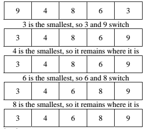

# Sorting
<!--
## Presentation
+ [Sorting and Efficiency](https://drive.google.com/open?id=1elJdFGo1ZcEI8rcmWgbSUFS33b-DoB2z_cA1yRaM1ec)
-->
<!--
## Assignment
+ [AdaGold/big-o](https://github.com/AdaGold/big-o)
-->
## Homework before class
Before our next class, read the lecture notes below, additional notes and watch the videos from links provided.

### Notes
In our last conversation on [Arrays](https://github.com/Ada-Developers-Academy/textbook-curriculum/blob/master/04-cs-fundamentals/classroom/Arrays.md), we saw how having the data set sorted improved the algorithms we could use. e.g. <strong>Finding an element with minimum or maximum value</strong> went from a *O(n)* algorithm for unsorted array to an *O(1)* algorithm for a sorted array. Similarly, <strong>binary search</strong> which is possible on sorted data set is an *O(log n)* algorithm as compared to *O(n)* <strong>linear search</strong> algorithm. There are also other everday examples where we expect the data set to be sorted e.g. last names sorted from 'a' through 'z', words in a dictionary, test scores sorted in descending order, employee ids sorted in ascending order etc.

Sorting is ordering a list of elements. We can distinguish two types of sorting. If the number of elements is small enough to fit in the main memory, sorting is called *internal sorting*. If the number of elements is larger than can fit in the main memory, some of them will stay in the external storage while the sorting algorithm works and is called *external sorting*. We'll scope our conversation to a few internal sorting algorithms.

#### Bubble Sort
The bubble sort algorithm is a simple sorting algorithm that repeatedly steps through the list to be sorted, compares each pair of adjacent items and swaps them if they are in the wrong order. As the algorithm proceeds, the largest element gets bubbled to the top of the array after each iteration through the outer loop. The algorithm repeats this process until it makes a pass all the way through the list without swapping any items.<\br>
**Example implementation:**
```ruby
def bubble_sort(array, length)
  i = 0
  while i < length # outer loop
    j = 0
    while j < length-i-1 # inner loop
      if array[j] > array[j+1] # swap
        temp = array[j]
        array[j] = array[j+1]
        array[j+1] = temp
      end
      j += 1
    end
    i += 1
  end
end
```
<strong>Example:</strong> Consider the initial unsorted array [99, 45, 35, 40, 16, 50, 11, 7, 90]. Here's one iteration through the outer loop of the algorithm (i.e. while *i* is *0* and *j* ranges from *0* to *8*).</br>
&nbsp;&nbsp;&nbsp;&nbsp;[<strong>99, 45</strong>, 35, 40, 16, 50, 11, 7, 90]</br>
&nbsp;&nbsp;&nbsp;&nbsp;[45, <strong>99, 35</strong>, 40, 16, 50, 11, 7, 90]</br>
&nbsp;&nbsp;&nbsp;&nbsp;[45, 35, <strong>99, 40</strong>, 16, 50, 11, 7, 90]</br>
&nbsp;&nbsp;&nbsp;&nbsp;[45, 35, 40, <strong>99, 16</strong>, 50, 11, 7, 90]</br>
&nbsp;&nbsp;&nbsp;&nbsp;[45, 35, 40, 16, <strong>99, 50</strong>, 11, 7, 90]</br>
&nbsp;&nbsp;&nbsp;&nbsp;[45, 35, 40, 16, 50, <strong>99, 11</strong>, 7, 90]</br>
&nbsp;&nbsp;&nbsp;&nbsp;[45, 35, 40, 16, 50, 11, <strong>99, 7</strong>, 90]</br>
&nbsp;&nbsp;&nbsp;&nbsp;[45, 35, 40, 16, 50, 11, 7, <strong>99, 90</strong>]</br>
&nbsp;&nbsp;&nbsp;&nbsp;[45, 35, 40, 16, 50, 11, 7, 90, 99]</br>
As you can see, the largest element, 99 gets bubbled to the top. In subsequent iterations through the outer loop, the next largest values will get bubbled to the top the next i.e. *n-i-1* position with increasing values of *i*.

<strong>Analysis:</strong> The time complexity of Bubble sort is *O(n^2)*
- The inner most swap conditional statement is *O(1)*
- The inner loop runs *i* times i.e. *O(i)* time complexity
- The outer loop runs from *i* = *0* to *n* 
Overall, the inner loop runs *n-1* times during the first iteration of the outer loop, *n-2* times during the second iteration through the outer loop, and so on. i.e. *n-1 + n-2 + n-3 + ... + 3 + 2 + 1* = *n(n-1)/2* = *O(n^2)* </br>
**Note 1**: The mathematical proof is out of scope for our discussion. For those curious, see [step 4 on wikihow](http://www.wikihow.com/Sum-the-Integers-from-1-to-N)</br>
**Note 2**: The best case time complexity for Bubble sort can be improved to be *O(n)* (for already sorted arrays) by optimizing this algorithm. Read further on [GeeksForGeeks: Bubble Sort](http://www.geeksforgeeks.org/bubble-sort/)

#### Selection Sort
The selection sort works by selecting the smallest unsorted item remaining in the list, and then swapping it with the item in the next position to be filled.

The selection sort works as follows: you look through the entire array for the smallest element. Once you find it, you swap this smallest element found with the first element of the array. Then you look for the smallest element in the remaining array (the sub-array without the first element) and swap this element found with the second element. Then you look for the smallest element in the remaining array (the sub-array without the first and second elements) and swap that element with the third element, and so on. </br>
Here's an example:</br>


**Example implementation:**
```ruby
def selection_sort(array, length)
  i = 0
  while i < length-1
    min_index = i
    j = i+1
    while j < length
      if array[j] < array[min_index]
        min_index = j
      end
      j += 1
    end
    if min_index != i
      temp = array[min_index]
      array[min_index] = array[i]
      array[i] = temp
    end
    i += 1
  end
end
```
<strong>Example:</strong> Consider the initial unsorted array [99, 45, 35, 40, 16, 50, 11, 7, 90]. Here's what it looks like before and after each iteration of the outer loop.</br>
&nbsp;&nbsp;&nbsp;&nbsp;[**99**, 45, 35, 40, 16, 50, 11, **7**, 90]&nbsp;&nbsp;*i=0; min_index=7*</br>
&nbsp;&nbsp;&nbsp;&nbsp;[7, **45**, 35, 40, 16, 50, **11**, 99, 90]&nbsp;&nbsp;*i=1; min_index=6*</br>
&nbsp;&nbsp;&nbsp;&nbsp;[7, 11, **35**, 40, **16**, 50, 45, 99, 90]&nbsp;&nbsp;*i=2; min_index=4*</br>
&nbsp;&nbsp;&nbsp;&nbsp;[7, 11, 16, **40**, **35**, 50, 45, 99, 90]&nbsp;&nbsp;*i=3; min_index=4*</br>
&nbsp;&nbsp;&nbsp;&nbsp;[7, 11, 16, 35, **40**, 50, 45, 99, 90]&nbsp;&nbsp;*i=4; min_index=4*</br>
&nbsp;&nbsp;&nbsp;&nbsp;[7, 11, 16, 35, 40, **50**, **45**, 99, 90]&nbsp;&nbsp;*i=5; min_index=6*</br>
&nbsp;&nbsp;&nbsp;&nbsp;[7, 11, 16, 35, 40, 45, **50**, 99, 90]&nbsp;&nbsp;*i=6; min_index=6*</br>
&nbsp;&nbsp;&nbsp;&nbsp;[7, 11, 16, 35, 40, 45, 50, **99**, **90**]&nbsp;&nbsp;*i=7; min_index=8*</br>
&nbsp;&nbsp;&nbsp;&nbsp;[7, 11, 16, 35, 40, 45, 50, 90, 99]&nbsp;&nbsp;*sorting complete*</br>

<strong>Analysis:</strong> The time complexity of Selection sort is *O(n^2)*. Each of the nested loops has an upper bound defined by the count of elements, *n* in the list to be sorted.

#### Insertion Sort
The insertion sort algorithm works by inserting each item into its proper place in a final list. The simplest implementation of this requires two list structures - the source list and the list into which sorted items are inserted. One entry is removed at a time and then each is inserted into a sorted part (initially empty). To save memory, most implementations use an in-place sort that works by moving the current item past the already sorted items and repeatedly swapping it with the preceding item until it is in place. </br>
Here's an example:</br>


**Example implementation:**
```ruby
def insertion_sort(array, length)
  i = 1
  while i < length
    to_insert = array[i]
    j = i
    # search in the sorted portion of the array
    # for the correct position to insert array[i]
    while j > 0 && array[j-1] > to_insert
      array[j] = array[j-1]
      j -= 1
    end
    array[j] = to_insert
    i += 1
  end
end
```
<strong>Example:</strong> Consider the initial unsorted array [99, 45, 35, 40, 16, 50, 11, 7, 90]. Here's what it looks like before and after each iteration of the outer loop. The sorted sub-array is **bolded**</br>
&nbsp;&nbsp;&nbsp;&nbsp;[**99**, 45, 35, 40, 16, 50, 11, 7, 90]</br>
&nbsp;&nbsp;&nbsp;&nbsp;[**45, 99**, 35, 40, 16, 50, 11, 7, 90]</br>
&nbsp;&nbsp;&nbsp;&nbsp;[**35, 45, 99**, 40, 16, 50, 11, 7, 90]</br>
&nbsp;&nbsp;&nbsp;&nbsp;[**35, 40, 45, 99**, 16, 50, 11, 7, 90]</br>
&nbsp;&nbsp;&nbsp;&nbsp;[**16, 35, 40, 45, 99**, 50, 11, 7, 90]</br>
&nbsp;&nbsp;&nbsp;&nbsp;[**16, 35, 40, 45, 50, 99**, 11, 7, 90]</br>
&nbsp;&nbsp;&nbsp;&nbsp;[**11, 16, 35, 40, 45, 50, 99**, 7, 90]</br>
&nbsp;&nbsp;&nbsp;&nbsp;[**7, 11, 16, 35, 40, 45, 50, 99**, 90]</br>
&nbsp;&nbsp;&nbsp;&nbsp;[**7, 11, 16, 35, 40, 45, 50, 90, 99**]</br>

<strong>Analysis:</strong> In sorting the most expensive part is a comparison of two elements. Insertion sort algorithm requires
- 0 comparisons to insert the first element
- 1 comparison to insert the second element
- 2 comparisons to insert the third element
- ... and so on
- *n-1* comparisons (worst case) to insert the last element
Overall, this is *1 + 2 + 3 + ... + (n-1)* = *O(n^2)*

The insertion sort has a complexity of O(n^2). Unlike selection sort, insertion sort has a best case time complexity of O(n) when the items are already sorted. In other words, insertion sort runs in linear time on a nearly sorted list of elements.

#### Merge Sort
Merge sort is a *divide-and-conquer* algorithm. It involves the following three steps:
1. Divide the array into two (or more) sub-arrays
2. Sort each sub-array
3. Merge the sub-arrays into one array

### Additional Notes
+ Watch this [sorting algorithms' comparison demo](https://www.youtube.com/watch?v=ZZuD6iUe3Pc) and this [visualization](https://www.cs.usfca.edu/~galles/visualization/ComparisonSort.html)
