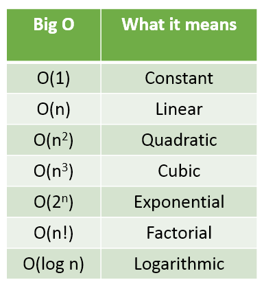
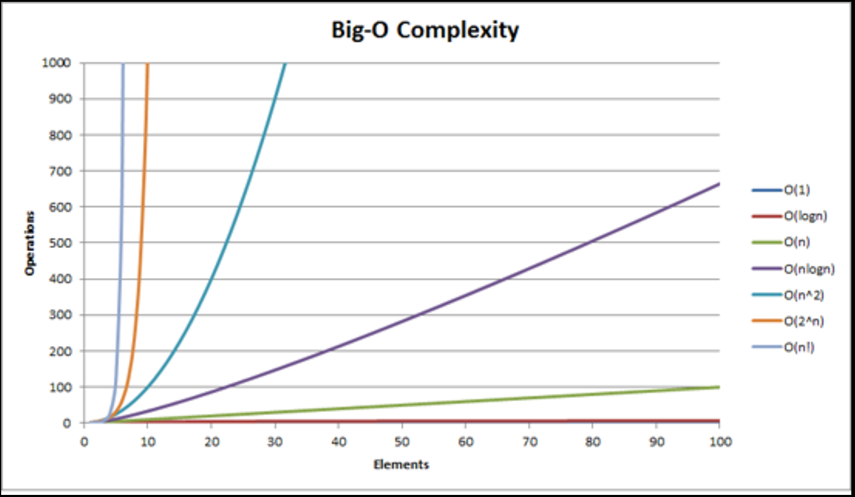

# Algorithmic Efficiency

## Learning Goals

By the end of this lesson you should be able to:

- Explain the concept of algorithm analysis
- Describe how Big-O is derivied on an algorithm
- Compare algorithms based on their runtime and space complexity


## Video Lesson & Exercises

- [Arrays and efficiency and algorithms Classwork](../homeworks.md#arrays-and-efficiency-of-algorithms)

## Introduction

An _efficient algorithm_ is one that runs as _fast_ as possible and _requires as little computer memory_ as possible. We often have to settle for a trade-off between these two goals, compromising memory to make things faster, or speed to use less memory.

We consider performance of an algorithm in three different scenarios: best-case, worst-case and average case.

Consider the task of performing a sequential search on some sort of list, i.e. an array. Best-case would be that your target value was found in the first element. Worst-case would be that the value was not there at all (so all elements would have to be compared and tested, including the last). Average-case would be mid-way between the two, and still dependent on the length of the list.

_In Computer Science, we care about worst case and average case._ This is because we need to plan our software systems that are used to control the infrastructures of our society to be performant in the worst case and average case scenarios.
- **Worst case consideration**: It is important to consider the worst case scenario when the response time is critical. e.g. the shutdown program for a nuclear power plant.
- **Average case consideration**: If an algorithm is to be used many times on many different instances, it may be more important to know the average execution time. e.g. calculating total cost for all the items in the shopping cart for a user for an e-commerce website like etsy.com or amazon.com

## Quantitative analysis of efficiency

So, we are interested in the efficiency of the algorithm in terms of the algorithm's **speed** and the algorithm's **memory utilization**. These are measured and described in terms known as **time complexity** and **space complexity** respectively.

Typically, we are interested in doing this analysis before a single line of code is written. Because it's too expensive to change the approach after having invested a time and effort in implementing or deploying a solution.

It stands to reason to ask **why** we are interested in deducing and quantitatively representing the efficiency of the algorithm. Here are the reasons:
1. To make quantitative judgments about the value of one algorithm over another.
1. To allow us to predict whether the software will meet any efficiency constraints that exist.

## Time complexity

While quantitatively representing the speed of an algorithm, we are looking to share _the rate of change of number of operations in an algorithm as the either the size or the value of the input to the algorithm changes_.

Let's consider an example: an algorithm reverses the values in the input array of integers.
Example; if the input array is:

Values  | 4 | 8 | 0 | 3 | 9
--------|---|---|---|---|---
Indices | 0 | 1 | 2 | 3 | 4 

the algorithm should change the input array to look like:

Values  | 9 | 3 | 0 | 8 | 4
--------|---|---|---|---|---
Indices | 0 | 1 | 2 | 3 | 4 

One approach to solve this problem is the following algorithm which swaps values within the array.

**Check the input**:
- If the array has no more than one element, then we are all done!

**Initialize variables**:
- `i` is an index for the first element in the array (`i` = 0)
- `j` is an index for the last element in the array, set to the value of array length minus one.

**Algorithm steps**:
- While `i` is less than `j`, perform the steps below in a loop:
    - Swap the values at index `i` and at index `j` in the array.
    - Increment `i`.
    - Decrement `j`.
- The array is reversed.

For the problem of reversing an array in-place, we have an algorithmic solution to consider. Without writing any code, how do we determine the performance of this algorithm? We are looking to the quantitatively represent the speed of this algorithm. To do this, we evaluate _how the number of steps in the algorithm would change as the value or size of the input changes_. 

Let's consider this for the algorithm above
1. To _check the input_, the algorithm performs one comparison operation. This single comparison will be performed regardless of the size or value of the input.
1. Next, the algorithm initializes two integer variables to index into the array. These two steps will always be performed, if the array has at least , two elements in it. Furthermore, there will be exactly two steps, regardless of the size of the array. i.e. Regardless of whether the array has 200 elements or 700,000 elements, the initializations will always need exactly two operations to be complete.
1. The main algorithm has a loop. For any loop, we want to consider how many times all of the operations insider the loop will get executed, and if this number of operations is dependent in any way on the value or size of the input. For quick reference, here's the loop (written in pseudo code)

    ```
        while i < j 
        {
            swap array[i] and array[j]
            increment i
            decrement j
        }
    ```

`i` is initialized to `0`. `j` is initialized to `array length - 1`. In each iteration of the loop, `i` increments and `j` decrements by one. The loop terminates when `i` becomes equal to, or greater than `j`. Hence, we can conclude that the three statements inside the loop will get executed half the number of times as the length of the array. If the input array had 500 elements, the loop would execute 250 times. If the array instead had the length of 600,000, the loop would execute 300,000 number of times. That means if the number of elements in the array were *n*, then the loop would execute _n / 2_ number of times. As we will learn [later](#big-o-notation), we will drop the constant i.e. 1/2 and say that the time complexity of the reverse algorithm is _linear_ or _order of n_ or _O(n)_.

## Space complexity

Similarly, while quantitatively sharing memory utilizaton of an algorithm, we are interested in sharing _the rate of change of amount of memory or space needed by an algorithm as compared to either the size or the value of the input_.

Let's continue considering the example of reversing an array in place. Here's our algorithm (in pseudo code):

### Algorithm 1

        // array is the input integer array to the algorithm

        if array.length <= 1
        {
            return // nothing to reverse
        }

        i = 0
        j = array.length - 1

        while i < j
        {
            // swap values at i and j
            temp = array[i]
            array[i] = array[j]
            array[j] = temp

            increment i
            decrement j
        }

**Exercise**: Examine the algorithm above. Can you call out all the extra, new memory allocations the algorithm performs?

You must have noticed the three memory allocations done by the program: `i`, `j` and `temp`. These are three integers created. Regardless of the size of the input array (be it 500 or 900,000), there will always be only and exactly three integers created. As such, the new memory allocations in this algorithm do not change as the size or value of the input changes. Such algorithms are said to have _constant_ space complexity or _O(1)_ space complexity.

## Example consideration

Consider the same problem of reversing the values in an input integer array. Here's another approach to solve the same problem. Here's the pseudo code:

### Algorithm 2

```    
        // array is the input integer array to the algorithm
        
        if array.length <= 1
        {
            return // nothing to reverse
        }

        i = 0
        j = array.length - 1

        // create a new array of the same size as input array
        temp_array = new array of size array.length

        while i < array.length
        {
            // copy over the values in input array 
            // into the temp array in reverse order
            temp_array[i] = array[j]
            increment i
            decrement j
        }

        i = 0
        while i < array.length
        {
            // copy over values from the temp array 
            // into the input array
            array[i] = temp_array[i]
        }

        // array is reversed
```

**Exercise**: Examine the algorithm above to count the number of operations it will perform. Do the number of operations change as the input array size changes?

You'll notice that the solution above has two `while` loops in addition to a set of single line code instructions. The two while loops are one after the other.
- The first while loop copies over each of the elements in the input array into a new array in reverse order of their position. The means, if there are 100 elements in the input array, then the loop will execute 100 times. If there are 700,000 elements in the input array, then the loop will execute 700,000 times and so on. Therefore, we can conclude that in the first loop, _the number of operations performed are linearly changing in accordance with the size of the input_.
- The second loop copies for each element of the temporary array back into the input array. Following the same logic, in the second loop, _the number of operations performed are linearly changing in accordance with the size of the input_.
- The time complexity of each loop is linear, or _O(n)_ where *n* is the number of elements in the input array. Together, since they perform the operations one after another, the _time complexity of the overall algorithm is linear or O(n), where n is the number of elements in the input array_.

**Exercise**: Examine the [algorithm](#algorithm-2) above to evaluate the amount of additional memory the algorithm needs in order to execute as compared to the input array size? What is the space complexity of this algorithm?

There are two integers, `i` and `j` that are used to index into the arrays. Each of these take up additional memory of the size of an integer each. Also, in addition to the input array, the algorithm creates a new array. This new array, `temp_array` takes up as much space as the size of the input array. If there are 100 elements in the input array, then the `temp_array` needs to be able to hold 100 elements. If the input array holds 900,000 elements, then the `temp_array` should also be able to hold 900,000 elements. In other words, the new `temp_array` created takes up space that is _linearly proportional_ to the size of the input array. Therefore, the space complexity of this algorithm is _linear_ or _O(n), where n is the number of elements in the input array_.

**Exercise**: Compare [Algorithm 1](#algorithm-1) with [Algorithm 2](#algorithm-2). These are two algorithms to solve the same problem; they both reverse the input array in-place. Which of these two algorithms is more efficient?
To compare and contrast two algorithms which solve the same problem, we evaluate the time complexity and space complexity of each of the algorithm individually and then compare the time and space complexity of the two algorithms.
- **Time complexity**: As we saw above, **Algorithm 1** as well as **Algorithm 2**, both have the same time complexity. They both execute in linear time as compared to the size of the input, or are said to have _O(n)_ time complexity, where *n* is the number of elements in the input array. From the view point of time complexity, both the algorithms are equally efficient.
- **Space complexity**: We noted that **Algorithm 1** above has a space complexity of _O(1)_ or constant, since the amount of additional memory used does not change as the size of the input array changes. In contrast, **Algorithm 2** creates a new array. The size of this new array created is the same as the input array. Therefore, **Algorithm 2** has a space complexity of _O(n)_, where *n* is the number of elements in the input array. Comparing **Algorithm 1**'s constant space complexity with **Algorithm 2**'s linear space complexity, we can conclude that **Algorithm 1** is more space efficient than **Algorithm 2**.
- In conclusion, although the two algorithms are equally time efficient, **Algorithm 1** is more space efficient as compared to **Algorithm 2** and hence, **Algorithm 1** is a better choice.

## Big O notation
To quantitatively represent the worst case performance for **speed** and **memory utilization** of an algorithm, we use the **Big O notation**, pronounced "big oh notation" or the **asymptotic notation**.

Leveraging the big O notation, we can:
1. Make quantitative judgments about the value of one algorithm over another.
1. Predict whether the software will meet any efficiency constraints that exist.



Here are the commonly seen big O terms:
- _O(1)_ is the no-growth curve. An _O(1)_ algorithm's performance is conceptually independent of the size of the data set on which it operates. Such an algorithm is said to have _constant_ time complexity. e.g. Indexing into an array to retrieve a value at a particular index is _O(1)_.
- _O(log n)_ means that the data set size affects the efficiency of the algorithm in a _logarithmic_ fashion. The key thing to note is that _log (base 2) n_ grows slowly. Doubling _n_ has a relatively small effect. Logarithmic curves flatten out nicely. e.g. Searching for a value in a sorted array using _binary search_ is of _O(log n)_ time complexity.
- _O(n)_ says that the algorithm's performance is directly proportional to the size of the data set being processed. Such an algorithm is said to have _linear_ time complexity. e.g. Searching for a value in an unsorted array takes _O(n)_ or _linear_ time.
- _O(n^2)_ says that the algorithm's performance is proportional to the square of the data set size. This happens when the algorithm processes each element of a set, and for each element processing, another pass through all the remaining elements in the set is required. Such an algorithm is said to have _quadratic_ time complexity. e.g. Some of the [sorting](Sorting.md) algorithms have a _quadratic_ time complexity.
- _O(n * m)_ says that the algorithm's performance is _quadratic_ in nature. e.g. Consider an algorithm which has access to a list of *n* Jedis and *m* Siths. The algorithm records the winners of a 1-to-1 duel between each Jedi and each Sith. Then the resulting record will be of size _n * m_.

**Note**: While sharing the time or space complexity in terms of _n_ or _m_ or any other variable like _k_, it is important to explain what _n_, _m_ or _k_ stand for.

### Nuances

- Constants are dropped. Constants only shift our graph slightly, but do not affect the overall look of the graph by much. _O(2n)_ is shortened to _O(n)_. _O(1⁄2 n)_ is shortened to _O(n)_.
- Usually when an algorithm's growth rate is a mix of orders, the dominant order is shown, and the rest are dropped. _O(n^2) + O(n)_ or _O(n^2 + n)_ would be shortened to _O(n^2)_. This is because _O(n^2) + O(n)_ is smaller than _O(n^2) + O(n^2)_.In other words, _O(n^2) + O(n)_ is in the order of _O(n^2) + O(n^2)_. _O(n^2) + O(n^2)_ can be simplified to _O(n^2) * 2_ or _O(2 * n^2)_. Then, we can drop the constant, and simply state that the complexity is _O(n^2)_.



### Complexity Analogy

Consider a physical phone book as an example to illustrate Big O notation for algorithm complexity. Let's take a look at some of the use cases related to the phone book:

- _O(1)_ – Find a random person’s phone number by flipping open any page in the phone book.
- _O(log n)_ – Given a person’s name, find the corresponding phone number. This is using a binary search for a person’s phone number.
- _O(n)_ – Find all people whose phone numbers contain the digit "5". This will require _linear_ scaning through the phone book.
- _O(n log n)_ – Sort a phone book’s pages by looking at the first name on each page. See [the merge sort](Sorting.md) for understanding this further.


## Summary

## Common Terms


## Resources

- [A story of Big-O](https://medium.com/@deadcookies/a-story-of-big-o-453471a35e62)
- [Free Code Camp on Why Big-O Matters & Why It Doesn't](https://www.freecodecamp.org/news/big-o-notation-why-it-matters-and-why-it-doesnt-1674cfa8a23c/)

<!-- ## Slide Deck

0 Slide Deck used in class</br>
<span xmlns:dct="http://purl.org/dc/terms/" property="dct:title"><a href="https://drive.google.com/file/d/0B__DV26QHsH4eHJqTWttLUdNZk0/view?usp=sharing">Array data structure and Introduction to Efficiency of Algorithms</a></span> is licensed under a <a rel="license" href="http://creativecommons.org/licenses/by-nc-nd/4.0/">Creative Commons Attribution-NonCommercial-NoDerivatives 4.0 International License</a>.</br>
<a rel="license" href="http://creativecommons.org/licenses/by-nc-nd/4.0/"></a><br />

-->