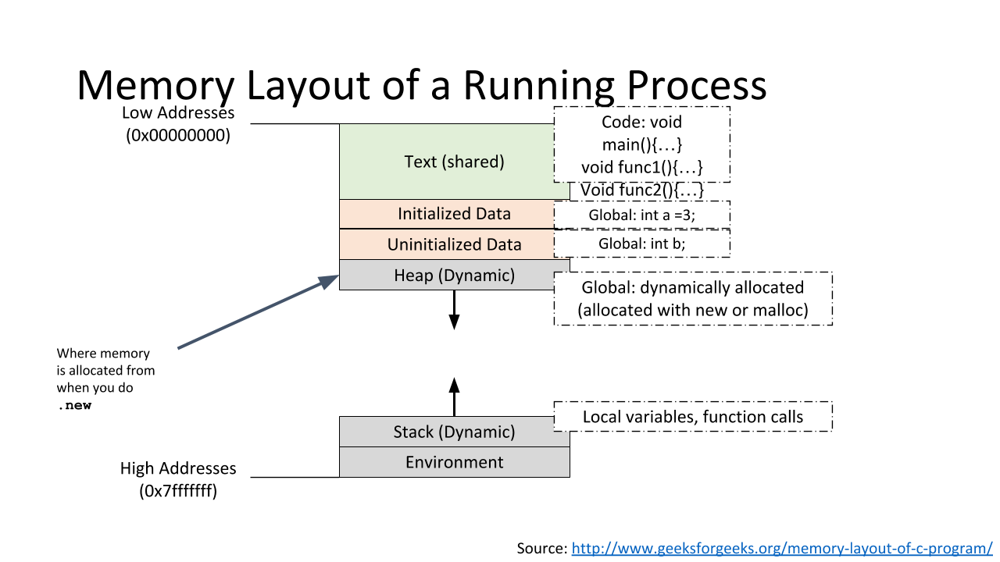
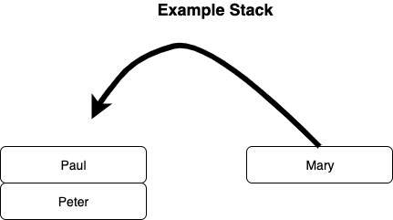
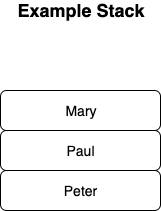
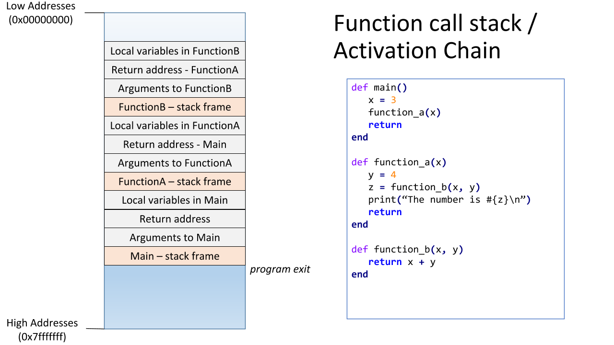
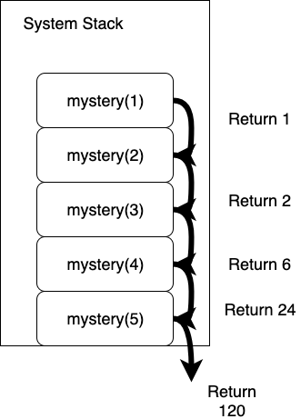

# Understanding Function Calls

## Learning Goals

By the end of this lesson you should be able to

- Explain how function calls work
- Explain the terms
  - Pass by reference
  - Pass by value
  - Call stack
  - Recursive Function
- Correctly identify the time and space complexity of small recursive functions

## Video Lesson

- [Video Lesson]()
- [Slides Used]()
- [Assignment](https://github.com/Ada-C12/recursion-tracing)

## Introduction

We have been using methods/functions for several months now.  However we have not investigated how functions actually work, under the hood.  How does information get passed into a method and how is information returned.

So what does a method need:

- Method name - A symbol which represents the block of code
- Method arguments - the data items sent to the method for processing.
- Local variables - A method may have local variables to store information while it runs
- Return value - A method should have some way to return a value as a result

We will first investigate how method arguments get passed into a method, then look at how the system stack is used to store method arguments and local variables and how the return value is sent back when the method finishes.

## Pass By Value

Take a look at the code below, plug it into irb or run it via the terminal or repl.  Try to understand the code. What do you expect to see in the console output? When do you expect the object_ids to change verses remain the same?  An object id references the object being stored in memory.  If two variables share the same object id, they must both reference the same object in memory.

```ruby
def peek_add_ten(number)
  puts "In peek_add_ten: #{number.object_id}"
  number = number + 10
  puts "Number is now: #{number}"
  puts "On adding in peek_add_ten: #{number.object_id}"
  return
end

def add_ten(number)
  puts "In add_ten: #{number.object_id}"
  number = number + 10
  puts "Number is now: #{number}"
  puts "On adding in add_ten: #{number.object_id}"
  return number
end

# Main code logic
result = 10
puts "Original value: #{result}"
puts "Object id is: #{result.object_id}"
puts "\n"

peek_add_ten(result)
puts "After peek_add_ten value is: #{result}"
puts "Object id is: #{result.object_id}"
puts "\n"

result = add_ten(result)
puts "After add_ten value is: #{result}"
puts "Object id is: #{result.object_id}"
```

Now, copy over this code and try it out in the console. Did your expectations match what the console output showed?

Ruby passes _references_ to the parameters in a method.  This means that if `result` in the main code logic has an object id of 41 that object id will be passed into `number` in the `peek_add_ten` parameter.  So both variables will refer to the sample place in memory.  However in the 2nd line of `peek_add_ten` method you have `number = number + 10`, and this _changes_ the object being referred to by `number` to a new place in memory.  So after that line `result` and `number` refer to **different** objects.  When we use the equal sign `=` or any of the shortcut operators like `+=` or `-=` you will **reassign** the variable to another memory address.

On the other hand consider this set of methods below.  Where will the object ids change?  Will `result` in the main code logic section be changed by what happens in `add_three`?

```ruby
def add_three(list)
  puts "in add_three list object_id: #{list.object_id}"
  list << 3

  puts "list now: #{list}"
  puts "after pushing in 3 the object id is: #{list.object_id}"
  puts "\n"
  return list
end

# Main code logic
result = [1, 2]
puts "Original value: #{result}"
puts "Object id is: #{result.object_id}"
puts "\n"

answer = add_three(result)
puts "After add_three value is: #{result}"
puts "Object id is: #{result.object_id}"
```

So the object ids are all the same across the program.  Just like with the integers passed in the previous example, `result` and `list` both refer to the same variable in memory.  However arrays and other objects like hashes, or custom objects have methods which act upon the data stored at that location in memory.

For arrays, the `<<`, as well as with the `[]` operator follow the reference to the place in memory where the array is stored and make changes upon the data stored inside the array.  The reference only changes for a variable when you use the `=` operator or a similar shortucut operator to assign that variable to another place in memory.

So in Ruby arguments are passed into a method's parameters by taking the memory address the arguments reference and passing them into the parameters.  This means that for primitive data types like integers, or floats, there is no way for a parameter to change the value of the argument passed in because these types of objects have no mutator methods which change the data stored inside those objects.

Learn more by reading [Object passing in Ruby](https://launchschool.com/blog/object-passing-in-ruby) by LaunchSchool or our [references & values](https://github.com/Ada-Developers-Academy/textbook-curriculum/blob/master/02-intermediate-ruby/references-and-values.md) lecture.

## The Call Stack

A running program has 4 sections of memory.

1. Memory used to store the program instructions, where the executable code is stored.
1. Memory used to store global variables.
1. The heap, which is a section of memory used to allocate space allocated with the `.new` method.
1. The system stack (more on this) where method calls and local variables are stored.
1. Details of the environment



The system stack is used to keep track of method calls.  A stack works kind of like a stack of plates, you add things to the top and you also remove things from the top.  So If this is my stack below and I add "Mary" to the stack, "Mary" will go to the top.



Resulting in the stack below.



Similarly if I remove an element from the stack, called a pop operation, I will then get "Mary"  If I then attempt to pop again, I will get "Paul".  Stacks operate in a Last-In-First-Out (LIFO) manner.  They remove things in the reverse order they were added.  

The system uses a stack to manage method calls.  When a method, lets call it `method_a`, is called something called a _stack frame_ is added to the system stack.  That stack frame contains all the local variables used by the method, the parameters used by the method and a memory address to return to when the function completes.  If `method_a` calls another method, `method_b` then `method_b`'s stack frame is added to the stack (with `method_a` still on the stack) and begins to execute.  Similarly if it calls another method, `method_c` then that method's stack frame gets added.  When `method_c` completes it's stack frame is popped off the stack and the program returns to where `method_b` left off, as indicated by the return address.  Then when `method_b` completes it's stack frame pops off and and `method_a` resumes.  If too many method calls are added to the system stack and memory is exhausted this results in a Stack Overflow Error, an inspiration for one of our favorite [websites](https://stackoverflow.com/).



The system call stack will lead into our next topic recursion.

## Intro to Recursion

We have had previously where methods called other methods, but what if a method calls itself?  This is the definition of a recursive method, a method which calls itself.  You can think of it like Russian nesting dolls, Matryoshka.  Each doll is a smaller version of the previous doll.

[Nesting Dolls](images/nesting-doll.jpg)

Examine the following method:

```ruby
def pow(base, exponent)
  return 1 if exponent == 0

  return base * pow(base, exponent - 1)
end
```

The method above calculates one number `base` taken to a given power `exponent`.  The method starts with a condition to end the recursion called a _base case_, `return 1 if exponent == 0`.  If the base case is met the method returns 1.  The next line takes one step toward solving the problem (calculating `base` to the given exponent) by multiplying `base` times a _smaller_ version of the original problem (taking `base` to a power which is one smaller).  This is called a _recursive case_.  

Most recursive methods will follow the following pattern:

- If [some condition]
  - Solve using the base case
- Else
  - Solve by recursively calling the same function with smaller input

### Exercise

Write a recursive function which takes a natural number, `x`, and computes a sum of all natural numbers up to and including `x`.

Examples:

- natural_sum(5) = 5 + 4 + 3 + 2 + 1
- natural_sum(7) = 7 + 6 + 5 + 4 + 3 + 2 + 1

When you are ready you can see a [solution](examples/recursion_example.rb) to both a recursive and iterative solution.

**Question**

```ruby
def natural_numbers_sum(num)
  return num + natural_numbers_sum(num - 1)
end
```

<details>
  <summary>Will the above method work?</summary>
  No!!  The above method has no base case and therefore it will lead to infinite recursion.
</details>

### Tracing Recursive Methods

Consider the following recursive method.

```ruby
def mystery(num)
  return 1 if num <= 1

  return num * mystery(num - 1)
end
```

How could you determine the result of mystery(5)?

You can trace through it by working through the problem just like Ruby executes it.  You start by drawing a stack with `mystery(5)` on it.

.png)

To solve that you need to find `mystery(4) because the base case is not true.

So you add `mystery(4)` to the stack.

.png)

To solve that you need to find `mystery(3) because the base case is not true.

So you add `mystery(3)` to the stack.

.png)

To solve that you need to find `mystery(2) because the base case is not true.

So you add `mystery(2)` to the stack.

.png)


To solve that you need to find `mystery(1) because the base case is not true.

So you add `mystery(1)` to the stack.

.png)

**Ah Ha!** now the base-case is met and it will return 1

-return.png)

`mystery(2) takes that return value multiplies it by 2 and returns 2.  That method then takes 2 and multiplies it by 3 and returns the product 6.  mystery(4) then takes that and multiples it by 4 and returns the product of 24.  The last mystery(5) takes 24 and multiplies it by 5 and returns the product 120.



You can use this manner to trace through and work through a recursive method.

### Time & Space Complexity

How can you determine the time and space complexity of a recursive method.  

For the time complexity you can use the number of recursive calls, just like you would use the number of loop iterations.  So the above method has a time complexity of O(n).

What about space?  On the face of it this method does not make a new data structure to store information... so it seems like O(1)...  However we are using a _hidden_ data structure here the System Stack!  Since the stack grows (and takes memory) with each iteration this method has a space complexity of O(n) because it will require a number of stack frame proportional to the size of n.

## Summary

In this lesson we looked at how methods work.  We examined the system stack and how it keeps track of method calls.  This is used to ensure that method calls execute in a last-in-first-out order, and it is used in the output, called a stack-trace, when a application crashes to enable the programmer to trace through method execution.

We also examined a new topic, recursion.  At this point we are not yet writing recursive methods, but we have learned how recursive methods are structured and how recursive methods can be traced through.  We finished by examining the space and time complexity of recursive methods.

## Terms & Definitions

| Term | Definition |
|--- |--- |
| Call Stack | Also known as the system stack, or activation chain, a stack data structure which stores currently running method calls. |
| Stack | A data structure which stores information in a Last-In-First-Out order.
| Stack Overflow Error | An error which occurs when the call stack runs out of memory. |
| Recursive Method | A Method which calls itself.  Typically a recursive method calls itself on a smaller subproblem and uses the result of that subproblem to solve the larger task.
| Base Case | A condition to stop recursion.  Any recursive method must have a base case, or it will run into infinite recursion and a stack overflow error |

## Resources

- Read more on [References and mutability in Ruby](https://launchschool.com/blog/references-and-mutability-in-ruby) by LaunchSchool
- Read more on [Mutating and non-mutating methods in Ruby](https://launchschool.com/blog/mutating-and-non-mutating-methods) by LaunchSchool
- Revise lesson on [Reference and values](https://github.com/Ada-Developers-Academy/textbook-curriculum/blob/master/02-intermediate-ruby/references-and-values.md)