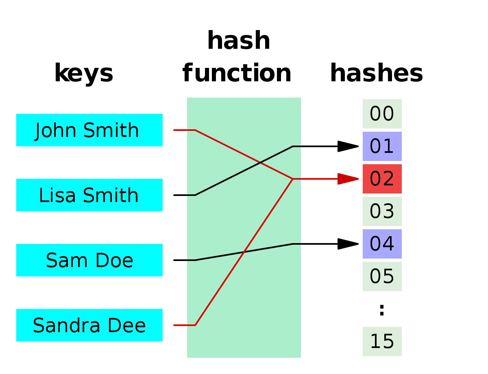

# Hash Tables

## Objectives

By the end of this lesson you should be able to:

- Explain the terms
  - _hash table_
  - _hash function
  - _collision_
- Explain why hash tables are useful in many situations
- Explain some of the trade-offs involved in using hash tables

## Hash Tables Overview

In our programs we often need to store data and need a quick way to look up specific items.  We could store elements in an array, but finding specific entries in an array require looping through potentially the entire list an O(n) operation, or maintaining the list in order.

A _hash table_, also known as a _dictionary_, is an implementation of an _abstract data type_ known as an _associative array_ a data structure designed to store key-value pairs and provide a method to look up a value from it's key.  

A hash table takes a key and applies that key to a special method known as a _hash function_ which converts the key into an index in an array.  The hash table then stores the key-value pair into that location.

<!-- Lucidchart link  https://www.lucidchart.com/invitations/accept/5fdcf503-7d8b-4139-94d4-795bfed27883 -->



You have already used hashes quite a bit and we know the following runtimes of a hash table.  

| Action | Average Case | Worst Case | 
|---|---|---|
| find(key) | O(1) | O(n)
| remove(key) | O(1) | O(n)
| insert(key, value) | O(1) | O(n)

Note the **worst-case**  runtimes, because **normally** when we estimate the runtime of a data structure's methods with Big-O we assume the worst-case.  However a well-designed hash table, will attempt to prevent the worst-case scenario from occurring.  Therefore when we work with hash tables we assume the average-case.  The likelyhood of the worst-case from occurring depends on how well the **hash function** is implemented.

### Hash Function

A __hash function__ is a method which takes an input, called a key, and maps it to an index in a fixed-sized array.  Good hash functions attempt to spread all possible values over the entire data structure and avoid assigning multiple keys to the same index.  

Designing a good hash function is something of a black art as there is no mathematical formula that will work perfectly in all cases.  Instead we use practical general-purpose functions which works well in most cases.  This technique is often called a _heuristic_.

However because there is an enormous list of possible keys and a limited-size array, any hash function will result in some keys mapped to the same index.  When this occurs it is called a _collision_.  

### Resolving Collisions

There are many ways to resolve a collision, one way is to make each element of the hash array a collection and store new elements in the next field in the collection.

For example if I wrote the following (really bad), hash function in my data structure.

```ruby
class MyHash
  def initialize()
    @array = Array.new(10)
  end

  def hash_function(key)
    return key.to_s.length % @array.length
  end

  def [](key)
    index = hash_function(key)

    # if the index is occupied
    if (@array[index])
      search_results = @array[index].find(key) do |bucket|
        bucket[0] == key
      end

      return search_results ? search_results[1] : nil
    end

    return nil
  end

  def []=(key, value)
    index = hash_function(key)

    if (@array[index])
      item = find_item(key, @array[index])
      if item.nil?  #if the key does not exist add it to the bucket
        @array[index] << [key, value]
      else # if the key exists replace the value
        item[1] = value
      end
    else
      @array[index] = [[key, value]]
    end
    return value
  end

  private
  
  def find_item(key, bucket)
    return bucket.find(key) do |element|
      element[0] == key
    end
end
```

If I attempted the following:

```ruby
  my_hash = MyHash.new
  my_hash["Dan"] = "Lead Instructor"
  my_hash["Chris"] = "CS Fun Instructor"
  my_hash["Dee"] = "Instructor Extraordinaire"
  my_hash[356] = "A big number"
```

We will end up with a hash which looks like this:  


This implementation resolves collisions by creating an array at each index of the main array and adding the key-value pair to the end of the list.  As you can see if the hash function does not adequately spread values out over the length of the array, this can result in long chains of key-value pairs and an O(n) worst-case.

Luckily most libraries use well-proven hashing functions which normally prevent high numbers of collisions.  


## How Ruby's Hash Tables Work

### Ruby's Hash Maintains Order


## Resources

- [How the hash works in Ruby](https://launchschool.com/blog/how-the-hash-works-in-ruby) - From Lauchschool
- [Basics of Hash Tables](https://www.hackerearth.com/practice/data-structures/hash-tables/basics-of-hash-tables/tutorial/) - HackerEarth