# Introduction to Data Structures

## Learning Goals

- Get familiar (at a high level) with different data structures:
  - Arrays
  - Linked Lists
  - Stacks
  - Queues
  - Graphs
  - Trees (Binary Trees, Binary Search Trees, Binary Heaps)

## Video Lesson & Notes

- [Video Lesson]()
- [Slide Deck Used in Video]()
- [Class Exercises]()


## Study of data structures - What and Why

A common problem in Computer Science is managing large amounts of data and performing different operations on them. **Data Structures** provide different well-known ways to organize data. Each data structure follows its own set of rules on how the data should get organized. The study of data structures is to understand these rules. Alongside these governing rules, we are also looking to understand how different common operations like insert, delete and search work on each of these data structures and understand the average and worst case efficiency for the common operations. Knowledge of well-known data structures allows us come up with optimal designs to our real world, practical coding projects.

How we structure and interact with our data can drastically affect the runtime of our software.  It is not unusual to go from operations taking minutes or hours to ones taking seconds by reorganizing the data structures used.  As a software developer it's important to learn how to select the appropriate data structure for the situation.

## Arrays

An array is our first data structure.  As [we have discussed](Arrays.md) arrays are a _homogenous_ data structure where each element can be accessed using a unique whole number known as an _index_.  Arrays are also allocated as a contigous block of memory.  This can be very helpful when saving data or loading data from other media.  Arrays are also a _static_ data structure where once allocated they cannot be dynamically resized.  If an array runs out of space, another array needs to be created and the data copied to the new array.  Similarly if not all elements allocated are being used, the developer is responsible for determining how to indicate unused elements.  Often unused elements are set to `nil` or 0.  

Arrays have the following advantages:

- Quick access to any element using an index number
- Efficient operations when interacting with hardware as all elements are in a contigous block of memory
- It is fast to add data to an array with unused elements

On the other hand it can be quite expensive to delete elements from an array.

### Deleting An Array Element

To remove an element in the middle of an array, each element in a subsequent index must be shifted over one element.

So to delete an element at a specific index in an array.

```
# traverse the array from index to the end
while index < length - 1
  # move each element one index to the left
  array[index] = array[index+1]
  index += 1
end
# reduce the length of the array
length = length - 1
```

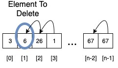

This is an O(n) operation as the number of elements to shift depends on the length of the array.

#### Array Deletion Alternative

Consider the problem, you have an elementYou could, rather than shifting elements over instead use a convention to mark cells deleted.  Unfortunately this leaves the array _fragmented_ where items are no longer guaranteed to be adjacent and leads to longer search times.  Which method is best depends on the number of searches on the array and the number of deletions.

### Inserting An Array Element

Similarly inserting an element into a specific index requires first shifting elements one index right before inserting the element.

```
current_index = length -1

while current_index > index_to_insert
  array[current_index] = array[current_index - 1]
  current_index -= 1
end

array[current_index] = new_value
```

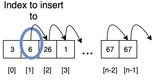

<!-- Original images at:  https://drive.google.com/file/d/1tpencaf-NOr7_ED4v8Jx9SKjplL81Mh8/view?usp=sharing -->

This depends on the array having adequate unused space at the end.  This requires O(n) time complexity.

### Limitations of Arrays & Static Data Structures

Arrays have a few limitations

- Inserting and deleting elements is an expensive O(n) operation
- You cannot add more elements than the size of the data structure

So if:

- The maximum size is unknown ahead of time
- Insertions and deletions are common

Then you are best to consider an alternative data structure.  

For Arrays

- Inserting or Deleting any node
  - O(n)
- Accessing an element by index
  - O(1)
- Finding an element in a sorted array
  - O(log n)
- Finding an element in an unsorted array
  - O(n)

## Linked Lists

A linked list is a dynamic data structure.  In other words the size of the data structure can change throughout it's lifetime.  Because memory is allocated as needed, the memory is not contigous.  In other words the elements of a linked list will appear at different locations in memory.  

Each element of the linked list is called a _node_.  Below is a Ruby implementation of a node for a singly linked list.  Each node object has data it is storing and a reference to the next node in the chain.  To find an item, you start with the first node and follow the chain of nodes until you find the data you are looking for or the next reference is `nil`.

```ruby
class ListNode
  attr_reader :data
  attr_accessor :next

  def initialize(data, next = nil)
    @data = data
    @next = next
  end
end
```

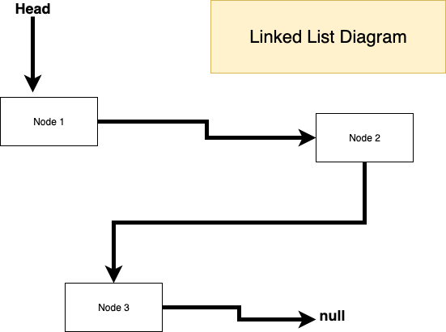

Examine the image above, notice that starting at the head, the linked list is a linear structure.  You have to start with the head and work through the nodes to find any particular element.  There is **no way** to jump to a specific node in constant time.  Finding any element is an O(n) operation.  On the other hand it is quick to create new nodes and add them to the list, because we do not need to shift elements over, like we did in arrays.

What we have above is source code and an image of a _singly linked list_.  Each node links to the next node in the chain, but a variation is a _doubly linked list_ where nodes link to both the next and previous nodes in the chain.  Most implementations of Linked List implement doubly linked lists with a reference to the head and another to the tail, or rear, of the chain.  

For Linked Lists

- Inserting to the front or rear
  - O(1)
- Removing from the front or rear
  - O(1)
- Searching for an element
  - O(n)

## Stacks

A stack is an _Abstract Data Structure_ which is a data structure described by the methods it provides, not a specific implementation.  In other words an abstract data structure is a type of object which stores information and provides access with a specific set of behaviours, but can be implemented a variety of ways, which is hidden from the user.  Specifically a stack is a Last-In-First-Out (LIFO) data structure.  The last element inserted into a stack is the first element retrieved.  

You can think of a stack like a stack of books.  You can add items to the top, and remove them from the top, but you cannot take an item from the bottom or middle.


Stacks have the following standard methods:

- `push(e)` - This method takes in `e` and adds it to the top of the stack.
- `pop()` - This method removes and returns the element at the top of the stack

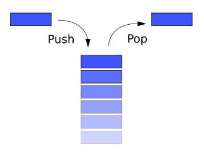

Stacks are used widely in computer systems.  In fact when your programs crash you get a **stack trace** which is a list of methods on the stack when the exception was raised.  Another example is when you send a document to a printer to print collated.  In that case the last page is printed first, followed by the next-to-last etc.  Thus the information may be sent to the printer using a stack

## Queues

A Queue is a similar abstract data structure.  While a stack is a LIFO (last-in-first-out) data structure, a queue is a First-In-First-Out (FIFO) data structure.  The first element added will be the first element removed.

A Queue has the following methods:

- `enqueue(e)` - This method takes an element and adds it to the back of the queue.
- `dequeue` - This method removes and returns the element from the front of the queue


## Graphs

We saw earlier with linked lists, we can create a data structure by creating nodes and linking them together by having elements reference other nodes in the data structure.

A Graph is a generalization of this concept.  In a graph each node has links or references to other nodes in the data structure.  In a graph the links between nodes or _edges_ can be weighted, which each link has a designated cost, or unweighted.

We will look at graphs in more detail later in internship.

### Example Graph Problem:  Traveling Salesperson Problem

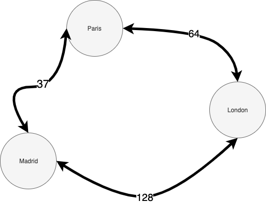

Consider the graph above.  Alice is in sales and charged with visiting clients in Paris, London and Madrid.  They need to set up a route to visit each city **exactly once** with the lowest possible cost.

**Question**

<details>
  <answer>How many possible routes, if Alice can start in any city?</answer>
  There are 6 routes
  Paris -> London -> Madrid
  Paris -> Madrid -> London
  London -> Madrid -> Paris
  London -> Paris -> Madrid
  Madrid -> Paris -> London
  Madrid -> London -> Paris
</details>

If all the nodes are interconnected, given `n` nodes, there are `n!` possible routes.  This grows rapidly!  This problem the [traveling salesperson problem](https://www.youtube.com/watch?v=zM5MW5NKZJg) is from a class of problems called [NP-Hard](https://en.wikipedia.org/wiki/NP-hardness).  We know how to solve them in polynomial time, but do not know if they can be solved in a better time complexity.

## Trees

A tree is a variation on a graph ADT.  Trees are a type of graph with one _root_ node where the data structure starts.  Each node in a tree can have 0 or more subnodes and a maximum of one parent.  A tree is unidirectional so no child can be an ancestor of it's parent.  

The image below illustrates a tree data structure.  The topmost node is known as the _root_.  The root is the start of the tree.  Nodes linked to from another node are called _children_.  The bottommost nodes with no children are known as _leaves_.  This diagram represents a binary tree, where each node may have 0-2 children, but othe trees exist with more children.

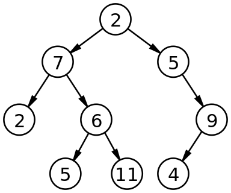

### Tree or Not A Tree

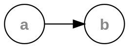

<details>
  <summary>Is the above a tree?</summary>
  YES!  Since the starting node has a child and the child does not link back to the parent, it is a tree.  So any linked list is in fact a kind o tree.  Weird but true!
</details>


<details>
  <summary>Is the above a tree?</summary>
  No!  In a tree, you cannot have a cycle, so a tree node cannot link back to itself.
</details>


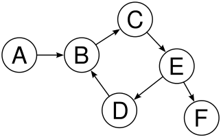

<details>
  <summary>Is the above a tree?</summary>
  No!  In a tree, you cannot have a cycle.  This node has a cyclepossible-tree.
</details>

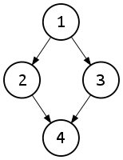

<details>
  <summary>Is the above a tree?</summary>
  No!  In a tree, each node cannot have more than 1 parent.
</details>

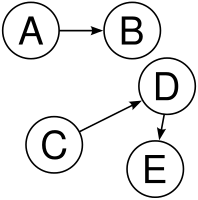

<details>
  <summary>Is the above a tree?</summary>
  No!  In a tree, You have to have 1 node to start with, as the root.  This has two unconnected sets of nodes, so you don't have a single root to start at.
</details>

<!-- Images from Wikipedia -->

Some example tree structures include:

- Organization charts
- Directory structures (files & folders in the operating system)

### Binary Search Trees

A binary search tree is a special type of tree where each element to the left of it's parent is less than the value of the parent, and the element to the right is greater than it's parent.  We will discuss Binary Search Trees in the internship portion of Ada.  So the left subtree of a node contains elements less than the node's value, and the right subtree contain nodes with elements greater than the node's value.

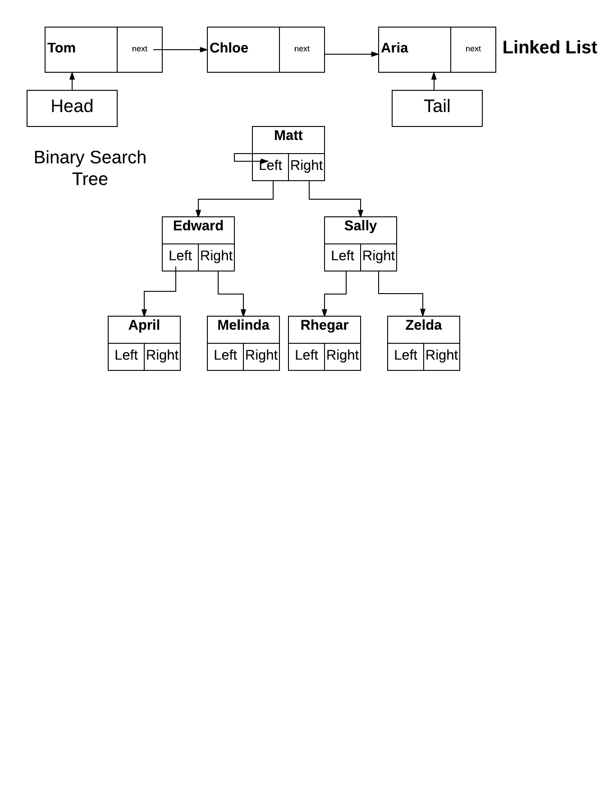

### Heaps

A heap is another variation on a binary tree.  In a heap, the tree is all level full, each node has 2 children, except the bottommost level.  So the tree is called almost complete because it maximizes the number of nodes in each level.  Only the second-to-last level can have less than 2 children.  Further in a max-heap each child is less than it's parent.  So the largest value is the root of the tree.  Similarly a min-heap is an almost-complete tree where each node is smaller than it's children.  

We will discuss heaps further in the internship period at Ada.

**Max Heap**

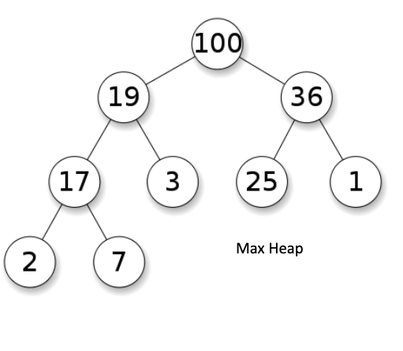

**Min Heap**

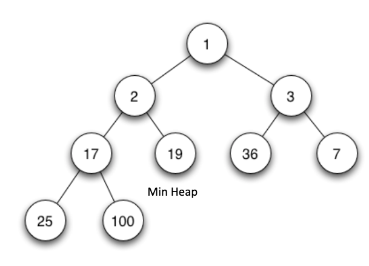


## How to approach the study of data structures

Each of the data structures follow _different rules that allow us to achieve certain intents_. e.g. a **Stack** data structure is a _linear_ data structure where all additions and all deletions must occur at one end, known as the _top_. This restriction makes it so that the data structure will always return the last item that was inserted. This property makes it so that stack becomes the optimal data structure of choice to design the _collate_ functionality in a printer's software. This is what allows for the last page to be printed first, the next to last and so forth so that the final output of printed pages appear in the correct order. As we'll see in future lessons, the *stack* design get used in how method calls work on a computer to form the *call stack*.

Each of the different ways of organizing the data _optimizes certain operations on the data_. For instance, we saw that the [Array data structure](https://github.com/Ada-Developers-Academy/textbook-curriculum/blob/master/04-cs-fundamentals/classroom/Arrays.md) is very efficient in retrieving the value of an element at a particular index with O(1) time complexity. However if the number of elements are going to change often due to frequent additions and deletions, Arrays are cumbersome to work with. If additions and deletions are going to be frequent operations and those operations being efficient is more important than retrieving the *k*th item in the data structure, then a **Linked List** would provide a better choice than Array data structure. _Knowing which operations a given data structure optimizes for and which operations are cumbersome or expensive on the data structure will allow you to choose the right design for your purpose._

Some data structures are _specialized versions of other data structures_. For example, a **graph** is a _non-linear_ data structure consisting of a finite set of _nodes_ and _edges_. A **tree** is a _connected_, _acyclic_ graph where one node is ditinguished as the _root_ of the tree and all other nodes are connected by a _directed_ edge from exactly one other node that is known as its parent. The directed edges in a tree connect from a parent node to its children node. A **binary tree** is a specialized form of a tree with the retriction that each node can have at the most two children. A **binary search tree** further retricts a binary tree and allows for sorted organization of data enabling fast searches in expected O(log n) time.

Some data structures could be _implemented using other data strucutres_. For example, a **stack** or a **queue**, can both be implemented using either an array or a linked list. In other words, behind the scenes, a stack or a queue is implemented simply as an array or a linked list with further restrictions added.

## Summary

We have looked, at a high-level, at a variety of data structures which we will examine in the course of CS Fundamentals.  

## Terms

| Term | Definition |
|--- |--- |
| Data Structure | A method of organizing, and managing information which enables efficient access and modification |
| Array | A homogenous collection of elements each identified by an index number or key.  |
| Linked List | |

## Resources

- [Basecs on Data Structures](https://medium.com/basecs/tagged/data-structures)
- [MIT Open Courseware Intro to Algorithms](https://ocw.mit.edu/courses/electrical-engineering-and-computer-science/6-006-introduction-to-algorithms-fall-2011/)
- [Former slides used in this course](https://docs.google.com/presentation/d/11Xxhv2y1SJ-oBzrmzPuosB69MLxI2g23SA_eEgPIbws/edit#slide=id.p1)