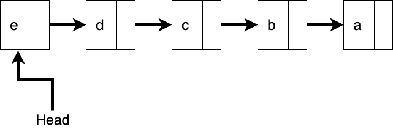

# Introduction Linked Lists

## Learning Goals

  + Understand structure of Linked Lists
  + Understand pros and cons of linked lists when compared to arrays
  + Types of Linked List
    + Singly linked list
    + Doubly linked list
  + Basic manipulation on a singly linked list
    + Add a value (i.e. node with a value)
    + Search for a value
    + Delete a value (i.e. node with a value)
    + Count number of nodes in the linked list

## Video Lesson

- [Video Lesson]() 
- [Slides](https://docs.google.com/presentation/d/1ylrnXEEMpPaGSBlIdnd0YHZSwTTKzNt0zYPDmFztLp0/edit#slide=id.p1)
- [Exercise]()

## What is a Linked List

We've seen individual variables like integers and floats.  We've also seen collections like arrays where each element forms a contiguous block.  In memory an array is allocated as a group of adjacent memory locations.  Below is an image illustrating this.


By contrast a Linked List is created by a collection of nodes, each in a different location in memory.


Each node is an object containing data **and** a reference, or link, to the next node in the list.  The last node has `nil` in it's reference to the next node.

## Structure of a Linked List

There are many ways to craft a Linked List.  We will start with a `Node` class.

```ruby
# node.rb
# defines a node in a linkedList
class Node
  attr_reader :data
  attr_accessor :next

  def initialize(value, nextNode = nil)
    @data = value
    @next = nextNode
  end
end
```

We could create a list of 5 nodes with this series of commands.

```ruby
a = Node.new("a")
b = Node.new("b")
b.next = a
c = Node.new("d")
c.next = b
d = Node.new("d")
d.next = c
e = Node.new("e")
e.next = d
```


Typically we don't maintain a variable for each node in the list instead we maintain a reference, or pointer, to the front of the list, called `head`.  Sometimes we also maintain a reference to the rear of the list, or `tail`.

The code snippet below creates the same structure as the above.

```ruby
head = Node.new("a")
# The line below will construct a new node and
#   Set it's `next` reference to the old value 
#   of `head`
head = Node.new("b", head)
head = Node.new("c", head)
head = Node.new("d", head)
head = Node.new("e", head)
```



## Traversing a Linked List

To find a particular value in a linked list you need to traverse the list starting with the first node and continuing until the value is found or the end of the list is encountered.


```ruby
# Continuing from the above code segment
current = head

found = false
until current.nil?
  if current.data == "d"
    puts "Found it!"
    found = true
  end

  current = current.next
end

puts "Didn't find it" unless found
```

**Questions:**

1.  What does the above code segment result in?
2.  Does the above code change the linked list?
3.  What happens if `current.data == "d"` is changed to `current.data == "f"`?


## Linked Lists vs Arrays

Like Arrays Linked Lists are organized in a linear (list) fashion, but they have a number of differences.  

- Unlike arrays Linked Lists are dynamically allocated, the size of a linked list will increase and decrease over time.  Whereas arrays are allocated in advance and typically do not change size.
- In a linked list each node can be located anywhere in memory.  Arrays allocate each element in a contigous block.
- Because there is only a reference to the first element of a linked list and the elements are stored at different locations in memory, the list must be traversed in a linear fashion to find the nth element.  You cannot just jump to list[3] in a Linked List like you would in an array.

The image illustrates the memory organization of a linked list vs an array.  Notice that the nodes are stored at a variety of locations, but each element of the array is adjacent to the previous element.


### When would you choose to use a linked list instead of an array

A Linked List can make sense when you do not know the space limitations of an array.  With an array memory is allocated in advance and having to reallocate memory if the available space is exhausted can be expensive.  Arrays can also be expensive to insert and delete elements from the middle.  With a Linked List one simply reorganizes the `next` references to insert an element into the middle.  


A Linked List can also be effective if memory is highly fragmented and there is not enough contigous space for an arrow to be allocated, but there is enough space dispersed across memory.


### Big-O of Common Array & Linked List Operations

| Operation 	| Arrays 	| Linked Lists 	|
|---	|---	|---	|
| find(value) 	| O(n) or O(log n) if sorted 	|  O(n)	|
| remove_front 	|  O(n)	|  O(1)	|
| add_front(data) 	| O(n) 	| O(1) 	|
| remove_at(index) 	|  O(n)	| O(n) 	|

## Encapsulation

In building a reusable data structure we often construct a class which hides implementation details behind a public interface.  This concept is called _Encapsulation_.  In our application we will construct a `List` class with the following public methods.


## Exercises

Here's the exercises we'll cover in class.

1. Add a node to a singly linked list
2. Search for a value in a singly linked list
3. Delete a node from a singly linked list
4. Count number of nodes in the linked list

