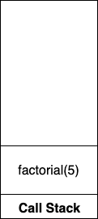
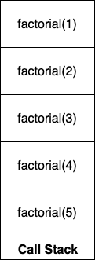
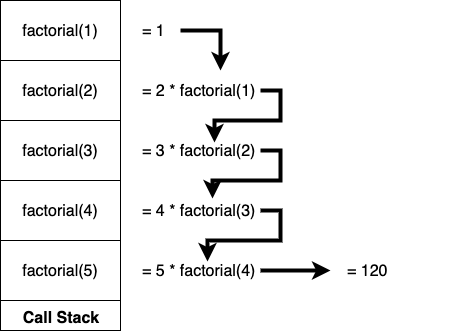

# Introduction to Recursion

## Learning Goals

By the end of this lesson you be able to:

- Explain recursion
- Trace through a recursive function call and understand time and space comlexities
- Author a recursive algorithm

## Video Lesson

- [Video Lesson]() - Coming Soon
- [Slides](https://docs.google.com/presentation/d/1SfpBdIgs38fj45WiwlFe6x0s0F44WqxPNHSizafzhwY) - Coming Soon
- [Exercise](https://github.com/Ada-C12/recursion-writing)

## Introduction

A recursive function is a function which calls itself.  We [have seen](function-calls.md) that function calls are placed on they _system call stack_ which functions in a last-in-first-out order.  


We have even seen some demonstrations of recursive methods.  Now we will look more closely at writing recursive methods.

## Parts of a recursive algorithm

A Recursive algorithm has two parts:

1. If the problem is easy, solve it immediately.
1. If the problem can't be solved immediately, divide it into smaller problems, then:  Solve the smaller problems by applying this procedure to each of them.

We call a problem that can be solved immediately a _base case_ and a problem that divides the problem into a smaller problem a _recursive case_.

So a recursive algorithm is really made up of:

- At least one base case.
- At least one recursive case.

### Without A Base Case

If you have a recursive function without a recursive case... well you just have a function.  However if a method has a recursive call without a base case like this:

```ruby
def infinite_recursion(n)
  return n + infinite_recursion(n - 1)
end
```

The recursive calls will continue until the stack runs out of space resulting in what's called a _Stack Overflow Error_.

### An example: factorial

Let’s consider the mathematical concept factorial.  In order to calculate a factorial of a number *n*, denoted as *n!*, you multiply all the numbers from n down to 1. The base case is for number 1.  The Factorial of 1 is 1.

So,
5! = 5 * 4 * 3 * 2 * 1
10! = 10 * 9 * 7 * 6 * 5 * 4 * 3 * 2 * 1
3000! = 3000 * 2999 * 2998 * 2997 * … * 3 * 2 * 1

We could also state 5! = 5 * 4 * 3 * 2 * 1 as:
	5! = 5 * 4!
	4! = 4 * 3!
	3! = 3 * 2!
	2! = 2 * 1!	And we know 1! = 1

So, in general:
n! = n * (n-1) * (n-2) * (n-3) * … * 1

Which broken down to model a recursive algorithm is:

- If simple, Solve it immediately --> 1! = 1
- If not simple, solve a small piece and then try to solve the rest --> n! = n * (n-1)!

If we were to divide this concept into a recursive definition, we might say:

- If n = 1, return 1
- If n > 1, return n * (n-1)!

We call this the *static view* of a recursive method.  Basically the **static view** is the mathematical way of looking at a recursive problem.

Mathematically, factorial can be explained as:

- *1! = 1*
- *n! = n × (n-1)!*      if *n > 1*

The second statement shows the **recurrence relationship** while computing factorial of a number.

### Code it

Once we know what the base case(s) and the recursive case(s) of a problem are, we can then write the code.

**Given**:
Factorial

- factorial(1) = 1
- factorial(n) = n * factorial(n-1), where n > 1

We can code this as:

```ruby
def factorial(n)
  if n == 1
    return 1
  else
    return n * factorial(n-1)
  end
end
```

or

```ruby
def factorial(n)
  return 1 if n == 1
  return n * factorial(n-1)
end
```

### How Factorial Works

Each time the factorial function is called Ruby places a _stack frame_ on the call stack.  This is the memory storing the method's local variables, parameters and the location to return to when the method finishes.  Since most factorial calls where n > 1 result in multiple items placed on the system stack, this incurs a cost in terms of space complexity.

<details>
  <summary>What do you think the space complexity of factorial is?</summary>
  O(n)
</details>

### Tracing Through Factorial

If you have `factorial(5)` first this method call gets put on the call stack.



Then `factorial(5)` calls `factorial(4)`, which calls `factorial(3)`, and that calls `factorial(2)` and this calls `factorial(1)`.



`factorial(1)` returns 1, which is plugged into `factorial(2)` which multiplies 2 * that returned result and carries on down in this fashion.



So you can trace a recursive function by walking through it's function calls, placing them on a simulated stack and then unwinding the stack as methods complete returning their result to the calling method.  


### Understanding space and time complexities for the example

To compute *factorial(n)*, n operations will be needed. Therefore, the time complexity will be *O(n)*.</br>
Each recursive call will end up with a stack frame on the call stack. There will be *n* such stack frames by the time the base case is reached and the stack starts unwinding. Stack frames take up space in memory. So, the space complexity will be *O(n)*.

### Writing A Recursive Method

When writing a recursive method, try the following:

- Think about the recursive case: How are we going to break the problem into a smaller problem (by calling out method again) and get closer to the base case?
- Think about how you can reduce the problem to one or more smaller sub-problems of the same form.
- Think about what information you need to give to the sub-problems (the parameters).
- Think about what information you want back from the sub-problems (the return type).
- Write the method header.
- Think about the base case: When is the answer so simple that we know the answer without recursing?
- Write a method specification (like the static view of the problem) that explains exactly what it will do in terms of the parameters. Include any preconditions.
- Write the code.
- Test out your code with several different cases. Ensure all of them terminate with a base case and yield the right results.

## Example - Solving 

Consider this programming problem.

```
Devise an algorithm for a function that takes a natural number as input parameter and computes the sum of all natural number up to and including the input parameter.

E.g. 
natural_numbers_sum(3) should return 6 = 3 + 2 + 1
natural_numbers_sum(4) should return 10 = 4 + 3 + 2 + 1
```

Note:

In mathematics, the natural numbers are those used for counting and ordering. Natural numbers start with 0 or 1. (aka positive integers).

You could write an iterative solution like this:

```ruby
def natural_numbers_sum(num)
  sum = 0
  while num > 0 # While num is greater than zero
    sum += num  # Add the current num to sum
    num -= 1    # decrement num
  end

  return sum
end
```

<details>
  <summary>If you did this recursively, what is the base case?</summary>
  Either num = 1 or num = 0.  In that case return num.
</details>

<details>
  <summary>If you did this recursively, what do you do in the recursive case?</summary>
  return num + natural_numbers_sum(num - 1)
</details>

**Write the recursive solution** 

If you want the solution you can find it in [our examples folder](examples/natural_numbers_sum.rb).

## Infinite Recursion

What is wrong with this code:

```ruby
def fibonacci(num) 
  return fibonacci(num - 1) + fibonacci(num - 2)
end
```

<details>
  <summary>What could be wrong with the above code?</summary>
  This code produces a Stack Overflow Error because it performs infinite recursion.  The method needs a base case like return 1 if num <= 1
</details>

## Tail Recursion

Look at the the code sample below.  How does it differ from the previous `natural_numbers_sum`.

```ruby
def natural_numbers_sum(num, sum = 0)
  return sum if num == 0

  return natural_numbers_sum(num - 1, sum + num)
end
```

Go ahead and run the code.  It functions just the same, and for Ruby, the code, by default, functions the same.  On some systems however a compiler or interpreter can convert this into a loop, bypassing the time and space overhead of multiple function calls.

This technique is called _Tail Recursion_.  In tail recursion, the recursive call is the **last** command executed in a method, by leaving nothing else in the calling method to do the interpreter can re-work the recursion into a loop.  Ruby, by default, [doesn't enable this feature](https://nithinbekal.com/posts/ruby-tco/) of tail recursion, but many other languages do. The Ruby language spec doesn't require the feature because it does not want to force every implementation to support it and tail recursion can make stack traces harder to understand since they transform method calls into loops with no cooresponding line numbers.

In general a tail recursive method, like the example above carries the calculations in the parameters to avoid the calling method from needing to do any further calculations once the recursive call is complete.

## Recursion vs Iteration, Which is Better

Both loops and recursive solutions arrive at the same result, code gets repeated.  However recursive methods are often considered more _elegant_ because they can be written with less code.  Further some data structures like [binary search trees](../internship/binary-search-trees.md) are naturally recursive and recursive solutions are equally efficient and easier to write.  

On the other hand, iterative solutions do not require use of the system stack, saving space, and the overhead of a method call (both a cost in space and time).  Thus often an iterative solution will be both faster and more space efficient.

So why learn recursion?  A few reasons:

- Recursive code is sometimes easier to write and shorter
- Some data structures are recursive by nature which makes recursive methods attractive
- Often, if you need a stack-like data structure to store the state, a recursive solution can be nearly as efficient.
- A good portion of interview questions have a recursive solution

## Converting An Iterative Solution to Recursion

If you want to convert an iterative solution to recursion you can:

1. Identify the core, candidate loop in the iterative algorithm. Convert this to a new function.
1. Add parameters to the new function to take the loop variables and local variables as input. (In our example, add index as a parameter.)
1. Adapt the loop condition to an if condition, (if index >= length) in the new function. This will form the base case in the recursive function – returning and ending the recursion.
1. If the condition is not satisfied, we define the recursive case by converting the loop body into a recursive call. The loop variable from iterative version is updated while making the next recursive call.
Finally, test & check for optimizations in the new recursive function.

Lets convert a linear-search to recursion

```ruby
def search(array, to_find)
  index = 0
  while index < array.length
    if array[index] == to_find
      return index
    end
    index += 1
  end
  return nil
end
```

1. Our core candidate loop is the `while index < array.length`.  
1. Our loop control variable is `index`, which we can add as a parameter.
1. We can adapt the loop into an if statement to stop the recursion if we find the item, or if we run past the end of the array.

See below:

```ruby
def recursive_linear_search(array, to_find, current_index = 0)
  # Base Cases
  return nil if current_index > array.length
  return index if array[current_index] == to_find

  # Recursive Case
  return recursive_linear_search(array, to_find, current_index + 1)
end
```

### Exercise:  Write Binary Search

Given the following binary search method, convert it to recursion.  You can use the starter code below.

```ruby
def binary_search(array, to_find)
  high = array.length - 1
  low = 0
  while high >= low
    mid = (high + low) / 2
    if array[mid] == to_find
      return mid
    elsif array[mid] > to_find
      high = mid - 1
    else
      low = mid + 1
    end
  end

  return nil
end
```

```ruby
def recursive_binary_search(array, to_find, low = 0, high = array.length - 1)


end
```

You can see a solution in the [examples folder](examples/recursive_binary_search.rb)

## Terms & Terminology

| Term | Definition |
|--- |--- |
| Stack | A data structure which operates in a Last-In-First-Out order.
| Call Stack | The internal data structure which stores function calls.
| Recursion | A programming technique where a method calls itself. |
| Base Case | A condition which will end the recursion.  This is the case where the solution is straightforward to solve.
| Recursive Case| The part of a recursive method which makes a recursive call. |
| Tail Recursion | A tail recursive function is a recursive function where the function calls itself at the end ("tail") of the function in which no computation is done after the return of recursive call. |
| Stack Overflow Error | An error caused when the system stack memory is exhausted, usually from infinite recursion.  |

## Resources

- [FreeCodeCamp How Recursion Works](https://www.freecodecamp.org/news/how-recursion-works-explained-with-flowcharts-and-a-video-de61f40cb7f9/)
- [UW Lesson On Recursion](https://www.cs.washington.edu/apcs/lessons/recursion) - Java Focused
