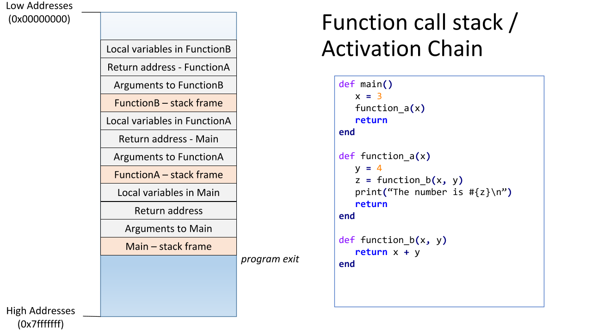

# Introduction to Recursion

## Learning Goals

By the end of this lesson you be able to:

- Explain recursion
- Trace through a recursive function call and understand time and space comlexities
- Author a recursive algorithm

## Video Lesson

- [Video Lesson]() - Coming Soon
- [Slides](https://docs.google.com/presentation/d/1SfpBdIgs38fj45WiwlFe6x0s0F44WqxPNHSizafzhwY) - Coming Soon
- [Exercise](https://github.com/Ada-C12/recursion-writing)

## Introduction

A recursive function is a function which calls itself.  We [have seen](function-calls.md) that function calls are placed on they _system call stack_ which functions in a last-in-first-out order.  



We have even seen some demonstrations of recursive methods.  Now we will look more closely at writing recursive methods.

## Parts of a recursive algorithm

A Recursive algorithm has two parts:

1. If the problem is easy, solve it immediately.
1. If the problem can't be solved immediately, divide it into smaller problems, then:  Solve the smaller problems by applying this procedure to each of them.

We call a problem that can be solved immediately a _base case_ and a problem that divides the problem into a smaller problem a _recursive case_.

So a recursive algorithm is really made up of:

- At least one base case.
- At least one recursive case.

### Without A Base Case

If you have a recursive function without a recursive case... well you just have a function.  However if a method has a recursive call without a base case like this:

```ruby
def infinite_recursion(n)
  return n + infinite_recursion(n - 1)
end
```

The recursive calls will continue until the stack runs out of space resulting in what's called a _Stack Overflow Error_.

### An example: factorial

Let’s consider the mathematical concept factorial.  In order to calculate a factorial of a number *n*, denoted as *n!*, you multiply all the numbers from n down to 1. The base case is for number 1.  The Factorial of 1 is 1.

So,
5! = 5 * 4 * 3 * 2 * 1
10! = 10 * 9 * 7 * 6 * 5 * 4 * 3 * 2 * 1
3000! = 3000 * 2999 * 2998 * 2997 * … * 3 * 2 * 1

We could also state 5! = 5 * 4 * 3 * 2 * 1 as:
	5! = 5 * 4!
	4! = 4 * 3!
	3! = 3 * 2!
	2! = 2 * 1!	And we know 1! = 1

So, in general:
n! = n * (n-1) * (n-2) * (n-3) * … * 1

Which broken down to model a recursive algorithm is:

- If simple, Solve it immediately --> 1! = 1
- If not simple, solve a small piece and then try to solve the rest --> n! = n * (n-1)!

If we were to divide this concept into a recursive definition, we might say:

- If n = 1, return 1
- If n > 1, return n * (n-1)!

We call this the *static view* of a recursive method.  Basically the **static view** is the mathematical way of looking at a recursive problem.

Mathematically, factorial can be explained as:

- *1! = 1*
- *n! = n × (n-1)!*      if *n > 1*

The second statement shows the **recurrence relationship** while computing factorial of a number.

### Code it

Once we know what the base case(s) and the recursive case(s) of a problem are, we can then write the code.

**Given**:
Factorial

- factorial(1) = 1
- factorial(n) = n * factorial(n-1), where n > 1

We can code this as:

```ruby
def factorial(n)
  if n == 1
    return 1
  else
    return n * factorial(n-1)
  end
end
```

or

```ruby
def factorial(n)
  return 1 if n == 1
  return n * factorial(n-1)
end
```

### How Factorial Works

Each time the factorial function is called Ruby places a _stack frame_ on the call stack.  This is the memory storing the method's local variables, parameters and the location to return to when the method finishes.  Since most factorial calls where n > 1 result in multiple items placed on the system stack, this incurs a cost in terms of space complexity.

<details>
  <summary>What do you think the space complexity of factorial is?</summary>
  O(n)
</details>

### Tracing Through Factorial

If you have `factorial(5)` first this method call gets put on the call stack.


Then `factorial(5)` calls `factorial(4)`, which calls `factorial(3)`, and that calls `factorial(2)` and this calls `factorial(1)`.


`factorial(1)` returns 1, which is plugged into `factorial(2)` which multiplies 2 * that returned result and carries on down in this fashion.


So you can trace a recursive function by walking through it's function calls, placing them on a simulated stack and then unwinding the stack as methods complete returning their result to the calling method.  


### Understanding space and time complexities for the example

To compute *factorial(n)*, n operations will be needed. Therefore, the time complexity will be *O(n)*.</br>
Each recursive call will end up with a stack frame on the call stack. There will be *n* such stack frames by the time the base case is reached and the stack starts unwinding. Stack frames take up space in memory. So, the space complexity will be *O(n)*.

### Writing A Recursive Method

When writing a recursive method, try the following:

- Think about the recursive case: How are we going to break the problem into a smaller problem (by calling out method again) and get closer to the base case?
- Think about how you can reduce the problem to one or more smaller sub-problems of the same form.
- Think about what information you need to give to the sub-problems (the parameters).
- Think about what information you want back from the sub-problems (the return type).
- Write the method header.
- Think about the base case: When is the answer so simple that we know the answer without recursing?
- Write a method specification (like the static view of the problem) that explains exactly what it will do in terms of the parameters. Include any preconditions.
- Write the code.
- Test out your code with several different cases. Ensure all of them terminate with a base case and yield the right results.

## Terms & Terminology

| Term | Definition |
|--- |--- |
| Stack | A data structure which operates in a Last-In-First-Out order.
| Call Stack | The internal data structure which stores function calls.
| Recursion | A programming technique where a method calls itself. |
| Base Case | A condition which will end the recursion.  This is the case where the solution is straightforward to solve.
| Recursive Case| The part of a recursive method which makes a recursive call. |
| Tail Recursion | A tail recursive function is a recursive function where the function calls itself at the end ("tail") of the function in which no computation is done after the return of recursive call. |

## Resources

- [FreeCodeCamp How Recursion Works](https://www.freecodecamp.org/news/how-recursion-works-explained-with-flowcharts-and-a-video-de61f40cb7f9/)
- [UW Lesson On Recursion](https://www.cs.washington.edu/apcs/lessons/recursion) - Java Focused
