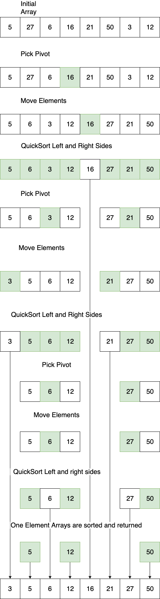

# Recursive Programming Strategies

In this lesson we will look at some programming strategies, Divide & Conquer and Dynamic programming, and how they can be used to solve recursive problems.

## Learning Goals

By the end of this less you should be able to:

- Explain what a divide & conquer solution is
- Write some divide & conquer solutions
- Explain the concept of dynamic programming
- Explain the concept of memoization
- Use dynamic programming to optimize programming solutions

## Divide & Conquer

_Divide & Conquer_ is an algorithmic paradigm.  This means it's an approach to problem solving.  You have already seen such solutions previously.  When we wrote a binary search, we we will revisit below we divided the problem into an easier-to-solve subproblem and then solved the subproblem.  As we will see MergeSort works similarly.  

When we write a divide & conquer solution we normally:

1. Break the problem into subproblems of the same type.
1. Recursively solve the subproblems
1. Combine the solved subproblems to solve the larger problem

### Example:  Binary Search

We will start with a previously discussed algorithm, Binary Search. 

With binary search we select the middle of the given range in an array.  If we find the element we return it.  Otherwise we determine if the element is in the left or right of the array and performs binary search in the proper half.  

Each iteration divides the array in half and performs the binary search on a smaller subproblem.

```ruby
def recursive_binary_search(array, to_find, low = 0, high = array.length - 1)
  mid = (high + low) / 2

  return nil if high < low

  if array[mid] == to_find
    return mid
  elsif array[mid] > to_find
    recursive_binary_search(array, to_find, low, mid - 1)
  else
    recursive_binary_search(array, to_find, mid + 1, high)
  end
end
```

You can see a nice animation of Binary search on [Daniel Liang's website](http://www.cs.armstrong.edu/liang/animation/web/BinarySearch.html).

### Example:  QuickSort

QuickSort is a sorting algorithm which takes  a divide & conquer approach to solving these steps.

1. If the array is only one element or empty, you are done, the array is sorted.
1. Pick an element from the array as a _pivot_.
1. Move all elements smaller than the pivot to the left and all elements larger than the piviot to the right.  Note that the pivot is now in the correct index.
1. Perform QuickSort on the left and right sides of the pivot.



So in terms of Divide & Conquer, you pick a pivot and move elements smaller to the left and larger to the right and you have two smaller subproblems.  Then you call quicksort on each section, which is a smaller subproblem.

### Example:  MergeSort

Merge sort is a *divide-and-conquer* algorithm. It involves the following three stages:

1. **Divide** the array into two sub-arrays at each step until each sub-array is of size one.
1. **Sort** each sub-array. (An array of size one is sorted by default.)
1. **Merge** the sub-arrays into one array by combining two sub-arrays into one at each step.</br></br>

This is usually done by keeping track of three indices in the array: *starting index*, *ending index* and *midway index* as shown in the image below. </br></br>


</br>As you can see in the image above, in the first *divide* step, the original array of size eight gets divided into two sub-arrays of size four each. This is done by setting *starting index* to *0*, the index of the first element in the array and the *ending index* set to the index of the last element in the array. The *midway index* is then computed using the formula: </br>
&nbsp;&nbsp;&nbsp;&nbsp;*midway index* = (*starting index* + *ending index*)/2

For the first *divide* step, the *midway index* will be *(0+7)/2* i.e. *3* (by considering the floor of *3.5*).</br>
In the next *divide* step, we have two sub-arrays, one ranging in index from *0* to *3* and the other ranging in index from *4* to *7*. The sub-arrays are not yet of size one. So, the same action gets repeated to compute the *midway index*. This *divide* stage continues until the original array of size *n* is reduced to sub-arrays of size *1* each.

A sub-array of size one is trivially, and by default sorted.

The *merge* stage starts by combining two sub-arrays at a time. While combining the sub-arrays containing *7* and *2* respectively, the values in each is compared, the smaller value i.e. *2* is written to the lower index, and the higher value i.e. *7* is written to the higher index. The mergining process continues in this manner. An auxiliary array of size *n* is often used to faciliate the merge steps. 

Consider the two sub-arrays *[1, 2, 7, 8]* and *[3, 5, 6, 9]* in the final merge step in our example image above.

- We start with comparing *1* with *3*. The smaller value, *1* gets written to the auxiliary array. (Auxiliary array: *[1]*)
- Next, we compare *2* with *3*. *2* gets written to the auxiliary array. (Auxiliary array: *[1, 2]*)
- Next, we compare *7* with *3*. *3* gets written to the auxiliary array. (Auxiliary array: *[1, 2, 3]*)
- Next, we compare *7* with *5*. *5* gets written to the auxiliary array. (Auxiliary array: *[1, 2, 3, 5]*)
- Next, we compare *7* with *6*. *6* gets written to the auxiliary array. (Auxiliary array: *[1, 2, 3, 5, 6]*)
- Next, we compare *7* with *9*. *7* gets written to the auxiliary array. (Auxiliary array: *[1, 2, 3, 5, 6, 7]*)
- Next, we compare *8* with *9*. *8* gets written to the auxiliary array. (Auxiliary array: *[1, 2, 3, 5, 6, 7, 8]*)
- At this point, all elements of the first sub-array have been merged. So, all remaining elements of the second sub-array get copied over linearly to the auxiliary array. In this case, only one element is left in the second sub-array. So, *9* gets copied over to the auxiliary array. (Auxiliary array: *[1, 2, 3, 5, 6, 7, 8, 9]*)

This two-way merging continues until there are no more sub-arrays and the orignal array is completely soorted. Finally, the auxiliary array gets linearly copied back to the original array.

**Analysis:** The time complexity of merge sort is *(n log n)*. Let's look closer to understand this.

- **Divide**: Finding the midway index is a straightforward computation (*midway index* = (*starting index* + *ending index*)/2). This takes constant time regardless of the subarray.
- **Merge**: Merging a total of *n* elements takes *O(n)* time. If there are two sub-arrays of size *n/2* each, then we will compare one element from one sub-array with another element from the second sub-array and one of the two will get copied. This step will continue until all are copied, taking a total of *O(n)* time.
- As the sub-problems get smaller, the number of sub-problems doubles at each level, but the merging time halves. The doubling and halving cancel each other out and so the merging takes *O(n)* time at each level of the merge steps (as seen in the image above). 
- **Base case**: In the base case, we have sub-arrays of size *1* and a total of *n* subarrays. It takes *O(1)* time to sort an array of size one. Overall, merging at base level is *O(n)* time, just like any other level.
- **Count of levels**: Starting with *n* elements and reducing by half at each level, until we reach one element sized array takes *log n* steps. Similarly, starting with sub-arrays of one element each and combining two sub-arrays at a time until we reach an array of *n* elements also takes *log n* steps.
Overall, each level takes *O(n)* time. There are *O(log n)* such levels. Resulting in an overall time complexity of O(n log n) for merge sort.

Note: We will look closer at merge sort and its implementation when we discuss *Recursive algorithms* in the future.

For small arrays insertion sort performs better than merge sort, but as the size of the array grows merge sort becomes much more performant.  There are other O(n log n) sorting algorithms, notably [Quick Sort](https://www.geeksforgeeks.org/quick-sort/), and [Heap Sort](../internship/heaps.md).

## Dynamic Programming


### Fibonacci


## Resources

