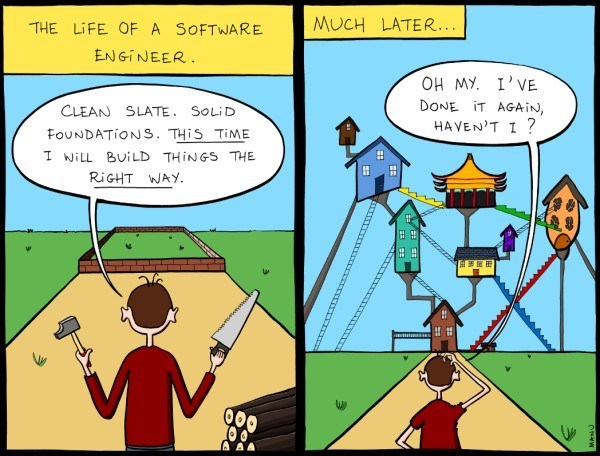
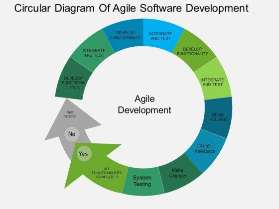
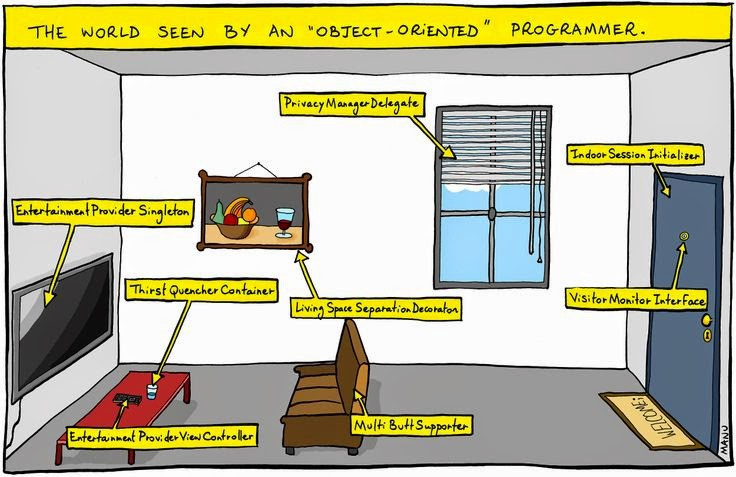
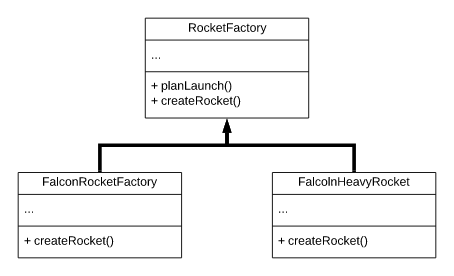
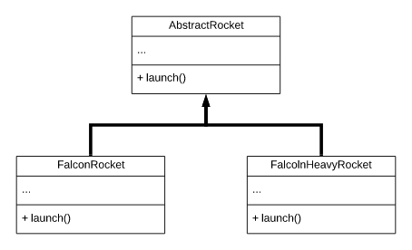

# Introduction to software design principles



<!--  Image from https://www.geeksaresexy.net/2015/03/14/the-life-of-a-software-engineer-comic/ -->

Designing software is a complicated and difficult undertaking.  Because of this **software design** is a field of study that's grown up around techniques and strategies used to create software.  

## Learning Goals

By the end of this lesson you should be able to:

* Explain Object Oriented Design - common terms and concepts
* Conduct an introductory discussion on design principles
* Explain the concept of design patterns

## Notes

* [Slides used in class](https://docs.google.com/presentation/d/1D6X9J-4Jk5RZzoPjSCvOPP1DBb67i3eM55LIJyTluPw/edit#slide=id.p1)

## The Goals of Software Design

The goal of a software design team is to write code which accomplishes the current requirements and is relatively easy to maintain and adapt over time.  Over the history of software development, we have a long history of failed designs and over time have developed some strategies for creating software which satisfies requirements and is more suited to change over time.

### Project Organization with Agile

Agile is currently the dominant approach teams take to building software.  Agile is an *incremental* approach to building software centered on satisfying user requirements.  Agile isn't however software building recipe that you can just follow.  Agile is more of an approach and a set of principles.

The Agile principles include:

1. Our highest priority is to satisfy the customer through early and continuous delivery of valuable software.
1. Welcome changing requirements, even late in development. Agile processes harness change for the customer’s competitive advantage.
1. Deliver working software frequently, from a couple of weeks to a couple of months, with a preference to the shorter timescale.
1. Business people and developers must work together daily throughout the project.
1. Build projects around motivated individuals. Give them the environment and support they need, and trust them to get the job done.
1. The most efficient and effective method of conveying information to and within a development team is face-to-face conversation.
1. Working software is the primary measure of progress.
1. Agile processes promote sustainable development. The sponsors, developers, and users should be able to maintain a constant pace indefinitely.
1. Continuous attention to technical excellence and good design enhances agility.
1. Simplicity–the art of maximizing the amount of work not done–is essential.
1. The best architectures, requirements, and designs emerge from self-organizing teams.
1. At regular intervals, the team reflects on how to become more effective, then tunes and adjusts its behavior accordingly.

At Ada we follow the Agile approach by:

1.  First gathering requirements in the form of [user stories](https://www.mountaingoatsoftware.com/agile/user-stories).  This keeps the project focused on helping the end-users.
1.  Second, the user stories are prioritized and broken into tasks
1.  Then the developers assign a set of tasks to developers to be completed in a timeboxed unit known as a **[sprint](https://www.wrike.com/project-management-guide/faq/what-is-a-sprint-in-agile/)**.
1.  Developers work on their assigned tasks over the course of the sprint, holding a daily [stand up meeting](https://www.agilealliance.org/glossary/daily-meeting/) in which they update, their team on what they have worked on, what they will work on and any blockers.  Other topics that come up are not discussed but rather scheduled in another meeting.
1.  At the end of the sprint the team demonstrates the currently working code to the customer or management team.  They then receive feedback and make adjustments to take into account in future sprints.
1.  Lastly the team does a retrospective in which they reflect as a team on what went well, what needs improvement and questions to consider.  
1.  Then they begin the next sprint, if needed.

In Agile, the teams regularly release working software rather than make one major "complete" release.  This allows the team to regularly get additional feedback and make adjustments.



## Object Oriented Design

Most modern programming languages support Object-Oriented Programming (OOP).  They have classes which encompass both data and methods which operate on that data.  In this way we often model objects based on real-world objects with the state and behaviors of those real-world items.  The key components of OOP are *encapsulation*, *inheritance*, and *polymorphism*.



*[Image from a medium article](https://medium.com/swlh/5-free-object-oriented-programming-online-courses-for-programmers-156afd0a3a73)*

### Encapsulation

Encapsulation is the concept of wrapping data and methods that work on that data within a single unit, a class.  This concept is used to hide the internal state, and implementation details from code which uses that class.  By using encapsulation you can change the implementation details within a class and as long as the public interface remains the same no code which use the class needs to change.  This makes the code more flexible and helps prevent users from writing code which depend on the implementation details of other classes.

### Inheritance

Inheritance is the ability of one class to inherit capabilities or properties of another class, called the super class. When we write a class, we inherit properties from the parent class. So when we create a class, we do not need to write all the properties and functions again and again, as these can be inherited from another class which possesses it.  Inheritance allows the user to reuse the code whenever possible and reduce its redundancy. 

#### Inheritance vs Composition

Well inheritance allows us to reuse code, but if our class *has-an* instance of another class as an instance variable, i.e. composition.  When should you use one over the other?  

In general, unless one class is a specialized version of the parent class, you want to default to using composition.  Otherwise you will violate a principle of good design known as the Liskov Substitution Principle, more on this later.  

### Polymorphism

Polymorphism is the ability of data to be processed in more than one form. It allows the performance of the same task in various ways. It consists of method overloading and method overriding, i.e., writing the method once and performing a number of tasks using the same method name.

To pull an example from [getlaura](http://www.getlaura.com/polymorphism-in-ruby/), you can do polymorphism with inheritance.  In the below example there is a person class with an `introduce` method which does one thing, but the subclasses do the same method in different ways by overriding the parent method.  

```ruby
class Person
  def initialize(first, last, age)
    @first_name = first
    @last_name = last
    @age = age
  end

  def birthday
    @age += 1
  end

  def introduce
    puts "Hi everyone. My name is #{@first_name} #{@last_name}."
  end
end

class Student < Person
  def introduce
    puts "Hello teacher. My name is #{@first_name} #{@last_name}."
  end
end

class Teacher < Person
  def introduce
    puts "Hello class. My name is #{@first_name} #{@last_name}."
  end
end

class Parent < Person     
  def introduce           
    puts "Hi. I'm one of the parents. My name is #{@first_name} #{@last_name}."     
  end 
end 

john = Student.new("John", "Doe", 18) 
john.introduce   #=> Hello teacher. My name is John Doe.
```

In Ruby however you can also implement polymorphism via [duck typing](), or basically making the same method signature in totally unrelated objects and passing them in via parameters to methods which call this method.

```ruby
class Student
  attr_accessor :first_name, :last_name, :age
  def initialize(first, last, age)
    @first_name = first
    @last_name = last
    @age = age
  end

  def birthday
    @age += 1
  end
end

class ViewStudent
  def initialize(student)
    @student = student
  end

  def do_something
    puts "Student name: #{@student.first_name} #{@student.last_name}"
  end
end

class UpdateStudent
  def initialize(student)
    @student = student
  end

  def do_something
    puts "What is the student's first name?"
    @student.first_name = gets.chomp
    puts "What is the student's last name?"
    @student.last_name = gets.chomp
    puts "Updated student: #{@student.first_name} #{@student.last_name}"
  end
end

choices = [ViewStudent, UpdateStudent]

student = Student.new("John", "Doe", 18)

puts "Select 1 to view student or 2 to update student."
selection = gets.chomp.to_i
obj = choices[selection - 1]
obj = obj.new(student)
obj.do_something
```

## Design Principles

In programming design principles, are general rules we follow in order to have a good design.  The most commonly adopted design principles are known as by the SOLID acronym.

### Have SOLID Principles

SOLID is an acronym first proposed in 2000 by Bob C Martin, aka "Uncle Bob," as a set of princples to strive for to create software which is maintainable, extensible and understandable.

The SOLID principles are:

1. Single Responsibility Principle
1. Open/Closed Principle
1. Liskov Substitution Principle
1. Interface Segregation Principle
1. Dependency Inversion Principle

#### Single Responsibility Principle

As the name suggests this principle means that every class or module should have a single role.  So if you have a Product class it should handle information relating directly to products and have methods which act on products.  You shouldn't have an instance variable in the Product class which stores the merchant's  image.  That would be mixing roles and giving the Product class multiple responsibilities between merchant and product data.

Consider the following class:

```ruby
class TextManipulator
  attr_reader :text

  def initialize(text) 
    @text = text
  end

  def append_text(new_text)
    @text.concat(new_text)
  end

  def find_and_replace(word, replacement)
    if @text.include?(word)
      @text.gsub!(word, replacement)
    end
    return @text
  end

  def find_and_delete(word)
    return self.find_and_replace(word, "")
  end

  def print_text
    puts @text
  end
end
```

<details>
  <summary><em>Question:</em> Does this class exemplify the single responsibilty principle?</summary>

No!  This class mixes manipulating the text and printing the text out.  It's mixing display and data manipulation.

Instead we could create a `TextPrinter` class which might have a `TextManipulator` object as an instance variable, and handles the display of the text.

</details>


#### Open/Closed Principle

This principle dictates that a long-standing and well-tested class should not be modified when new features need to be built.  If you do that, you might introduce new bugs to older features.  Instead of changing that class, you should use inheritance or composition to create new classes to add new features.  The idea is that the codebase is open to extension, via inheritance and composition, but older classes are closed for modification.

Consider this class which sends notifications to the user.

```ruby
class Notifier
  # ...
  def send(user, message)
    EmailSender.send(user, message)
  end
end
```

But what if requirements change and we want to send push notifications instead of emails... we could modify the `Notifier` class, but that could introduce bugs.  Instead we should set this up to be open to extension, but without letting the user modify the class which sends email notifications.

```ruby
class Notifier
  # Abstract method
  def send(user:, message:)
    raise NotImplementedError, "Attempted to call an abstract method"
  end
end

class EmailNotifier < Notifier
  def send(user: message:)
    # code to send emails
  end
end
```

Then we could easily create new subclasses of `Notifier` which send push notifications, text messages etc.  It becomes much easier to extend our features without users modifing classes being used in deployed code.  

#### Liskov Substitution Principle

This principle is named after [Barbara Liskov](https://en.wikipedia.org/wiki/Barbara_Liskov), an MIT computer scientist.  This principle states that an instance of a subclass should be substitutable for an instance of the parent class without breaking the behavior.  

Consider the code below:

```ruby
class Rectangle
  attr_accessor :width, :height

  def initialize(width = 0, height = 0)
    @width = width
    @height = height
  end

  def area
    return width * height
  end
end

class Square < Rectangle
  def initialize(width = 0)
    super(width, width)
  end

  def width=(new_width)
    @width = new_width
    @height = new_width
  end

  def height=(new_height)
    @width = new_height
    @height = new_height
  end  
end

rec = Rectangle.new
rec.width = 3
rec.height = 4
puts rec.area  # prints 12

sq = Square.new
sq.width = 3
sq.height = 4
puts sq.area # prints 16
```

This example violates the Liskov Substitution Principle (LSP) because substituting a Square for a Rectangle gives a different result.  

Here are some guidelines for enforcing the LSP principle.

1.  Method signatures should match and accept the same number of parameters as the base type.
1.  The return type of a subclass' methods should match the parent class
1.  Exceptions in the subclass should match the type generated by the superclass.

A few indicators that you have violated LSP are:

* Have a subclass method that override a method of the base class method to give it completely new behaviour.
* Have a subclass which documents that certain methods inherited from the superclass should not be called by clients.
* A subclass throws additional (unchecked) exceptions not thrown by the superclass

A better solution would look like this:

```ruby
class Shape
  def calculate_area
    raise NotImplementedError
  end
end

def Rectangle < Shape
  attr_accessor :height, :width
  
  def calculate_area
    height * width
  end
end

def Square < Shape
  attr_accessor :side_length
  
  def calculate_area
    side_length * side_length
  end
end
```

Notice that we often create abstract superclasses to make our code more extensible!

#### Interface Segregation Principle

The Interface Segregation Principle states that if you have an abstract superclass it should not force subclasses to have a bunch of unwanted methods.  So abstract classes should be relatively small.  In other languages (Java for example), you can create interfaces which are lists of abtract methods and a class can choose to implement multiple interfaces.  The idea is that each interface should be a relatively small set of abtract methods.  

So many very small and specific interfaces are preferable to a large and complicated set of abstract methods in one interface.

#### Dependency Inversion Principle

The Dependence Inversion Principle states that a class should not depend on the implementation details of another class.  Instead you should rely on Duck Typing and abstractions.

Here is an example which violates this principle:

```ruby
class PostgresConnector
  def connect
    # code to connect to Postgres database
  end
  # ...
end

class Post
  attr_reader :db_connection

  def initialize
    @db_connection = PostgresConnector.new
  end

  def make_post(text)
    db_connection.connect()
    # ...
  end
end
```

Here this `Post` class maintains a variable which is a connection to a database.  It might work great... until your team switches to MySQL or another database.  The `Post` class here depends on implementation of the `PostgresConnector` class.  

It would be better to pass in an object as an argument to `initialize` and then the only dependency that `Post` has is that `@db_connection` implements a `connect` method.

```ruby
class PostgresConnector
  def connect
    # code to connect to Postgres database
  end
  # ...
end

class Post
  attr_reader :db_connection

  def initialize(connection)
    @db_connection = connection
  end

  def make_post(text)
    db_connection.connect()
    # ...
  end
end
```

We could now switch our implementation from Postgres to another database without having to rewrite the `Post` class.

## Design Patterns

A lot of problems are commonly encountered in software design.  A design pattern is like a blueprint to solve these common problems in your code.  This isn't the same as library code where you just import the method or class and the problem is solved.  The solution is a general concept or approach to solving the problem.  It's similar to an algorithm, but where an algorithm is a step-by-step solution to a problem, a design pattern is more of a high-level description of an approach.  You can think of it as a general template for how to solve a problem that can be used in many different situations.  

### Example the Factory Method Design Pattern

With the factory method design pattern we want to build an interface to create an object, but let subclasses design which class to instantiate.  This lets us defer the decision of which class to instantiate to the subclasses.  So the parent class provides the *interface* for creating objects, but subclasses can determine the ype of objects created.  

Imagine that you are working at SpaceX.  At present your code is coupled to create instances of the `FalconRocket` class.  If you wanted to add a new type of Rocket, maybe the `FalcolnHeavyRocket` class, you would need to make major changes to the whole codebase.  Then if you added a further type of rocket, maybe the `FalconSuperHeavyRocket` you would have to do a whole lot more!

Instead you can create an interface to generate rockets and implement those methods in methods which implement that interface.



To fit this pattern every object returned by the `createRocket` method should be a subclass of a common parent.  

Something like this:



The factory method pattern here is often specified in a framework and then implemented by users of the framework.


### Another Design Pattern:  MVC

The Model-View-Controller (MVC) architecture which you use in Rails applications is a very common design pattern for large applications.  It allows separation of files, and follows the SOLID design principles by giving each component a single responsibility, makes the application open to extension and trys to ensure that no component is dependent on the implementation details of another.

## Optional: Reading Material

* When would you choose [**Inheritance** verses **Composition**](https://www.thoughtworks.com/insights/blog/composition-vs-inheritance-how-choose)
* A blog post on [10 tips to write reusable code](http://hoskinator.blogspot.com/2006/06/10-tips-on-writing-reusable-code.html)
* A blog post on [S-O-L-I-D object oriented design principles](https://scotch.io/bar-talk/s-o-l-i-d-the-first-five-principles-of-object-oriented-design)
* Good articles by ObjectMentor on [Design Principles](http://web.archive.org/web/20060908022742/http://www.objectmentor.com:80/resources/listArticles?key=topic&topic=Design%20Principles) covers S-O-L-I-D and a few other design principles
* TutorialsPoint on [Design Patterns Interview Questions](https://www.tutorialspoint.com/design_pattern/design_pattern_interview_questions.htm)
* Andiamogo on [Object Oriented Design Interview Questions](http://www.andiamogo.com/S-OOD.pdf)
* CareerCup on [Object Oriented Design Interview Questions](https://www.careercup.com/page?pid=object-oriented-design-interview-questions)
* Book: [Practical Object-Oriented Design in Ruby](https://www.amazon.com/Practical-Object-Oriented-Design-Ruby-Addison-Wesley/dp/0321721330)
* Book: [Agile Software Development, Principles, Patterns and Practices](https://www.amazon.com/Software-Development-Principles-Patterns-Practices/dp/0135974445)
* Book: [Design Patterns: Elements of Reusable Object-Oriented Software](https://www.amazon.com/Design-Patterns-Elements-Reusable-Object-Oriented/dp/0201633612)

