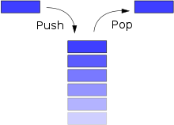

# Stacks and Queues
<b>Stacks</b> and <b>Queues</b> are both linear and homogeneous data structures. We come across various examples of stacks and queues in real life.

Examples of stack:
- a stack of ironed clothes (it's easiest to add a new ironed shirt on top and remove the top-most clothing in the stack)
- a stack of plates
- a stack of books

Examples of queue:
- A queue at the bus stop
- A queue at the driver's license office

## Aside: Abstract Data Type (ADT)
An Abstract Data Type (ADT) specifies _permitted operations_ as well as _time and space gurantees for those operations_ for a particular data type. An ADT therefore provides the contract of what it guranteed to the user of the ADT. ADT is a convention and a specification that every implementation of the ADT must satisfy.

### Abstract Data Type: Stack
- A <b>stack</b> is an ordered list in which all insertions and deletions are made at one end, called the _top_.
- The items in the stack follow an order such that the last item inserted in the stack is the first one that will get deleted from the stack. Hence, a stack follows the principle of <b>L</b>ast <b>I</b>n <b>F</b>irst <b>O</b>ut (<b>LIFO</b>).
- The insert operation in a stack is known as <b>Push(e)</b> where e is the item being added to the stack. 
- The delete operation in a stack is known as <b>Pop()</b>
- Push(e) and Pop() are guaranteed to take constant time (i.e. they are O(1) operations).



### Abstract Data Type: Queue
- A <b>queue</b> is an ordered list in which all insertions take place at one end known as the _back_ of the queue and all deletions are made at the other end, known as the _front_.
- The items in the queue follow an order such that the first item inserted in the queue is always the first one that will get deleted from the queue. Hence, a queue follows the principle of <b>F</b>irst <b>I</b>n <b>F</b>irst <b>O</b>ut (<b>FIFO</b>).
- The insert operation in a queue is known as <b>Enqueue(e)</b> where e is the item being added to the queue. 
- The delete operation in a queue is known as <b>Dequeue()</b>
- Enqueue(e) and Dequeue() are guaranteed to take constant time (i.e. they are O(1) operations).


## Using Stacks and Queues
The ADTs for Stack and Queue define the essentials of what any consumer of a Stack and any consumer of a Queue expect from any implementation of these data strucute. The details of how this functionality is provided is abstracted away from the consumer.


The consumer of the stack is interested in the functionality provided by the interface. The implementation details are all hidden from the consumer.

Same is true with the queue. 


### Printer
A printer is a great example of a device that uses both a stack and a queue.

When sending a document to a printer, one common option is to collate the output, in other words, to print the pages so that they come out in the proper order. Generally, this means printing the last page first, the next to last next, and so forth. This is how a <b>stack</b> gets leveraged in a printer.

```ruby
    def print_collated(job)
        stack = Stack.new

        job.pages.each do |page|
            stack.push(page)
        end
        
        while !stack.empty?
            print_page(stack.pop)
        end
    end
```

When sending a document to a printer, it may have to be held until the printer finishes whatever job it is working on. 
Holding jobs until the printer is free is generally the responsibility of a print spooler (a program that manages the input to a printer). 
Print spoolers hold jobs in a <b>queue</b> until the printer is free. This provides fair access to the printer and guarantees that no print job will be held forever.

```ruby
def initialize()
    job_queue = Queue.new()
end

def spool(document)
    job_queue.enqueue(Job.new(document))
end

def run()
    while (true)
        if printer.free? && !job_queue.empty?
            printer.print_job(job_queue.dequeue)
        end
    end
end
```

<b>Note</b>: As you can see in the example above, along with <b>push(e)</b> and <p>pop()</p>, a stack implementation often provides <b>empty</b>  and <b>full</b>as a conveniently available operation. The same two operations are also provided in a <b>queue</b>.

### Function call stack
When we looked at how function calls work and how recursive function calls work, we discussed the memory layout of a running process and the <b>function call stack</b>.


The stack part of the memory is where all the function calls take up space. As the name suggests, this portion of the memory, actually uses the concept of a stack.

Consider the following C code:


Function <b>Main</b> is the first one to be invoked in the program. <b>FunctionA</b> gets called from <b>Main</b>. <b>FunctionA</b> calls <b>FunctionB</b>. At the time that <b>FunctionB</b> is getting executed, here's what the <b>function call stack</b> will look like:


### Exercises using Stacks and Queues
<b>Given</b>: For each of the exercises below, assume that you're provided with an implementation for:
- a Stack with the following methods:
    - push(e), returns nothing
    - pop(), returns the element deleted
    - empty(), returns true if the stack is empty and false otherwise
- a Queue with the following methods:
    - enqueue(e), returns nothing
    - dequeue(), returns the element deleted
    - empty(), returns true if the queue is empty and false otherwise

Design algorithms and write pseudo code for the following exercises.
1. Design a method that takes a string as an input parameter and reverses it using a stack.
    <details>
        <summary>click here to see a solution in C
        </summary>
            
            void ReverseString(char *string)
            {
                /* Create and initialize a stack */
                Stack myStack;
                Stack Init(&myStack);

                // push each char in the original string to the stack
                // e.g. push to stack 'a', 'b', 'c' if input string is "abc"
                char *temp = string;
                while(*temp != '\0') {
                    Stack_Push(*temp);
                    temp++;
                }

                // pop from Stack and update string to be in reverse order
                // leverage the stack's LIFO nature
                while !Stack_Empty() {
                    *string = Stack_Pop();
                    string++;
                }
            }
    </details>
    <details>
        <summary>click here to see a solution in Ruby
        </summary>
        
            def reverse_string(my_string)
                # create a stack
                my_stack = Stack.new()

                # add each character to the stack
                my_string.length.times do |i|
                    my_stack.push(my_string[i])
                end

                # leverage the LIFO property of a stack and update the string to be reversed
                while !my_stack.my_string.length.times do |i|
                    my_string[i] = my_stack.pop()
                end
            end
    </details>
1. Given a string of open and closed parentheses i.e. a string composed only of ( and ) The string is said to have balanced parentheses if the open parentheses matches a closed parentheses i.e. the order and pairs match. Write a method that returns true if the parentheses are balanced, and false otherwise. What is the space and time complexity of your solution?
- Examples of balanced parentheses:
    - (())()
    - (())()(()(()()))
- Examples of unbalanced parentheses:
    - <b>)</b>(
    - (())()<b>)</b>
    - ((())<b>((</b>)
    <details>
        <summary> Solution option 1: Use a stack.
        </summary> 
        Create a stack. For every (, push into stack, for every ), pop from stack. If the stack is empty and a pop is not possible when needed, the string has unbalanced parentheses. If at the end of the string, the stack is not empty, the string has unbalanced parentheses. 
        Space complexity: O(n) where n is number of characters in the string.
        Time complexity: O(n) where n is number of characters in the string.
    </details>
    <details>
        <summary> Solution option 2: Tracking count.
        </summary>
        Initialize counter to 0. For every ( add a 1. For every ) subtract 1 from counter. If counter is every negative, the string has unbalanced parentheses. If counter is greater than 0 at the end of the string, the string has unbalanced parentheses.
        Space complexity: O(1)
        Time complexity: O(n)
    </details>
1. Assume the data contained in the Stack is integer values. Design and implement a method called _Top()_, which returns the next value that would get removed from the Stack. <b>Hint</b>: call _push(e)_ and _pop()_ on the stack. <b>Note</b>: This method is also sometimes called _Peep()_
    <details>
        <summary> click to see Solution
        </summary>
            def top(my_stack)
                return nil if my_stack.is_empty()

                top_value = my_stack.pop() # pop from stack
                stack.push(top_value) # push back into the stack
                return top_value # return value that will get popped next
            end
            # Time complexity: O(1) since it doesn't depend on stack size
            # Space complexity: O(1) since it doesn't depend on stack size
    </details>
1. Assume the data contained in the Queue is integer values. Design and implement a method called _Front()_, which returns the value of the next item that would get removed from the Queue. <b>Hints</b>: (i) call _dequeue()_, _enqueue(e)_ and _is_empty()_ on the Queue. (ii) you will need an additional data structure. <b>Note</b>: This method is also sometimes called _Peep()_
    <details>
        <summary> click here to see the solution
        </summary>
            def front(my_queue)
                return nil if my_queue.is_empty()
                
                temp = Array.new() # using an array data structure as an auxiliary
                while !my_queue.is_empty()
                    temp << my_queue.dequeue()
                end # remove from queue and add to temp

                temp.length.times do |i|
                    my_queue.enqueue(temp[i])
                end # add back to the queue in correct order

                return temp[0] # return the first element removed from the queue
            end
            # Time complexity: O(n), where n is the number of itmes in the Queue. n items are removed from the queue and added to temp. n items are added back to the queue.
            # Space complexity: O(n), where n is the number of items in the Queue. n items will need to be saved temporarily in the auxiliary data structure.
    </details>
1. [Binary Search Tree] Assuming you're familiar with Binary Search Trees, 
consider how you would use a Stack to perform pre-order depth first traversal iteratively.
1. [Binary Search Tree] Assuming you're familiar with Binary Search Trees, 
consider how you would use a Queue to perform breadth-first traversal iteratively.

## Implementation
### Implementing a Stack
As we saw earlier in this lesson, the consumer of the Stack care that _push_ and _pop_ methods are available in the Stack. Typically, the designer and developer of the Stack will try to abstract away the implementation details. The process of abstraction, allows the  programmer to hide implementation details, in order to reduce complexity and increase maintainability.


Let's consider the _private data structure_ in the diagram above. Knowing the requirements and use case scenarios, what data structure may we consider to keep a record of all the items in our stack? Since the stack is a linear data structure, we could consider saving the information in one of the linear data structures that we are already familiar with. An _array_ or a _linked list_ would serve our purpose. We would then need to ensure that the constraints and the requirements for the stack are met in how we devise our algorithms.

#### Stack implemented using an array
Let's consider implementing a stack using an array data structure. Because we're using a static data structure, we'll need to define the size of the array. Let's constrain our stack to 10 items. So, the size of the internal array is the _limit_ to which the stack may grow. The size of the stack may be 0 or any value less than or equal to the limit set by the inner array size.

With that, our stack class would look like below:
```ruby
    class Stack
        def initialize()
            @size = 0 # initial size of the stack
            @limit = 10 # limit to which the stack may grow
            @inner_array = Array.new(@limit) # internal private data structure: array
        end
    end
```

Next, we need to determine how to add the <b>push</b> and <b>pop</b> methods.

Any time an item is pushed into the Stack, we need to first check and ensure that there is room to add one more item in the internal array. If the array is full then our stack is at limit, we won't be able to add any more items. If there is room in the array, then we add it to the next available index. The next available index at the beginning would be `0`. Once the first item is added, we will need to update the stack size to have increased by one. Looking at the code above, you will notice that the `@size` could be used for both purposes.

With that, here's what our push method may look like:
```ruby
    def push(value)
        return nil if @size == @limit # stack is full

        @inner_array[@size] = value # add the new item to stack
        @size += 1 # update current stack size accordingly
        return
    end
```

Now, let's consider the _pop_ method. We can't remove an item from the stack if the stack is empty. We know that the stack is empty if `@size` is `0`. In this case, we can't pop anything. If however, the stack has at least one item, we return the item at the index of 