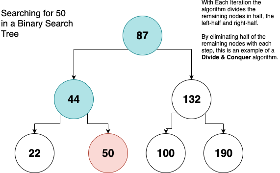
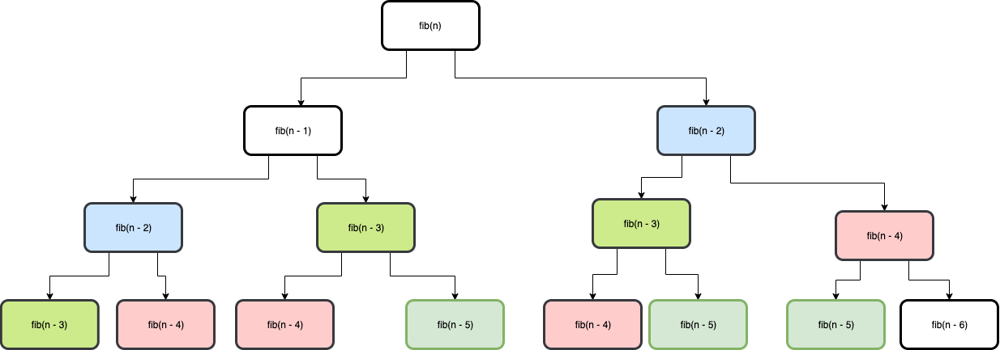

# Introduction to Algorithms

## Learning Goals

By the end of this lesson you should be able to:

- Further explain time and space complexity
- Explain the term algorithm
- Explain three categories of algorithms _greedy_, _divide and conquer_ and _dynamic programming_

## Video Lesson

- [Video Lesson](https://adaacademy.hosted.panopto.com/Panopto/Pages/Viewer.aspx?id=2619c3c1-e6d5-48a1-a199-aad7014dcc4e)
- [Slide Deck used for the lesson](https://docs.google.com/presentation/d/1QaCSJfqcQNCqFHk0zFdAL5zZCi-O37mGuhOIYLKcf_Q/edit#slide=id.gc6f75fceb_0_0)
- [Exercise](https://github.com/Ada-C12/dynamic-programming)

## What is an an algorithm

So what is an algorithm?  An _algorithm_ is a finite set of instructions that, if followed, accomplishes a particular task.  You can think of it as a series of steps to accomplish a task.  For example Google maps has an algorithm to calculate the best route to drive between any two points on map.  

All algorithms must have:

- Input
  - An Algorithm may accept zero or more inputs
- Output
  - An algorithm should produce some result
- Clarity
  - Each step in an algorithm should be a clear and unambiguous
- Finiteness
  - An algorithm should end after a finite number of steps. 
  - An algorithm cannot repeat forever (otherwise it doesn't solve a problem)
- Effectiveness
  - It should be possible for a person or computer to fulfill each step in an algorithm and the algorithm should accomplish the given task.

The art of computer science is really the art of devising, analyzing, proving the correctness and testing algorithms.

### Algorithms areas of study

The study of computer science is the study of algorithms.  Researchers in CS focus on:

- **Devising** algorithms
  - This is the art of using data structures and design strategies to develop new and useful algorithms
  - It also encompasses optimizing and generalizing existing algorithms
- **Validating** algorithms
  - This is the art of proving the correctness of an algorithm for all possible inputs
  - This is very similar to a mathematical proof
- **Analyzing** algorithms
  - This is identifying the time and space complexity of an algorithm
- **Testing** Algorithms
  - When we test an algorithm we are really debugging it.  
  - When we test an algorithm we run it on sample data and try to determine if it failed and if so correct the error.
  - We also _profile_ or conduct performance measurements by running the algorithm on sample data and measuring performance changes and memory usage.
    - If you have seen [leetcode](https://leetcode.com/), this site will take your solution to a common programming problem and compare it's performance to solutions from other developers.

**Question**

Now that hardware is so cheap and powerful and now that we have enormous cloud computing providers like AWS, is it worth wasting a programmer's valuable time trying to shave off seconds from the runtime of an algorithm?

## Analyzing Algorithms

When we analyze an algorithm we generally do not care how an algorithm performs on a specific input size.  Instead we look at how the runtime and memory usage changes as the input size grows.  Looking at how an algorithm's runtime and memory usage increases with increasing input is called, _Asymptotic Analysis_.

Why bother with asymptotic analysis?  Why bother with examining how an algorithm increases in runtime and memory usage as the input size increases?  This allows us to compare algorithms and select one over another.  It also allows us to judge if any algorithm will be able to solve a particular problem within a meaningful amount of time or the system's limited storage capacity.

Most often we measure things in terms of _worst-case_ performance of an algorithm.  This is important when response time and memory usage is critical like in managing a self-driving car or autopilot system.  There are also times where the _average-case_ performance is important, especially where an algorithm is run often or in many instance, like an analysis program run regularly on a cloud platform.

| Big-O | English Term
|--- |--- |
| O(1) | Constant |
| O(log n) | Logarithmic |
| O(n) | Linear |
| O(n<sup>2</sup>) | Quadratic |
| O(n<sup>3</sup>) | Cubic |
| O(2<sup>n</sup>) | Exponential |
| O(n!) | Factorial |

### Analyzing Binary Search Trees

In a _balanced_ binary search tree, finding a particular node has an asymptotic complexity of O(log<sub>2</sub> n), because at each step we cut the number of possible nodes by half.  This type of algorithm is called a _divide and conquer_ algorithm.

In this Divide & Conquer Algorithm we:

- Divide by splitting the remaining nodes into a left and right subtrees
- Conquer by continuing the search on the subtree which may contain the element

In a divide and conquer algorithm we reduce a large problem into smaller subproblems, which are the same problem, but in a smaller scale until we reach a base-case.  In this example, when we reach the node being searched for or a leaf node.

Because we will continually divide our list of potential nodes in half until we reach a leaf node, or the item searched for, this algorithm is O(log n) for time complexity.



### Mergesort

Mergesort is another classic divide and conquer algorithm.  In mergesort, if our list has a size greater than 1, we divide our list into two halves conduct a mergesort on each half and merge the sorted lists together.


#### Analysis of Mergesort

If the Time complexity of mergesort is `T(n)` we can determine the time complexity of mergesort as follows.

**Dividing** When we divide the list into two sublists this takes `O(1)` as it just calculates the middle of the sub-array.
**Conquer**  We then recursively sort each half, which is of size n/2.  You can then say that the time complexity of both halves is `2 * T(n/2)`.
**Combining** The merge method into an n-element subarray is `O(n)`.  

If you look at the diagram above we will divide and recombine a total of log n levels, just like a binary tree.  At each level of the merging step we will be merging a total of `n` elements.  Since we will have log n levels and at each level we merge n elements, this algorithm is `O(n log n)`

## Categories of Algorithms

There are a [number of different categories of algorithms](http://www.cs.ukzn.ac.za/~hughm/ds/slides/32-algorithm-types.pdf).  Each category describes the general approach to the algorithm's use in solving its particular problem.  Categories are not exclusive; an algorithm can be a member of multiple categories.  For example QuickSort is both a divide-and-conquer algorithm and a randomized algorithm in that it picks a random element as a pivot to sort against.

In this lesson we will look at a few categories, specifically _divide and conquer_ algorithms, _greedy_ algorithms and _dynamic programming_ algorithms.

### Divide & Conquer

We have looked at a few examples of divide and conquer algorithms above with Mergesort and finding an element in binary search tree.  In a divide and conquer algorithm you divide the problem into smaller subproblems and solve the subproblems.  Then you combine the subproblem solutions to solve the larger problem.  Very often divide and conquer algorithms are done recursively because their nature makes writing recursive implementations easier.

**Questions**

- What are some divide and conquer algorithms you have used?
- Is Heapsort a divide and conquer algorithm?  Why or why not?


**Example**

One divide and conquer algorithm is Quicksort.  Quicksort works by:

- Take the array and the start and end indices
- If the start and end indices are the same, you have one element and are done
- Select a random element in the array, called the `pivot`
- Move all the elements less than or equal to the `pivot` to the left side of the array and the elements greater than the pivot to the right side, with the `pivot` between them
- Now you have two parts to the array - the elements smaller than the pivot and the elements greater than the pivot
- Call Quicksort on the side smaller than the pivot and on the side greater than the pivot, to sort each side

As you can see Quicksort divides the larger problem into two parts, and then solves the two subproblems.  The time and space complexity of Quick Sort is an interesting problem as its worst-case is O(n<sup>2</sup>), but this worst-case is very unlikely as for that to occur the worst possible pivot would need to be used with each iteration.  You can read more about the time complexity of Quick sort on [Geeks for Geeks](https://www.geeksforgeeks.org/quick-sort/)

### Greedy

A greedy algorithm is like a mouse moving through a maze.  At each step the mouse will move into the next room with the tastiest cheese at each step.  It does not look at the entire problem, but only the current values available.  In other words, at each step, take the best possible value at the moment without regard for future consequences.  Greedy algorithms _hope_ that by picking local optimimums at each step, they will arrive at an optimum solution for the larger problem.  

#### Greedy Example 1 - Sorting

One example of a greedy sorting algorithm is this `greedy_sort` method.  In this method any time it finds an element smaller than the current element, it will swap.  

```ruby
def greedy_sort(list)
  list.length.times do |i|
    (i+1...list.length).each do |j|
      if(list[i] > list[j])
        swap(list, i, j)
end
```

**Question** Compare the `greedy_sort` with `selection_sort` below.  Which will end up making fewer swaps?

```ruby
def selection_sort(list)
  (list.length - 1).times do |i|
    temp = i
    ( (i + 1)...list.length).each do |j|
      if list[temp] > list[j]
        temp = j
      end
    end
    swap(list, i, temp)
  end
end
```

#### Greedy Example 2 - Merging Sorted Lists

In this problem you are given `k` sorted arrays of varying lengths and asked to merge them.  The greedy approach is to merge the smallest two arrays, then the next two smallest, including the merged result.

For example, suppose you had arrays a, b, and c which have 30, 20 and 15 elements each.  The greedy approach would be to merge arrays b & c, which would take 35 iterations, then merge the result with array a, which would take 65 iterations, for a total of 100.  If you had merged arrays a and b first, that would take 50 iterations, and then merging array c would take 65, for a total of 115 iterations.  

<details>
  <summary>Can you think of another way to solve this problem?</summary>
  You could also use a heap to solve this by adding the 1st element of each list to a min-heap, then removing the root value from the min-heap and adding the next element in the list from which it came into the heap, and repeating until the heap is empty.  This can be done in O(n log k) time where n is the total number of elements in all of the arrays and k is the number of arrays.
</details>

### Dynamic Programming

_Dynamic programming_, which is also sometimes referred to as _dynamic optimization_, is an approach to solving complicated problems by breaking them down into their smaller parts, and storing the results to these subproblems so that they only need to be computed once.  So any time you take a big problem and break it down into component parts and save the results from each part to use in solving the larger problem, you are doing dynamic programming.  

We looked earlier at greedy algorithms.  In a greedy algorithm the program makes the best looking choice in the moment and never revisits it's decisions to look back for a more optimal choice.  Often this method works, but even more often a greedy algorithm will find a solution that is not the most optimal.  The greedy sort we looked at above operates in this fashion.  It makes swaps in the moment, but never considers which element should end up in a specific index and ends up making more swaps than a selection sort.  However both greedy and dynamic programming approaches have to make choices at each step.  Both approaches attempt to make the best choice in very different ways.  Greedy algorithms make the best choice at each stage solving one subproblem at each step on the path to solving the larger problem.  Dynamic programming on the other hand tries to solve **all** the subproblems and then choose the best option from all the subproblems.  So a dynamic programming algorithm will look at all the possible subproblems before choosing a solution and a greedy algorithms only look through one subproblem.  This means that a dynamic programming solution is more thorough.

We have also looked at divide and conquer algorithms and there are a lot of overlapping ideas here, as divide and conquer algorithms also break a problem down into subproblems. However the subproblems in a dynamic algorithm can overlap and repeat whereas a divide and conquer algorithm's subproblems do not overlap.  

You can think of it like this.  You have 5<sup>4</sup> and know that this is 625.  When you are asked to find 5<sup>5</sup>, you could re-do 5\*5\*5\*5\*5 to calculate the answer or you could just multiply 5<sup>4</sup> by 5 and since you already have 625, the problem is easier to solve.

This is easier to explain with an example:

#### Dynamic Programming Example - Fibonacci

We have already seen the fibonacci sequence `fib(n) = fib(n-1) + fib(n-2)` for all n > 0 and `fib(1) = 1` and `fib(0) = 0`.  

We can solve that problem recursively like this:

```ruby
def fibonacci(n)
  raise ArgumentError, "n must be >= 0" if n < 0
  return 0 if n == 0
  return 1 if n == 1

  return fibonacci(n-1) + fibonacci(n-2)
end
```

However this solution, as we saw with recursion is wildly inefficient.  We can however write a dynamic programming solution which will solve all the subproblems and use them to solve the larger problem.

```ruby
def fibonacci(n)
  raise ArgumentError, "n must be >= 0" if n < 0
  
  # Build a memo of subproblems
  fib_numbers = Array.new(n)
  # Fill in the base case for the memo
  fib_numbers[0] = 0
  fib_numbers[1] = 1

  # Solve all the subproblems
  num = 2
  while num <= n
    fib_numbers[num] = fib_numbers[num - 1] + fib_numbers[num - 2]
    num += 1
  end

  # return the answer by using the memo
  return fib_numbers[n]
end
```

This dynamic programming solution solves the larger problem by solving all the individual subproblems and recording their results in an array, which I will call a memo.  This transforms an O(2<sup>n</sup>) time complexity algorithm into an O(n) algorithm.

The power of dynamic programming is that we never have to repeat the overlapping subproblems.  In Fibonacci if you calculate the algorithm manually, you will end-up calculating `fibonacci(2)` quite a lot.  By recording the results of that value in a memo, you avoid having to duplicate that work.

Take a look below, see how many times you are solving the same subproblem?



By recording solutions to subproblems for use later we are using a technique known as _memoization_.  This is a classic example of using space to save time.  We sacrifice a larger space complexity for the ability to look up solutions to subproblems rather than recalcualting them.

In the case of fibonacci, since you only need to remember the last two values of the sequence to solve for n, you could solve in this manner with an O(1) space complexity.  However this is still dynamic programming as you are memoizing subproblems for as long as you need them.

```ruby
def fibonacci(n)
  raise ArgumentError, "n must be >= 0" if n < 0
  return n if n < 2
 
  two_previous = 0
  one_previous = 1
  num = 2

  while num < n 
    temp = one_previous + two_previous
    two_previous = one_previous
    one_previous = temp

    num += 1
  end
 
  return one_previous + two_previous
end
```

## Summary

In this lesson we looked at what an algorithm is: a series of finite steps to solve a particular problem.  We also looked at how we analyze algorithms in terms of time and space complexity.  Lastly we looked at three categories of algorithms: greedy, divide and conquer, and dynamic programming.  Greedy algorithms attempt to solve a large problem by making locally optimal choices at each step, with the hope of solving a larger  problem.  Divide and conquer algorithms attempt to solve a big problem by repeatably breaking it into smaller subproblems until the subproblems become small enough to solve directly and then combining the results to solve the larger problem.  Dynamic programming also divides the problem into smaller subproblems, but it memoizes the results of the subproblems and uses the stored results to solve the larger problem.  These strategies are commonly used in writing useful algorithms.

## Terms & Definitions

| Term | Definition |
|-- |--- |
| Greedy Algorithm | A greedy algorithm is an algorithmic strategy that follows the problem solving strategy of making the locally optimal choice at each stage with the intent of finding an optimal solution to a larger problem. |
| Dynamic Programming | A dynamic programming algorithm is an algorithmic strategy which solves and stores subproblems which repeatably occur within a larger problem with the goal of using these saved results to optimize a solution to the larger problem.  |
| Divide and Conquer | A divide and conquer algorithm tries to solve a large problem by repeatably dividing it into smaller subproblems until the problems become small enough to be solved directly and then combining the results to solve the larger problem. |
| Memoization | In computer science  memoization is an optimization technique used to speed up computer programs by storing the results of expensive function calls and saving the results to use when those method calls occur again.  |
| asymptotic analysis | A mathematical method of examining programs which describes how the program performs as the input size grows. |
| profile | In engineering, profiling is a form of analysis which measures the space and time complexities of a program.  This tends to be more a practical and statistical analysis as compared to asympototic analysis. |

## Resources

- [Geeks for Geeks: Greedy Algorithms and the Knapsack problem](https://www.geeksforgeeks.org/greedy-algorithms/)
- [HackerEarth: Basics of Greedy Algorithms](https://www.hackerearth.com/practice/algorithms/greedy/basics-of-greedy-algorithms/tutorial/)
- [BaseCS: Less Repetition, More Dynamic Programming](https://medium.com/basecs/less-repetition-more-dynamic-programming-43d29830a630)

<!-- Diagram source https://drive.google.com/file/d/1UtfvVBsu6yAte1KftYjBhUwH8dCvjq33/view?usp=sharing -->
