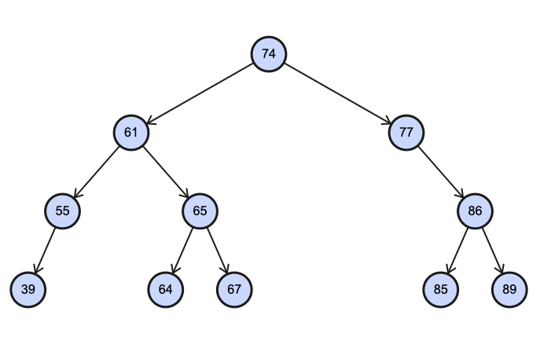
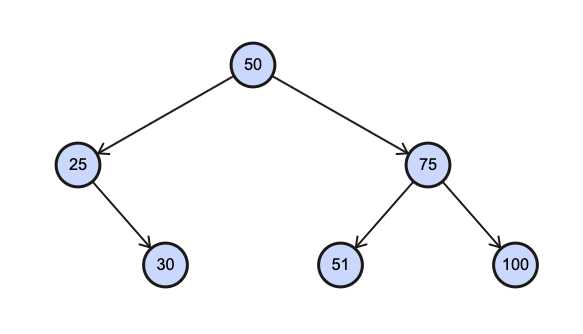

# Binary Search Trees

## Learning Goals

By the end of this lesson you should be able to:

- Compare a Binary Tree to a Linked List
- Explain how a Binary Search Tree differs from a generic Binary Tree
- Write methods to perform the following on a Binary Search tree:
  - Search
  - Insert value
  - Delete value
  - Find height
  - Perform traversals including: 
    - Depth first traversals: pre-order, in-order, post-order
    - Breadth first traversal

## Limitations of Linked Lists

Remember that finding an element in a Linked List requires a runtime of O(n).  This is because any search in a Linked List requires a linear search.  However once a Linked List node is found, removing or adding a node is O(1).  It would be ideal to combine the binary search O(log<sub>n</sub>) or a sorted array with the O(1) runtime to remove or add nodes.  This is what Binary Search Trees give us.

Instead of a node with one link to a next node, we can create nodes with 2 pointers, left and right.  Each node is not allowed to point back to a parent or grandparent.   So you can arrive at a child by following the links of it's parents, but there is no path from a child to a parent.  This ends up forming a tree like shape with each node having 0, 1 or 2 "children".  This is called a _Binary Tree_.  In this way a binary tree is an _acyclic, connected graph_.

In a special type of Binary Tree, called a _Binary Search Tree_ the left pointer points to all elements smaller than the node.  The right pointer points to all nodes greater than the given node.   Each node can refer to other nodes, but there is no way to go from a child node to a parent.  The links go in one direction.  A Tree is hierarchical with certain nodes acting as parents to others.  



Notice that nodes 61 and 77, both form subtrees of the larger tree data structure.  This enables you to use **recursion** on most tree methods because each child node forms a subtree.

**Exercise**

Given the following values draw a binary search tree:

"Ringo", "John", "Paul", "George"

## Binary Search Tree Node

Just like a Linked List node, a tree node has a data field, and links to other nodes.  However instead of linking to previous and next nodes, the links are to nodes less than and greater than the value in the data field.



The Node class for a Binary Search Tree (BST) could look like this:

```ruby
class TreeNode
  attr_reader :data
  attr_accessor :left, :right

  def initialize(data)
    @data = data
    @left = @right = nil
  end
end
```

These nodes are arrange with one node known as the **root** which is where the tree begins.  New nodes as they are added are placed to the left, if they are less than the current node, and to the right if they are greater than the current node.  This is a natually recursive process.

```
Method add:
  if the root is nil set the root to be a new node with the given value and return the node.

  Otherwise 
    if the value is less than or equal to the current root's value, make root's left be the result of calling add on root's left.
    otherwise make root's right be the result of calling add on root's right.
```

You can observe this in the [Binary Tree Visualizer](http://btv.melezinek.cz/binary-search-tree.html)


## The Tree Class

You can build a `Tree` class in a manner similar to how we created a `LinkedList` class.

```ruby
class Tree
  attr_reader :root

  def initialize
    @root = nil
  end

  # Tree methods go here...
end
```

## Finding a Value

You can try to search to find a value in a Binary Search Tree Like this:

```
If root is nil return nil
If the root equals the value being searched for return the root's data

If the value is less than the root return search on root's left side
If the value is greater than the root return search on root's right side
```

**Exercise** 

Try this out on the [Binary Tree Visualizer](http://btv.melezinek.cz/binary-search-tree.html).

**Question**:  What's the worst-case for finding a value in the tree?

**Question**:  What's the best-case for finding a value in the tree?

**Question**:  What would you guess is the average case for finding a node in a tree?

We will answer these questions in a bit.

## Balanced Trees & Unbalanced Trees

A tree is considered **balanced** if the height of it's left and right subtree differ by at most 1.  In this way the nodes in the tree must be spread fairly evenly.

This is an example of a balanced tree.


On the other hand this is an unbalanced tree.


<details>
  <summary>How many nodes do you need to examine to find 5, in the 1st example.  How many in the 2nd?</summary>

  In the 1st example you look at 25, then 10, and then 5.  In the 2nd you look at 100, then 50, then 25, then 15, then 10 and then 5.  

  So the 1st requires 3 lookups while the 2nd requires 6.
</details>

<br />

<details>
  <summary>Based on your expert knowledge of Big-O.  What's the time complexity to look up a node in a balanced tree?</summary>

  O(log n)
</details>

<details>
  <summary>What about an unbalanced tree?</summary>

  O(n)
</details>

Notice if a tree is balanced, you are essentially doing **binary search.**  If the tree is unbalanced, it more resembles linear search.  In general you can assume a tree is balanced given no other information just because if elements are inserted randomly, the resultant tree is likely to be more or less balanced.

**Self-Balancing Trees** There are a lot of algorithms for [keeping a tree balanced](https://en.wikipedia.org/wiki/Self-balancing_binary_search_tree).  These are wonderful things to learn, but beyond the scope of this class.

## Traversals

A _traversal_ is an action visiting each node in a graph such as a tree.  There are several kinds of traversals, Breadth First Traversals which visit each node level, by level and Depth First Traversals which visit a node's children before it's siblings.

### Breadth first Traversals

When you conduct a _breadth-first traversal_ you visit each node by level.  In other words you explore nodes on a given level before exploring their children.  


A Breadth First Traversal on the above tree could look like:

[50, 25, 75, 10, 30, 60, 100]

**Exercise**

Do a breadth first traversal on the tree you created for:  
"Ringo", "John", "Paul", and "George"

### Depth First Traversals

In a _Depth-first traversal_ you explore the children and grandchildren of a node before moving to it's sibling.

There are three standard types of depth-first traversals:

- **Pre-Order**:  Root, Left, Right
- **In-Order**: Left, Root, Right
- **Post-Order**: Left, Right, Root


For the above Binary Search Tree
- **Pre-Order**:  [50, 25, 10, 30, 75, 60, 100]
- **In-Order**: [10, 25, 30, 50, 60, 75, 100]
- **Post-Order**: [10, 30, 25, 60, 100, 75, 50]

**Exercise**


<details>
  <summary>In what order are the nodes in this tree encountered for each type of traversal
  </summary>
    Pre-Order  [17, 14, 20, 19, 52]
    In-Order: [14, 17, 19, 20, 52]
    Post-Order: [10, 19, 52, 20, 17]
</details>

<details>
  <summary>What is the height of the above BST?
  </summary>
    3
</details>

<details>
  <summary>Is the tree balanced?
  </summary>
    Yes because the left and right subtrees only differ by a height of 1.
</details>

### Why Do Traversals

There are a few use-cases for each of the depth-first traversals.

- **Pre-order** If you need to save a tree data structure to disk, or send it across the network and maintain the structure, pre-order traversals can be useful.
- **In-Order**: If you need to print all the nodes of a tree in order.
- **Post-Order**: If you need to delete all the nodes in a BST.

### Binary Expression Trees

There is also a kind of tree called a [Binary Expression Tree](https://www.geeksforgeeks.org/expression-tree/), which is a type of tree used to represent an arithetic formula.  In order traversals allow you to present the formula in the traditional manner while the preorder (prefix) and postorder (postifx) traversals can make the order more clear to machines.


## Finding the Height of a Binary Search Tree

To find the height of a binary search tree you can do the following:

```
If the node is nil return 0

Otherwise return 1 plus the maximum of the heights of the right and left subtrees
```

This is a recursive solution because it treats the left and right sides of a node as trees.

<details>
  <summary>What do you think the Big-O of finding the height of a tree is in this manner in terms of time & space complexity?</summary>

  Since you have to visit each node once, the time complexity is O(n).  Because you will have a maximum call stack (due to recursion) based on the height of the tree, you can estimate the space complexity as O(log n)
</details>

<!--
## Exercises

Design a recursive algorithm, deduce the space and time complexity and then, author functions to do the following. For each of the problems below, assume you are given a Binary Search Tree where each node contains an integer data and links to the left and right children nodes.

  1. Search for a given integer value in the Binary Search Tree. Return true if the value is found, false otherwise.
  2. Insert a given integer value in the Binary Search Tree.
  3. Compute the height of the Binary Search Tree.
  4. Print values in the Binary Search Tree in pre-order.
  5. Print values in the Binary Search Tree in in-order.
  6. Print values in the Binary Search Tree in post-order.
  7. Print values in the Binary Search Tree in level-order. (Breadth-first traversal)
  8. Delete a given value from the Binary Search Tree.

Design an iterative algorithm for the first seven exercises above, deduce the space and time complexity and author the functions to implement them. You may use additional data structures.
 -->

## Terminology

We will use the following terms in the lesson.

| Term 	| Definition 	|
|---	|---	|
| Tree Height 	| The maximum number of nodes to traverse to get from the root node to a leaf (bottom) node. 	|
| Root Node |  The starting node in a Binary Search Tree 	|
| Leaf Node |  A node in a binary search tree with no children (left & right are `nil`) 	|
| Unbalanced Tree 	|  A BST where each node has 0 or 1 children (it looks like a linked list) 	|
| Balanced Tree 	|  The starting node in a Binary Search Tree 	|
| Traversal 	|  A method of visiting each node in a BST	|
| Depth-First Traversal 	|  Explore the children and grandchildren nodes before moving to sibling nodes	|
| Breadth-first traversal 	|  Explore in level order.   Hit nodes in the root level then all the root's children, then all their children etc. 	|
| Parent Node | A node with references to one or more other nodes |
| Child Node | A node which can be accessed through a parent node |

## Additional Resources

- Recursion
  - Khan Academy on [Recursion](https://www.khanacademy.org/computing/computer-science/algorithms#recursive-algorithms)
  - Cornell CS211 Lecture Notes on [Recursion] (http://www.cs.cornell.edu/info/courses/spring-98/cs211/lecturenotes/07-recursion.pdf)
- Trees
  - [Trees](https://drive.google.com/drive/u/0/folders/0B6DpS0ihYV31alhKR2NKc3BuUGc)
  - Kal academy's material on [BSTs](https://drive.google.com/open?id=0BxHords9odw3ZXRGUlBZTHEta2M)
  - Kal academy's material on [Balanced BST](https://drive.google.com/open?id=0BxHords9odw3Sk5VZE9heWJjUXM)
  - Kal academy's material on [Bit Arrays](https://drive.google.com/open?id=0BxHords9odw3ZU11dzBtWkxCMjQ)
  - Read about [Tree Traversals](http://www.geeksforgeeks.org/618/) and watch videos on GeeksForGeeks
  - Read about [Binary Tree Introduction](http://quiz.geeksforgeeks.org/binary-tree-set-1-introduction/) on GeeksForGeeks
  - Read about [Binary Tree Properties](http://quiz.geeksforgeeks.org/binary-tree-set-2-properties/) on GeeksForGeeks
  - Read about [Types of Binary Tree](http://quiz.geeksforgeeks.org/binary-tree-set-3-types-of-binary-tree/) on GeeksForGeeks
  - Stanford CS Education Library material on [Binary Trees](http://cslibrary.stanford.edu/110/)
  - Stanford CS Education Library material on [Tree List Recursion Problem](http://cslibrary.stanford.edu/109/)
  - Cornell CS211 Lecture Notes on [Lists, Priority Queues and Binary Search Trees](http://www.cs.cornell.edu/info/courses/spring-98/cs211/lecturenotes/06-ListsPQsBSTs.pdf)
  - MIT Open Courseware on [Breadth First Search](https://ocw.mit.edu/courses/electrical-engineering-and-computer-science/6-006-introduction-to-algorithms-fall-2011/lecture-videos/lecture-13-breadth-first-search-bfs/)
  - MIT Open Courseware on [Depth First Search](https://ocw.mit.edu/courses/electrical-engineering-and-computer-science/6-006-introduction-to-algorithms-fall-2011/lecture-videos/lecture-14-depth-first-search-dfs-topological-sort/)
  - MIT Open Courseware on [Binary Search Trees, BST Sort](https://ocw.mit.edu/courses/electrical-engineering-and-computer-science/6-006-introduction-to-algorithms-fall-2011/lecture-videos/lecture-5-binary-search-trees-bst-sort/)

## Optional offline Problem Sets

- Convert a given integer array e.g. {5,2,1,6,7,3,4} to a Binary Search Tree.
- Find the height of a BST using an iterative solution.
- Given 2 Binary Trees (not BST), return true if both trees have the same in-order else return false. Note: You can save in-order from both trees and compare in the end (try implementing this as well). Can you inorder traverse them parallely and stop the traversal on a mismatch to return false instead?
- In "Cracking the Coding Interview" book, "Chapter 4: Trees and Graphs"
- CareerCup [Trees and Graph Interview Questions](https://www.careercup.com/page?pid=trees-and-graphs-interview-questions) - scan and look for the tree interview questions.
- Kal academy's problems on [Trees](https://drive.google.com/open?id=0BxHords9odw3b2d1ZTJtVkZZTkk)

## Former Slide Deck

- Former Slide Deck used in class</br>
<span xmlns:dct="http://purl.org/dc/terms/" property="dct:title"><a href="https://drive.google.com/file/d/0B__DV26QHsH4SXFxN2JpS3RGRkE/view?usp=sharing">Binary Search Trees</a> and <a href="https://drive.google.com/file/d/0B__DV26QHsH4bWJmS1A0QXBad1U/view?usp=sharing">Introduction to Recursion</a></span> is licensed under a <a rel="license" href="http://creativecommons.org/licenses/by-nc-nd/4.0/">Creative Commons Attribution-NonCommercial-NoDerivatives 4.0 International License</a>.</br>
<a rel="license" href="http://creativecommons.org/licenses/by-nc-nd/4.0/"></a>
