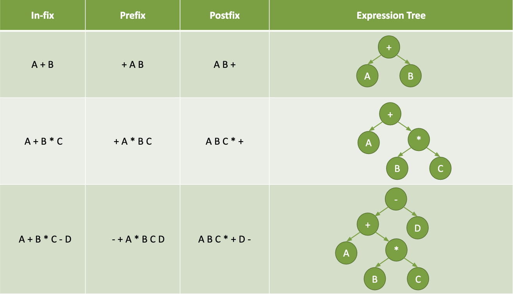

# Binary Search Trees

## Learning Goals

By the end of this lesson you should be able to:

- Compare a Binary Tree to a Linked List
- Explain how a Binary Search Tree differs from a generic Binary Tree
- Write methods to perform the following on a Binary Search tree:
  - Search
  - Insert value
  - Delete value
  - Find height
  - Perform traversals including: 
    - Depth first traversals: pre-order, in-order, post-order
    - Breadth first traversal

## Video Lesson & Exercises

- [Video Lesson](https://adaacademy.hosted.panopto.com/Panopto/Pages/Viewer.aspx?id=d9746397-8a10-43be-b1cc-aaaf00720b31)
- [Slide Deck](https://docs.google.com/presentation/d/1jE2bQDXkoCIJmqBgFXuripXftzrijuSY1JRKf2Ln7MY/edit#slide=id.p)
- [Binary Trees Practice](https://github.com/Ada-C11/tree-practice)

## Sample Problem

Ada is working on software powering an online store.  Their application needs to maintian a list of products in memory and maintain them in order by price.  The app should be able to list all the products sorted by price, and look up individual items at a particular price.  The application will also need to add products as they are added to inventory and remove them when they are sold out.

They could maintain a sorted array.  It's very quick to find individual elements by executing a binary search O(log n), and because the list is in order, simply traversing the array will display the items sorted by price.

However removing an element requires all the elements to the right of the deleted item to be shifted left one position.  This means that deleting an element requires a time complexity of O(n).


<!-- Image at:  https://drive.google.com/file/d/1PeYa3z7mgVxy6jOPqS7brL09u2Vq_nFW/view?usp=sharing -->

Adding an element to a sorted list similarly requires each item to be shifted before a new item can be inserted.  


<!-- Image source:  https://www.draw.io/#G1j_vbvEN5UgNSszrKSPgwA7agvgQdhs1r -->

### What About a Linked List

Likewise we could use a Linked List, but we cannot do a binary search on a Linked List.  Any search in a Linked List requires a time complexity of O(n).

Further maintaining a list in order requires Ada's application to **find** the location in the list to do the insertion.  So while adjusting the links to insert a new node in a Linked List is O(1), finding the place to do the insertion would be O(n).  **Doh!**

So while we want to:

1. Maintain a list of items in order.
1. Add and delete elements in better than O(n) time
1. Find elements with an O(log n) time

If need 1 is maintained an array will struggle to add and delete items, and a Linked List will require O(n) for all operations because you have to traverse the sorted list to do anything. 

So is Ada stuck with O(n) operations?  No!  Enter Binary Search Trees!

## Enter Binary Trees

Our Linked Lists are a linear structure with each node linking to the next node in the structure.


Our ListNode looked like this:

```ruby
class Node
  attr_reader :data
  attr_accessor :next

  def initialize(value, next = nil)
    @next = next
    @data = value
  end
end
```

The `ListNode` class was used in a larger `LinkedList` class which maintained a chain of `ListNode` objects starting with a node pointed to by an instance variable called `@head`.

### Consider A Nonlinear Structure...

In a _Binary Search Tree_ each node's left pointer points to all elements smaller than or equal to the node's key.  The right pointer points to all nodes greater than the given node's key.   Each node can refer to other nodes.  A Tree is hierarchical with certain nodes acting as parents to others.  A node above another is the node's _parent_.  The node(s) below a node are it's _children_.  The topmost node in a tree is known as the _root_.  The nodes with no children are called _leaves_.


Notice that nodes 43 and 86, both form subtrees of the larger tree data structure.  A _subtree_ is the tree formed by the child nodes of a node.  This enables you to use **recursion** on most tree methods because each child node forms a subtree.  The _height_ of a tree is defined as the maximum distance from the root to a bottommost node, known as a _leaf_.

### Binary Search Tree Node

Instead of a node with one link to a next node, we can create nodes with 2 pointers, left and right.  Since each node can have 2 successors or "children", it forms a binary structure as opposed to the linear structure of a Linked List.

```ruby
class TreeNode
  attr_reader :key, :data
  attr_accessor :left, :right

  def initialize(data)
    @data = data
    @left = @right = nil
  end
end
```

### The Tree Class

Just like the `LinkedList` class discussed above, we can create a `Tree` class to represent the full data structure, using the `TreeNode` class to create nodes and build the tree.

```ruby
class Tree

  def initialize
    @root = nil # The root is the starting
                # node in the Tree
  end

  # Tree methods go here...
end
```

**Exercise**

Given the following values draw a binary search tree:

"Ringo", "John", "Paul", "George" sorted alphabetically.

The _root_ is where the tree begins, the topmost node.  New nodes as they are added are placed to the left or a given node, if they are less than or equal to the current node, and to the right if they are greater than the current node.  This is a natually recursive process.

```
Method add:
  if the root is nil set the root to be a new node with the given value and return the node.

  Otherwise:
    if the value is less than or equal to the current node's value, make the current node's left be the result of calling add on root's left.
    otherwise make node's right be the result of calling add on node's right.
```

You can observe this in the [Binary Tree Visualizer](http://btv.melezinek.cz/binary-search-tree.html)

## Finding a Value

You can try to search to find a value in a Binary Search Tree Like this:

```
Start the current node at the root
If the current node is nil return nil
If the current node equals the value being searched for return the current node's data

If the value is less than the current node return search on current node's left side
If the value is greater than the root return search on current node's right side
```

**Exercise** 

Try this out on the [Binary Tree Visualizer](http://btv.melezinek.cz/binary-search-tree.html).

**Question**:  If you have a tree of height 5, what's the worst-case for finding a value in the tree?  What affects the number of comparisons you need to make?

## Balanced Trees & Unbalanced Trees

A tree is considered **balanced** if the levels of any two leaves differ by at most 1.  In this way the nodes in the tree must be spread fairly evenly.

This is an example of a balanced tree.


On the other hand this is an unbalanced tree.


<details>
  <summary>How many nodes do you need to examine to find 5, in the 1st example.  How many in the 2nd?</summary>

  In the 1st example you look at 25, then 10, and then 5.  In the 2nd you look at 100, then 50, then 25, then 15, then 10 and then 5.  

  So the 1st requires 3 lookups while the 2nd requires 6.
</details>

<br />

<details>
  <summary>With the visualizer, build a balanced tree with a height of 5 levels.  How many comparisons do you need to make to find a particular leaf node?</summary>

  Answer: 5
</details>

<details>
  <summary>Add 5 more nodes to the balanced tree, maintaining the balance.  How many comparisons do you need to make now to find a particular leaf node?</summary>
  Answer: 6 (at most)
</details>


<details>
  <summary>Build a completely unbalanced tree with 5 levels.  How many comparisons to find a leaf node?  What if you added 4 nodes and kept the tree unbalanced.  How many more comparisons would you need to make?</summary>

  Answer #1:  5
  Answer #2: 9
</details>


Create a tree with one node.  Then double the number of nodes, but keep the tree balanced.  Then double the number of nodes again, maintaining balance.  How does the height change?

<details>
  <summary>What standard Big-O time complexity does this match?</summary>
  O(log n) when you double the number of nodes, the height increases by 1.
</details>

Notice if a tree is balanced, when you move left or right, you eliminate half of the possible nodes.  This means you are essentially doing **binary search.**  If the tree is unbalanced, you are performing a linear search.

**Self-Balancing Trees** There are a lot of algorithms for [keeping a tree balanced](https://en.wikipedia.org/wiki/Self-balancing_binary_search_tree).  The act of keeping a tree balanced is also O(log n), and so rebalancing a tree after an insertion or deletion doesn't significantly impact the runtime of a binary search tree.  These structures are wonderful things to learn, but beyond the scope of this class.  You **can** however rest assured that any library tree classes that you use will keep the tree balanced in such a manner.

## Traversals

A _traversal_ is an action visiting each node in a graph such as a tree.  There are several kinds of traversals, Breadth First Traversals which visit each node level, by level and Depth First Traversals which visit a node's children before it's siblings.

### Depth First Traversals

Unlike linear data structures like arrays or linked list which have only one logical way to traverse them, trees can be traversed in different ways.  In a _Depth-first traversal_ you explore the children and grandchildren of a node before moving to it's sibling.

There are three standard types of depth-first traversals:

- **Pre-Order**:  Current, Left, Right
- **In-Order**: Left, Current, Right
- **Post-Order**: Left, Right, Current

In a **Pre-Order** traversal you execute the algorithm in this manner:

```
visit the current node
traverse the left subtree
traverse the right subtree
```

In a **In-Order** traversal you execute the algorithm in this manner:

```
traverse the left subtree
visit the current node
traverse the right subtree
```

In a **Post-Order** traversal you execute the algorithm in this manner:

```
traverse the left subtree
traverse the right subtree
visit the current node
```

Notice that all of the algorithms are recursive in structure because each node can be treated as it's own subtree.


For the above Binary Search Tree
- **Pre-Order**:  [50, 25, 10, 30, 75, 60, 100]
- **In-Order**: [10, 25, 30, 50, 60, 75, 100]
- **Post-Order**: [10, 30, 25, 60, 100, 75, 50]

**Exercise**


<details>
  <summary>In what order are the nodes in this tree visited for each type of traversal
  </summary>
    Pre-Order  [17, 14, 20, 19, 52]
    In-Order: [14, 17, 19, 20, 52]
    Post-Order: [10, 19, 52, 20, 17]
</details>

<details>
  <summary>What is the height of the above BST?
  </summary>
    3
</details>

<details>
  <summary>Is the tree balanced?
  </summary>
    Yes because the left and right subtrees only differ by a height of 1.
</details>

### Why Do Traversals

There are a few common use-cases for each of the depth-first traversals.

- **Pre-order** If you need to save a tree data structure to disk, or send it across the network and maintain the structure, pre-order traversals can be useful.
- **In-Order**: If you need to print or otherwise visit all the nodes of a tree in order.
- **Post-Order**: If you need to delete all the nodes in a BST.

### Binary Expression Trees

There is also a kind of tree called a [Binary Expression Tree](https://www.geeksforgeeks.org/expression-tree/), which is a type of tree used to represent an arithetic formula.  In order traversals allow you to present the formula in the traditional manner while the preorder (prefix) and postorder (postifx) traversals can make the order more clear to machines.



## Finding the Height of a Binary Search Tree

To find the height of a binary search tree you can do the following:

```
If the current node is nil return 0

Otherwise return 1 plus the maximum of the heights of the right and left subtrees
```

This is a recursive solution because it treats the left and right sides of a node as trees.

<details>
  <summary>What do you think the Big-O of finding the height of a tree is in this manner in terms of time & space complexity?</summary>

  Since you have to visit each node once, the time complexity is O(n).  Because you will have a maximum call stack (due to recursion) based on the height of the tree, you can estimate the space complexity as O(log n)
</details>

<!--
## Exercises

Design a recursive algorithm, deduce the space and time complexity and then, author functions to do the following. For each of the problems below, assume you are given a Binary Search Tree where each node contains an integer data and links to the left and right children nodes.

  1. Search for a given integer value in the Binary Search Tree. Return true if the value is found, false otherwise.
  2. Insert a given integer value in the Binary Search Tree.
  3. Compute the height of the Binary Search Tree.
  4. Print values in the Binary Search Tree in pre-order.
  5. Print values in the Binary Search Tree in in-order.
  6. Print values in the Binary Search Tree in post-order.
  7. Print values in the Binary Search Tree in level-order. (Breadth-first traversal)
  8. Delete a given value from the Binary Search Tree.

Design an iterative algorithm for the first seven exercises above, deduce the space and time complexity and author the functions to implement them. You may use additional data structures.
 -->


## Summary

In this lesson we looked at the advantages a Binary Search Tree provides over a sorted array or LinkedList.  Binary Search trees provide an O(log n) time to add, remove and find elements because searching a tree performs a binary search.  This performance however depends on the tree being **balanced**.  A balanced tree has subtrees of height within 1 of each other.

We also examined different methods to traverse a Tree.  Unlike a LinkedList where there is only one method to traverse a tree has multiple ways to traverse.

## Big-O Comparison

As you can see below a balanced Binary Search Tree provides good performance while maintaining elements in order.  

**#**|**Data Structure**|**Access By Key**|**Search**|**Insertion (Middle)**|**Deletion (Middle)**|**Add First**|**Add Last**
:-----:|:-----:|:-----:|:-----:|:-----:|:-----:|:-----:|:-----:
1|Unsorted Array|O(1)|O(n)|O(n)|O(n)|O(n)|O(1)
2|Sorted Array|O(1)|O(log n)|O(n)|O(n)|O(n)|O(1)
3|Linked List|O(n)|O(n)|O(n)|O(n)|O(1)|O(1)
4|Binary Tree (balanced)|O(log n)|O(log n)|O(log n)|O(log n)|NA|NA
5|Hash Table|O(1)|O(1)|O(1)|O(1)|NA|NA


## Terminology

We will use the following terms in the lesson.

| Term 	| Definition 	|
|---	|---	|
| Tree Height 	| The maximum number of nodes to traverse to get from the root node to a leaf (bottom) node. 	|
| Root Node |  The starting node in a Binary Search Tree 	|
| Leaf Node |  A node in a binary search tree with no children (left & right are `nil`) 	|
| Unbalanced Tree 	|  A BST where each node has 0 or 1 children (it looks like a linked list) 	|
| Balanced Tree 	| A tree where the the level of any two leaves differs by at most 1 node.	|
| Subtree | The tree which is a child of a node. Note: The name emphasizes that everything which is a descendant of a tree node is a tree, too, and is a subset of the larger tree.|
| Traversal 	|  A method of visiting each node in a BST	|
| Depth-First Traversal 	|  Explore the children and grandchildren nodes before moving to sibling nodes	|
| Breadth-first traversal 	|  Explore in level order.   Hit nodes in the root level then all the root's children, then all their children etc. 	|
| Parent Node | A node with references to one or more other nodes |
| Child Node | A node which can be accessed through a parent node |

## Additional Resources

- Recursion
  - Khan Academy on [Recursion](https://www.khanacademy.org/computing/computer-science/algorithms#recursive-algorithms)
  - Cornell CS211 Lecture Notes on [Recursion] (http://www.cs.cornell.edu/info/courses/spring-98/cs211/lecturenotes/07-recursion.pdf)
- Trees
  - [Trees](https://drive.google.com/drive/u/0/folders/0B6DpS0ihYV31alhKR2NKc3BuUGc)
  - Kal academy's material on [BSTs](https://drive.google.com/open?id=0BxHords9odw3ZXRGUlBZTHEta2M)
  - Kal academy's material on [Balanced BST](https://drive.google.com/open?id=0BxHords9odw3Sk5VZE9heWJjUXM)
  - Kal academy's material on [Bit Arrays](https://drive.google.com/open?id=0BxHords9odw3ZU11dzBtWkxCMjQ)
  - Read about [Tree Traversals](http://www.geeksforgeeks.org/618/) and watch videos on GeeksForGeeks
  - Read about [Binary Tree Introduction](http://quiz.geeksforgeeks.org/binary-tree-set-1-introduction/) on GeeksForGeeks
  - Read about [Binary Tree Properties](http://quiz.geeksforgeeks.org/binary-tree-set-2-properties/) on GeeksForGeeks
  - Read about [Types of Binary Tree](http://quiz.geeksforgeeks.org/binary-tree-set-3-types-of-binary-tree/) on GeeksForGeeks
  - Stanford CS Education Library material on [Binary Trees](http://cslibrary.stanford.edu/110/)
  - Stanford CS Education Library material on [Tree List Recursion Problem](http://cslibrary.stanford.edu/109/)
  - Cornell CS211 Lecture Notes on [Lists, Priority Queues and Binary Search Trees](http://www.cs.cornell.edu/info/courses/spring-98/cs211/lecturenotes/06-ListsPQsBSTs.pdf)
  - MIT Open Courseware on [Breadth First Search](https://ocw.mit.edu/courses/electrical-engineering-and-computer-science/6-006-introduction-to-algorithms-fall-2011/lecture-videos/lecture-13-breadth-first-search-bfs/)
  - MIT Open Courseware on [Depth First Search](https://ocw.mit.edu/courses/electrical-engineering-and-computer-science/6-006-introduction-to-algorithms-fall-2011/lecture-videos/lecture-14-depth-first-search-dfs-topological-sort/)
  - MIT Open Courseware on [Binary Search Trees, BST Sort](https://ocw.mit.edu/courses/electrical-engineering-and-computer-science/6-006-introduction-to-algorithms-fall-2011/lecture-videos/lecture-5-binary-search-trees-bst-sort/)

## Optional offline Problem Sets

- Convert a given integer array e.g. {5,2,1,6,7,3,4} to a Binary Search Tree.
- Find the height of a BST using an iterative solution.
- Given 2 Binary Trees (not BST), return true if both trees have the same in-order else return false. Note: You can save in-order from both trees and compare in the end (try implementing this as well). Can you inorder traverse them parallely and stop the traversal on a mismatch to return false instead?
- In "Cracking the Coding Interview" book, "Chapter 4: Trees and Graphs"
- CareerCup [Trees and Graph Interview Questions](https://www.careercup.com/page?pid=trees-and-graphs-interview-questions) - scan and look for the tree interview questions.
- Kal academy's problems on [Trees](https://drive.google.com/open?id=0BxHords9odw3b2d1ZTJtVkZZTkk)

## Former Slide Deck

- Former Slide Deck used in class</br>
<span xmlns:dct="http://purl.org/dc/terms/" property="dct:title"><a href="https://drive.google.com/file/d/0B__DV26QHsH4SXFxN2JpS3RGRkE/view?usp=sharing">Binary Search Trees</a> and <a href="https://drive.google.com/file/d/0B__DV26QHsH4bWJmS1A0QXBad1U/view?usp=sharing">Introduction to Recursion</a></span> is licensed under a <a rel="license" href="http://creativecommons.org/licenses/by-nc-nd/4.0/">Creative Commons Attribution-NonCommercial-NoDerivatives 4.0 International License</a>.</br>
<a rel="license" href="http://creativecommons.org/licenses/by-nc-nd/4.0/"></a>
