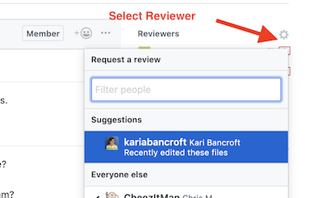
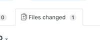
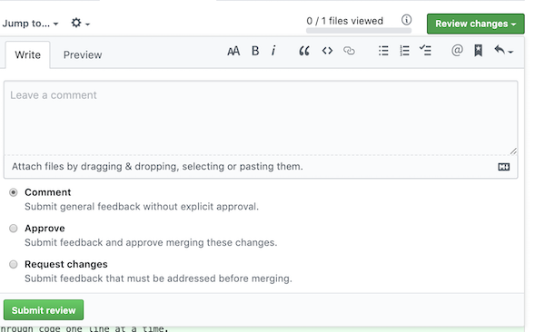

# Code Reviews

## Learning Goals

By the end of this lesson you should be able to:

- Define what a code review is
- Explain the purposes of a code review
- Use Github Pull Requests to provide feedback on a code review

## What Is A Code Review

A Code Review is a process in which one or more developers review code written by another developer as part of the quality assurance process.  This is usually done before changes are merged into production and is done by reading the source code and providing comments and suggestions.  The people checking and commenting are called _Reviewers_.

## Why Do Code Reviews

Code reviews provide the following benefits.

- **Readability & Consistent Style** - By ensuring that code is reviewed before it is merged into the main project, team members can ensure that the code is understandable by others beyond the author and adheres to coding standards that the team has adopted.
- **Knowledge Transfer** - When a team makes code reviews part of the development process they ensure that knowledge of each feature is shared among multiple members of the team.  
  - This minimizes disruption when a member transfers, finds new employment, retires etc.  
  - It also makes it easier for other team members to adapt or adjust the feature under review in the future.
  - Code reviews provide a useful tool for newer team members to explore and learn about the codebase.  That said, a new team member should **not** be the only reviewer.
  - Finally this allows developers to learn techniques, libraries and tricks from other members of the team.
- **Architecture** - By involving several team members in a proposed change or feature a code review allows the team to examine the architecture of a feature and judge it in the larger context of the application.  Will the change scale?  Does it match or integrate with the architecture of the larger application.
- **Finding Bugs** - As you might expect, having more eyes on code early in development allows the team to catch more bugs **before** they enter production, lowering costs and speeding up development time.  

## Types Of Code Reviews

There are several different ways to review code.

### Pull Requests

Github and other version management software sytems provide methods to review suggested changes before accepting them into the master or main branch.  This is called a _Pull Request_ or PR.  A PR allows team members to comment on and propose changes on a branch before it is merged in.  

### Pair Programming

Another way to provide a review on code is through _pair programming_.  In pair programming two developers work on the feature as a team.  The developers take turns with one _driving_, or writing the code and focusing on the immediate task at hand.  Meanwhile the second developer _navigates_ or looks at the work from a higher level guiding around complications and obsticals the driver cannot focus on in the moment.

### Mob Programming

A third method is called [_mob programming_](https://en.wikipedia.org/wiki/Mob_programming) where a team of developers works on the same feature, at the same time, together.  One developer drives while the rest of the team navigate.  Mob programming can be very useful on complicated, tricky or core features where wide understanding on the team is essential or where it is useful to have as many eyes on the code as possible.

Both mob programming and pair programming can also be done remotely using software such as [Visual Studio's Liveshare extension](https://code.visualstudio.com/blogs/2017/11/15/live-share).  They also have the advantage of a very short feedback loop, while a more common pull request review happens asynchronouslly and can happen hours or even days later.  


## How to Review Code

In this section we will walk through the code review process using Github pull requests.  Git is the most common version control system and Github the largest hosting service for git repositories.  Thus Github makes a good starting point for practicing code reviews.  

Much of the steps and etiquite of a code review apply across systems however.

### The Mechanics of a Github PR Review

#### Requesting a PR

As you begin working on a feature [start the feature on as branch](https://githowto.com/creating_a_branch).  It's also a good idea to check and make sure you are using linters and tools to help enforce your team's adopted style guide.  This will prevent stylelistic errors and help reviewers focus on what the code is doing.  You should also try to keep the changes as small and focused as possible.  It is much easier for reviewers to understand and evaluate changes when they are of modest size.

When your feature is ready push all changes up to github:

```bash
$ git push origin <BRANCH_NAME>
```

Then go to github and find your branch and click on the `New Pull Request` button.


Then add a description to your PR describing the feature and rationale for the changes.  Communicate the changes clearly.  Then you can use gear icon under reviewers to request a code review.



#### Reviewing Code in Github

To review a pull request on the github webpage first click on the `files changed` tab.  



Then you can examine the proposed changes.  You can click on a `+` sign next to any line of code to add inline comments.  The comments are in [markdown](https://guides.github.com/features/mastering-markdown/) format.  

Good code review comments can be:

-  Questions to the author about the purpose or need for the code.
-  Suggestions for improvements
-  Compliments

It is important to remember that the code belongs to the team, use the word "We" over "You" and feel free to criticise the code, while being respectful of the author.  

When you have finished reviewing the PR, click on the `Review Changes` button and leave a summary of your impressions and either approve or request changes for the review



### What to Look For In A Review

In a code review you should be looking for:

- Edge Cases
  - Are there circumstances that will cause this code to fail unexpectedly?  
- Did they test the code adequately?
  - Is there good test coverage?
  - For areas the tests do not cover, is this a concern?
- Does it match requirements
  - Look at the feature requirements and compare it to the code submitted.  
    - Is there anything missing from the submission or functionality not found in the requirements?
- Performance
  - Is this code efficient?
  - Do you do performance testing?  Can you automate performance and load testing?
- Security
  - Are there security advisories for libraries being used?
  - Does this safeguard data adequately?


### Code Review Tips for Success

- Do them!  
- Two developers will sometimes have two conflicting opinions.  Get a 3rd opinion
- Keep changes small (small branches)
- Don't trust the developer, challenge them respectfully
- Use your favorite tool to do code reviews.  [VS Code has a PR review tool!](https://code.visualstudio.com/blogs/2018/09/10/introducing-github-pullrequests)
- Shared vision
  - Make sure the team has a shared understanding of where the application is moving and the short and long term goals.  

## Beyond The Code Review

There may come a time where you notice architectural issues with the application **beyond** the code being submitted in a specific PR.  Maybe your app is reaching the limits of it's scalability or the application is less flexible than it could be.  You may have ideas to address these issues.  This is **not** something to discuss in a code review.  Instead, a broader architectural exploration is something to discuss with a team lead and, if justified, scheduling a timeboxed team meeting to present and discuss your ideas.  

## Summary


## Sources For This Lesson

- [The Science of Code Reviews Video](https://www.youtube.com/watch?v=EyL7mqwpZhk)
- [The Psycology of Computer Programming](https://leanpub.com/thepsychologyofcomputerprogramming) - The 1st book on the human factors of computer programming, and the 1st to mention Egoless programming.
- [Pull Request Review in VS Code](https://code.visualstudio.com/blogs/2018/09/10/introducing-github-pullrequests)
