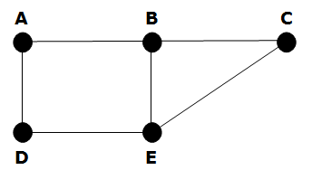

# Graphs Review

1.  In English, what is a graph?
2.  Define the terms _Node/Vertex_ and _Edge_ .
3.  Is a Binary Search Tree a graph?
4.  What type of graph is depicted below

5.  What are 3 ways to represent a graph in memory?
6.  What are the differences between Breadth-first-search & Depth-first-search?
