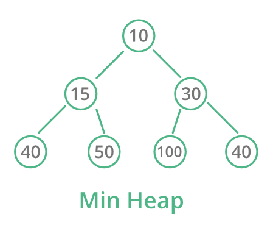
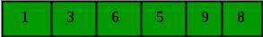

# Heaps Review

1.  How does a Heap maintain an O(log n) insertion and removal time complexity?
2.  Why is an array an efficient means to store the elements of a Heap?
3.  Look at the Heap below, draw the array which could store the heap.

4.  Take a look at the following array and draw the Min Heap that array represents

5.  With the above heap, walk through what happens if someone tries to add `2` to the heap.
6.  With the above heap walk through what happens when the root element is removed. 