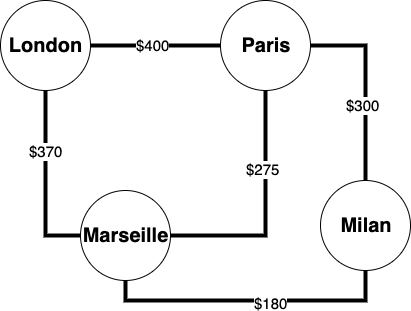
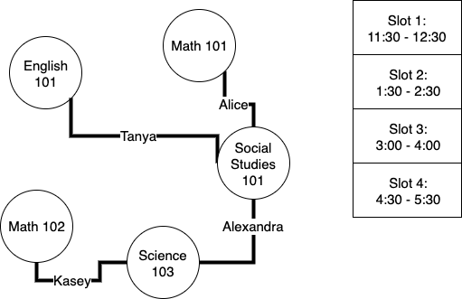
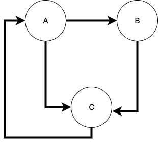
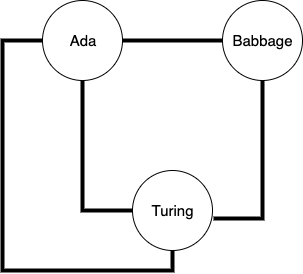
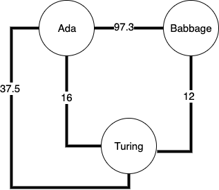
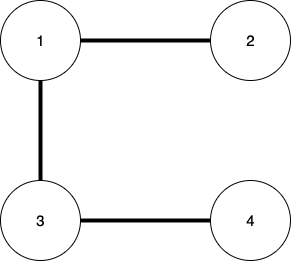
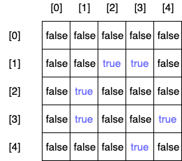
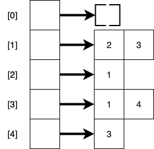
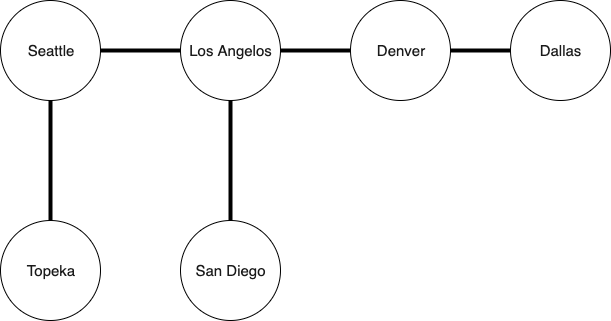

# Graphs

## Learning Goals

By the end of this lesson you should be able to:

- Explain a graph data structure
- Explain how an ordered or unordered set of verticies can represent a graph
- Write algorithms using graphs
- Explain dijkstra algorithm

## Video Lesson

- [Video Lesson]()
- [Accompanying Slidedeck]()
- [Exercise]()

## Introduction

Graphs are a data structure in computer science represented by a set of nodes connected by what are called edges.  Naturally graphs can be used to solve problems like finding the cheapest way to visit all the cities below.



They can also be used to solve problems like this.  Fairaday Academy is planning to host exams.  They have a number of classes and a number of students.  However they want to schedule exams in such a manner that no student is scheduled to take two exams a the same time.  There are `m` exam slots.



In the example above, each course is represented by nodes, and students which take both courses represent an edge between two nodes.  To solve the problem you would look for a way to assign courses to slots which are not directly connected by an edge.  Many many problems can be represented by graphs even those not involving geographic or navigational problems.  Studying graph problems gives us another way to solve a broad sector of difficult problems.

## Graph Description

A graph is a data structure in computer science, consisting of a finite collection of _nodes_, also called _verticies_, and a collection of connections between nodes known as _edges_.  A graph can be either a _directed graph_, or an _undirected graph_.  In a directed graph, edges are not bidirectional.  So in the example below you travel from node A to node B, but not from node B to node A.

**Directed Graph**


On the other hand, in an undirected graph, each edge is bidirectional.  In other words in the example graph below you can travel from Ada to Babbage and from Babbage to Ada.

**Undirected Graph**


Graphs can also be either _weighted graphs_ or _unweighted graphs_.  In a weighted graph, each edge is assigned a numeric cost or weight.  A weighted graph can either be directed or undirected.  

**Weighted & Undirected Graph**


As you may have noted, we have **already** worked with graphs before.  Both Linked Lists & Binary Search Trees are specific types of graphs.  In this lesson we will explore more generic graph algorithms and look at a few classic problems.

## How To Represent A Graph

As stated above we have already worked with graphs before.  With both binary search trees & linked lists we created a node class and wrote traversals traveling from one node to the next.  An example `TreeNode` class is listed below.

```ruby
class TreeNode
  attr_reader :key, :value
  attr_accessor :left, :right

   def initialize(key, val)
    @key = key
    @value = val
    @left = nil
    @right = nil
   end
end
```

In our methods we traversed the structure adding and removing elements by writing either iterative or recursive methods which jumped from one node to the next following the links between them.  We could write Node class for our graph algorithms like the example below.  In this example we have a potential `GraphNode`.  

```ruby
class GraphNode
  attr_reader :key, :value
  attr_accessor :edges

  def initialize(key, val, edges = [])
    @key = key
    @value = val
    @edges = edges
  end

  def add_connection(other_node)
    edges.push(other_node)
  end
end
```

While this can work it leaves us with a problem.  Unlike a tree or a linked list, there is no starting node for a graph.  So instead we would need another way to store our graph, which provides a method to start with any node.

### List of Edges

The most basic way to store a graph is simply to maintain a list of edges.  For example for the graph with numbers representing the nodes.



We could represent this graph with the following:

```ruby
sample_graph = [
  [1, 2], [1, 3], [3, 4]
]
```

This representation has a couple of advantages it's simple and uses a minim amount of space.  For a graph G(N, E) where N is the set of nodes and E the set of edges, this representation has a space complexity of O(E).

It does have a major downside, to find out if any particular pair of nodes are connected, you must traverse the entire list.  This means that the time complexity to find out of any two nodes are connected is O(E) as well.  We can do better.  Instead we will look at an adjacency matrix.

### Adjacentcy Matrix

Lets look at the same graph again.  Instead of maintaining a list of edges we could instead create a matrix where each row-column intersection indicates a potential edge between two nodes.


Below is an example matrix:



In the adjacency matrix above if two nodes matched by the row-column intersection share an edge, that entry in the matri is true.  If they do not share an edge that entry is false.  Notice a couple of things:

- Unless a node has an edge with itself the diagonal from [0][0] to [n-1][n-1] will be false
- If the graph is undirected the entries across the central diagonal will be mirror images
  - if (1, 2) is true, then (2, 1) must also be true
- We would need some way to convert a node in the graph to a number

For a graph G(N, E), where N is the number of nodes and E the number of edges, this solution provides:

- **O(1)** lookup time complexity to find out if any two nodes share an edge
- **O(N<sup>2</sup>)** space complexity to store this representation
- **O(1)** time complexity for getting a list of all the neighbors of a node `n` because you need to read the entire row or column.

This method provides a very fast lookup time and not terrible space complexity if the graph is a _dense graph_, in other words if there are a large number of edges compared to nodes.

In the example above we used a matrix of booleans where true indicates an existing edge and false indicates no edge exists connecting the two nodes.  You will often see this represented as a matrix of ones and zeroes where zero indicates no edge exists and 1 indicates it does.  This has the advantage of only requiring one bit per matrix cell.  There are [some strategies](https://github.com/javolio/Bitwise-Adjacency-Matrix) to use this fact to compress the space requirements.  

### Adjacency List

An Adjacency List provides a bit of a middle ground between a list of edges and an adjacency matrix.  In an adjacency list, you have an array with each index representing a node and the content an unordered list of neighboring nodes.  The list can be an array or a linked list.



This adjacency list gives us:

- **O(d)** lookup time to find out if any two nodes share an edge, where `d` is the _degree_ of a node meaning the number of edges the node has
  - The maximum value of d would be the case where a node is connected to every other node (assuming no duplicate edges) which is V - 1
  - This can be a problem in dense graphs
- O(2E) = **O(E)** space complexity to store this representation because each element of the array stores a list of the edges a node has, twice in the case of an undirected graph.
- **O(1)** time complexity to find all the neighbors of a particular node because it is an O(1) operation to lookup a node by it's index and the list at that location is a list of all the node's neighbors.

Generally adjacency lists give a good balance between time and space complexity and perform relatively well.  Below would be the adjacency list above in code:

```ruby
adjacency_list = [
  [],
  [2, 3],
  [1],
  [1, 4],
  [3]
]
```

### Adjacency List With A Hash

The examples we used above used numeric identifications for nodes.  What if you want to use other values, like strings or objects to represent nodes.  In that case we could use a hash table.

```ruby
adjacency_list_with_hash = {
  "Seattle" => ["Los Angelos", "Topeka"],
  "Los Angeles" => ["Seattle", "Denver", "San Diego"],
  "Topeka" => ["Seattle"],
  "Denver" => ["Los Angeles", "Dallas"],
  "San Diego" => ["Los Angeles"],
  "Dallas" => ["Denver"]
}
```




This representation provides similar benefits to using an array for an adjacency list, but provides us more flexibility with keys.  We no longer need numeric ids for our nodes and the ids do not need to be consecutive.  For example, in the adjacency matrix and list above, there was no node 0, but we maintained space for a node with that id.

## Graph Algorithms

There are a huge [class of problems](https://en.wikipedia.org/wiki/Category:Graph_algorithms) involving graphs.  We will look at a few as a sample.  

### Breadth-First-Search

Like in a Binary Search Tree a breadth-first-search in a graph is performed with a queue.  However because a graph can, and likely will have a cycle, unlike a tree we need to keep track of the nodes we have visited.  

In breadth-first-search we start with a particular node and visit each node connected to the starting point in the graph starting with the closest node to the starting point and expanding outward.

We do so by adding each of the neighbors of the starting node to a Queue and then loop through the Queue removing an element and repeating the process with the neighbors of the current node.

**Pseudocode**

1. Start with a graph adjacency list and a specific node called `start_node`
1. Create a list of nodes called `visited` and mark each element `false`
1. Create an empty queue `q`
1. Add `start_node` to `q`
1. While `q` is not empty
    1. Remove an element from `q` and store it in `current`
    1. Mark `current` as `true` in the list `visited`
    1. Loop through each of `current`'s neighbors
        1. If the neighbor is not `true` in `visited` add it to `q`

You can see breadth-first-search animated on [HackerEarth](https://www.hackerearth.com/practice/algorithms/graphs/breadth-first-search/visualize/)

Breadth first search is a solution in a variety of problems including:

- Finding the shortest path in a graph/maze
- Solving puzzle games like a [Rubik's Cube](https://www.quora.com/How-can-solving-a-Rubiks-Cube-be-framed-as-a-graph-problem)
- Checking to see if a graph is connected

**Questions**

<details>
  <summary>What is the time complexity of Breadth-First-Search</summary>
  Since you will visit each node once, and loop through each of the edges in each node the Big-O of this algorithm is O(N + E) where `N` is the number of nodes in the graph and `E` is the number of edges since each node and each edge will be explored.
</details>

<details>
  <summary>What is the space complexity of Breadth-First-Search</summary>
  In the worst-case you will need to add each node to the Queue, so the space complexity is O(N) where `N` is the number of nodes in the graph.
</details>


### Depth-First-Search

Where breadth-first-search spreads out from a starting node in order of distance from the starting node, depth first search follows each path as far as possible before backing up and following the next closest path.

**Pseudocode**

1. Starting with a graph's adjacency list and a starting node `s`
1. Create a Stack called `stack`
1. Create a list of nodes called `visited` and mark each element `false`
1. Push `s` into `stack`
1. mark `s` as `true` in `visited`
1. while `stack` is not empty
    1. Remove an element from `stack` and store it in `current_node`
    1. Loop through all the neighbors of `current_node`
        1. If they are not marked as `true` in `visited`
            1. Push the neighbor into `stack`
            1. Mark the neighbor as `true` in `visited`


**Questions**

<details>
  <summary>What is the time complexity of Depth-First-Search</summary>
  Since you will visit each node once, and loop through each of the edges in each node the Big-O of this algorithm is O(N + E) where `N` is the number of nodes in the graph and `E` is the number of edges since each node and each edge will be explored.  Note, this is the same as breadth-first-search.
</details>

<details>
  <summary>What is the space complexity of Depth-First-Search</summary>
  In the worst-case you will need to add each node to the Stack, so the space complexity is O(N) where `N` is the number of nodes in the graph.
</details>

[HackerEarth](https://www.hackerearth.com/practice/algorithms/graphs/depth-first-search/visualize/) has an excellent description and visualization of the algorithm.

Depth-First-Search has a number of applications in graph problems including:

- Detecting a cycle in a graph
- Finding a path in a maze where there is only one correct path
- Scheduling jobs based on dependencies on other jobs

### Shortest Path Algorithms

It is common that given a graph with weighted edges you need to discover the shortest, or cheapest path between two nodes.  Essentially you need to discover a route from node A to node B in such a way that the sum of the edges along the route is a minimnum.  

For unweighted graphs, you could solve this problem using breadth-first-search, however for a weighted graph, a more complicated algorithm is needed.

**Dijkstra's Algorithm**

Dijkstra's algorithm is an algorithm which takes a weighted graph and computes **all** the shortest paths from one node to all other reachable vertices.

**Pseudocode** 

1. Starting with an adjacency matrix of nodes and a starting node called `origin_node`
1. Create a list of the distances to all the nodes in the graph called `shortest_distances`, set all the values to `INFINITY`
1. Create a list of nodes called `added` which will record if a path to that node has already been discovered and set every entry to `false`
1. Create an array called `parents` which will record the previous of any particular node on the path from the origin.
1. Assign `shortest_distances[origin_node]` to 0, so that it is picked first
1. Loop the number of nodes - 1 times
    1. Select a node which is not in `added` and has a the smallest distance value called `current_node`.
    1. Set `current_node` in `added` to true
    1. Update all the values in `distance` for the neighbors of `current_node` with the minimum of their current value and the distance to the `current_node` and the weight of the edge connecting them with `current_node`

There are also many variants of Dijkstra's Algorithm.  One includes a Min-Heap in which elements whom have a distance value known are stored.  When you select the node not in `shortest_path_set` with the minimum distance, you can do so by removing elements from the heap.  

Below is a Ruby implementation using an adjacency matrix.  You can see this code and accompanying tests on [AdaGold](https://github.com/AdaGold/dijkstra).

```ruby
def dijkstra(adjacency_matrix, start_node)
  num_nodes = adjacency_matrix.length

  # shortest_distances will hold the shortest distances from start_node to i
  # it starts with infinity as the value
  shortest_distances = Array.new(num_nodes, Float::INFINITY)


  # added[i] will be true if the path to i
  # from the source has been found
  added = Array.new(num_nodes, false)


  # Distance of source vertex from
  # itself is always 0
  shortest_distances[start_node] = 0
  
  # parent array to store the shortest path tree
  parents = Array.new(num_nodes)
  # no parent for the start node
  parents[start_node] = nil


  # Find shortest path for all nodes
  (num_nodes - 1).times do

    # Pick the minimum distance vertex
    # from the set of vertices not yet
    # processed. nearest_node is  
    # always equal to start_node in  
    # first iteration.
    nearest_node = -1
    shortest_distance = Float::INFINITY
    (0...num_nodes).each do |node_index|
      if (!added[node_index] &&
          shortest_distances[node_index] <  shortest_distance)  
        nearest_node  = node_index
        shortest_distance = shortest_distances[node_index]
      end
    end  

    # Mark the picked vertex as visited
    added[nearest_node] = true
    # Update dist value of the
    # adjacent nodes of the picked node.
    (0...num_nodes).each do |node_index|
      edge_distance = adjacency_matrix[nearest_node][node_index]

      if (edge_distance > 0 && 
          ((shortest_distance + edge_distance) <  
              shortest_distances[node_index]))  
        parents[node_index] = nearest_node
        shortest_distances[node_index] = shortest_distance +  
                                        edge_distance
      end
    end
  end
  return {  
    start_node: start_node,
    parent_list: parents,
    shortest_distances: shortest_distances
  }
end
```

**Questions**

<details>
  <summary>Is Dijkstra's Algorithm a greedy algorithm?</summary>
  <strong>YES!</strong>  With each iteration of the main loop Dijkstra's algorithm picks the next node with the shortest path.  It makes each choice by picking the next shortest path available.  
</details>

<details>
  <summary>What is the time complexity of Dijkstra's Algorithm?</summary>
  <strong>O(N<sup>2</sup>)</strong>  Where N is the number of nodes.  The algorithm iterates until each node has been visited, N times, and with each iteration you have to find the node with the smallest current distance, so with each iteration you have to look roughly at most N other nodes.
</details>

**Exercise** 

Take a look at the solution above.  Can you convert it to a solution involving an Adjacency list?  Each entry in the adjacency list will need to store a weight as well as the destination node.


#### Using a Heap

Because finding an unvisited node with a minimum distance takes O(N) time, Dijkstra's algorithm can be made more efficient by using a Min-Heap where nodes are stored by order of their distance.  

By using an Adjacency list instead of an Adjacency matrix and using a heap to store the distances to each node you can get:

- Finding the next node to visit using the heap is O(log N)
- With an adjacency list, updating the distances to each node takes O(log N) each with a total of E edges.
- Overall O(N log N + E log N) = O( (N + E) log N)

#### Limitation of Dijkstra's Algorithm

Can you see a problem with Dijkstra's algorithm?  What if an edge has a _negative_ weight?  Then you might find a shorter path **after** already visiting a node.  This is often not a problem, but it is a limitation of the algorithm.

For example you could build a graph of chemical reactions between compounds.  The edge weight could represent the energy released or absorbed by the reaction.

## Summary

In this lesson we have looked at the Graph data structure.  A graph is a collection of nodes and connections between nodes called edges.  Binary search trees and linked lists are both subsets of graphs.  A graph can have both unweighted and weighted edges.  In a weighted graph, each connection is assigned a cost or weight.  Further a graph can be directed or undirected.  In a directed graph an edge is not bidirectional.  

There are two main ways to represent a graph.  The first is using an adjacency matrix which is a 2-dimensional array where each entry represents an edge between the nodes indicated by it's row and column indices.  An adjacency matrix is very quick to lookup a connection between two nodes.  On the other hand retrieving a list of all the edges a node has a time complexity of O(N) where `N` is the number of nodes.  It also require O(N<sup>2</sup>) space complexity.  The other method of representing a graph involves an adjacency list, which is an array of lists of neighbors.  This method has an O(1) time complexity to look up all the neighbors of a node, but O(d) to lookup a particular connection where `d` is the degree of the node, or the number of neighbors it has.  It also requires less space complexity.

There are a number of algorithms involving graphs in computer science.  To traverse a graph you can either make a breadth-first-search or a depth-first-search.  In a breadth-first-search each node is investigated by it's proximity to the starting node.  In a depth-first-search a path is explored as far as it will go, and then the algorithm backs up until another subpath can be explored, like a mouse exploring a maze.

In weighted graphs, finding the shortest paths is a common problem.  One classic solution is Dijkstra's algorithm which is a good example of a greedy algorithm.

## Terms & Definitions

| Term | Definition |
|--- |--- |
| Graph | A data structure with two parts:  A limited set of verticies, called nodes, and a limited set of connections between nodes known as edges. |
| Edge | A connection between two nodes in a graph |
| Node | The fundamental unit of a graph in computer science.  Each element of a graph, connected by edges. |
| Sparse Graph | A graph with few edges when compared to nodes. |
| Dense Graph | A graph with many more edges when compared to nodes.  A graph is considered _dense_ when it has close to the maximum number of possible edges. |
| Directed Graph |  A graph where the edges connet in one direction.  For example an edge may conect nodes A -> B, but will not connect B -> A. |
| Undirected Graph | A Graph in which each edge is bidirectional.  So an edge from A -> B also connects B -> A |
| Adjacency Matrix | A 2-dimensional array listing the connections between nodes in a graph |
| Adjacency List | A collection of unordered lists used to represent a graph.  Each list describes the neighors of a particular node.
| Node Degree | The number of edges a particular node has |

## Resources

- [BaseCS on Graphs](https://medium.com/basecs/from-theory-to-practice-representing-graphs-cfd782c5be38)
- [Dijkstra's Algorithm]()
- [Geeks for Geeks: Graphs and it's representations](https://www.geeksforgeeks.org/graph-and-its-representations/)
- [Coursera:  Algorithms on Graphs](https://www.coursera.org/lecture/algorithms-on-graphs/representing-graphs-c4W9f)
- [Alternative video on Dijkstra's Algorithm](https://www.youtube.com/watch?v=ba4YGd7S-TY#action=share)

<!-- Diagram sources:  https://drive.google.com/file/d/1bOXvfXdWi9pkKfmWnMZd9QK4zoG930c7/view?usp=sharing -->