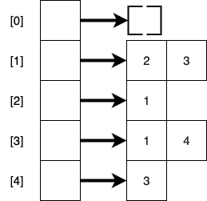

# Graphs

## Learning Goals

By the end of this lesson you should be able to:

- Explain a graph data structure
- Explain how an ordered or unordered set of verticies can represent a graph
- Write algorithms using graphs
- Explain dijkstra algorithm

## Video Lesson

- [Video Lesson]()
- [Accompanying Slidedeck]()
- [Exercise]()

## Introduction

Graphs are a data structure in computer science represented by a set of nodes connected by what are called edges.  Naturally graphs can be used to solve problems like finding the cheapest way to visit all the cities below.


They can also be used to solve problems like this.  Fairaday Academy is planning to host exams.  They have a number of classes and a number of students.  However they want to schedule exams in such a manner that no student is scheduled to take two exams a the same time.  There are `m` exam slots.


In the example above, each course is represented by nodes, and students which take both courses represent an edge between two nodes.  To solve the problem you would look for a way to assign courses to slots which are not directly connected by an edge.  Many many problems can be represented by graphs even those not involving geographic or navigational problems.  Studying graph problems gives us another way to solve a broad sector of difficult problems.

## Graph Description

A graph is a data structure in computer science, consisting of a finite collection of _nodes_, also called _verticies_, and a collection of connections between nodes known as _edges_.  A graph can be either a _directed graph_, or an _undirected graph_.  In a directed graph, edges are not bidirectional.  So in the example below you travel from node A to node B, but not from node B to node A.

**Directed Graph**


On the other hand, in an undirected graph, each edge is bidirectional.  In other words in the example graph below you can travel from Ada to Babbage and from Babbage to Ada.

**Undirected Graph**


Graphs can also be either _weighted graphs_ or _unweighted graphs_.  In a weighted graph, each edge is assigned a numeric cost or weight.  A weighted graph can either be directed or undirected.  

**Weighted & Undirected Graph**


As you may have noted, we have **already** worked with graphs before.  Both Linked Lists & Binary Search Trees are specific types of graphs.  In this lesson we will explore more generic graph algorithms and look at a few classic problems.

## How To Represent A Graph

As stated above we have already worked with graphs before.  With both binary search trees & linked lists we created a node class and wrote traversals traveling from one node to the next.  An example `TreeNode` class is listed below.

```ruby
class TreeNode
  attr_reader :key, :value
  attr_accessor :left, :right

   def initialize(key, val)
    @key = key
    @value = val
    @left = nil
    @right = nil
   end
end
```

In our methods we traversed the structure adding and removing elements by writing either iterative or recursive methods which jumped from one node to the next following the links between them.  We could write Node class for our graph algorithms like the example below.  In this example we have a potential `GraphNode`.  

```ruby
class GraphNode
  attr_reader :key, :value
  attr_accessor :edges

  def initialize(key, val, edges = [])
    @key = key
    @value = val
    @edges = edges
  end

  def add_connection(other_node)
    edges.push(other_node)
  end
end
```

While this can work it leaves us with a problem.  Unlike a tree or a linked list, there is no starting node for a graph.  So instead we would need another way to store our graph, which provides a method to start with any node.

### List of Edges

The most basic way to store a graph is simply to maintain a list of edges.  For example for the graph with numbers representing the nodes.


We could represent this graph with the following:

```ruby
sample_graph = [
  [1, 2], [1, 3], [3, 4]
]
```

This representation has a couple of advantages it's simple and uses a minim amount of space.  For a graph G(N, E) where N is the set of nodes and E the set of edges, this representation has a space complexity of O(E).

It does have a major downside, to find out if any particular pair of nodes are connected, you must traverse the entire list.  This means that the time complexity to find out of any two nodes are connected is O(E) as well.  We can do better.  Instead we will look at an adjacency matrix.

### Adjacentcy Matrix

Lets look at the same graph again.  Instead of maintaining a list of edges we could instead create a matrix where each row-column intersection indicates a potential edge between two nodes.


Below is an example matrix:


In the adjacency matrix above if two nodes matched by the row-column intersection share an edge, that entry in the matri is true.  If they do not share an edge that entry is false.  Notice a couple of things:

- Unless a node has an edge with itself the diagonal from [0][0] to [n-1][n-1] will be false
- If the graph is undirected the entries across the central diagonal will be mirror images
  - if (1, 2) is true, then (2, 1) must also be true
- We would need some way to convert a node in the graph to a number

For a graph G(N, E), where N is the number of nodes and E the number of edges, this solution provides:

- **O(1)** lookup time complexity to find out if any two nodes share an edge
- **O(N<sup>2</sup>)** space complexity to store this representation
- **O(1)** time complexity for getting a list of all the neighbors of a node `n` because you need to read the entire row or column.

This method provides a very fast lookup time and not terrible space complexity if the graph is a _dense graph_, in other words if there are a large number of edges compared to nodes.

In the example above we used a matrix of booleans where true indicates an existing edge and false indicates no edge exists connecting the two nodes.  You will often see this represented as a matrix of ones and zeroes where zero indicates no edge exists and 1 indicates it does.  This has the advantage of only requiring one bit per matrix cell.  There are [some strategies](https://github.com/javolio/Bitwise-Adjacency-Matrix) to use this fact to compress the space requirements.  

### Adjacency List

An Adjacency List provides a bit of a middle ground between a list of edges and an adjacency matrix.  In an adjacency list, you have an array with each index representing a node and the content an unordered list of neighboring nodes.  The list can be an array or a linked list.



This adjacency list gives us:

- **O(d)** lookup time to find out if any two nodes share an edge, where `d` is the _degree_ of a node meaning the number of edges the node has
  - The maximum value of d would be the case where a node is connected to every other node (assuming no duplicate edges) which is V - 1
  - This can be a problem in dense graphs
- O(2E) = **O(E)** space complexity to store this representation because each element of the array stores a list of the edges a node has, twice in the case of an undirected graph.
- **O(1)** time complexity to find all the neighbors of a particular node because it is an O(1) operation to lookup a node by it's index and the list at that location is a list of all the node's neighbors.

Generally adjacency lists give a good balance between time and space complexity and perform relatively well.  Below would be the adjacency list above in code:

```ruby
adjacency_list = [
  [],
  [2, 3],
  [1],
  [1, 4],
  [3]
]
```

### Adjacency List With A Hash

The examples we used above used numeric identifications for nodes.  What if you want to use other values, like strings or objects to represent nodes.  In that case we could use a hash table.

```ruby
adjacency_list_with_hash = {
  "Seattle" => ["Los Angelos", "Topeka"],
  "Los Angeles" => ["Seattle", "Denver", "San Diego"],
  "Topeka" => ["Seattle"],
  "Denver" => ["Los Angeles", "Dallas"],
  "San Diego" => ["Los Angeles"],
  "Dallas" => ["Denver"]
}
```


This representation provides similar benefits to using an array for an adjacency list, but provides us more flexibility with keys.  We no longer need numeric ids for our nodes and the ids do not need to be consecutive.  For example, in the adjacency matrix and list above, there was no node 0, but we maintained space for a node with that id.

## Graph Algorithms

There are a huge [class of problems](https://en.wikipedia.org/wiki/Category:Graph_algorithms) involving graphs.  We will look at a few as a sample.  

### Breadth-First-Search

### Depth First Search

### Shortest Path Algorithms

**Dijkstra's Algorithm**

## Summary

## Terms & Definitions

| Term | Definition |
|--- |--- |
| Graph | A data structure with two parts:  A limited set of verticies, called nodes, and a limited set of connections between nodes known as edges. |
| Edge | A connection between two nodes in a graph |
| Node | The fundamental unit of a graph in computer science.  Each element of a graph, connected by edges. |
| Sparse Graph | A graph with few edges when compared to nodes. |
| Dense Graph | A graph with many more edges when compared to nodes.  A graph is considered _dense_ when it has close to the maximum number of possible edges. |
| Directed Graph |  A graph where the edges connet in one direction.  For example an edge may conect nodes A -> B, but will not connect B -> A. |
| Undirected Graph | A Graph in which each edge is bidirectional.  So an edge from A -> B also connects B -> A |
| Adjacency Matrix | A 2-dimensional array listing the connections between nodes in a graph |
| Adjacency List | A collection of unordered lists used to represent a graph.  Each list describes the neighors of a particular node.
| Node Degree | The number of edges a particular node has |

## Resources

- [BaseCS on Graphs](https://medium.com/basecs/from-theory-to-practice-representing-graphs-cfd782c5be38)
- [Dijkstra's Algorithm]()
- [Geeks for Geeks: Graphs and it's representations](https://www.geeksforgeeks.org/graph-and-its-representations/)
- [Coursera:  Algorithms on Graphs](https://www.coursera.org/lecture/algorithms-on-graphs/representing-graphs-c4W9f)