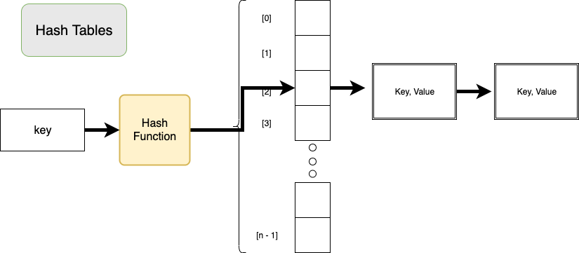
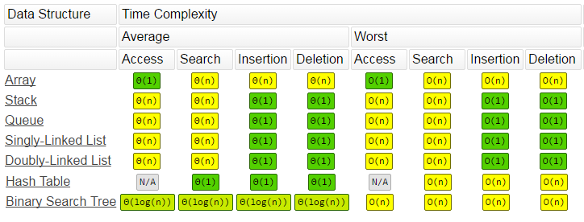
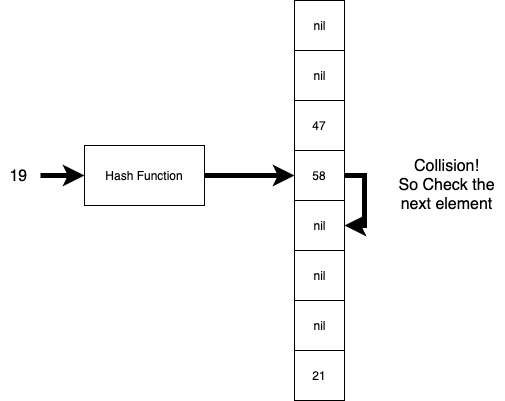
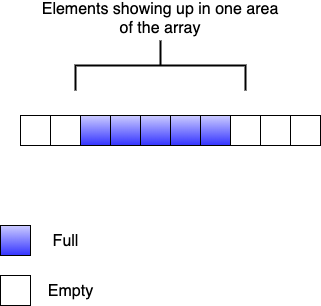

# Introduction to Hash Tables

## Learning Goals

By the end of this lesson you should be able to:

- Explain the uses of a Hash table
- Explain the concept of a hashing function and the criteria for a good hashing function
- Explain the concept of a Collision and Collision handling schemes including:
  - _linear probing_
  - _separate chaining_
  - _quadratic probing_
  - _double hashing_
- Use a hash table to solve a coding problem
- Choose between a hash table, binary search tree, linked list or array to solve a programming problem.

## Video Lecture & Lesson

- [Video Lesson](https://adaacademy.hosted.panopto.com/Panopto/Pages/Viewer.aspx?id=6dfc0f2a-8f7d-4fa6-be61-aac3003b4abf)
- [Slide Deck](https://docs.google.com/presentation/d/1jUvHCeeqYVx_i8vHAfdGaGdkJEssEYZW1OBC2Heh44c/edit?usp=sharing)
- [Exercises](https://github.com/Ada-C11/hash-practice)

## Introduction

In practical programming we often spend much more time looking data up in a data structure as opposed to inserting or removing data.  A typical example is a grocery store.  At the checkout point we need to quickly recognize items and look up their prices in order to ring up a bill.  In ye olde days employees often had to memorize the prices of each item.  This worked in small shops, and was supplemented by price tags.  However stores have grown and price tags can fall off or prices change after an item is tagged.  Today most items have been given a unique key called a [Universal Product Code (UPC)](https://en.wikipedia.org/wiki/Universal_Product_Code).  The software at the point of sale regularly need to look up items from their UPC codes and retrieve the current price.  


The systems could use an array to store the data with Log<sub>2</sub>(n) retrieval times, or a binary search tree of the data, but in that case for `m` lookups and a universe of `n` products it would take O(mlog<sub>2</sub>n) to complete a transation.  It would be better to reduce the lookup time to a constant and the entire transaction to O(m).

This is where hash tables come in.  Hash tables reduce lookup times O(1) or constant time.  They do this by trading space complexity for time complexity.

## Hash Table Overview

A hash table is essentially a generalization of an array.  Each element has a _key_ and _value_.  The key is a unique identifier for the element and can be used to quickly retrieve the value from the table.  In the same way an index number can be quickly used to retrieve an element from an array.  However a key can be any type of value, a string, a number, or any other kind of object.  



A hash table is built on an array.  When given a key value, the hash table applies a function called a _hash function_ to the key resulting in a number between 0 and the length of the array.  The hash table then uses that value to either look up or place the item into an element the array known as a _bucket_.  A bucket is the term used for each element of the hash table's internal array used to store data.

In the image above, given a key, a hash function is run resulting in an index number used by the hash table to identify the bucket used to store the information.

Hash tables are also often called:

- _Dictionaries_ because like a dictionary is used to look up a definition from a word, in a hash table a key is used to look up a value.  This is a term used in Python.
- _Hash Map_ because the hash function helps map an item to it's location in a table.

Hash tables perform relatively well in terms of Big-O

[](https://www.bigocheatsheet.com/#Common%20Data%20Structure%20Operations)

Notice the linear worst-case performance of a hash table.  We will address this when we discuss the hashing function.

## Hashing Functions

The key, no pun intended, to a hash table is the hashing function.  The hashing function is used to convert any key to a number.  That number can then be used to find an index in the internal array used by the hash table.

To be useful a hash function must satisfy a few criteria:

- **The hash function must be consistent.** if the hash function of key k, `h(k)` results in a number it should always result in the same number.
- **The hash function should (mostly) map different keys to different values** - we want to avoid situations where two keys map to the same index in the array.
  - This is even better if the hash  function distributes elements uniformly across the collection.
- **The hash function should execute in constant time** - The hashing function should scale well and execute relatively quickly.
- **Hashing should appear to be random** - It should be hard to identify the key from the hashed value.  This is why we use hashing in cryptography.

When a hashing function assigns two different keys to the same bucket, this is known as a _collision_.  Hash tables work most efficiently, as we will see, the fewer collisions they have.

Unfortunately there is no universal hashing function which can take any type of key and guarantee that collisions do not occur and in fact there is no guarantee the hashing function will not cause **every** key in a given application to collide.  This is why hashing functions are known as _heuristics_.  Heuristics are algorithms which work practically well, but may have a mathematically possible worst-case which is unattractive.

Below are two example hash functions

### The Division Method

In the division method, we convert the key to an integer and then take the remainder of the key divided by the length of the internal array (m).

`h(k) = k mod m`

Because we are taking the remainder of the key divided by the length of the array, we are guaranteed a value `0 <= h(k) < m`.  Therefore the resulting index will be valid for the internal array

We normally use a prime number, not close to a power of 2 for `m`, the size of the internal array because this tends to more evenly dispurse the resulting indexes.  Notice that this method does require a method to convert a non-integer key into an integer.

### The Multiplication Method

In the multiplication method we create an index in the array by:

1. First multiplying the key by a constant `A` which is between 0 and 1, and take the decimal result.  
1. Then multiply that by the size of the array `m` and round down.

`h(k) = floor(m * (k * A mod 1))`

So if:

- `k` = 37
- `A` = 0.31
- `m` = 100

`h(37) = floor(100 * (37 * 0.31 % 1))`

`h(37) = floor(100 * (11.47 % 1))`

`h(37) = floor(100 * (0.47000000000000064))`

`h(37) = floor(47.000000000000064)`


`h(37) = 47`

**Exercise** Assuming `A` is 0.71 and `m` = 100, answer the following

<details>
  <summary> if k is 15, what is h(k) using the multiplication method?  What about the division method?
  </summary>
  Multiplication method: 64 <br />
  Division method: 15
</details>

<br />

You are **not** expected to memorize these methods, but rather be able to see how they work to identify a bucket to find values in a hash table.

There are **many** different ways to write a hash function.  There is not a mathematically provable perfect solution, in the general case.  Instead developers use statistical analysis with experimental data to judge the performance of a given hashing function.  When evaluating a hashing function developers want a function which is easy to compute, maps any given input to valid buckets, and minimizes collisions.

[Ruby uses the MurmurHash](https://sites.google.com/site/murmurhash/) hashing function internally.

## Collision Handling

All general-purpose hashing functions will encounter collisions.  When two keys are mapped to the same bucket something has to happen to manage it.  We will look at three methods, chaining, linear probing, quadratic probing and rehashing.

### Chaining

The first solution, as we discussed in the classroom portion of ada is to make each bucket of the hash table's internal array the head of a linked list.  Linked lists are quick to insert and remove items O(1) and can store an arbitrary number of elements.  Unfortunately if there are a high number of items in the same bucket, finding an element starts to approach O(n).  However if the hashing function does a good job of spreading elements out over different buckets the linked lists will be small and the time to search for an item in the hash table approaches O(1).  


### Linear Probing

Chaining required a secondary data structure in the array.  Linear probling is instead rather simple.  When inserting a new element into the hash table, the hash function will return with an index number.  If the bucket at that index number is occupied (there's a collision), then the hash table checks the next element in the array, and the next and so on until an empty bucket is found.  



Similar to chaining, searching for an empty bucket has a worst-case of O(n).  Also because we are looking only at adjacent elements for empty buckets, this can lead to a problem with _clustering_.  Clustering means that elements are grouping together into one area in the hash table.  



If there is a lot of clustering then operations on a hash table using linear probing approach O(n).  To avoid this we need to use a hashing function which spreads the items over the body of the internal array as evenly as possible.  When a hash function does a good job of spreading elements throughout the array, we can say the hash table is _well spaced_. 

### Quadratic Probing

Quadratic probing is very similar to linear probing in that when inserting an element, if the bucket is full, instead of incrementally searching the array for an empty bucket, a formula is applied to search.  There is no set fomula to use in quadratic clustering, which formula to use.  That is another heuristic determined by the developer and experimentation.

**Example**

For example on the `ith` attempt to find an empty bucket, the formula to determine the next index to check could be:

h(k, i) = (h(k) + i + i<sup>2</sup>) mod m

So if h(k) was 37 and m was 100, the 3rd attempt to find an empty bucket would use:  37 + 3 + 3<sup>2</sup> mod 100 = (37 + 3 + 9) mod 100 = 49

Quadratic probing makes clustering less likely, although not impossible and it performs similarly to linear probing.  [Unfortunately quadratic probing performs worse as the number of elements increases compared to the size of the internal array.](https://en.wikipedia.org/wiki/Quadratic_probing#Limitations)  Unless the internal array is sparsely occupied, quadratic probing could struggle to find an empty bucket.  This is an example of trading space efficiency for time efficiency.  By making the array larger, relative to the data, quadratic probing will approach O(1) time efficiency at the cost of more expensive space efficiency.

### Rehashing

A third solution to collision is to simply have a secondary hash function..  If there is a collision, then use the secondary hash function to find another bucket to use.  There will however be occasions where both hash functions produce a collision and then another collision resolution scheme would need to be used, like chaining or linear probing.  If the _load factor_, the ratio of the number of elements to the number of buckets in the hash table is low, then this occurs rarely, and the seconary hash function helps avoid clustering.  

## Ruby & Hash Tables

As stated Ruby uses the MurmurHash hashing algorithm internally.  It also uses the chaining method to resolve collisions.  To better guarantee performance, ruby hashes also monitor the _density_ of the hash table.  This means it monitors the maximum number of records chained in a given bucket.  For example if the largest linked list in the hash table was of length 4, then the density would be 4.  Ruby sets a maximum density of 5.  When that density is exceeded, Ruby enlarges the internal array and recalculates the hash, placing the elements into new indexes.  

By limiting the density of the hash, Ruby guarantees the O(1) lookup time for adding elements to the hash.

### Side Note

Ruby actually [uses an array](https://launchschool.com/blog/how-the-hash-works-in-ruby#targetText=Conclusion,in%20Java%2C%20Python%20or%20Ruby) for hashes smaller than 6 items.  It has been found to be faster than using a more complicated data structure for small datasets.

## When To Use Hash Tables

Now that we've had some theory, when would you expect to use a hash table?  In any problem where quick lookup of items is important, a hash table should be considered.  However a hash table depends on **unique keys**.  If a dataset cannot provide unique key values, a hash table may not be the best solution.  Instead a binary search tree or another data structure may be a better selection.

### Sample Problem

Hash tables are a common, practical, solution to a variety of programming problems.  Below is a sample interview problem taking from [leetcode.com](https://leetcode.com/problems/sort-characters-by-frequency/)

Take a look at the problem below and answer:

<details>
  <summary>Why would a hash table be a good approach here?</summary>

  - To solve this problem we need to store each letter and the number of occurances. <br />
    - There are a couple of ways to do this:
      1. We could traverse the list repeatably counting the ocurances of each letter.  This would require nested loops and O(n<sup>2</sup>) time complexity.
      1. We could also sort the string by letter use this sorted string to count the occurances of each letter.  Sorting the string would require O(nlogn) time complexity.
      1. Or we could use a hash table to with each character as the keys and the number of occurances as the value.  Building this hash would require one traversal of the string or O(n).  
    - Once we have the list of letters and their number of occurances, we can use this to build the output string.

  Because looking up an items in a hash table is so fast, hash tables turn out to be excellent data structures.

</details>
<br />

#### Exercise

With a neighbor examine the problem below and do the following:

1.  Write down 2-3 clarifying questions.
1.  Write down assumptions you will make for each clarifying question.
1.  Generate a fresh set of 2-3 sample input-output looking for **edge cases**.
1.  Break down the problem into at least 2 subproblems, more if you can.
1.  Write out a pseudocode solution

**Problem Description**

Given a string, sort it in decreasing order based on the frequency of characters.

**Example 1:**

```
Input:
"tree"

Output:
"eert"

Explanation:
'e' appears twice while 'r' and 't' both appear once.
So 'e' must appear before both 'r' and 't'. Therefore "eetr" is also a valid answer.
Example 2:

Input:
"cccaaa"

Output:
"cccaaa"
```

**Explanation:**
Both 'c' and 'a' appear three times, so "aaaccc" is also a valid answer.
Note that "cacaca" is incorrect, as the same characters must be together.

**Example 3:**

```
Input:
"Aabb"

Output:
"bbAa"
```

**Explanation:**

"bbaA" is also a valid answer, but "Aabb" is incorrect.
Note that 'A' and 'a' are treated as two different characters.

You can find a [solution in the example code folder](example-code/character_frequency.rb).

## Array, Linked List, Binary Search Tree or Hash Table

Hash tables are execellent for looking up data from a key.  Binary search trees are excellent data structures for maintaining items in order while linked lists provide quick access to the front and rear and maintain a specific order.

So, which would you use in these situations?

**Question 1:**

<details>
  <summary>A list of candidate records that need to be stored so that you can find the max or min test scores</summary>
  Hash tables are not good for maintaining ordered data.  Instead a binary search tree, or sorted array or linked list (sorted by test scores) would serve better.
</details>

<!-- source: http://www.cs.cmu.edu/~guna/15-123S11/Lectures/Lecture17.pdf -->
<br />

**Question 2:**

<details>
  <summary>Fedex needs to provide quick access for customers to check the status of their packages.  Quick lookup time using distinct tracking numbers is important.</summary>
  Since the tracking numbers are distinct and order is not important a hash table makes the most sense because of it's quick lookup time.
</details>

<br />

**Question 3:**

<details>
  <summary>Postgres needs to keep track of fields in a table to output sorted data.  Items will be regularly inserted and deleted from the table.</summary>
  Since order is important, maintaining a set of binary search trees would make a great deal of sense.
</details>

## Summary

Hashes are one of the most practically useful data structures you will encounter.  They make a great many problems easier and with lower time complexity.  You will also likely **never** have to create a hash table data structure yourself, but you will need to know their practical applications and be able to discuss how they function.

There are many ways to structure a hash table.  One of the most common is simple chaining with each element of the internal array or _bucket_ referencing the beginning of a linked list.  Alternative solutions include _dynamic arrays_ which use arrays to store the elements in each bucket and open addressing using either _linear probling_, _quadratic probing_ or _double hashing_.  It's also important to recognize that a hash table depends on **unique** keys.  If the keys for items are not unique there is no way to generate a unique hash result.


<!-- Image from: https://www.bigocheatsheet.com/ -->

## Terms & Definitions

| Term | Definition |
|-- |-- |
| **Bucket** | An element in the internal array used by a hash table. |
| **Chaining** | A strategy to handle collisions where each element of a hash table's internal array serves as the head of a linked list.  This allows the same bucket to store multiple items.
| **Clustering** | When multiple elements are mapped to the same bucket in a hash table |
| **Collision** | When two keys are mapped to the same bucket in a hash table. |
| **Double Hashing** | A strategy to handle collisions in a hash table where a secondary hash function is used when a collision occurs. |
| **Hash Function** | A function used in a hash table to determine where to place an item into the internal array |
| **Heuristic** | Any approach to problem solving or self-discovery that employs a practical method, not guaranteed to be optimal, perfect, or rational, but works well in practice. |
| **Linear Probing** | A strategy to handle collisions where if a collision occurs for the hash table to progress iteratively through the array until an empty element is encounterd |
| **Load Factor** | The number of elements in a hash divided by the number of buckets.  A lower load factor generally leads to better time efficiency at the expense of memory usage |
| **Quadratic Probing** | A strategy to handle collisions where if a collision occurs, a function is applied to determine the next index to attempt to place the item.  |


## Resources

- [Basecs on Hash Tables: Taking Hash Tables Off The Shelf](https://medium.com/basecs/taking-hash-tables-off-the-shelf-139cbf4752f0)
- [Basecs: Hashing Out Hash Tables](https://medium.com/basecs/hashing-out-hash-functions-ea5dd8beb4dd)
- [How the Hash works in Ruby](https://launchschool.com/blog/how-the-hash-works-in-ruby#targetText=Conclusion,in%20Java%2C%20Python%20or%20Ruby)
- [Hackerearth and hash tables](https://www.hackerearth.com/practice/data-structures/hash-tables/basics-of-hash-tables/tutorial/targetText=A%20hash%20table%20is%20a,function,%20hashing%20can%20work%20well.)
- [Visualizations of Hash Tables](https://visualgo.net/en/hashtable)
