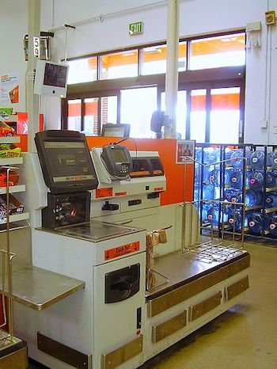

# Introduction to Hash Tables

## Learning Goals

By the end of this lesson you should be able to:

- Explain the uses of a Hash table
- Explain the concept of a hashing function and the criteria for a good hashing function
- Explain the concept of a Collision and Collision handling schemes including:
  - _linear probing_
  - _separate chaining_
  - _quadratic probing_
  - _double hashing_
- Use a hash table to solve a coding problem
- Choose between a hash table, binary search tree, linked list or array to solve a programming problem.

## Introduction

In practical programming we often spend much more time looking data up in a data structure as opposed to inserting or removing data.  A typical example is a grocery store.  At the checkout point we need to quickly recognize items and look up their prices in order to ring up a bill.  In ye olde days employees often had to memorize the prices of each item.  This worked in small shops, and was supplemented by price tags.  However stores have grown and price tags can fall off or prices change after an item is tagged.  Today most items have been given a unique key called a [Universal Product Code (UPC)](https://en.wikipedia.org/wiki/Universal_Product_Code#targetText=UPC%20(technically%20refers%20to%20UPC,of%20sale%2C%20per%20GS1%20specifications.).  The software at the point of sale regularly need to look up items from their UPC codes and retrieve the current price.  

The systems could use an array to store the data with Log2(n) retrieval times, or a binary search tree of the data, but in that case for `m` lookups and a universe of `n` products it would take O(mlog2n) to complete a transation.  It would be better to reduce the lookup time to a constant and the entire transaction to O(m).

This is where hash tables come in.  Hash tables reduce lookup times O(1) or constant time.  They do this by trading space complexity for time complexity.

## Hash Table Overview

## Hashing Functions

### Hash Function Criteria

#### The Division Method

#### The Multiplication Method

## Collisions

## Collision Resolution

## Sample Problem

## Resources

- [Basecs on Hash Tables: Taking Hash Tables Off The Shelf](https://medium.com/basecs/taking-hash-tables-off-the-shelf-139cbf4752f0)
- [Basecs: Hashing Out Hash Tables](https://medium.com/basecs/hashing-out-hash-functions-ea5dd8beb4dd)
- [How the Hash works in Ruby](https://launchschool.com/blog/how-the-hash-works-in-ruby#targetText=Conclusion,in%20Java%2C%20Python%20or%20Ruby)
