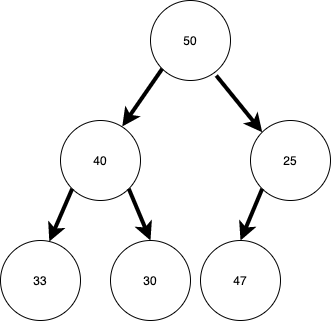
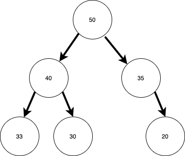

# Heaps

## Video Lesson & Slides

## Introduction

In this lesson we will introduce a new data structure, a heap!  Heaps are a great way to store information in a semi-order.  Essentially if you have a collection of data that you can sort or compare, you can add it to a heap.  A heap maintains a [complete binary tree](https://web.cecs.pdx.edu/~sheard/course/Cs163/Doc/FullvsComplete.html).  In a complete binary tree each level is full except the last, and the last level is filled from left-to-right.  Further, in a heap each parent has a specific order-relationship with it's chilren.  In a Min-Heap every parent node is less than it's child nodes.  In a max-heap, every parent node is greater than it's parent nodes.

Below is a drawing of a Max-Heap.

<!-- Image source:  https://drive.google.com/file/d/17cH7vfyZg-PFlULi-bO2K4H61oc4pCDT/view?usp=sharing -->

On the other hand this is **not** a Max-Heap.  Notice that 47 on the bottom level is greater than 25, it's parent.

This is also **not** a Max-Heap.  The last level is not full from left-to-right.  The 20 should be the left-child of 35.

## Implementation

## Uses for Heaps

### Priority Queues

Once use for a heap is a _Priority Queue_.  A priority queue is an abstract data type, like a stack or a regular queue.  However with a queue items are added and removed in a first-in-first-out (FIFO) order.  Priority queues remove items with the highest priority items removed first.  By using a heap to implement a priority queue you can build a data structure to serve data by priority.  

### 

### Heapsort

## Resources

- [Basecs on Heaps](https://medium.com/basecs/learning-to-love-heaps-cef2b273a238)
- [Basecs on Heapsort](https://medium.com/basecs/heapify-all-the-things-with-heap-sort-55ee1c93af82)
- [Geeks for Geeks on Heaps](https://www.geeksforgeeks.org/heap-data-structure/)
