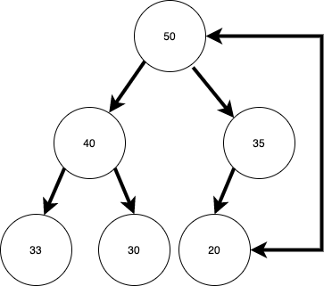
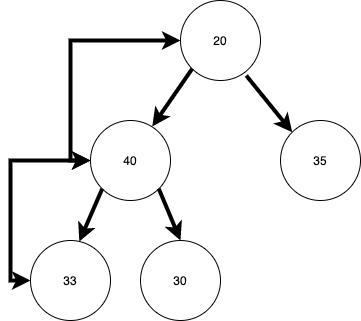
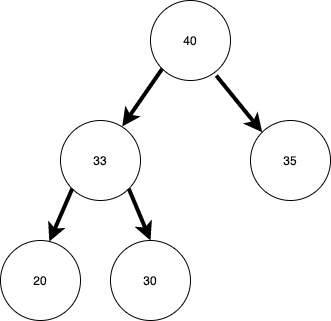

# Heaps

## Video Lesson & Slides

## Introduction

In this lesson we will introduce a new data structure, a heap!  Heaps are a great way to store information in a semi-order.  Essentially if you have a collection of data that you can sort or compare, you can add it to a heap.  A heap maintains a [complete binary tree](https://web.cecs.pdx.edu/~sheard/course/Cs163/Doc/FullvsComplete.html).  In a complete binary tree each level is full except the last, and the last level is filled from left-to-right.  Further, in a heap each parent has a specific order-relationship with it's chilren.  In a Min-Heap every parent node is less than it's child nodes.  In a max-heap, every parent node is greater than it's parent nodes.

Below is a drawing of a Max-Heap.


<!-- Image source:  https://drive.google.com/file/d/17cH7vfyZg-PFlULi-bO2K4H61oc4pCDT/view?usp=sharing -->

On the other hand this is **not** a Max-Heap.  Notice that 47 on the bottom level is greater than 25, it's parent.


This is also **not** a Max-Heap.  The last level is not full from left-to-right.  The 20 should be the left-child of 35.


## Implementation

While you **can** implement a heap with linked TreeNode objects, it can be **much** easier to implement a heap with an array.

Consider if the root is at index 0, the left child could be at index 1, and right index 2.  The child of index 1 would be at index 3 and 4 while the children of index 2 are at 5 and 6... we could write a formula to find the children of a node at index _i_.

`left_child = i * 2 + 1`
`right_child = i * 2 + 2`

So this heap:


In Array format:


### Adding An Element

To add an element to a heap, you place it into the end of the array (or the next logical leaf).  Then you do a heap-up operation comparing the new node to it's parent and swapping them if they are out of order.  Then, if a swap occured repeat the operation using the new node's updated location.

Below is an example of adding a node to a heap.


When finished the heap could look like this.


Pictured with an array it would look like this:


The add method would look like this:

```ruby
# This heap is sorted by key-value pairs
def add(key, value)
  @store << HeapNode.new(key, value)

  # Compare the new node with it's parent
  # If they are out of order swap and heap-up
  # using the parent's index number.
  # Implementation not shown purposefully.
  heap_up(@store.length - 1)
end
```

**Exercise:** Write pseudocode for the heap-up method using an array implementation for a heap.  Then compare your steps with your neighbor.

#### Add Node Time Complexity

Adding a value to the end of the array is an O(1) operation.  Performing the heap-up operation will at worst-case perform 1 swap per level of the heap.  Since there are `Log n` levels to the heap, then adding a node is a O(log n) operation.

### Removing An Element

Removing an element in some way works in the opposite manner of adding an element.  To remove an element you can swap the last leaf with the root.  Then and then compare the new root with it's children and swap to maintain the heap order in an operation called heap-down.  The heap down operation is repeated until a leaf node is reached or no swaps are made.

1. First swap the last leaf & the root node



2. Then heap-down the new root, to reestablish the heap property.



3. Then you should have a new, slightly smaller heap.




So removing a node could be done with:

```ruby

def remove
  if @store.empty?
    return nil
  end

  swap(0, @store.last - 1)
  result = @store.pop

  # heap_down is specifically not
  # implemented here
  # start heap_down with the root (index 0)
  heap_down(0) unless @store.empty?
  return result
end

private

def swap(index_1, index_2)
  temp = @store[index_1]
  @store[index_1] = @store[index_2]
  @store[index_2] = @store[index_1]
end
```

**Exercise:** Write pseudocode to implement the heap_down operation.  Note that you will need to verify that you may swap all the way down to a leaf node.

## Uses for Heaps

There are a number of practical uses for heaps in programming.  We will take a brief look at three.

### Priority Queues

Once use for a heap is a _Priority Queue_.  A priority queue is an abstract data type, like a stack or a regular queue.  However with a queue items are added and removed in a first-in-first-out (FIFO) order.  Priority queues remove items with the highest priority items removed first.  By using a heap to implement a priority queue you can build a data structure to serve data by priority.  

### Heapsort

Since heaps allow you to extract elements in order.  You can use them to sort an array.

With an array of `n` elements to perform Heapsort you can add the elements to the heap, an O(nlog n) operation.  Then you can remove the elements from the heap one-by-one placing them to the proper place in an array, also an O(nlog n) operation.

It is possible to do this with O(1) space complexity using the original array to store the heap elements.

So how does this compare?  Well adding the elements to a heap, and then placing them back in the array in order is O(nlog n + nlog n) = O(nlog n).  That's a pretty good sort.  On average it is not as fast as [QuickSort](https://www.geeksforgeeks.org/quick-sort/), but it has a **much** better worst-case time complexity, as QuickSort has a worst-case of O(n<sup>2</sup>).  It is also slower than [MergeSort](https://www.geeksforgeeks.org/merge-sort/), but has a better space complexity O(1) compared to O(n).  

### Dijkstra’s Algorithm

We will later look at [Dijkstra’s algorithm](https://brilliant.org/wiki/dijkstras-short-path-finder/) to find the shortest path in a weighted graph from a starting node to all other points in a graph.

## Summary

Heaps are a data structure to maintain elements in order.  They can be diagramed as a complete tree, but are often implemented as an array.  Each array element can represent one node in a binary tree.  

Adding a node involves placing a node in the next available leaf node and then conducting a series of swaps with it's parent until heap order is achieved.  Removing an element involves swapping the last leaf with the root of the heap, and then swapping the updated root with it's children until a valid heap realtionship is established.  

## Resources

- [Basecs on Heaps](https://medium.com/basecs/learning-to-love-heaps-cef2b273a238)
- [Basecs on Heapsort](https://medium.com/basecs/heapify-all-the-things-with-heap-sort-55ee1c93af82)
- [Geeks for Geeks on Heaps](https://www.geeksforgeeks.org/heap-data-structure/)
