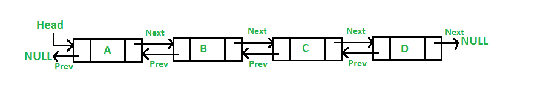

# Linked Lists

## Video Lesson

- [Video Lesson](https://adaacademy.hosted.panopto.com/Panopto/Pages/Viewer.aspx?id=7d5d5d84-a85e-4c5d-aaab-aaa8016736aa)
- [Slides](https://docs.google.com/presentation/d/1lJ8WJnA6qRlHAIaRAjim3kiL4nRBWT5qvFGQQIB4EL4/edit?usp=sharing)
- [Linked List Exercises](https://github.com/Ada-C12/linked-list)

## Learning Goals

By the end of this lesson students should be able to:

- Describe the structure of a singly linked list, and doubly linked list
- Compare and contrast the a advantages and disadvantages of singly and doubly linked lists.
- Design an Object Oriented Singly Linked List
- Write methods to perform a variety of tasks on a singly linked list

## Overview

An Array is an ordered, linear collection of data where each element sits next to the previous element.  Because each element is of uniform size, and adjacent to it's neighboring elements, with some basic math, the interpreter or compiler can jump to any element in the array immediately.  The interpreter takes the memory address of the 1st element of the array and adds the size of each element plus the index number of the sought element.  


A Linked List is also a linear collection where one element is first, another second etc, but each element instead contans a _reference_ to the next element in the list.  In that manner you could say that an element _points_ to the next item.  A Linked List forms a series of nodes linked together like a chain in memory.  


<!-- Image from https://en.wikipedia.org/wiki/Linked_list -->

### Singly Linked Lists

A Singly Linked List is the most basic form of a Linked List.  The data structure maintains a reference, typically called `head` which references the first node in a list.  That node maintains a field, typically called `next`, which reference the next node etc.  The last node in a linked list, sometimes called the `tail`, has `null` or `nil` as it's `next` reference.  


<!-- image from https://www.geeksforgeeks.org/difference-between-a-static-queue-and-a-singly-linked-list/ -->

### Doubly Linked Lists

A Doubly Linked List extends this by adding a `previous` reference to each node.  That `previous` reference points to the prior node.  The `head` node's `previous` field will be `nil` or `null`.



## Advantages & Disadvantages

You can use a doubly or singly linked list in any place you could use an array, but they have specific advantages depending on the use-case.

Doubly linked lists take up additional memory, due to the additional references, but it is possible to iterate through in reverse, and it can be a little easier to sort or add/remove elements in the middle of the list more easily.

### Over Arrays

Both Arrays & Linked Lists are linear data structures and both have a clearly defined order with first and last elements.  An array however has the ability to use an _index_ to select any element in constant time, while to find an arbitrary element in a linked list requires you to start at the head and iterate through the links until you find the element.  You can visualize and explore linked list operations on [visualgo.net](https://visualgo.net/en/list).

Big-O For Linked Lists & Arrays

| Operation 	| Linked Lists 	|  Array 	|
|---	|---	|---	|
| access | O(n) | O(1) |
| search | O(n) | O(n) |
| insertion | O(1) | O(n) |
| deletion | O(1) 	| O(1) |

As you can see above, Linked Lists perform in constant time to insert values into or remove values from a list, because it only requires a few reference to be changed.  Arrays, on the other hand, can require shifting numerous elements into new indices with each insertion or deletion.

Further most runtimes allocate more memory to an array than is being used because if the array grows, the interpreter needs to request new memory from the environment and copy the entire array into the new, larger, space.  By starting with extra space available an array can grow as required for some time.  A LinkedList by contrast only uses memory as required for the nodes available.  An array also requires each element to be adjacent in memory.  When available memory is limited, this can be problematic.  So in some memory restrictive environments a Linked List could be attractive.  

Linked Lists have the following advantages:

- **Dynamic Size** Linked Lists are of dynamic size, a Linked List only uses the memory required for it's current nodes.
- **Insertion/Deletion** Because each element does not need to be adjacent in a LinkedList it is easier to insert or remove element by adjusting the links, O(1).  
  - Arrays require shifting adjacent elements on insertion or deletion, O(n).

Arrays have the following advantages:

- **Random Access** Using by using the index you can quickly access any element in an array, O(1).  A Linked List requires you to traverse the list until you find the element, O(n).
- **No next/previous References** Each node in a Linked List requires, at least, a reference to the next node.  This is an additional complication and a bit of extra memory usage.
- **Caching** Because the memory is colocated, it's easier to move an array into faster system cache memory.

### Questions

<details>
<summary>Suppose you have an online store and need to lookup and access product descriptions by an id (index) number.  What would you pick, LinkedList or Array?</summary>
  
An Array because looking up items by index is much faster O(1) vs O(n) with an Array.
</details>

<details>
<summary>You need to look up orders by customer name and the list is maintained in order by the customer name.  What would you pick, LinkedList or Array?</summary>
  
An Array because you can search for elements in an Array using binary search O(log n) vs an Array with linear search O(n).
</details>

<details>
<summary>You need to regularly add orders to the end of a list and remove orders from the front to process them.  What would you pick, LinkedList or Array?</summary>
  
A Linked List because you can add and remove elements from the ends in constant time O(1) vs an Array where you have to shift all elements over causing it to run in O(n) time.
</details>

<details>
<summary>You need to regularly look up students from an unordered list and remove them from the list.  What would you pick a LinkedList or an Array?</summary>
  
Either could work as finding an element will take O(n) for an unordered list in both cases.  Granted removing an element in a LinkedList will take O(1) vs O(n) for an Array.
</details>

<details>
<summary>Your low memory capacity smart lightbulb needs to store a list of data.  What would you pick, LinkedList or Array?</summary>
  
A Linked List because it does not require the items to be adjacent and will only use as much memory as it requires in the moment.
</details>


## Object Oriented Design of a Linked List

### Encapsulation

When designing a data structure like a Linked List, we typically design the data structure as abstract, hiding implementation.  So the designer could switch a LinkedList into an ArrayList without impacting user functionality.  They could also transition into a DoublyLinkedList without impacting users.  

### Node Class

The node class encapsulates each element of the LinkedList..  It provides an attribute to store data and a node referencing the next node in the chain.  It provides an interface for our LinkedList to deal with the data and connect nodes.

```ruby
# Defines a node in the singly linked list
class Node
  attr_reader :data # allow external entities to read value but not write
  attr_accessor :next # allow external entities to read or write next node

  def initialize(value)
    @data = value
    @next = nil
  end
end
```


### Linked List Class

```ruby
# Defines the singly linked list
class LinkedList
  def initialize
    @head = nil # keep the head private. Not accessible outside this class
  end
  
  # method to add a new node with the specific data value in the linked list
  # insert the new node at the beginning of the linked list
  def add_first(value)
    new_node = Node.new(value)

    # if the head is nil new_node becomes head
    # Then head becomes the new node.
  end
  
  # returns the value in the first node
  # returns nil if the list is empty
  def get_first
    # return the value of the 1st node in the list
  end

  # method that returns the value of the last node in the linked list
  # returns nil if the linked list is empty
  def get_last
    # return nil if the list is empty
    # otherwise traverse the list to the end
    # Then return the last node's value
  end
  
  # method that returns the value at a given index in the linked list
  # index count starts at 0
  # returns nil if there are fewer nodes in the linked list than the index value
  def get_at_index(index)
    # traverse the list, 
    #  index, number of times or
    #  until the end is reach
    #  Then return the current node's value
  end
end
```

### Adding A Node

Adding a node to the front of the LinkedList class above is relatively straightforward.  You:

- Create a new Node
- Make the new node's next field be the current `head` of the list
- Set the `head` to become the new node

Step 1:


Step 2:


Step 3:


Step 4:


```ruby
def add_first(value)
  new_node = Node.new(value, nil, nil)
  new_node.next_node = @head
  @head = new_node
end
```

### Removing a node at a specific index

To remove a node at a specific index, you first have to traverse the list until you find the index before the node to delete.  If the node to remove is the head, then the head becomes the next element.  Then adjust the prior node's `next` reference to point **past** the node you are removing.  


```ruby
def remove(index)
  return if @head.nil?

  if index == 0
    @head = head.next_node
  else
    # Traverse the list until you find the node at index -1
    current = @head
    current_index = 0
    while current.next_node != nil && current_index < index - 1
      current = current.next_node
      current_index += 1
    end

    # if the node exists
    if !current.next.nil?
      current.next_node = current.next_node.next_node
    end
  end
end
```

## Supplemental Concepts

### Pointers & References

You will often hear the terms _pointer_ and _reference_ in relation to dynamic data structures like LinkedLists.  Both terms refer to a variable which **points** to data in memory, or holds the address of another varaible in memory.  The concept is similar to a home.  The home is an object in memory, while the home's address is a _reference_ which indicates where to find the home.

In some languages like C/C++ you can manipulate memory addresses and memory directly.  In other languages, like Ruby, you have references which refer to objects in memory, but you cannot directly work with the memory addresses.  

An example in C++

```c++
  int x = 5;
  int *ptr_x;
  ptr_x = &x;  // Assign ptr_x the value of the memory address of x.
```

We use references in Ruby whenever we use a Linked List since each node _refers_ to the next node in the chain and `head` refers to the 1st node in the chain.


### Memory Leaks

Is a bug in how a program manages memory.  A _memory leak_ occurs when memory that is no longer needed by the program is not released back to the operating system.  Over time, if memory is used, and not returned to the system less and less memory is available to other programs and eventually not enough memory is available to run applications.  Modern operating systems return all system memory allocated to a program when it ends.  Thus memory leaks in long-running processes like daemons can cause a system to run out of memory.

In Ruby the ruby interpreter manages memory for developers.  Ruby uses a [garbage collection](https://en.wikipedia.org/wiki/Garbage_collection_(computer_science)) system which identifies memory no longer used by the application and returns it.

Consider when a node is removed from a Linked List:


<!-- source:  https://stackoverflow.com/questions/41474163/singly-linked-list-remove -->


When no variable refers to a node (holding 99 in the image above) the ruby garbage collector will eventually return the memory to the operating system.  

```ruby
def remove_first()
  if @head == nil
    return false
  end

  value = @head.value
  head = head.next_node

  return value;
end
```

Some languages however, place memory management on the developer.  C is one such language.  These lower-level languages give a developer more flexibility and control over low-level operations, at the cost of more responsibility and a greater likelyhood of errors.

Removing a Node from a Linked List in C

```c
void removeFirst(struct node **headRef) {
  if (*head != NULL) {
    struct node* temp = *head;
    int value = (*temp)->value;
    head = (*head)->next;
    free(temp);  // <-- Give back memory to the OS
    return value;
  }
}
```


## Exercises

The exercises will be done on the [Linked List Repository](https://github.com/Ada-C12/linked-list), please turn in a PR when done.

Design an algorithm, deduce the space and time complexity and then, author functions to do the following:

For each of the problems below: Assume you are given a singly linked list where each node in the linked list has integer data and a link to the next node.

  1. Add a new node with the specific input data value in the linked list. Insert the new node at the beginning of the linked list
  2. Check if the linked list contains a node with specified input value. Returns true if found, false otherwise.
  3. Return the max value in the linked list. Returns the data value and not the node.
  4. Return the min value in the linked list. Returns the data value and not the node.
  5. Return the count of nodes in the singly linked list.
  6. Return the value of the nth node from the beginning. *n* is the input to the method.
     Assume indexing starts at 0 while counting to n.
  7. Insert a new node with specific input data value, assuming the linked list is sorted in ascending order.
  8. Print the value of each node in the singly linked list separated by a space.
  9. Delete the first node found with the specified input data value.
  10. Reverse the singly linked list. The nodes should be moved and not just the values in the nodes.
  11. Returns the value at the middle node in the singly linked list.
      If the node count is even, pick one of the two middle values to return.
  12. Find the nth node from the end of the linked list and return its value. Assume indexing starts at 0 while counting to n.
  13. Check if the linked list has a cycle. A cycle exists if any node in the linked list links to a node already visited. Returns true if a cycle is found, false otherwise.

## Resources

- [Current Slide Deck Used](https://docs.google.com/presentation/d/1lJ8WJnA6qRlHAIaRAjim3kiL4nRBWT5qvFGQQIB4EL4/edit?usp=sharing)
- [Past Slide Deck Used In Class](https://drive.google.com/file/d/0B__DV26QHsH4bFczWXBXdGtHYkE/view?usp=sharing)
- [Linked Lists from Geeks for Geeks](https://www.geeksforgeeks.org/data-structures/linked-list/) - Lots of articles & practice problems
- [Stanford LinkedList Basics](http://cslibrary.stanford.edu/103/LinkedListBasics.pdf)
