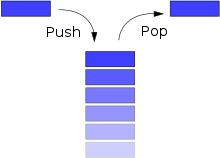
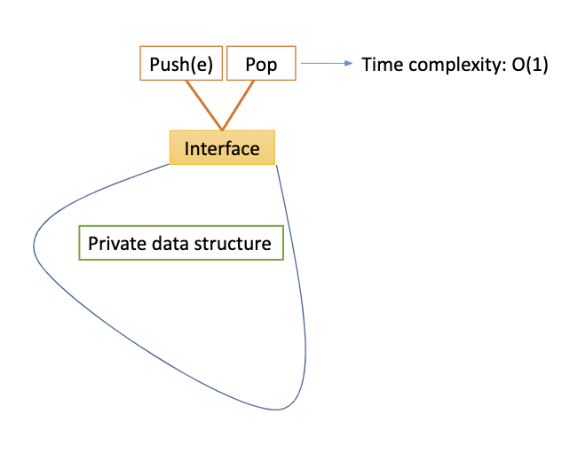
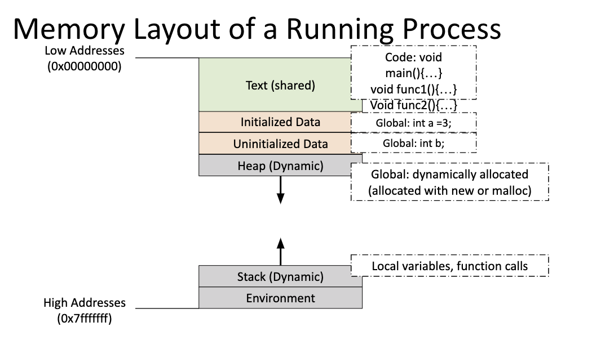
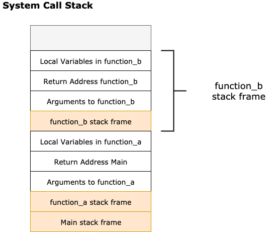
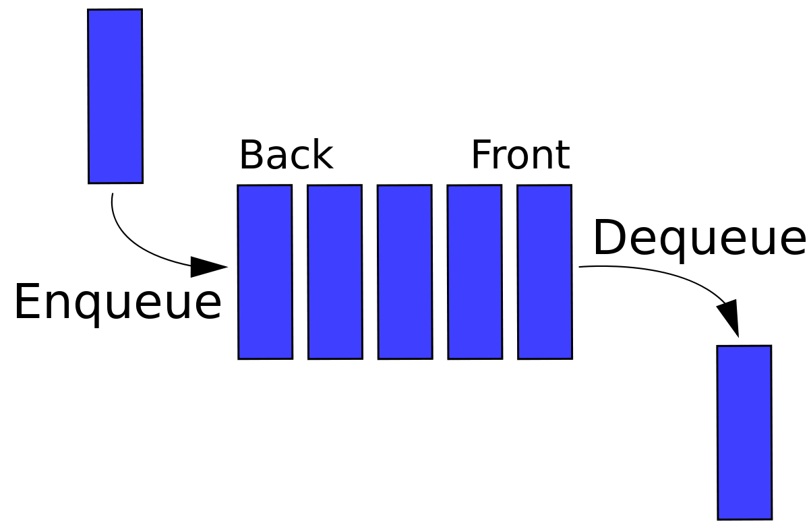
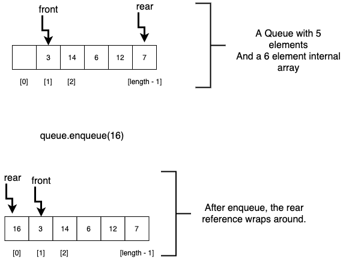
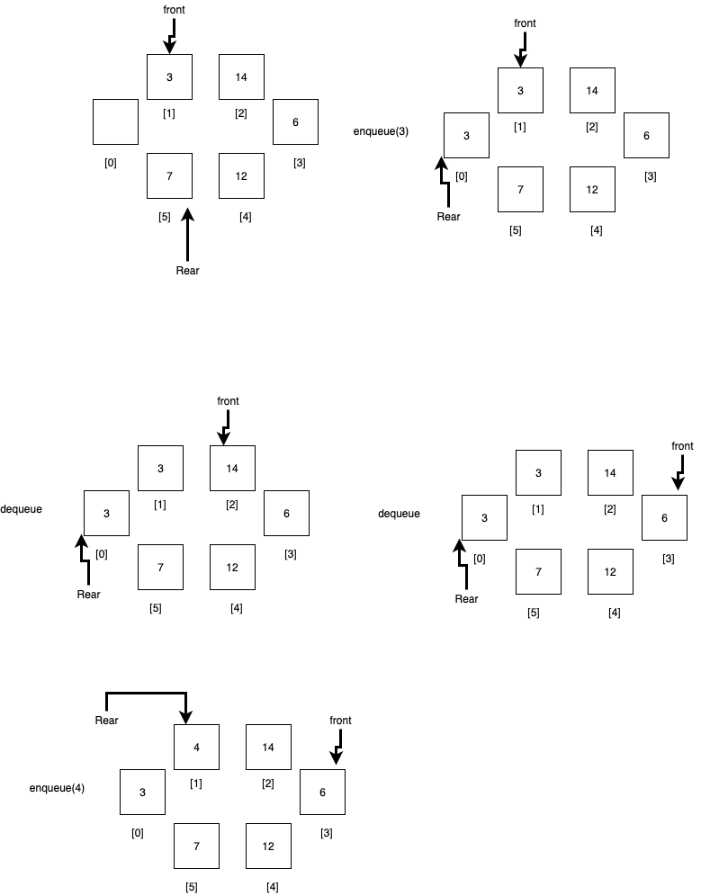

# Stacks & Queues

## Learning Goals

By the end of this lesson you should be able to:

- Describe the Stack & Queue data structures
- Explain the concept of an Abstract Data Type (ADT)
- Implement a Stack and a Queue using a linked list or an array
- Use Stacks and Queues to solve problems

## Introduction

At Ada we have often talked about hiding implementation details behind a public interface.  In this lesson we will look at two common data types which can be implemented in a variety of ways, Stacks and Queues.  Both data structures are described by what they do, rather than how they are written.  This is different from a linked list in that they key feature of a linked list is that it is implemented by linking nodes together into a chain.  A Stack on the other hand is a set of methods and how they behave.  The internals of a stack can be done in any number of ways.  So this lesson could be called an introduction to abstract data types.  

## Abstract Data Types (ADT)

An _Abstract Data Type_, is a type of object which is described by the methods it has and how they perform.  Implementation details are not included.  You could for example create a `List` class.  You can provide methods to add elements and even retriveve elements at a given index.  The user of your class never needs know if you used an array or linked list to store the information internally.  The class is called _abstract_ because the data structure's description is independent from it's implementation.  The process of providing only the public interface and hiding implementation details is known as _abstraction_.  We will examine & implement 2 different ADTs known as Stacks and Queues.

## Stacks

A Stack is a data structure which stores a list of data and only provides access in a Last-In-First-Out (LIFO) order.  You've seen stacks before at Ada.  When we discussed recursion we noted that function calls are saved on the system stack.  This is so the most recent function called is the first function returned to when the current function ends.

A Stack provides the following methods:

- **push(item)** - This method puts an item into the stack at the top.
- **pop** - This method removes and returns the item on the top of the stack.
- **is_empty** - This method returns true if the stack is empty and false otherwise.

A Stack might also implement a `peek` method which returns, but does not remove the item on top of the stack, and `size` which would return the number of items on the stack.

You can picture a Stack like a stack of plates where new plates can be added and removed from the top, but cannot be removed from the middle or bottom of the structure.



### Implementation of a Stack

You can use any linear data structure to implement a stack.  For example you could implement a `Stack` class like this:

```ruby
class Stack
  
  def initialize
    @list = LinkedList.new
  end

  def push(item)
    @list.add_front(item)
  end

  def pop()
    return nil if self.empty?

    item = list.remove_front

    return item
  end

  def empty?()
    return @list.empty?
  end
end
```

You could later change the implementation of Stack to use an Array, but the users of the class would not need to change anything of their code.  This is because the implementation is hidden behind a public interface.  The top of the stack would reference the last element in the array.

**Stack ADT**


**Exercise**:  Implement a `top` method which returns the top of the stack without changing the stack.

**Exercise**:  Write a method which takes a string as an argument.  Return the string reversed using a Stack.

### The Function Stack

As methods get called in an application, the system stores the current instruction addresses, local variables etc on a stack known as the _system call stack_.  Then when a method ends, the topmost method is popped off the stack allowing the system to resume execution.



The diagram below shows the memory used by a running application.  At the top, the text in the application, and global variables are stored.  Below them is the dyanmic data allocated.  At the bottom the system stack stores the functions called.

```ruby
def function_a(x)
{
   y = 4
   z = function_b(x, y)
   puts “The number is #{z}"
}

def function_b(int x, int y)
  # pause application
  return x + y;
end

x = 3
function_a(x)
```

For the code snippet above, the stack frame at the `# pause application` line would look like this:



<!-- Graphic saved at: https://drive.google.com/file/d/1SsxrrqIIw5oYonpKzwxvXAF3lTcQmB10/view?usp=sharing -->

As the application starts the system puts the main part of the application on the stack, and then main calls `function_a`.  So the system saves the arguments to `function_a` onto the stack, the address to return to (Main) when the method is finished and the local variabes in `function_a`.  Then `function_b` is called and the system saves the arguments to `function_b` onto the stack, the return address (function_a) and any local variables in `function_b`.  When function_b finishes, it's stack frame is popped off the stack, and the return address is used to resume `function_a`.  When `function_a` finishes the same pop operation is performed and the application returns to main.  When the main part of the application is finished, it's stack frame is popped off and the application terminates.  

When an error is raised, the stack is popped until the error is rescued in the current method, or the application terminates and a trace of all the elements on the stack at the time of the error is reported.

## Queues

A queue unlike a stack operates in a first-in-first out order.  Like a line of people at a concert, the first element to enter the queue is the first element removed.  


As shown above elements are added to the back of the queue in an operation called _enqueue_ and removed with an operation called _dequeue_.  

Queues are great for any operation that needs to work with data in a first-in-first-out order.  For example some systems have worker processes which can be assigned tasks to work on and these worker processes take on jobs assigned to them in the order they appeared, completing one before taking on the next.

**Exercise**: With pseudocode implement a `front` method which returns the item at the front, but leaves the Queue unchanged without directly accessing any methods of the Queue except `dequeue`, `enqueue` and `empty?`.  Feel free to use any other data structures.

A Queue provides the following methods:

- **enqueue(item)** - This method puts an item into the back of the queue.
- **dequeue** - This method removes and returns the item at the front of the queue.
- **is_empty** - This method returns true if the queue is empty and false otherwise.

### Queue Implementation Considerations

Like a stack a queue can be implemented several ways and the implementation should be hidden from the user.  One way would be to implement a queue with a linked list like this:

```ruby
class Queue

  def initialize
    @list = LinkedList.new
  end

  def enqueue(item)
    @list.add_last(item)
  end

  def dequeue
    return nil if self.is_empty

    return @list.remove_first
  end

  def is_empty
    return @list.empty?
  end
end
```

<details>
  <summary>What would be the Big-O here of enqueue and dequeue?</summary>
  If the Linked List has a tail reference, and is a doubly linked list, then both enqueue and dequeue can be done in O(1) time.  If there is no tail reference then enqueue should perform in O(n) time.
</details>

This implementation has a number of advantages, it's easy to read, fairly performant, but the data is a bit fragmented.  If you had a queue with a fixed maximum size, how would you use an Array to implement it?

#### Implementing a Queue With an Array

Remember that inserting or removing an element at index 0 of an array can be expensive as all items to the left of the item inserted or deleted would need to be shifted over 1.  

However this can be overcome by maintaining a reference to the front index of the queue and the rear index and treating the array as a circular data structure.  For example, as elements are dequeued the front index would increase by 1 each time.  Then as elements are added the rear of the queue would also increase by 1.  If the end of the array is encountered (rear becomes the length of the array), the rear can be set to 0, if the front is greater than 0.  



<!-- Image saved at: https://drive.google.com/file/d/1sr3vY5AC4p_9HJKqCPdEvYl_TWZLXGVz/view?usp=sharing -->

You can picture it as a circle like below, with several operations illustrated.



<!-- Image source:  https://drive.google.com/file/d/1K4oSf3uaTd0MMxZsv8nn65wnC3LnY5uW/view?usp=sharing -->

Below is a pseudocode implementation of the circular buffer.

```
Method enqueue(value)
  if ((front == 0 && rear == array.length - 1) OR
      (rear == (front-1)%(size-1))) 
        //  The Queue is full
        raise an error
  else if (front == -1) // Queue is empty
    set front & rear to 0
    array[rear] = value
  else if (rear == array.length - 1 && front != 0) // rear needs to wrap around
    rear = 0
    array[rear] = value
  else
    rear = rear + 1
    array[rear] = value
  endif
end method

Method dequeue
  if (front == -1) // Queue is empty
    raise an error
  endif
  
  data = array[front]
  // overwrite the element being deleted
  array[front] = null

  // if the queue is now empty
  if (front == rear)
    front = -1
    rear = -1
  else if (front == size-1) // if front needs to wrap around
    front = 0
  else
    front = front + 1
  endif

  return data
end method
```

<details>
  <summary>What is the Big-O of each method?</summary>
  Since a fixed number of comamnds are executed no matter the size of the queue, the Big-O of enqueue and dequeue are both O(1)
</details>


This strategy of using floating front and rear references is known as a _circular buffer_.  It allows you to work around the need to shift elements left and right when adding and removing to the front of a list.  It can, however be more difficult to understand.  This kind of buffer is used for things like round-robin scheduling of tasks, like in the CPU and for storing in-memory logs.  

**Try it Out!**

On paper draw out a circular buffer of size 6 and perform the following operations on it.  Then trace through what happens to it as these operations are performed.

- enqueue('A')
- enqueue('B')
- enqueue('D')
- enqueue('E')
- enqueue('F')
- enqueue('G')
- dequeue
- dequeue
- enqueue('X')
- dequeue
- dequeue
- enqueue('Y')
- enqueue('Z')

In class we will compare our answers.  

Using a circular buffer overcomes some of the limitations of an array, and enables efficient operations on the ends of the data structure.  The array size however remains a limitation and resizing the data structure is an expensive O(n) operation.

## Exercises

Complete the following exercises with a partner.

1. Given a Binary Search Tree where each node contains links to the left and right children and an integer value. Implement pre-order traversal for a binary search tree using an **iterative** approach.

Note the recursive solution to preorder is as follows:

```ruby
def preorder(current_node, list)
  list << current_node.value
  # Add the left node to the system stack and do preorder on the left
  preorder(current_node.left, list) 
  # Add the right node to the system stack and do preorder on the right
  preorder(current_node.right, list)

  return list
end
```

<details>
  <summary>If you need a hint, click here for pseudocode steps.</summary>
  <ul>
    <li> If the tree is empty, all done return. </li>
    <li>Create an empty stack of Node objects</li>
    <li>Push ‘root’ to the stack</li>
    <li>Do the following while the stack is not empty
      <ul>
        <li>Pop the node from the stack and print its value</li>
        <li>Push right child of popped node to the stack, if not NULL</li>
        <li>Push left child of popped node to the stack, if not NULL</li>
        <li><strong>Note:</strong> Right child is pushed before Left child to ensure that the Left subtree is processed first.</li>
      </ul>
    </li>
  </ul>
</details>

<br />
<br />

2. Write a function to print all integer values in a binary tree in breadth first traversal iteratively. (Hint: Use a Queue.)
3. Describe how you would implement a Queue using 2 Stacks.
4. Describe how you would implement a Stack using 2 Queues.


## Summary

Stacks and queues are standard computer science data structures.  They provide a well-understood interface without perscribing a specific implementation.  We explored how a stack & queue could be implemented with either a linked list or an array.  A stack is relatively straightforward to implement with either a linked list or an array, but to implement a queue with an array requires either high overhead caused by needing to shift elements, or use of a circular buffer.  The circular buffer solution uses two references to record the front and rear of the queue and treat the array as an object that be wrapped around.  For a queue, this provides the same time complexity as an implementation using a linked list, without the fragmentation of the data in memory.

## Terms & Terminology

| Term      | Description |
| ----------- | ----------- |
| Abstract Data Type (AD)      |  A type of data structure described by a set of operations it can perform.  It is abstract because the details of implementation are not included.  Thus for example, one developer could implement a Stack ADT with a linked list and another could use an array.       |
| Stack   | An Abstract Data Type which stores data in a Last-in-first-out (LIFO) order.  The first element added will always be the last element removed, and the most recent element added will be the first removed.         |
| Queue   | An Abstract Data Type which stores data in a First-In-First-Out (FIFO) order.  The first element stored in the data structure will be the first element removed.  You can think of a Queue as a line, where the first person to get in line is the person served first.         |
| LIFO | Last-In-First-Out, the order in which items are inserted and removed from a stack. |
| FIFO | First-In-First-Out, the order in which items are inserted and removed from a queue |
| Circular Buffer | A circular buffer, circular queue, cyclic buffer or ring buffer is a data structure that uses a single, fixed-size array as if it were connected end-to-end.  Very useful for tasks which repeatably add/remove elements from the front and rear of a list. |

## Resources

- [Geeks for Geeks on Queue Implementation with a circular array](https://www.geeksforgeeks.org/implementation-deque-using-circular-array/)

## References

- [Stack Diagram from wikipedia](Sources: https://simple.wikipedia.org/wiki/Stack_(data_structure))
