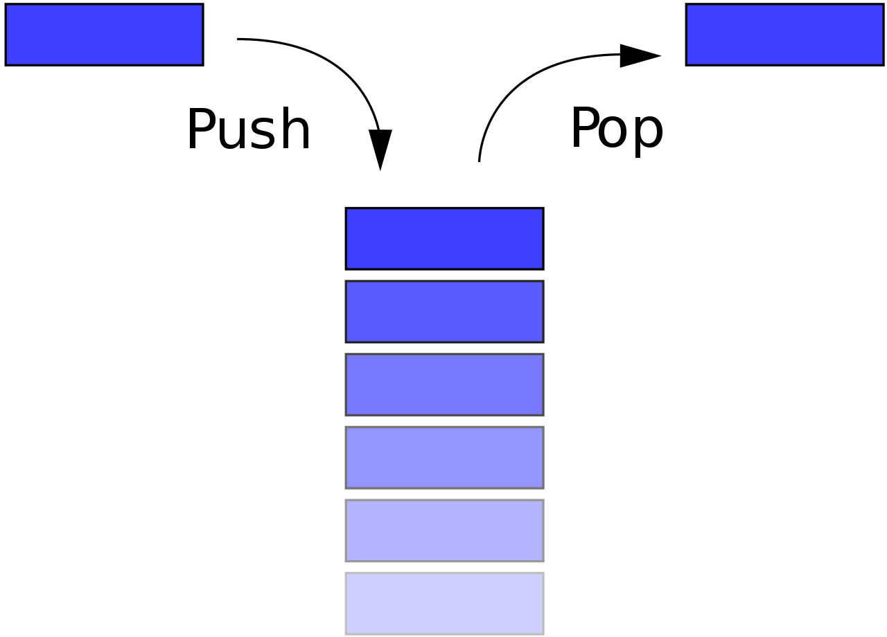
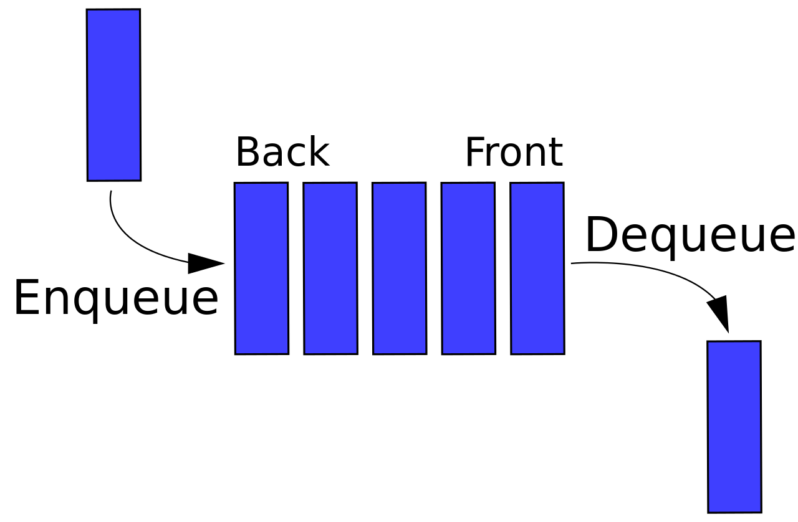

# Abstract Data Type (ADT) for Stacks and Queues
An <b>Abstract Data Type</b> (ADT) specifies _permitted operations_ as well as _time and space gurantees for those operations_ for a given data type. An ADT therefore provides the contract of what it gurantees to the user of the ADT. ADT is a convention and a specification that every implementation of the ADT must satisfy.

### Abstract Data Type: Stack
- A <b>stack</b> is an ordered list in which all insertions and deletions are made at one end, called the _top_.
- The items in the stack follow an order such that the last item inserted in the stack is the first one that will get deleted from the stack. Hence, a stack follows the principle of <b>L</b>ast <b>I</b>n <b>F</b>irst <b>O</b>ut (<b>LIFO</b>).
- The insert operation in a stack is known as <b>Push(e)</b> where e is the item being added to the stack. 
- The delete operation in a stack is known as <b>Pop()</b>
- Push(e) and Pop() are guaranteed to take constant time (i.e. they are O(1) operations).

### Abstract Data Type: Queue
- A <b>queue</b> is an ordered list in which all insertions take place at one end known as the _back_ of the queue and all deletions are made at the other end, known as the _front_.
- The items in the queue follow an order such that the first item inserted in the queue is always the first one that will get deleted from the queue. Hence, a queue follows the principle of <b>F</b>irst <b>I</b>n <b>F</b>irst <b>O</b>ut (<b>FIFO</b>).
- The insert operation in a queue is known as <b>Enqueue(e)</b> where e is the item being added to the queue. 
- The delete operation in a queue is known as <b>Dequeue()</b>
- Enqueue(e) and Dequeue() are guaranteed to take constant time (i.e. they are O(1) operations).

The ADTs for Stack and Queue define the essentials of what any consumer of a Stack and any consumer of a Queue expect from any implementation of these data structures. The details of how this functionality is provided is abstracted away from the consumer.

The consumer of the stack is interested in the functionality provided by the interface. The implementation details are all hidden from the consumer.

Same is true with the queue. 

