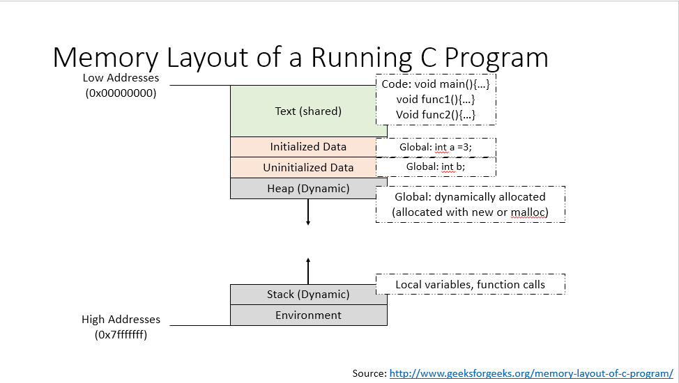
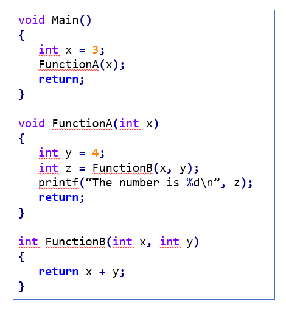
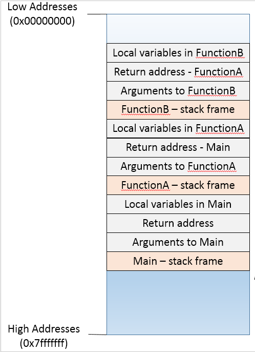

# Using Stacks and Queues
As we learned, the [ADTs for Stack and Queue](adt.md) define the essentials of what any consumer of a Stack and any consumer of a Queue expect from any implementation of these data structures. The details of how this functionality is provided is abstracted away from the consumer. In this section, we'll see examples of how having stack and queue implementations can be leveraged to solve various problems.

## Printer
A printer is a great example of a device that uses both a stack and a queue.

When sending a document to a printer, one common option is to collate the output, in other words, to print the pages so that they come out in the proper order. Generally, this means printing the last page first, the next to last next, and so forth. This is how a <b>stack</b> gets leveraged in a printer.

```ruby
    def print_collated(job)
        stack = Stack.new

        job.pages.each do |page|
            stack.push(page)
        end
        
        while !stack.empty?
            print_page(stack.pop)
        end
    end
```

When sending a document to a printer, it may have to be held until the printer finishes whatever job it is working on. 
Holding jobs until the printer is free is generally the responsibility of a print spooler (a program that manages the input to a printer). 
Print spoolers hold jobs in a <b>queue</b> until the printer is free. This provides fair access to the printer and guarantees that no print job will be held forever.

```ruby
def initialize()
    job_queue = Queue.new()
end

def spool(document)
    job_queue.enqueue(Job.new(document))
end

def run()
    while (true)
        if printer.free? && !job_queue.empty?
            printer.print_job(job_queue.dequeue)
        end
    end
end
```

<b>Note</b>: As you can see in the example above, along with <b>push(e)</b> and <p>pop()</p>, a stack implementation often provides <b>empty</b>  and <b>full</b>as a conveniently available operation. The same two operations are also provided in a <b>queue</b>.

## Function call stack
When we looked at how function calls work and how recursive function calls work, we discussed the memory layout of a running process and the <b>function call stack</b>.




The stack part of the memory is where all the function calls take up space. As the name suggests, this portion of the memory, actually uses the concept of a stack.

Consider the following C code:



Function <b>Main</b> is the first one to be invoked in the program. <b>FunctionA</b> gets called from <b>Main</b>. <b>FunctionA</b> calls <b>FunctionB</b>. At the time that <b>FunctionB</b> is getting executed, here's what the <b>function call stack</b> will look like:



## Exercises
<b>Given</b>: For each of the exercises below, assume that you're provided with an implementation for:
- a Stack with the following methods:
    - push(e), returns nothing
    - pop(), returns the element deleted
    - empty(), returns true if the stack is empty and false otherwise
- a Queue with the following methods:
    - enqueue(e), returns nothing
    - dequeue(), returns the element deleted
    - empty(), returns true if the queue is empty and false otherwise

Design algorithms and write pseudo code for the following exercises.
1. <b>Exercise</b>: Design a method that takes a string as an input parameter and reverses it using a stack.
    <details>
        <summary>click here to see a solution in C
        </summary>
            
            void ReverseString(char *string)
            {
                /* Create and initialize a stack */
                Stack myStack;
                Stack Init(&myStack);

                // push each char in the original string to the stack
                // e.g. push to stack 'a', 'b', 'c' if input string is "abc"
                char *temp = string;
                while(*temp != '\0') {
                    Stack_Push(*temp);
                    temp++;
                }

                // pop from Stack and update string to be in reverse order
                // leverage the stack's LIFO nature
                while !Stack_Empty() {
                    *string = Stack_Pop();
                    string++;
                }
            }
    </details>

    <details>
        <summary>click here to see a solution in Ruby
        </summary>
        
            def reverse_string(my_string)
                # create a stack
                my_stack = Stack.new()

                # add each character to the stack
                my_string.length.times do |i|
                    my_stack.push(my_string[i])
                end

                # leverage the LIFO property of a stack and update the string to be reversed
                while !my_stack.my_string.length.times do |i|
                    my_string[i] = my_stack.pop()
                end
            end
    </details>
1. <b>Exercise</b>: Given a string of open and closed parentheses i.e. a string composed only of ( and ) The string is said to have balanced parentheses if the open parentheses matches a closed parentheses i.e. the order and pairs match. Write a method that returns true if the parentheses are balanced, and false otherwise. What is the space and time complexity of your solution?
    - Examples of balanced parentheses:
        - (())()
        - (())()(()(()()))
    - Examples of unbalanced parentheses:
        - <b>)</b>(
        - (())()<b>)</b>
        - ((())<b>((</b>)`
    <details>
        <summary> Solution option 1: Use a stack.
        </summary> 
            Create a stack. For every (, push into stack, for every ), pop from stack. If the stack is empty and a pop is not possible when needed, the string has unbalanced parentheses. If at the end of the string, the stack is not empty, the string has unbalanced parentheses. 
            Space complexity: O(n) where n is number of characters in the string.
            Time complexity: O(n) where n is number of characters in the string.
    </details>

    <details>
        <summary> Solution option 2: Tracking count.
        </summary>
            Initialize counter to 0. For every ( add a 1. For every ) subtract 1 from counter. If counter is every negative, the string has unbalanced parentheses. If counter is greater than 0 at the end of the string, the string has unbalanced parentheses.
            Space complexity: O(1)
            Time complexity: O(n)
    </details>
1. <b>Exercise</b>: Consider the same exercise as the one above. Only instead of being limited to the pairs of open <b>(</b>, and closed <b>)</b> paranthesis matching up, we are also want to make sure that open and closed square brackets i.e. <b>[</b> and <b>]</b>, as well as open and closed curly braces i.e. <b>{</b> and <b>}</b> match up. How would you design this solution?
    <details>
        <summary> One approach
        </summary>
        We'll need a hash table that returns back `true` for any of the open parenthesis, open square bracket or open curly brace. We'll need a separate hash table that returns the corresponding open equivalent when a closed parenthesis, curly brace or square bracket is sent in as a key. Finally, we use a stack. If we encounter a character in the string that is an open parenthesis, curly brace or square bracket, we add it to the stack. When we encounter a closed parenthesis, curly brace or square bracket, we pop from the stack and compare the value popped with the value returned from the hash table. If they match, we continue, otherwise we have a mismatch. At the end of the string, the stack should be empty.
    </details>
1. <b>Exercise</b>: Assume the data contained in the Stack is integer values. Design and implement a method called _Top()_, which returns the next value that would get removed from the Stack. <b>Hint</b>: call _push(e)_ and _pop()_ on the stack. <b>Note</b>: This method is also sometimes called _Peep()_
    <details>
        <summary> click to see Solution
        </summary>
            def top(my_stack)
                return nil if my_stack.is_empty()

                top_value = my_stack.pop() # pop from stack
                stack.push(top_value) # push back into the stack
                return top_value # return value that will get popped next
            end
            # Time complexity: O(1) since it doesn't depend on stack size
            # Space complexity: O(1) since it doesn't depend on stack size
    </details>
1. <b>Exercise</b>: Assume the data contained in the Queue is integer values. Design and implement a method called _Front()_, which returns the value of the next item that would get removed from the Queue. <b>Hints</b>: (i) call _dequeue()_, _enqueue(e)_ and _is_empty()_ on the Queue. (ii) you will need an additional data structure. <b>Note</b>: This method is also sometimes called _Peep()_
    <details>
        <summary> click here to see the solution
        </summary>
            def front(my_queue)
                return nil if my_queue.is_empty()
                
                temp = Array.new() # using an array data structure as an auxiliary
                while !my_queue.is_empty()
                    temp << my_queue.dequeue()
                end # remove from queue and add to temp

                temp.length.times do |i|
                    my_queue.enqueue(temp[i])
                end # add back to the queue in correct order

                return temp[0] # return the first element removed from the queue
            end
            # Time complexity: O(n), where n is the number of itmes in the Queue. n items are removed from the queue and added to temp. n items are added back to the queue.
            # Space complexity: O(n), where n is the number of items in the Queue. n items will need to be saved temporarily in the auxiliary data structure.
    </details>
1. [Binary Search Tree] <b>Exercise</b>: Assuming you're familiar with Binary Search Trees, 
consider how you would use a Stack to perform pre-order depth first traversal iteratively.
1. [Binary Search Tree] <b>Exercise</b>: Assuming you're familiar with Binary Search Trees, 
consider how you would use a Queue to perform breadth-first traversal iteratively.

There are lots of famous computer science problems that leverage stacks and queues to design an efficient solution.
