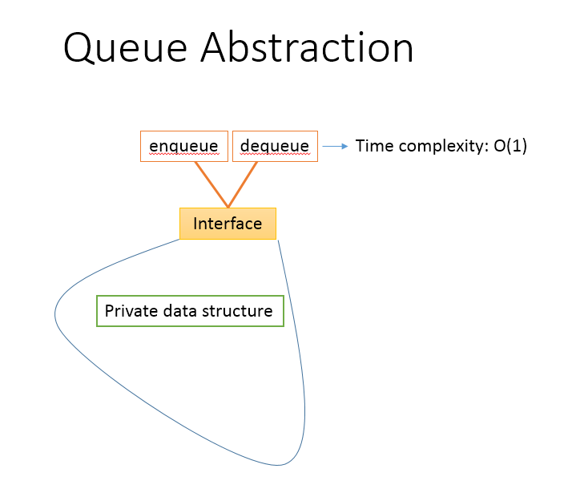
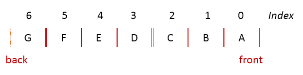
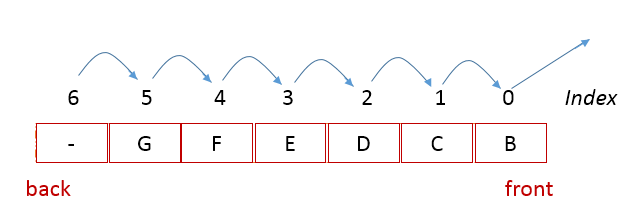
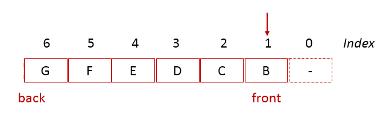
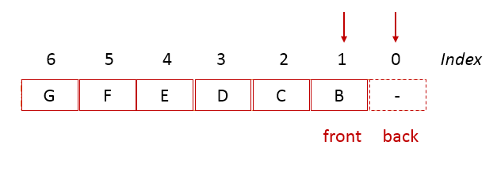

# Queue
In this section, we'll be implementing a queue using object oriented design principles. You're encouraged to create a class and code to follow along. 

## Tests
To make our design and implementation follow a test-driven design and development approach, let's begin with thinking about how we will create an instance of the Queue class and call methods on it.

<b>Exercise</b>:Take some time to write the code for doing the following:
1. Create an instance of the `Queue` class
1. Check whether the queue is empty
1. Check whether the queue is full
1. Enqueue the integer value 10 to the queue
1. Check whether the queue is empty
1. Enqueue the integer value 20 to the queue
1. Check whether the queue is empty
1. Enqueue the integer value 30 to the queue
1. Check whether the queue is empty
1. Dequeue an item from the queue and verify that it is of value 10
1. Dequeue an item from the queue and verify that it is of value 20
1. Dequeue an item from the queue and verify that it is of value 30
1. Check whether the queue is empty
    <details>
        <summary> Click here to see an implemented version for the above
        </summary>
    
            my_queue = Queue.new()
            puts "Queue should be empty. Is the queue empty? #{my_queue.is_empty}"
            puts "Queue should not be full. Is the queue full? #{my_queue.is_full}"

            puts "enqueue 10"
            my_queue.enqueue(10)
            puts "Queue should not be empty. Is the queue empty? #{my_queue.is_empty}"

            puts "enqueue 20"
            my_queue.enqueue(20)
            puts "Queue should not be empty. Is the queue empty? #{my_queue.is_empty}"

            puts "enqueue 30"
            my_queue.enqueue(30)
            puts "Queue should not be empty. Is the queue empty? #{my_queue.is_empty}"

            puts "dequeue should return 10. dequeueped value: #{my_queue.dequeue()}"
            puts "Queue should not be empty. Is the queue empty? #{my_queue.is_empty}"

            puts "dequeue should return 20. dequeueped value: #{my_queue.dequeue()}"
            puts "Queue should not be empty. Is the queue empty? #{my_queue.is_empty}"

            puts "dequeue should return 30. dequeueped value: #{my_queue.dequeue()}"
            puts "Queue should not be empty. Is the queue empty? #{my_queue.is_empty}"
    </details>

## ADT to implementation
The consumer of the Queue are interested in the contract provided by the ADT:
1. There is a <b>enqueue</b> method which adds an item to the Queue and operates at the time complexity of _O(1)_
1. There is a <b>dequeue</b> method which removes the next item from the Queue in the First In First Out (i.e. FIDO) order and operates at the time complexity of _O(1)_

Through encapsulation, we can design the queue so that all the implementation details are abstracted away from the consumer of the queue. This helps us reduce complexity since the consumer doesn't need to be relying on any more details than required. This also helps us improve the maintainability since we can change the _internal private data structure_ we use to implement a queue without breaking any of the consumers of the queue.



Similar to our consideration for implementing a [stack](stack.md), we could consider using one of the two linear data structures, a _linked list_ or an _array_ to implement our queue data structure.

## Queue implemented using a linked list
The main advantage of choosing a linked list instead of an array data structure to implement a queue is that a linked list is a dynamic data structure and the queue will therefore be dynamic with the ability to grow as large as the business need. The main disadvantage is that each node in a linked list uses more memory due to the saving references to the adjoining nodes in addition to the data being saved.

In a queue all insert operations, known as <b>enqueue</b> happen at one end of the queue known as the <b>back</b>. Similarly, all delete operations, known as <b>dequeue</b> happen at the other end of the queue known as the <b>front</b>.

<b>Thought exercise</b>: Given our requirements for the Queue, would there be any benefit to using a doubly linked list versus a singly linked list for implementing a Queue?
    <details>
        <summary> Understand one reasoned explanation below:
        </summary>
            With a queue implementation, all additions will need to happen at one end where as all the deletions will occur at the other end of the linked list. 
    </details>

<b>Exercise:</b> Create a class called `Queue`. Add an initialize method. Initialize te internal instance of the linked list class.
    <details>
        <summary> [Solution to the exercise above] Using a linked list, our queue class would look like the one below:
        </summary>
    
            class Queue
                def initialize()
                    @internal_list = LinkedList.new() # initialize an instance of a doubly linked list
                end
            end
    </details>

<b>Exercise</b>: Let's say we want all the inserts to happen at the `@head` of the linked list and all the deletions to occur at the `@tail` of the linked list. What method would you need in the doubly linked list class to create a new node with a certain value as the new head of the linked list? Similarly, what method would you need to delete the tail node and return the value in it?
    <details>
        <summary> One implementation of the two methods needed in the doubly linked list:
        </summary>
    
            # method to add a new node with the specific data value in the linked list
            # insert the new node at the beginning of the linked list
            def insert(value)
                new_node = Node.new(value)
                if @head != nil # if linked list is not empty
                    new_node.next = @head
                    @head.prev = new_node
                end
                @head = new_node
                @tail = new_node if !@tail # if linked list was empty before this addition
            end
            
            # removes and returns the last item in the linked list
            def remove_tail()
                return nil if @tail == nil
                temp = @tail.data
                @tail.prev.next = nil if @tail.prev
                @tail = @tail.prev
                @head = nil if @tail == nil
                return temp
            end
    </details>

<b>Exercise</b>: With the above linked list methods in mind, what would the definition of `enqueue` and `dequeue` methods in our Queue class look like so that they operate in O(1) time complexity?
    <details>
        <summary> [Solution to the above exercise] Possible definitions for enqueue and dequeue methods.
        </summary>
    
            def enqueue(value)
                @inner_list.insert(value)
            end
            
            def dequeue()
                return @inner_list.remove_tail()
            end
    </details>

One of the cons of implementing a Queue as a linked list is that each node in the linked list takes up memory for saving the references to the next and previous nodes. To account for this, implementing the Queue using an array is worth considering.

## Queue implemented using an internal array
<b>Exercise</b>: Update the `Queue` class to be implemented using an internal array. What would the `enqueue`, `dequeue` and `initialize` methods look like?

Similar to how we created a stack using an internal array, we could create an instance of an array of a certain size which defines the limit of our queue. In the exercise above, you may have noticed that due to the nature of queues, we have a few challenges while defining the mechanics of the internal array. Let's consider an internal array that sets the limit of our queue to 7 elements. When the queue is full, the internal array may look like the following:



<b>Question</b>: What should happen on the next `dequeue`?
We could consider different options for this.
<b>Option 1</b>: On every dequeue, move all remaining elements forward by one index.



Whilst this approach gets the job done, it is too expensive on each dequeue. The expensive dequeue operation in _O(n)_ time complexity and hence we are no longer keeping our ADT contract of _O(1)_ time complexity for dequeue.

So, we could consider <b>Option 2</b>: on every dequeue, we update the value of the _front_ index like so:



This approach overcomes the issue we saw with option 1. However, what happens if there was a call to enqueue immediately after, when the internal array looks like the one above? As you can see, with this option, the enqueue operation would be expensive when the internal array has room in the front and an item exists at index _limit - 1_.

To overcome the limitations of options 1 and 2, we introduce the final option: we update the _front_ index on every dequeue and we update the _back_ index on every enqueue to make the queue circular.



The index _front_ is always at the index where the next dequeue will occur from. Similarly, the index _back_ is always at the index where the next item will get added to during the next enqueue.

The <b>circular queue</b> or <b>circular buffer</b> resolves the limitations of option 1 and option 2. We have a solution that will meet the requirement of O(1) time complexity for enqueue and dequeue.

To ensure the circular nature, on every enqueue we move the _back_ index to the next available position.
```ruby
    if @back == @size - 1
        @back = 0
    else
        @back += 1
    end
```
Using the modulo operator, we could represent this as:
```ruby
    @back = (@back + 1) % @size
```

The same would hold true for index _front_ on every dequeue.
```ruby
    @front = (@front + 1) % @size
```

The main challenge we have in the design of our circular buffer is in disambiguating when the queue is empty verses when the queue is full. When the index _front_ and the index _back_ have the same value, is the queue empty, or is it full?

To eliminate this issue, we could introduce a new convention:
1. Create the internal array of a size that is one larger than the limit of our queue. e.g. the internal array is created to hold 8 elements but the queue it helps create has a capacity of only 7 items.
2. With the above, we can say that the queue is <b>full</b> when:
```ruby
    @front == (@back + 1) % @size
    # where size is the size of the internal array
```
and the queue is <b>empty</b> when:
```ruby
    @front == @back
```

<b>Exercise</b>: Assuming you have a circular buffer created. The circular buffer (i.e. our queue) can hold 6 items. So, an internal array is created of size 7. Draw this out on a piece of paper and perform the following actions on the queue step-by-step. How would the updated array look like at each step?
- Enqueue the following items:
    - A
    - B
    - C
    - D
    - E
    - F
    - G
- Dequeue 2 times
- Enqueue
    - X
- Dequeue 2 times
- Enqueue
    - Y
    - Z

## Solutions
List of completed solutions:
- [Doubly linked list](solutions/linked_lists/linked_list.rb)
- [Queue using linked list](solutions/queues/queue_using_linked_list.rb)
- [Circular buffer - queue using an array](solutions/queues/queue_using_arrays.rb)
