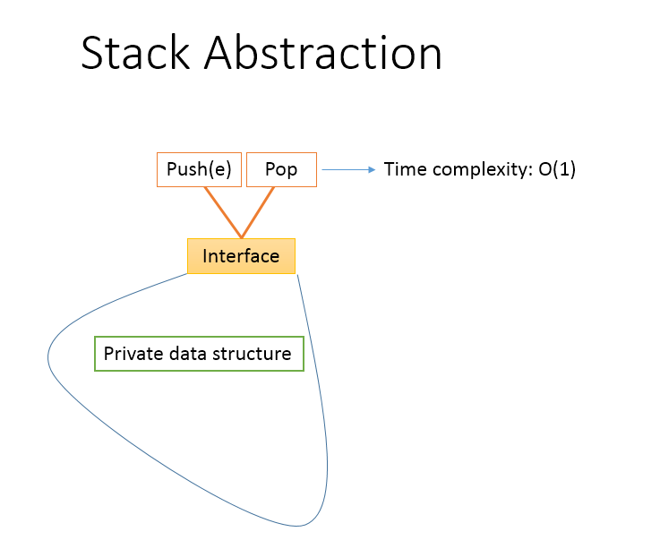

# Stack
In this section, we'll be implementing a stack using object oriented design principles. You're encouraged to create a class and code to follow along. 

## Tests
To make our design and implementation follow a test-driven design and development approach, let's begin with thinking about how we will create an instance of the Stack class and call methods on it.

<b>Exercise</b>:Take some time to write the code for doing the following:
1. Create an instance of the `Stack` class
1. Check whether the stack is empty
1. Check whether the stack is full
1. Push the integer value 10 to the stack
1. Check whether the stack is empty
1. Push the integer value 20 to the stack
1. Check whether the stack is empty
1. Push the integer value 30 to the stack
1. Check whether the stack is empty
1. Pop an item from the stack and verify that it is of value 30
1. Pop an item from the stack and verify that it is of value 20
1. Pop an item from the stack and verify that it is of value 10
1. Check whether the stack is empty
    <details>
        <summary> Click here to see a version for the above
        </summary>
            my_stack = Stack.new()
            puts "Stack should be empty. Is the stack empty? #{my_stack.is_empty}"
            puts "Stack should not be full. Is the stack full? #{my_stack.is_full}"

            puts "push 10"
            my_stack.push(10)
            puts "Stack should not be empty. Is the stack empty? #{my_stack.is_empty}"

            puts "push 20"
            my_stack.push(20)
            puts "Stack should not be empty. Is the stack empty? #{my_stack.is_empty}"

            puts "push 30"
            my_stack.push(30)
            puts "Stack should not be empty. Is the stack empty? #{my_stack.is_empty}"

            puts "pop should return 30. popped value: #{my_stack.pop()}"
            puts "Stack shoul not be empty. Is the stack empty? #{my_stack.is_empty}"

            puts "pop should return 20. popped value: #{my_stack.pop()}"
            puts "Stack shoul not be empty. Is the stack empty? #{my_stack.is_empty}"

            puts "pop should return 10. popped value: #{my_stack.pop()}"
            puts "Stack shoul not be empty. Is the stack empty? #{my_stack.is_empty}"
    </details>

As we saw earlier in this lesson, the consumer of the Stack care that _push_ and _pop_ methods are available in the Stack. Typically, the designer and developer of the Stack will try to abstract away the implementation details. The process of abstraction, allows the  programmer to hide implementation details, in order to reduce complexity and increase maintainability.




Let's consider the _private data structure_ in the diagram above. Knowing the requirements and use case scenarios, what data structure may we consider to keep a record of all the items in our stack? Since the stack is a linear data structure, we could consider saving the information in one of the linear data structures that we are already familiar with. An _array_ or a _linked list_ would serve our purpose. We would then need to ensure that the constraints and the requirements for the stack are met in how we devise our algorithms.

## Stack with internal array
Let's consider implementing a stack using an array data structure. Because we're using a static data structure, we'll need to define the size of the array. So, let's constrain our stack to 10 items. The size of the internal array will be the _limit_ to which the stack may grow, and hence the size of the internal array will also be 10. Initially, the stack will be empty and the size of the used stack will be 0.

<b>Exercise</b>: Create a class called `Stack` and define the `initialize` method. What data member variables would you need to implement a stack usign an array data structure?
<details>
    <summary> [Solution to the exercise above] With that, our stack class would look like the one below:
    </summary>
        class Stack
            def initialize()
                @size = 0 # initial size of the stack
                @limit = 10 # limit to which the stack may grow
                @internal_array = Array.new(@limit) # internal private data structure: array
            end
        end
<details>

If designed well, we'll leverage _encapsulation_ to abstract away implementation details. In the code snippet above, you'll notive that `@size`, `@limit` and `@internal_array` are all private data member variables with no `attr_reader` or `attr_writer` to allow access to them from outside the class.

Next, we need to determine how to add the main two methods to make this class into a true definition of a stack. For that, we need to add the <b>push</b> and <b>pop</b> methods.

<b>Exercise</b>: Take some time to implement your own `push` and `pop` methods inside the class `Stack`. Test your own code. Then continue reading and compare your logic and solution.

Any time an item is pushed into the Stack, we need to first check and ensure that there is room to add one more item in the internal array. If the array is full then our stack is at limit and we won't be able to add any more items. We can say that the stack is full when the the size of the stack is equal to the limit of the stack i.e. `@size` is equal to `@limit`.

If there is room in the array, then we add it to the next available index. At the beginning, when the stack is empty,the next available index would be `0`. Once the first item is added (at index 0 in the internal array), we will need to update the stack size to have increased by one. Looking at the code above, you will notice that the `@size` could be used for both purposes: to share the size of the stack as well as to share at what index the next item should be added in the internal array. 

With that, here's what our push method may look like:
```ruby
    def push(value)
        return nil if @size == @limit # stack is full

        @internal_array[@size] = value # add the new item to stack at index @size
        @size += 1 # update current stack size
        return
    end
```

Now, let's consider the _pop_ method. We can't remove an item from the stack if the stack is empty. We know that the stack is empty if `@size` is `0`. So, on a request to pop the next item from the stack, we first check if the stack is empty. If it is, nothing gets popped out.

Otherwise, inside the `pop` method, we do two things:
1. Return the value of the last item pushed into the stack
1. Reduce the size of the stack by one

The last item pushed, is at index `@size - 1`. So, we could consider first reducing the stack size by one i.e. `@size -= 1`, and then return the value at index `@size`.

Putting it all together, this is what our pop method may look like:
```ruby
    def pop()
        return nil if @size == 0 # stack is empty

        @size -= 1
        return @internal_array[@size]
    end
```
<b>Exercise</b>: Reduce the limit of the stack to be 2 and try using the stack again. Does the stack act as you expect when the a push is called on a full stack?

<b>Aside<b>: _What should be done in the case the stack is empty when a <b>pop</b> is called or when the stack is full when a <b>push</b> called?_ At minimum, we know that in such cases the call will not complete. So the push or pop operation will/should not succeed. In addition, based on conventions used on the team and the contract established with the consumer code of the stack, the design may require (i) throwing an exception with appropriate error code and message, (ii) returning a value (e.g. return `false` from the push operation if adding the item fails) or (iii) printing an error message in the terminal or log file. You're encouraged to enhance your code based on any of these conventions for practice.

<b>Exercises</b>: Complete the rest of the class by adding the following methods:
1. `is_empty`: returns `true` if the stack is empty. returns `false` otherwise.
1. `is_full`: returns `true` if the stack is at capacity. returns `false` otherwise.
1. `top`: returns the value of the next item that will get popped from the stack. Does not alter the stack.

## Stack with internal linked list
One of the downsides of using an array data structure to implement a stack is that the size of the stack is limited to the size of the internal array. If we were creating a stack which would often be used in scenarios requiring a flexibility in the sizing/resizing, we may be better off considering using a linked list instead. Linked list is a linear data structure, just like an array. However, since linked list is dynamic data structure, it gives us the flexibility we need to resize our stack without knowing an upper bound. This benefit comes at a cost since each node in a linked list needs to save reference to the next node and this uses additional memory.

<b>Exercise</b>: Create a class `Stack` in a new file. Considering that we wanted to implement it using a linked list instead of an array, define the `initialize` method.
    <details>
        <summary>  [Solution to the exercise above] Using a linked list, our stack class would look like the one below:
        </summary>
            class Stack
                def initialize()
                    @internal_list = LinkedList.new()
                end
            end
    </details>

<b>Thought exercise</b>: As we start adding items to the stack, where in the linked list should we make the changes to add the new node?
    <details> 
        <summary> Understanding one reasoned explanation below:
        </summary>
            On every push, items should get added to the linked list. On every pop, items should get deleted from the same end of the linked list. In order to do both these with O(1) time complexity, it would aid us to add and delete items at the head of the linked list.
    </details>

<b>Thought exercise</b>: Would there be any benefit to using a singly linked list versus a doubly linked list to implement a stack?
    <details>
        <summary> Understanding one reasoned explanation below:
        </summary>
            Since all the additions and deletions happen at one end, we could simply update the head of the linked list on every push or pop operation on the stack. With that in mind, we don't get any benefit from using a doubly linked list. The doubly linked list does use more memory per node due to the additional previous reference.
    </details>

<b>Exercise</b>: Design and implement the `push` and `pop` methods for the stack class using a linked list as its internal data member.
    <details>
        <summary> Click here to see one solution to the exercise.
        </summary>
            def push(value)
                @internal_list.add_to_head(value)
            end

            def pop()
                temp = @internal_list.delete_head()

                if !temp
                    # linked list is empty
                    puts "stack is empty"
                end
                return temp # return the data at the head of the linked list
            end
    </details>

<b>Exercise</b>: Think about any other methods that would be useful to add to the Stack class and go ahead and add those.
