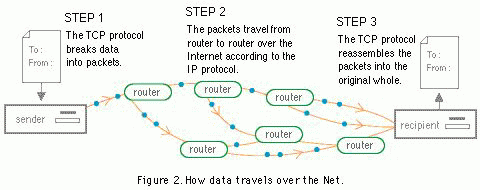

# 🌐 Intro to the web 🌐

## 📚 Learning Goals 📚
- Differentiate between a static and dynamic website
- Differentiate between the front-end and the back-end of a web application
- Understand relationship between clients and servers
- Be aware of web standards & browser compatibility

## Static vs Dynamic websites

Most modern sites are dynamic. Every time you sign-in to a site and are given custom content based on your preferences (like who you follow), you are interacting with a dynamic site. These sites have logic that is involved in serving content, thus requiring the use of programming languages like ruby, python or PHP.
Common Examples: Facebook, Gmail and Medium

A static site presents the same content to every visitor. Everybody that visits the site will be given the same content. The content will rarely change, and if it does, it is typically by only one or few people manually. These sites will only use HTML, CSS and possibly basic JavaScript.
 Common Examples: restaurants, small business and individual's portfolio sites.

What makes these sites static or dynamic?
- [Space Jam](http://www.warnerbros.com/archive/spacejam/movie/jam.htm)
- [Twitter](http://www.twitter.com)

## Front-end vs Back-end

Web applications are dynamic websites that can be broken down into two parts, the front-end and the back-end.

Front-end refers to everything that you actually see on the website, in your browser (and is often called "client-side"). Front-end languages include HTML, CSS and JavaScript.

Back-end refers to the brains, or logic, of a web application. This code remains "server-side" and often interacts with a database. The back-end utilizes programming languages such as ruby, python, PHP, java or JavaScript.

**Fun-Fact:** You may hear the phrase 'full-stack developer' thrown around a lot. A full-stack developer is familiar with and prefers to work on both the front-end and back-end of a web application.

## How the Internet Works

In order for us to access a website,  it's files need to be stored on a computer that is constantly online, otherwise known as a [web server](https://www.cloudyn.com/blog/10-facts-didnt-know-server-farms/).

 A web server uses a protocol called HTTP to take requests from 'clients'. For example, when you type in 'google.com', your browser (the client) will make a request to google's servers. Google's servers will find the requested files and send them back to the browser.

 
 
 - [Analogy between postal mail and TCP/IP](http://bpastudio.csudh.edu/fac/lpress/471/hout/netech/postofficelayers.htm)
 - [Warriors of the Net Video](https://www.youtube.com/watch?v=PBWhzz_Gn10)

## Browser Compatibility

The internet has changed a lot since Sir Tim Berners Lee made the first [web page](http://info.cern.ch/) in 1991. In turn, HTML and CSS have evolved from when they were first used in the 90's. As these front-end languages evolve, browsers need to evolve with them.

The current versions of browsers we are using right now  understand HTML5 and CSS3, which utilize newest web development standards we will be learning.

Be aware that some older browsers do not understand the newest versions of HTML or CSS. One day you many need to develop a site that needs to be accessed by a large demographic, including users with computers from 2001 (or older). Your site may break, or look a lot different on those computer's browsers.

There are also many different browsers (Safari, Internet Explorer, Chrome, Firefox etc). A browser's job is to translate the code that will be displayed. Each browser does this a little bit differently. To ensure a site is widely accessible, developers use browser [compatibility tools](http://www.catswhocode.com/blog/15-techniques-and-tools-for-cross-browser-css-coding).

As we begin learning about HTML and CSS, we are not going to be concerned about our sites' browser compatibility. Instead we are only going to focus on developing with the most recent version of [Chrome](https://www.google.com/chrome/).  

## Vocab ✅
  - Web application
  - Static
  - Dynamic
  - Front-end
  - Back-end
  - Client
  - Server

## 🔑 Key Takeaway
This week we will be focusing on creating static sites with front-end languages, HTML and CSS. In order to view the sites we create on the internet, we have to store them on a web server.

### Additional Resources

[MDN What is a Web Server](https://developer.mozilla.org/en-US/docs/Learn/Common_questions/What_is_a_web_server) (Highly Recommended)
