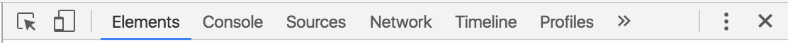
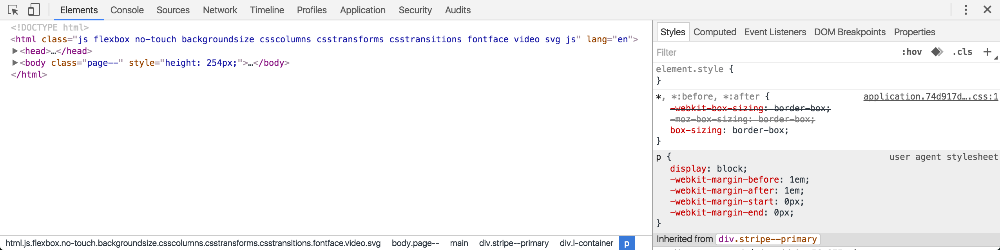

# Developer Tools & Default Styles

## Learning Goals 📚
- Use developer tools to identify default styles of elements
- Use developer tools to identify inherited styles of elements

## What are Developer Tools?

The Chrome Developer Tools (DevTools for short), are a set of web authoring and debugging tools built into Google Chrome. The DevTools provide web developers deep access into the internals of the browser and their web application.

Other Browsers, such as Firefox and Safari, have their own debugging developer tools. They are worth becoming familiar with as you begin to be aware of cross-browser compatibility. Because we are only developing with Chrome this week, we are going to focus specifically on Chrome's Developer Tools.

## Dive into Developer Tools!
To open Devtools,
- either right click on a page and click on 'inspect' from the menu
- Use Ctrl+Shift+I (or Cmd+Opt+I on Mac) to open the DevTools.

To start, click on the *Elements* tab. You should get something that looks like this:

It should show you some html code of the page you are on in one panel and css in the other panel. This HTML code is reflecting your site's DOM (Document Object Model).

### The DOM
The Document Object Model (DOM) is a cross-platform and language-independent application programming interface that treats an HTML document as a tree structure wherein each node is an object representing a part of the document.

## Look at Element's Default Styles
In the html code panel, click on an element(a node of our dom tree). The CSS panel should change to reflect the styles that are affecting that specific element.

The are various sources of CSS that are affecting that element.

## Vocab ✅
- DOM (Document Object Model)

## 🔑 Key Takeaway
Using Chrome's Devtools should be a primary front-end debugging tool.

### Additional Resources
[DevTools Documentation](https://developers.google.com/web/tools/chrome-devtools/iterate/inspect-styles/?utm_source=dcc&utm_medium=redirect&utm_campaign=2016q3)
