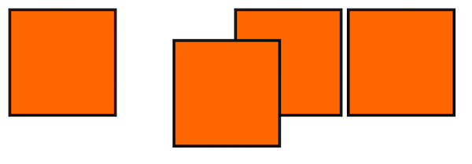

# Layout: Positioning

## Learning Goals 📚
- Understand the purpose of the __position__ property
- Use `relative`, `absolute` and `fixed` positioned elements to lay out a website

## Positioning
The __position__ property is used to modify where an element appears on the screen. Like __float__, it can affect how other elements flow around it. However, __position__ provides a more fine-grained control over element placement.

There are 4 possible values for __position__: `static`, `relative`, `absolute` and `fixed`

### Static Positioning
`static` is the default position, applied to all the elements we've worked with so far. A statically positioned element is included normally in the flow of the website.

### Relative Positioning
An element with `relative` positioning is rendered at a point relative to where it would be placed statically. This means that space is made in the flow as if the element had `static` positioning.

```HTML
<!-- index.html -->
<!DOCTYPE html>
<html>
  <head>
    <meta charset="utf-8">
    <title>Orange Boxes</title>
    <link href="styles.css" rel="stylesheet">
  </head>
  <body>
    
    
    
    
  </body>
</html>
```

```css
/* styles.css */
#relative-position {
  position: relative;
  top: 30px;
  left: 50px;
}
img {
  border-style: solid;
  width: 100px;
}
```



(This example stolen more-or-less wholesale from the [MDN guide on position](https://developer.mozilla.org/en-US/docs/Web/CSS/position#Relative_positioning))

### Absolute Positioning
When an element has `absolute` positioning, it is rendered relative to the closest ancestor with a non-static position. If all its parents are static, it will be rendered relative to the whole page. Unlike with `relative` positioning, *no space is made in the flow* for the element.

As an example, lets put some text on top of an image.

```html
<!-- index.html -->
<!DOCTYPE html>
<html>
  <head>
    <meta charset="utf-8">
    <title>Memes 101</title>
    <link href="styles.css" rel="stylesheet">
  </head>
  <body>
    <div class="image-container">
      
      <p class="top-text">IT'S TIME FOR YOUR</p>
      <p class="bottom-text">PURRRRFORMANCE REVIEW</p>
    </div>
  </body>
</html>
```

```css
/* styles.css */
div.image-container {
  display: inline-block;
  position: relative;
}
p.top-text {
  position: absolute;
  top: 0px;
}
p.bottom-text {
  position: absolute;
  bottom: 0px;
}

p {
  /* Line it up correctly within the div */
  padding: 20px 10px 20px 10px;
  width: 100%;
  text-align: center;
  margin: 0 auto;
  box-sizing: border-box;

  /* Make it look like meme text */
  color: white;
  font-family: impact, sans-serif;
  font-size: 40px;
  text-shadow: 2px 2px black,
               2px -2px black,
               -2px 2px black,
               -2px -2px black;
}
```


### Fixed Positioning
When an element has `fixed` positioning, it is always rendered at the same place on the screen. Like an `absolute` element, no space will be made for a `fixed` element in the flow of a website. However, while an `absolute` element still moves with the rest of the page, a `fixed` element does not.

Common uses of fixed elements include navigation bars that stay at the top of the page and banners or advertisements that scroll with the user.

To demonstrate, we'll add a fixed navigation bar to our Bob Ross site from the previous lecture. These instructions should work with either the version we've modified or a fresh copy.

First, the CSS for the header. Note that we set the width to 100% (of the page). Since a fixed element has no containing element, its size will default to that of its content.

```css
header {
  position: fixed;
  top: 0px;
  width: 100%;
}
```

That seems to work, but something is wrong - the header is being drawn over the top of our website! This means some of our content isn't visible. To fix this, add a properly sized top margin to the next section (`main` in this example).

```css
main {
  margin: 160px 0 0 0;
}
```

It's worth noting that interesting things can happen if you render fixed elements on top of one another - see [MDN's guide on the stacking context](https://developer.mozilla.org/en-US/docs/Web/CSS/CSS_Positioning/Understanding_z_index/The_stacking_context).

### Comparison of Different `position` Values
| `position` | Reserves Space in Containing Element's Flow | Coordinates Based on |
|:-----------|:--------------------------------------------|:---------------------|
| `relative` | Yes, in original spot                       | Original spot in the flow |
| `absolute` | No                                          | Closest positioned (non-static) containing element, defaulting to the whole page |
| `fixed`    | No                                          | The screen |


## Vocab ✅
- `position`
- `static`
- `relative`
- `absolute`
- `fixed`

## Key Takeaway
Use the __position__ property to place elements outside the normal flow of the page.

### Additional Resources
- [MDN on position](https://developer.mozilla.org/en-US/docs/Web/CSS/position)
