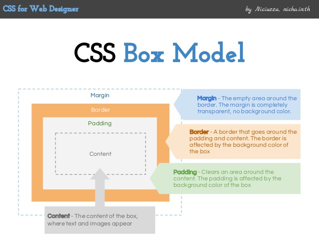

# Box Model


## Learning Goals 📚
- Identify the key pieces of the box model:
  - margin
  - border
  - padding
  - content
- Understand the difference between block & inline elements
- Understand the different ways to specify measurements

## What is the Box Model

**Every element on a page is a rectangular box.**

In a document, each element is represented as a rectangular box. Understanding the structure of an elements box is essential in setting it's size and the position.

In CSS, each of these rectangular boxes are described using the standard box model. This model describes the content of the space taken by an element. Each box has four edges: the margin edge, border edge, padding edge, and content edge.


[Image source](http://www.slideshare.net/niciuzza/css-box-model-25142045)


With a site you have already created, add the following

```css
* {
  border: black 1px solid;
}
```


## Altering an Element's Box Model

There are several properties that determine the size of that box. The core of the box is defined by the width and height of an element, which may be determined by the display property, by the contents of the element, or by specified width and height properties.

Padding and then border expand the dimensions of the box outward from the element’s width and height. Lastly, any margin we have specified will follow the border.

### Block Elements vs Inline-Block Elements
Each HTML element has a default display value of block or inline.

#### Block Elements
Block-level elements start on a new line and take up the full width available (stretch from left and right).

Some examples of block-level elements include:
- `<h1>` through `<h6>`
- `<p>`
- `<ul>`
- `<div>`

#### Inline Elements
Inline elements _do not_ start on a new line and only take up as much width as necessary.

Some examples on inline elements include:
- ``
- `<a>`

Let's see it in action! The way we can put together these elements will help us see how they work with one another.

Try:
- Two small thumbnail images, one after the other
- Two small thumbnail images, both inside `div` tags

Whats the difference?

We will continue to dive into these types of display properties in a future discussion.

## Measurements

You site may be viewed on a wide range of devices, from mobile phones to 50" smart TV's. Creating appropriate measurements are one way that we can ensure that our web sites will be viewed in a visually pleasing way on many different devices.

### Absolute Measurements
One way to specify measurements is by using the screen pixels. This is done by adding `px` to the end of the value.

### Relative Measurements

#### Percentages
Percentages can be used in measurements that will be a percentage relative to another value. This is done by adding `%` to the end of the value.

#### `em` or `rem`
This is a relative measurement based on the heigh of a font. One `em` unit is equivalent to the size of a given font.

### It all Adds Up!

According to the box model, the total width of an element can be calculated using the following formula:

```
margin-right + border-right + padding-right + width + padding-left + border-left + margin-left
```

And this formula for the height:

```
margin-top + border-top + padding-top + height + padding-bottom + border-bottom + margin-bottom
```

This is important to consider when setting an element's width. Even if you have two elements with a width of 50%, they will not show up side by side if there is any padding, margin or border adding to the widths.

**Note** A lot of front-end developers prefer to set the width or height to **include** the padding and border along with the content, but not the margin. [This article](http://www.paulirish.com/2012/box-sizing-border-box-ftw/), written by a google chrome developer, demonstrates how to do so!


## Use DevTools to View an Element's Box-Model


## Vocab ✅
- margin
- border
- padding

## 🔑 Key Takeaway
Understanding an elements box-model is essential to positioning elements in more complex layouts.

### Additional Resources
- [DevTools Documentation](https://developers.google.com/web/tools/chrome-devtools/iterate/inspect-styles/?utm_source=dcc&utm_medium=redirect&utm_campaign=2016q3)
- [Opening the Box Model Lesson](http://learn.shayhowe.com/html-css/opening-the-box-model/)
