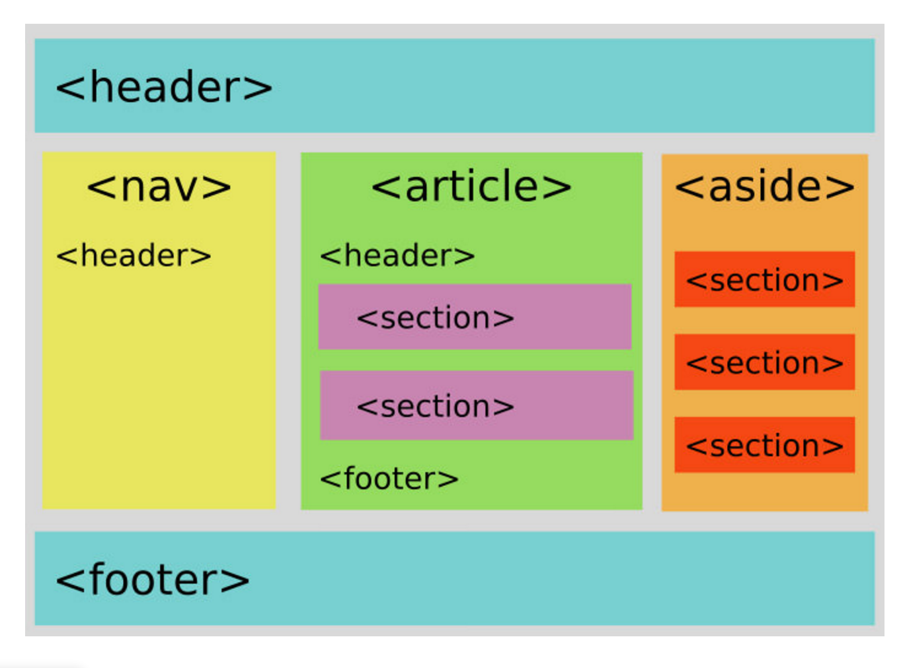
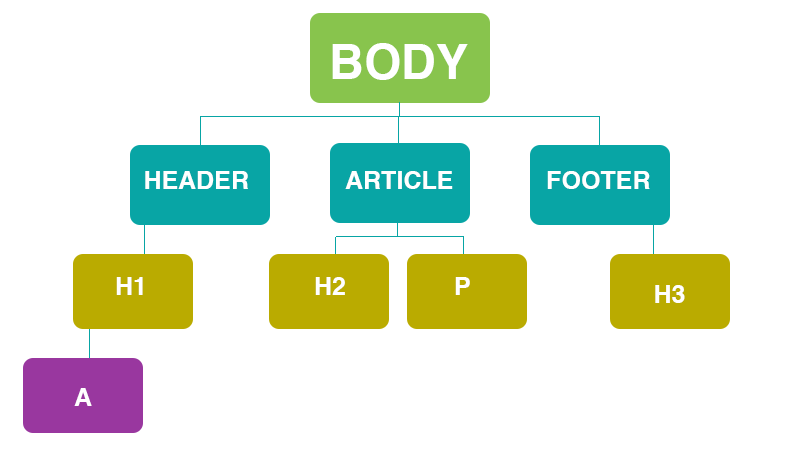

# Sectioning Elements


## 📚 Learning Goals 📚
- Can organize content using semantic sectioning tags
- Know why we organize content with semantic sectioning tags

## What are Sectioning Elements
HTML has sectioning elements that allow you to organize your HTML document into logical topical sections.

They bring a big advantage for people who need the structure to help them understand the page, for instance people needing the help of some assistive technology, like a [screen reader](http://webaim.org/techniques/screenreader/).


Below are tags that group elements together.

```html
  <body></body>

  <div></div>

  <section></section>

  <article></article>

  <nav></nav>

  <aside></aside>

  <header></header>

  <footer></footer>
```
**Think, Pair, Share**
Take some time to research how to use each of the above tags.
Then discuss with your chair pair.
And then high five each other.

## Organize content with Sectioning Elements
Sectioning elements wrap around the elements we have already been working with. Organizing elements into sectioning elements will also become useful as we start to style the layout of our webpages.

Here are a couple of diagrams of how these sectioning elements might be laid out on a webpage.   




## Element Relationships
When elements become nested inside of each other they start to form relationships.
- An element that is inside of another is a child-element
- The element wrapping a child is it's parent
- Elements on the same level as each other are sibling elements

A visual diagram of elements relationships to each other:


The relationship tree above is modeled from the following code:
```html
<body>
 <header>
    <h1><a href="index.html">Meowspace</a></h1>
 </header>
 <article>
    <h2>You're Meowsome</h2>
    <p>
      Soft kitty warm kitty little ball of furr but hide when guests come over, for gnaw the corn cob purr for no reason. Lies down knock over christmas tree but kitty ipsum dolor sit amet, shed everywhere shed everywhere stretching attack your ankles chase the red dot, hairball run catnip eat the grass sniff or massacre a bird in the living room and then look like the cutest and most innocent animal on the planet, and hide head under blanket so no one can see. Kitty power!
   </p>
 </article>
 <footer>
    <h3>&copy; 2016</h3>
 </footer>
</body>
```


### Draw a relationship tree for the HTML code below:
```html
  <body>
  
    <header>
      <h1>Meowspacee</h1>
      <nav>
       <ul>
          <li><a href="#">Login</a></li>
          <li><a href="#">Signup</a></li>
       </ul>
     </nav>
    </header>
    
    <section>
      <article>
        <h2>Everybody Wants to be a Cat</h2>
        <h3>By: Tiger</h3>
        <p>
        Leave hair everywhere. Wake up wander around the house making large amounts of noise jump on top of your human's bed and fall asleep again poop in the plant pot all of a sudden cat goes crazy, so pee in the shoe. Cat is love, cat is life eat owner's food human is washing you why halp oh the horror flee scratch hiss bite or paw at your fat belly.
        </p>
        <p>
        This human feeds me, i should be a god love to play with owner's hair tie. Kitty power! see owner, run in terror all of a sudden cat goes crazy. Attack feet russian blue so intently sniff hand. Leave hair everywhere. Wake up wander around the house making large amounts of noise jump on top of your human's bed and fall asleep again poop in the plant pot. Destroy couch as revenge.
        </p>
     </article>
     <article>
        <h2>Everybody Wants to be a Cat</h2>
        <h3>By: Felix</h3>
        <p>
        Kitty power! see owner, run in terror all of a sudden cat goes crazy. Attack feet russian blue so intently sniff hand.
        </p>
        <p>
        Cat is love, cat is life eat owner's food human is washing you why halp oh the horror flee scratch hiss bite or paw at your fat belly.
        </p>
     </article>
   </section>
   
   <footer>
      <ul>
        <li><a href="#">Contact</a></li>
        <li><a href="#">Careers</a></li>
     </ul>
   </footer>
   
 </body>
```

## Vocab ✅
  - Semantic
  - Sectioning
  - Parent
  - Child
  - Sibling

### Additional Resources

- [Treehouse Blog Post](http://blog.teamtreehouse.com/use-html5-sectioning-elements) (freely available)
- [Element Relationships](http://www.littlewebhut.com/css/info_element_relationships/)
- [A Look Into Proper HTML5 Semantics](http://www.hongkiat.com/blog/html-5-semantics/)
