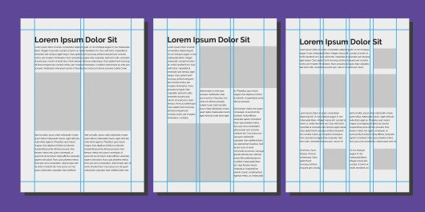
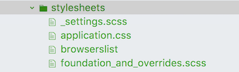
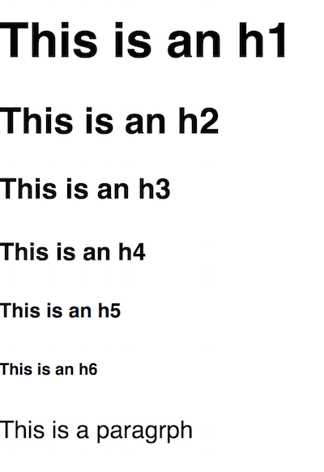
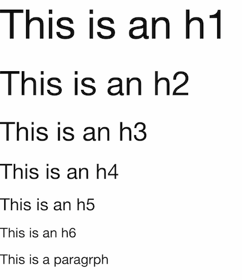
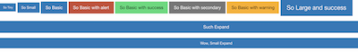
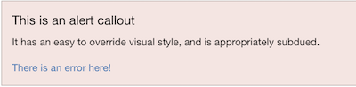

# CSS Framework: Zurb Foundation

## 📚 Learning Goals 📚
By the end of this lesson you should be able to:
- Explain the use of a CSS framework like Foundation
- Use Foundation to apply standard styles to common HTML elements
- Use Foundation to apply styling and validation to HTML form elements


## What is a Front-end Framework?

Front-end frameworks (or CSS Frameworks) usually consist of a package made up of a structure of files and folders of standardized front-end code (HTML, CSS, JS ).

The usual components are:

- CSS source code to create a **grid**: this allows the developer to position the different elements that make up the site design in a simple and versatile fashion
- Typography **style definitions** for HTML elements
- **Browser compatibility** solutions so there is consistent style across browsers
- Creation of standard **CSS classes** which can be used to style advanced components of the user interface

The most popular frameworks are Bootstrap and Foundation. Here's [an article](https://www.upwork.com/hiring/development/bootstrap-vs-foundation-which-framework-is-right-for-you/) comparing the two Frameworks. We'll be digging into Foundation, but the concepts apply to both frameworks.

Foundation does provide a grid framework so developers can more quickly setup a layout for their site by simply, yet strategically, adding classes to HTML elements!

NOTE: _CSS Frameworks_, like Bootstrap and Foundation are different from _Front-end JavaScript frameworks_ like React, Angular and Ember.

## Mobile First
As browsing on phones has increasingly become popular, so has the philosophy of designing mobile first.  Mobile first is planning the design of your site for a very small screen before anything else.

Doing so will help you concentrate on visual hierarchy and boiling your content down to what is most important.


That means creating separate wireframes for the different ways a user may interact with your site. Ex: A phone vertically, a phone horizontally, a large table in either direction, a laptop, a large-screen  television, I could go on forever!

In an effort to not overwhelm ourselves, we’ll only be concerned on three generic screen sizes: small, medium and large. We refer to the user's visible area of a web page as the **viewport**.

Think of small as a very narrow viewport, like your phone horizontally. Medium when you are split screening your laptop screen with your browser on one half and another application on the other. And large as your browser full-screen on your laptop.

## Grid Layout
A grid system is an invisible foundation of web page layout, which is used to divide the web page multiple grids.



Grids have long been used in design to provide structure and balance for content in a layout. Interested in learning more about grid theory? [Read this](https://designschool.canva.com/blog/grid-design/)


### Foundation uses a 12 column grid.


At Ada we will continue to use CSS Grid & Flexbox for layout, but it's important to know that many sites use CSS framework layouts like the 12 column grid foundation layout.  If you want to learn more about Foundation's XY-Grid you can check [this out](https://foundation.zurb.com/sites/docs/xy-grid.html).  One nice advantage to Foundation's grid system is that it can be easier to make responsive to varying screen sizes.

## Add Foundation to your project

 When choosing to use Foundation in a Rails project you can select to either:
 1.  Manually copy and include all the CSS, JavaScript and SCSS files into your project.
 2. Use a provided [foundation-rails](https://github.com/zurb/foundation-rails) gem.

We will take the expedient of using the Gem, and placing it into our [`.rails-template.rb`](https://github.com/Ada-Developers-Academy/textbook-curriculum/blob/master/09-intermediate-rails/reference/.rails-template.rb) file.  

Open your `rails-template.rb` file and copy the content of [this file](https://github.com/Ada-Developers-Academy/textbook-curriculum/blob/master/09-intermediate-rails/reference/.rails-template.rb) and use it to **replace** all the content of the template file.

The updated template adds the following content:

```ruby
...

gem 'foundation-rails'

...

# Run rails generate foundation:install
  generate "foundation:install", "--force"

...

# Add Foundation Javascript with Motion-ui this must be run after
# rails generate foundation:install, because that command
# adds foundation_and_overrides.scss
inject_into_file 'app/assets/stylesheets/foundation_and_overrides.scss', after: '// @include motion-ui-animations;' do
<<-'RUBY'

@import 'motion-ui/motion-ui';
@include motion-ui-transitions;
@include motion-ui-animations;

RUBY
end
```

These foundation template changes will cause Rails to:
1. Add the `foundation-rails` gem to the gemfile.  
2. Run a generator command to work with the gem to generate a bunch of CSS and JavaScript files.  
3. Lastly add some code to `foundation_and_overrides.scss` in the stylesheets folder to include some libraries for animated menus and transitions.

Now when you create a new Rails project you will see the following stylesheets.



You can change foundation settings by editing the `_settings.scss` file and turn off and on Foundation features by changing the `foundation_and_overrides.scss` file.  You can also override foundation styles, by defining css rules of your own in the `applicaiton.css` file.  

## Using Foundation Typography

You should first notice that foundation changes the default styling of all the header and paragraph text styling

### Before Foundation:


### After Foundation:


As you can see above Foundation provides an set of default fonts and styles for the basic elements.  It also provides styling for lists, abbreviations, quotations and accessibility.  You can read about Foundation's typography [here](https://foundation.zurb.com/sites/docs/typography-base.html).

## Built-in Foundation Classes

Foundation also provides a number pre-created stylings for class names you can add to common HTML elements and take advantage of ready-made stylings.  

For example, Foundation also provides a variety of ways to create buttons on your site either using anchor or button elements.  You can experiment with foundation buttons [here](https://codepen.io/adadev/pen/WzYvyo?editors=1000).

```html
<a class="button tiny" href="#">So Tiny</a>
<a class="button small" href="#">So Small</a>
<button class="button" href="#">So Basic</button>
<a class="button alert" href="#">So Basic with alert</a>
<a class="button success" href="#">So Basic with success</a>
<button class="button secondary" href="#">So Basic with secondary</button>
<a class="button warning" href="#">So Basic with warning</a>
<a class="button large" href="#">So Large and success</a>
<a class="button expanded" href="#">Such Expand</a>
<a class="button small expanded" href="#">Wow, Small Expand</a>
```

**Experiment:** Try creating a large warning `button` element in Codepen.  Then try adding CSS to make `secondary` buttons dark green.



Another set of pre-defined classes are used to create alert panels calling a user's attention to notifications or error messages.   This is commonly used for flash notices or validation errors on forms.

```html
<section class="alert callout">
  <h5>This is an alert callout</h5>
  <p>It has an easy to override visual style, and is appropriately subdued.</p>
  <a href="#">There is an error here!</a>
</section>
```



You can experiment with callouts [here](https://codepen.io/adadev/pen/dmQodr?editors=1000).

**Experiment**:  Change the color of the callout background.

## Form Validations

Foundation also has a library named [**Abide**](https://foundation.zurb.com/sites/docs/abide.html) which can be used to go beyond the built-in HTML5 form validation available to us.  To use Abide over HTML5 validations, add `novalidate` and `data-abide` attributes to the form element.  

Elements can have a number of validations which ensure input matches common patterns like `alpha` (only letters), `alpha_numeric`, `color`, `cvv` (the three numbers on the back of a credit card), `date`, `datetime`, `day_month_year`, `domain`, `email`, `integer`, `month_day_year`, `number`, `time`, and `url`.  A pattern can be specified by adding a pattern attribute-value to the form field.  For example `<input type="text" pattern="email" >`.  Then when the user attempts to submit the form, Abide will check to ensure the field matches the given pattern.  

Developers can also add an attribute `required` to any form field which is required to have a value.  

Abide can also use a `form-error` field to display an error message to the user when a field fails to validate.  To use a `form-error`, group labels, inputs and a span or other text field with the class `form-error` together in a container.  The text with the class `form-error` will display in red if and only if the form is submitted with invalid data in the accompanying field.  You can experiment with a code example [here](https://codepen.io/adadev/pen/vRQKoZ?editors=1100).

```html
<form data-abide novalidate>
  <p>This example shows input validation using Abide.</p>
  <div>
      <input type="text" required>
       <span class="form-error">Please enter amount.</span>
  </div>
  <div>
      <input type="text" placeholder="www.somesite.com" required pattern="url">
      <span class="form-error">Please enter a website URL.</span>  
  </div>    

  <button type="submit" class="button" value="Submit">Submit to see Errors</button>
</form>
```

**Question:** If I have validations in my HTML with Foundation, do I need model validations on the back-end?

## Best Practices
- NEVER change any CSS in Foundation's documents
  - It's _okay_ to override them, if necessary, in your css files or the `_settings.scss` file.
- Comment your HTML & CSS by sections to stay organized
- Keep Validating your HTML Code!

## Vocab ✅
- Mobile First
- Grid Layout
- Viewport
- Validation


## 🔑 Key Takeaway
Using a front-end framework like Foundation or Bootstrap will allow you to more rapidly develop with styles and typography created in advance and add common validations to your site front-end.  

### Additional Resources
- [Foundation XY Grid Video](https://www.youtube.com/watch?v=Xl5DjEzKn1g&t=3s)
- [Media Queries Documentation](https://developer.mozilla.org/en-US/docs/Web/CSS/Media_Queries/Using_media_queries
)
- [Foundation Form Validations](https://www.youtube.com/watch?v=4bN0qr5pxjs)
