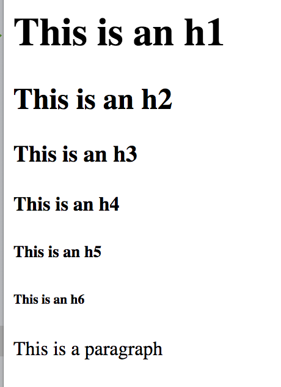

  # CSS Framework: Bootstrap

## 📚 Learning Goals 📚
By the end of this lesson you should be able to:
- Explain the use of a CSS framework like Bootstrap
- Use Bootstrap to apply standard styles to common HTML elements

## What is a Front-end Framework?

Front-end frameworks (or CSS Frameworks) usually consist of a package made up of a structure of files and folders of standardized front-end code (HTML, CSS, JS ).

The usual components are:

- CSS source code to create a **grid**: this allows the developer to position the different elements that make up the site design in a simple and versatile fashion
- Typography **style definitions** for HTML elements
- **Browser compatibility** solutions so there is consistent style across browsers
- Creation of standard **CSS classes** which can be used to style advanced components of the user interface

The most popular frameworks are:
-   [Bootstrap](https://getbootstrap.com/)
-   [Foundation](https://foundation.zurb.com/sites/docs/)
-   [Material Design](https://material.io/design/)
-   [uikit](https://getuikit.com/)
-   [Semantic UI](https://semantic-ui.com/)

May frameworks like Bootstrap do provide a grid frameworks which can be used on top of or in place of CSS Grid.

NOTE: _CSS Frameworks_, like Bootstrap and Foundation are different from _Front-end JavaScript frameworks_ like React, Angular and Ember.

## Grid Layout
A grid system is an invisible foundation of web page layout, which is used to divide the web page multiple grids.  While CSS Grid has reduced the need for a framework grid system there are advantages to a grid system like Bootstrap or Foundation.  One nice advantage to Bootstrap's grid system is that it [can be easier to make grids responsive to varying screen sizes.](https://getbootstrap.com/docs/4.1/layout/grid/#responsive-classes)

At Ada we will continue to use CSS Grid & Flexbox for layout, but it's important to know that many sites use CSS framework layouts like the 12 column grid layout.  If you want to learn more about Bootstrap's Grid system you can check [this out](http://getbootstrap.com/docs/4.1/layout/grid/).

## Add Bootstrap to your project

 When choosing to use Bootstrap in a Rails project you can select to either:
 1.  Manually copy and include all the CSS, JavaScript and SCSS files into your project.
 2. Use a provided [Bootstrap](https://github.com/twbs/bootstrap-rubygem) gem.

We will take the expedient of using the Gem, and placing it into our [`.rails-template.rb`](https://github.com/Ada-Developers-Academy/textbook-curriculum/blob/master/09-intermediate-rails/reference/.rails-template.rb) file.

In our [`rails-template.rb`](https://github.com/Ada-Developers-Academy/textbook-curriculum/blob/master/09-intermediate-rails/reference/.rails-template.rb) file we added code to automatically install the Bootstrap 4 framework.

These rails template changes will cause Rails to:
1. Add the `bootstrap` gems to the gemfile.
2. Tell Rails to import some JavaScript and CSS files for Bootstrap.

## Using Bootstrap Typography

You should first notice that Bootstrap changes the default styling of all the header and paragraph text styling

### Before Bootstrap:


### After Bootstrap:


As you can see above Bootstrap provides an set of default fonts and styles for the basic elements.  It also provides styling for lists, abbreviations, quotations and accessibility.  You can read about Bootstrap's typography [here](http://getbootstrap.com/docs/4.1/content/typography/).

## Built-in Bootstrap Classes

Bootstrap also provides a number pre-created stylings for class names you can add to common HTML elements and take advantage of ready-made stylings.

For example, Bootstrap also provides a variety of ways to create buttons on your site either using anchor or button elements.  You can experiment with Bootstrap buttons [here](https://codepen.io/adadev/pen/XxpNJQ).

```html
<section>
  <a href="#" class="btn btn-primary">Prmary</a>
  <a href="#" class="btn btn-secondary">Secondary</a>
  <a href="" class="btn btn-success">Success</a>
  <a href="#" class="btn btn-danger">Danger</a>
  <a href="#" class="btn btn-warning">Warning</a>
  <a href="#" class="btn btn-info">Info</a>
  <a href="#" class="btn btn-light">Light</a>
  <a href="#" class="btn btn-dark">Dark</a>
  <a href="#" class="btn btn-link">Link</a>

</section>
<section>
  <a href="#" class="btn btn-primary btn-lg btn-block">Block level button</a>
  <a href="#" class="btn btn-secondary btn-lg btn-block">Block level button</a>
  <a href="#" class="btn-lg btn-primary">Primary-large</a>
  <a href="#" class="btn-sm btn-primary">Primary-small</a>
</section>
```


**Experiment:** Check out [the CodePen](https://codepen.io/adadev/pen/XxpNJQ).  First fork the codepen.  Then try creating a large danger `button` element in Codepen.  Then try adding CSS to make `secondary` buttons dark green.


**Question:  Do I have to use Bootstraps styles for everything?**

No, you can override Bootstrap's styling by adding your own styles for the class.

Add this to the CSS of the Codepen.

```css
.btn-primary {
  background-color: #FF69B4;
  border-color: #FFA1B4;
  margin: 5px;
}
```

This CSS code __overrode__ the bootstrap styling.  Remember that CSS cascades and the last rule encountered of equal specificity take precidence.

### Alerts

Another set of pre-defined classes are used to create alert panels calling a user's attention to notifications or error messages.   This is commonly used for flash notices or validation errors on forms.

```html
<section class="alert alert-danger">
  <h5>This is an alert</h5>
  <p>It has an easy to override visual style, and is appropriately subdued.</p>
  <a href="#">There is an error here!</a>
</section>
```


**Experiment**: Experiment with alerts [here](https://codepen.io/adadev/pen/VEjKqz?editors=1000) and change the color of the alert background.


## Best Practices
- NEVER change any CSS in Bootstrap's documents
  - It's _okay_ to override them, if necessary, in your css files.
- Comment your HTML & CSS by sections to stay organized
- Keep Validating your HTML Code!

## 🔑 Key Takeaway
Using a front-end framework like Bootstrap or Foundation will allow you to more rapidly develop with styles and typography created in advance and add common validations to your site front-end.

### Additional Resources
#### Bootstrap
- [Bootstrap Documentation](https://getbootstrap.com/docs/4.1/getting-started/introduction/)
- [Bootstrap Course on Scrimba](https://scrimba.com/g/gbootstrap4) (~45 minutes)
-  [Bootstrap Grid Examples](https://coreui.io/docs/layout/grid/)
