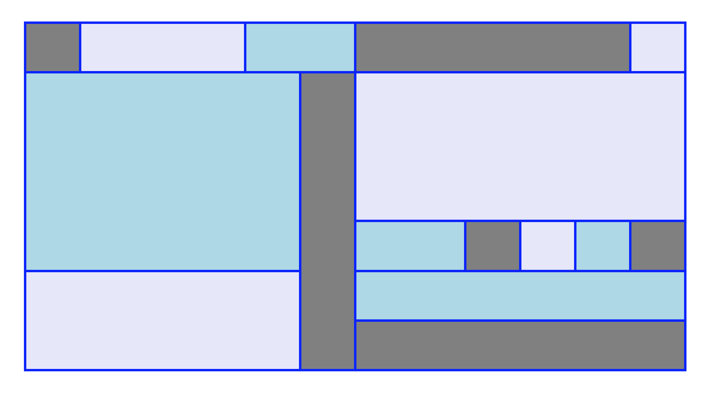
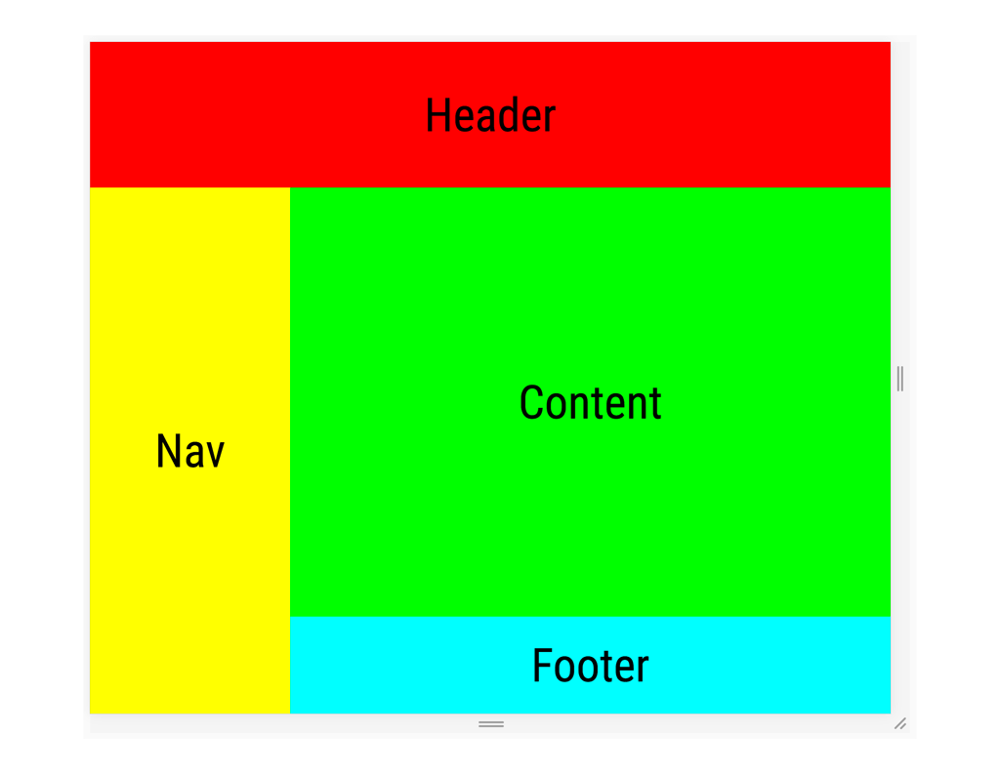

# Intro to Layout with CSS Grid

## Learning Goals

By the end of this lesson, students should be able to...

- Define key terms related to a grid layout
- Use the `display: grid;` CSS property to create a grid on a webpage
- Use the `grid-template` properties to adjust the spacing of a grid
- Specifiy sizes using `fr` fractional units
- Position specific items using `grid-column` and `grid-row`

## History

[Designing on a grid is not a new concept](https://en.wikipedia.org/wiki/Grid_%28graphic_design%29), and in fact grid theory is a well-known practice in many schools of design. However, historically, web designers did not apply these ideas, and CSS did not have available good ways to practice them anyway. It is only until recently that web design has been pushing using a grid for layout.

CSS Grid Layout is a way to determine page layout along a two-dimensional grid (with X and Y axes) with major browser support "out of the box."

CSS Grid has the following advantages:
1. More applicable than teaching a specific CSS library
1. Browser compatibility
1. Promotes responsive design/relative units for layout

Other solutions to layout include:
- Proprietary implementations of grids in CSS
  - Bootstrap
  - Foundation
- Using combinations of other CSS properties
  - [Layouts using Display](archived/layout-display.md)
  - [Layouts using Floats](archived/layout-floats.md)
  - [Layouts using Positioning](archived/layout-positioning.md)

## Rules for Setting Up CSS Grid

  CSS Grid solves the following problem: **How do I define rules for the layout of many elements, specifically across rows and columns?** Therefore, to use CSS Grid, we set up our CSS Grid with these rules:

  1. There is one large container for these elements, and it is called **the grid container**. We designate it as the grid container by giving it the CSS rule `display: grid;`
  1. The "many elements" that we are trying to put in a layout are called **the grid items**. The grid items **must** be and will only be the **direct children** of the grid container
      - these grid items may have children inside of them, but will not be affected by this grid container
  1. We can define the "rules" for the grid system in many ways
      - The grid container may have CSS that determine a "template" for how all the grid items span across rows and columns
      - The grid item may have CSS applied to it that determines how it specifically spans across rows and columns

  Note: The grid items of a specific grid container do not have to be all the same kind of element.

### Counting on CSS Grid

CSS Grid does not begin with index 0, and instead counts starting at 1.


### Practice

Let's look at a slightly abstract example to practice counting columns and rows and thinking in a grid.



Each rectangular block of color represents one grid item. Answer the following questions:

- How many columns are there in the layout? How many are defined on the _grid container_?
  - Are all columns equally sized? In CSS Grid, not every column needs to be the same width
- How many rows are there in the layout? How many are defined on the _grid container_?
  - Are all rows equally sized? In CSS Grid, not every row needs to be the same height
- For three different grid items, answer the following:
  - What column line # does this grid item start at?
  - What column line # does this grid item end at?
  - How many columns does this grid item span?
  - What row line # does this grid item start at?
  - What row line # does this grid item end at?
  - How many rows does this grid item span?

### Observe

Let's look at a more realistic example. Let's say we've received this wireframe for a website to create. As you look at the wireframe, answer the following questions:
- What is the grid container?
- What are the rows?
- What are the columns?
- Are all columns equally sized?
- Are all rows equally sized?
- What is each grid item, and how many rows and columns does each one span?



Let's take a look at one way we'd likely write this HTML, and its accompanying CSS to set it up to use CSS Grid.

```html
<!-- index.html -->
<!-- stuff like the opening html tag, head tag, link to stylesheet, opening body tag -->

<main class="container">
  <header class="header">

  </header>
  <nav class="nav">

  </nav>
  <div class="content">

  </div>
  <footer class="footer">

  </footer>
</main>

<!-- close body tag and html tag -->
```

```css
/* style.css */

.container {
  /* these are just an arbitrary widths and heights to look good on our browser */
  width: 30vw;
  height: 60vh;

  display: grid;
}

.header {
  background-color: #d55e00;
}

.nav {
  background-color: #f0e442;
}

.content {
  background-color: #009e73;
}

.footer {
  background-color: #0072b2;
}
```


We've set up CSS Grid using `display: grid;` on our grid container, but we don't see it working yet.

## Grid Template

We need to start with broad strokes. In above examples, we identified how many columns and rows each grid item spanned, where they started and where they ended. But we need to first define the following in the context of the entire grid container:

- How many columns are there?
- What size is each column?
- How many rows are there?
- What size is each row?

We answer all of those questions with any property beginning with the phrase "grid-template": `grid-template`, `grid-template-columns`, `grid-template-rows`, and/or `grid-template-areas`.

### Defining Grid Template

For the following section we will be using [this example on Codepen.](https://codepen.io/adadev/pen/bvbKQX?editors=1100) Follow along, and comment and uncomment sections as we go through.

#### Grid Template Columns, Grid Template Rows

To define how many columns there are and what size each column is, you use the CSS attribute `grid-template-columns` so that _it applies to your grid container_. For every column, you provide a value for width, separated by **spaces, with no punctuation**.

```css
.container {
  display: grid;
  grid-template-columns: 200px 100px 50%;
}
```

How many columns are there? Why are there two rows?

Let's define rows now. To define how many rows there are and what size each row is, we use `grid-template-rows`.

```css
.container {
  display: grid;
  grid-template-columns: 200px 100px 50%;
  grid-template-rows: 100px 500px;
}
```

How many rows are there? **Experiment:** What happens if you add more grid items **and** remove the rule `min-height` defined at the bottom of the Codepen? What is the height of all following rows?

**Practice:** Take a minute to play around. Add more columns and rows to these properties. Remove some.

#### A shortcut: Grid Template

It is common to need to define both the `grid-template-rows` and `grid-template-columns` at the same time. There is a syntax shortcut for this: instead of the above properties, use `grid-template`. The value for this is what you would put in `grid-template-rows`, a slash, then what you would put in `grid-template-columns`.

```css
.container {
  display: grid;
  grid-template: 100px 500px / 200px 100px 50%;
}
```

This one line is identical to the two properties we saw above.

### The `fr` fractional unit

CSS Grid lets us use one specific unit of measurement that we can't use anywhere else in CSS: the `fr` fractional unit.

Fractional units are relative units: After all other kinds of units are measured, fractional units take the remaining space and calculate their size relative to other fractional units. In other words, they form ratios.

Consider [this Codepen using fractional units](https://codepen.io/adadev/pen/xWKJdz?editors=1100) on different definitions of `grid-template-columns` on different grid containers. Answer the following questions:
- Which of these examples mixes fractional units and other units?
- Which of these creates equally sized columns?
- Which of these creates three columns?


## Grid Item

Now we can manipulate our grid items! For the following examples, we'll be using [this Codepen](https://codepen.io/adadev/pen/yKBqQP?editors=1100).

### Using Start and End

We can define on a grid item which column line number the item starts at using `grid-column-start`:

```css
.container {
  display: grid;
  grid-template: 1fr 1fr / 1fr 1fr;
}

.item {
  grid-column-start: 1;
}
```

Remember that CSS Grid's line numbers do not start at "index zero."

We define on a grid item the column line the item ends at using `grid-column-end`:

```css
.item {
  grid-column-start: 1;
  grid-column-end: 4;
}
```

We define the start line and end line of an item's row using `grid-row-start` and `grid-row-end`.

```css
.item {
  grid-row-start: 3;
  grid-row-end: 5;
}
```

**Practice:** Spend some time uncommenting and altering the `-start` and `-end` properties in our [example Codepen for this section](https://codepen.io/adadev/pen/yKBqQP?editors=1100).

### A shortcut: grid-column and grid-row

Similar to how `grid-template-rows` and `grid-template-columns` have `grid-template` as a shortcut, there's a shortcut for defining start and end on one line! `grid-column` and `grid-row` can take in both the start value and end value in one line, separated by a slash.

```css
.item {
  grid-column: 1 / 4;
  grid-row: 3 / 5;
}
```

### Using `span`

Sometimes you don't know the line number that an item ends at, or you would rather define how many rows or columns that item spans.

Instead of giving an integer for the line number an item ends at, you can give `span num_of_rows_or_columns`.

```css
.item {
  grid-column-start: 1;
  grid-column-end: 4;

  /* is the same as */
  grid-column-start: 1;
  grid-column-end: span 3;

  /* is the same as */
  grid-column: 1 / 4;

  /* is the same as */
  grid-column: 1 / span 3;
}
```

### `auto` in CSS Grid

`auto` means a lot of different things in different contexts. In the context of CSS Grid:

- When used to define `grid-template` sizes, it can mean "automatically fill up as much as possible," but it doesn't play well with `fr` units
- When used to define `start` or `end` columns or rows for a grid item, it can mean "the browser should make the best decision on where it should automatically flow next"

## Observe, Returned

Now that we have all of these tools at our disposal, let us return to our realistic example from above. Remember, we're referencing this wireframe:


**Practice:** recreate this wireframe with the HTML we provided above.

After you've tried this out on your own, let's look at one solution to this:

```css
/* style.css */
.container {
  width: 60vw;
  height: 100vh;

  display: grid;
  /* used arbitrary units of measurement to mimic wireframe */
  grid-template: 15% auto 20% / 1fr 3fr;
}

.header {
  background-color: #d55e00;
  grid-column: auto / span 2;
}

.nav {
  background-color: #f0e442;
  grid-row: auto / span 2;
}

/* ... */
```

The result should look something like this:


And here it is on a [Codepen.](https://codepen.io/adadev/pen/zWOaNB)

## Subjects Not Covered In This Lecture

- Grid Template Areas
- Grid Tracks
- Gutters

CSS Grid is a deep subject with a lot of features! The above features would allow for further customization of your grid, but aren't necessary to make a robust layout.

## About Browser Compatibility

CSS Grid was introduced only in the past few years. Even so, *every modern browser supports CSS Grid*.

Internet Explorer 11 requires specifying the browser prefix `-ms-display: grid;`.

A lot of information and advice on the Internet uses CSS that does not use CSS Grid, even if CSS Grid may be a better solution for that problem.

## Conclusion

To use CSS Grid as a built in solution for making a 2-dimensional layout, you need to define a *grid container* with `display: grid;`. The grid container's `grid-template` property will only affect its direct children, or the *grid items*.

## Resources
- [W3 Schools (source of the grid image)](https://www.w3schools.com/css/css_grid.asp)
- Play around with the implementation of the weird abstract example in the Practice section [on Codepen](https://codepen.io/adadev/pen/oqvdrB?editors=1100)
- [Article source for "Realistic example"](https://developers.google.com/web/updates/2017/01/css-grid)
