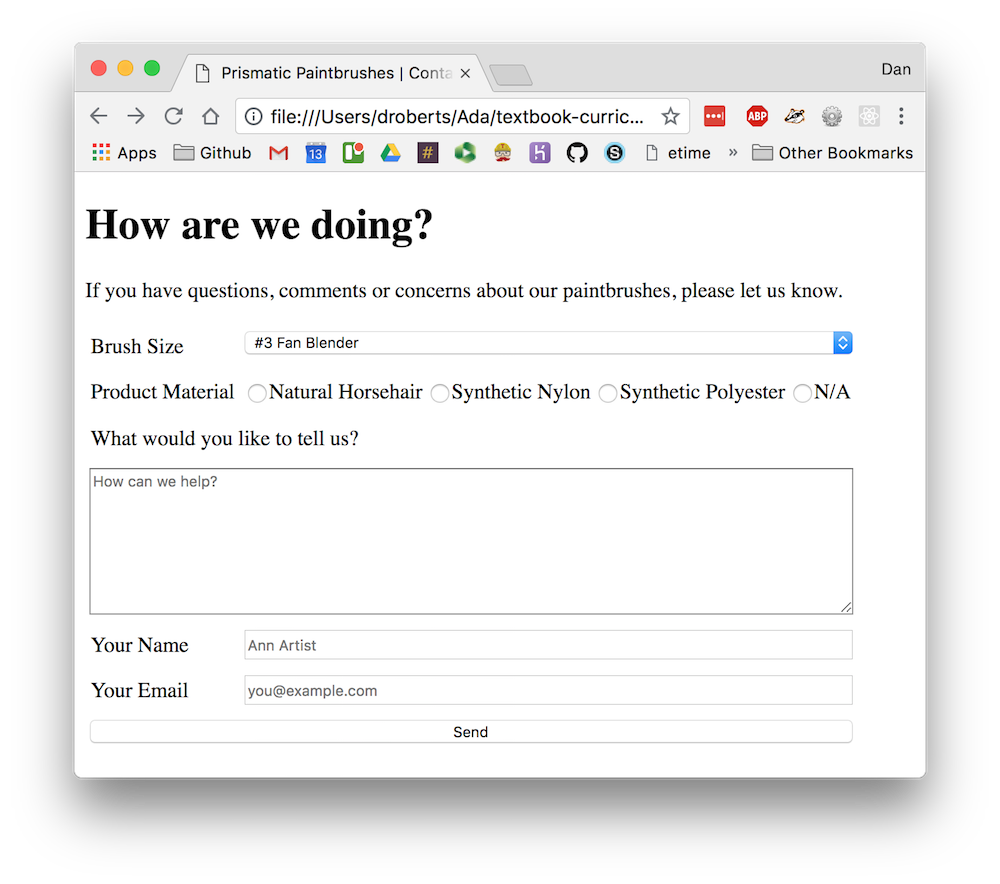

# Forms Exercise

We have been contracted to build a website for a small art supplies company, Prismatic Paintbrushes. They take the quality of their product very seriously, and want to have a form on the site to allow users to give them feedback. Building this form is your task.

## Learning Goals

- Practice building various form elements
- Organize the data sent by a form to match what's required by a real web server

## Requirements

The feedback form should have the following properties:

- Brush size
  - Dropdown menu (see below for options)
  - Input name: `brush_sku`
- Product material
  - Set of radio buttons (see below for options)
  - Input name: `material`
- Your feedback
  - Textarea with space for the user to type out a long comment
  - Input name: `feedback`
- Your name
  - Text input
  - Input name: `name`
- Your email
  - Text input
  - Input name: `email`

Each field should have a label describing it to the user, and each of the text areas should have a reasonable placeholder.

When submitted, this form should send a POST request to `https://ada-paint-shop.herokuapp.com/contact`. This will take you to either a success page (if everything is set up correctly) or a warning page with a list of errors.

### Verification

Once you've used your form to successfully submit feedback, you can visit https://ada-paint-shop.herokuapp.com/admin/support_tickets to verify that a support ticket was generated using the contact form.

In order to access the admin interface you'll need to log in with the following credentials:
- Username: `admin`
- Password: `PaintIsGreat78`

### End Result

Here's what the finished product should look like.


<!-- See the solutions folder for code -->

**Question:** What CSS techniques did we use to style this page?

You don't need to worry about styling for this exercise, but it is an interesting thing to think about.

### Hints

To save you a little typing, here are tags for the dropdown menu and the radio buttons:

```html
<label for="brush-sku">Brush Size</label>
<select id="brush-sku" name="brush_sku">
  <option value="FANBLND3">#3 Fan Blender</option>
  <option value="FANBLND6">#6 Fan Blender</option>
  <option value="RNDHALF">Half Size Round</option>
  <option value="RND1FLG">1" Round Foliage Brush</option>
  <option value="KNFDTL5">#5 Detail Knife</option>
  <option value="KNFPNT10">#10 Painting Knife</option>
  <option value="BLENDER2">2" Blender</option>
  <option value="SCPTLIN2">#2 Script Liner</option>
  <option value="FILBERT6">#6 Filbert</option>
  <option value="BKGRND2">2" Background</option>
  <option value="OVLBRST1">1" Oval Bristle</option>
  <option value="LNDSCP1">1" Landscape</option>
</select>

<label for="material">Product Material</label>
<div>
  <input id="material-horsehair" name="material" type="radio" value="horsehair">
  <label for="material-horsehair">Natural Horsehair</label>

  <input id="material-nylon" name="material" type="radio" value="nylon">
  <label for="material-nylon">Synthetic Nylon</label>

  <input id="material-polyester" name="material" type="radio" value="polyester">
  <label for="material-polyester">Synthetic Polyester</label>

  <input id="material-n-a" name="material" type="radio" value="n-a">
  <label for="material-n-a">N/A</label>
</div>
```
