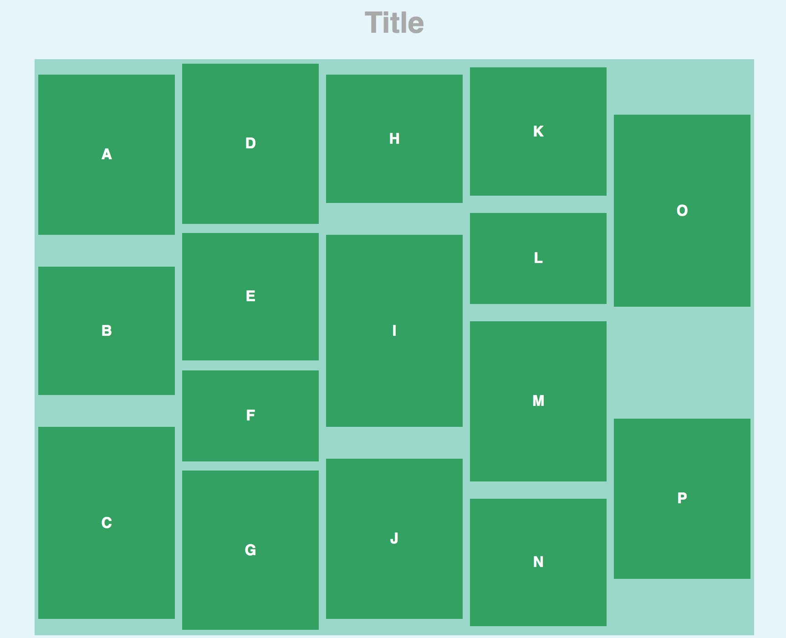
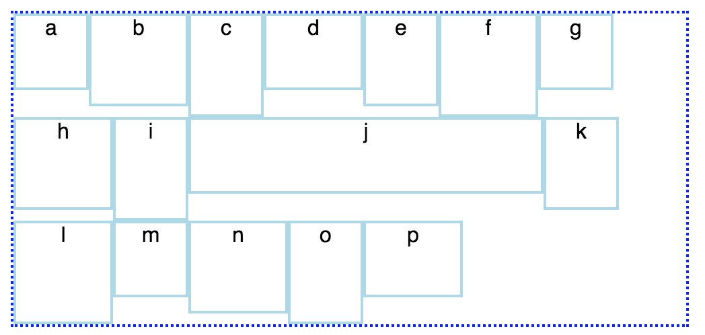
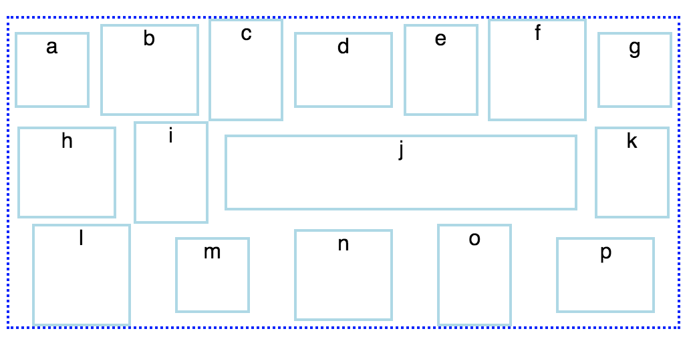

# Intro to Alignment and Positioning with Flexbox

## Learning Goals
- Understand the historical context of flexbox compared to other methods of aligning and positioning with CSS
- Review how the browser uses _flow_ to place elements on the page
- Change how elements flow on the page using CSS's `display: flex` property
- Change how elements align on the page using CSS's `display: flex` property
- Know browser compatibility for flexbox

## Before We Begin: Review Display

[Refer to our Display lecture that we read for homework.](archived/layout-display.md) When rendering, the browser _flows_ from left to right, placing things in a single line. The line is as tall as the tallest element, and all the things are lined up with its bottom. If a thing would go off the edge of the screen, the browser wraps around and starts a new line, completely below the current one.

By default, every HTML tag comes with a `display` property value of `inline` or `block`. The `display` property determines how elements flow on the page. As a general rule, flow has only be left to right, and top to bottom.

Elements that are by `inline` elements align themselves left-to-right as many items that can fit into the container. Examples of these elements are `a`, `span`, and `img`.

Elements that are `block` elements interrupt flow and start and end with a line break. Examples of these elements are `div`, `p`, and `h1`.

Also, by default every element aligns the baseline of itself to the other baselines of surrounding elements.

## History

Historically, _aligning_ items while working with page flow using CSS has been difficult. CSS has never had a great way to align an item within along one dimension (vertically or horizontally). Vertical alignment in CSS is notoriously complex.

In comes _flexbox_ (stylistically lowercase, sometimes "flex-box", short for Flexible Box Module)!

Flexbox has the following advantages:
1. More intuitive attributes for aligning compared to older CSS solutions (like vertical alignment or evenly spacing elements inside of a container)
1. More relevant solutions to modern web layouts
1. Built for responsive design
1. Promotes thinking about alignment on websites agnostic of language direction

If you choose to not use flexbox as your main way of aligning elements along one dimension, Ada has archived lectures on other ways to do layouts in CSS:
1. [Layouts using Display](archived/layout-display.md)
1. [Layouts using Floats](archived/layout-floats.md)
1. [Layouts using Positioning](archived/layout-positioning.md)

**Note:** Flexbox is fairly new, and adoption for using flexbox isn't widespread. A lot of information and advice on the Internet uses CSS that does not use flexbox, even if flexbox may be a better solution for that problem.

## Rules for Setting Up Flexbox

Flexbox solves the following problem: **How do I define rules for aligning many small elements in one larger container element?** Therefore, to use flexbox, we set up our site with these rules:

1. The "one larger container element" is called **the flex container**. We designate it as the flex container by giving it the CSS rule `display: flex;`
1. The "many small elements" that we are trying to align are called the flex items. The flex items **must** be and will only be the **direct children** of the flex container
    - these flex items may have children inside of them. Note: the rules of a flex container do not apply to the children of flex items
1. The "rules" we want to define for aligning the flex items will be additional properties on the flex container

Note: The flex items of a specific flex container do not have to be all the same kind of element.

### Observe

Let's say we've received this wireframe for a website to create.



Take some time to answer the following questions about that wireframe:
- What is the flex container?
- What are the flex items?
- The elements are ordered alphabetically in the HTML. How are they ordered by appearance?
- What do you think is the rule about the spacing around the lettered elements?

This is the HTML for the above image:

```html
<!-- opening html tag, head -->
<body>
  <h1>Title</h1>
  <div class="container">
    <div> a </div>
    <div> b </div>
    <div> c </div>
    <div> d </div>
    <div> e </div>
    <div> f </div>
    <div> g </div>
    <div> h </div>
    <div> i </div>
    <div> j </div>
    <div> k </div>
    <div> l </div>
    <div> m </div>
    <div> n </div>
    <div> o </div>
    <div> p </div>
  </div>
</body>
<!-- ... -->
```

Does anything about this surprise you? What parts did you expect?

For the rest of the lecture, we want to continuously ask and observe how flex items:

- Align themselves against other items
- Behave when there are more flex items than can fit in one direction
  - How does it overflow into the next space?
  - What is "the next space"?

## Example

Take a moment to read through [this example on Codepen](https://codepen.io/adadev/pen/jzNQmV?editors=1100) that we'll use for the rest of the lecture.

What's in there? What is it currently doing? Why are the elements that size?

Now add the `display: flex;` rule to the `.container` rule:
```css
.container {
  display: flex;
}
```

Our elements used to take up the whole width of their parent container because by default, `div`s take their size from their default `display: block;`. However, once the elements became _flex items_ (due to being direct children of a flex container with `display: flex;`), each element stopped taking up an entire "row."

## Controlling Flow

Flexbox defines some specific vocabulary that applies to flow.

In flexbox, there is a **main axis**. This axis runs **along** the direction that inline items flow.


There is also the **cross axis**. This axis runs **perpendicular** to the main axis.


You can determine the direction of the main axis with the property `flex-direction`.

`flex-direction` has the following properties:
- `row` (default)
- `row-reverse`
- `column`
- `column-reverse`

**Practice:** Pair up with someone around you and make a prediction for what each of these will do. Then, add the property `flex-direction` to [the Codepen](https://codepen.io/adadev/pen/jzNQmV?editors=1100) and change the values and observe the differences.

## Determining Wrapping Behavior

We can see in our example right now that our flex items extend beyond the flex container. Let's change that: we can determine the behavior for what our flex items should do if it fills the flex container along the main axis using `flex-wrap` on the flex container:

```css
.container {
  display: flex;
  flex-wrap: wrap;
}
```

The available values for `flex-wrap` are:
- `nowrap`
- `wrap`
- `wrap-reverse`

**Practice:** Using [the same Codepen](https://codepen.io/adadev/pen/jzNQmV?editors=1100), add the property `flex-wrap` and each of the values to observe the differences.

## Controlling Alignment

Let's look at a modification of the example we've been following. [Look at this Codepen](https://codepen.io/adadev/pen/ZxzVLq?editors=1100); it's nearly identical, but we've added some stuff that essentially shows a more realistic case where every flex item is not identical in width or height. This will help us see empty space between flex items better.



**Questions:**
- How are the flex items currently aligned?
- Where is there empty space / negative space?
  - Where did the negative space come from?
- What kind of an alignment would be more pleasant to look at/be a better experience for a website?

To control alignment of flex items within the flex container, we have two main properties: `justify-content` and `align-items`.

`justify-content` determines alignment along the main axis. Its possible values are:
- `stretch`
- `flex-start`
- `flex-end`
- `center`
- `space-around`
- `space-between`
- `space-evenly`

`align-items` determines alignment along the cross axis. Its possible values are:
- `stretch`
- `flex-start`
- `flex-end`
- `center`

Take the time to see each value of both properties in action.

**Practice:** What properties work best to achieve the following look?




### Experiment: Check for Responsive Design

**Responsive design** is all about answering the question, "does this website _work_ with different browser sizes and devices?" By _work_, we can ask "does this look good?" but we must always ask "is the site still functional?"

Using flexbox happens to be very compatible with thinking and practicing responsive design on web design.

For every flexbox example we've looked at today, change the `.container`'s width to `50vw` instead of `500px`, then resize the browser and observe how the flex items behave. _Why does that work?_

Because of the increasing necessity of mobile browsing in recent years, responsive design is an increasingly important part of modern web development. We will return to it in more depth in a future lesson.

## Some Tips

Because flex items must be the direct children of the flex container, it is tempting to alter your HTML to make CSS easier, ignoring semantic HTML. Resist that urge!

Flexbox makes it easy to change the direction of flow, like changing `flex-direction` to reverse. It might be fun to take a list of items, put them in HTML in reverse, and then use CSS to reverse them again into the correct order. Even though that would create the same visual experience for an able-bodied user, it would ruin the experience for someone who relies on accurate HTML.

## Subjects Not Covered In This Lecture

- Relative sizing/space distribution of flex items (`flex-grow`, `flex-shrink`, etc)
- Ordering a specific flex item with `order`
- Aligning a specific flex item
- `place-content`, a shortcut for `align-content` and `justify-content`

Flexbox has a lot of depth, and you're free to continue your research into it!

## About Browser Compatibility

Flexbox was introduced only in the past few years. *Every modern browser supports flexbox*, but that didn't happen until 2015.

Internet Explorer 10 requires specifying the browser prefix `-ms-display: flex;`.

## Conclusion

It's entirely possible to customize flow and alignment of elements using CSS without flexbox. To do so, you will want to check out how to use `display` and `position` and `float`.

However, flexbox provides deep solutions for flow and alignment in a way that promotes better, more responsive layouts.

To use flexbox, you will determine a flex container whose direct children are the flex items. From there, you can use properties to determine the main axis and cross axis with `flex-direction`, and so much more from there!

## Resources
- [MDN with Basic Overview on flexbox](https://developer.mozilla.org/en-US/docs/Web/CSS/CSS_Flexible_Box_Layout/Basic_Concepts_of_Flexbox)
- [MDN on Techniques for Aligning in flexbox](https://developer.mozilla.org/en-US/docs/Web/CSS/CSS_Flexible_Box_Layout/Aligning_Items_in_a_Flex_Container)
- [MDN on Browser Compatibility for flexbox](https://developer.mozilla.org/en-US/docs/Web/CSS/CSS_Flexible_Box_Layout/Backwards_Compatibility_of_Flexbox)
