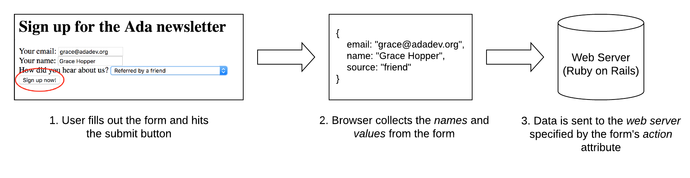

# HTML Forms

## Learning Goals

By the end of this lesson, students should be able to...

- Describe the mechanisms in the HTML standard that allow for interactive elements on a website
- Select the correct form element for a given situation
- Make and _post_ our first HTML form!

Forms are how users provide input to servers for operation. Everything from authoring a tweet to logging into an email account is accomplished using a small set of HTML tags that create and structure forms.

## Anatomy of a Form

There are a number of different tags used in building forms. For each tag, the different _attributes_ of that tag will make a big difference in how the form behaves.

Our running example for this lesson will be a signup form for the Ada newsletter.

### The `<form>` Tag

Every HTML form is wrapped in a `<form>` tag. A `<form>` works similar to a `<section>` or `<div>`, in that it's a block element designed to contain other elements. The big difference is that a `<form>` can be _submitted_, causing your browser to send the data somewhere.

The attributes on the `<form>` tell us things about the whole form, like what type of characters it uses or where to send the data when it's submitted. For right now there are two important attributes for a `<form>`:
- `action="some-URL"`: To what URL should we send the data when the form is submitted?
- `method="post"`: What HTTP verb should we use for the data? For right now, this will always be `post`.

Both of these attributes are necessary, but they won't make much sense until we've started working with web servers. For now, we will give you the values to use for both `action` and `method`.

Here's what it would look like in a web page:

```html
<h1>Sign up for the Ada newsletter</h1>
<form action="/newsletter/signup" method="post">
  <!-- We'll put something here soon -->
</form>
```

### `<input>` Tags

`<input>` tags do the hard work of forms, giving the user somewhere to provide input.

There are several types of `<input>`, each specified by the `type` attribute:

- `<input type="text">`
  - A one-line text box
- `<input type="checkbox">`
  - One checkbox (typically you would use several together)
- `<input type="radio">`
  - One radio button (typically you would use several together)
- `<input type="password">`
  - Similar to `type="text"`, but the characters are hidden
- `<input type="hidden">`
  - Stores a value to be submitted with the form, but is invisible to the user. We won't use these until next week.

Each `<input>` must also have a `name` attribute, which specifies what the data entered here will be called. You can think of it as being similar to the key in a hash. It's worth pointing out that `"name"` is a common value for the `name` attribute, which can get a little confusing.

Many `<input>`s will also have a `value` attribute. For checkboxes and radio buttons, `value` will determine what data will be sent to the server when the form is submitted. Going back to our hash metaphor, if `name` is the key then `value` is the value. For text inputs, `value` indicates an initial value for this field.

Another useful attribute for `type="text"` is `placeholder`, which is used to give the user an idea of what to type, but goes away as soon as they start typing (as opposed to a `value` which sticks around).

#### Submit Button

There's one special type of `<input>` element we should discuss: `<input type="submit">`. This creates a submit button! Almost every form you build will include one of these.

Let's add a few `<input>` elements to our email signup form. Since `<input>` is an inline-block element, we'll wrap each in a `<div>` to force line-breaks (this is a common pattern in the wild).

```html
<h1>Sign up for the Ada newsletter</h1>
<form action="/newsletter/signup" method="post">
  <div>
    <input name="email" type="text" placeholder="lovelace@adadev.org">
  </div>

  <div>
    <input name="name" type="text" placeholder="Ada Lovelace">
  </div>

  <input type="submit" value="Sign up now!">
</form>
```

### `<label>` Tags

One thing you'll notice about our example so far is that it doesn't include any text on the page. There's no indication (other than the placeholder text) of what our `<input>` elements are for. To help out the user we'll label them with `<label>`s.

Each `<label>` gets a `for` attribute, which should match the `id` of the `<input>` it corresponds to. Making this connection is important for accessibility.

Adding `<label>` tags to our example yields:

```html
<h1>Sign up for the Ada newsletter</h1>
<form action="/newsletter/signup" method="post">
  <div>
    <label for="email">Your email:</label>
    <input id="email" name="email" type="text" placeholder="lovelace@adadev.org">
  </div>

  <div>
    <label for="name">Your name:</label>
    <input id="name" name="name" type="text" placeholder="Ada Lovelace">
  </div>

  <input type="submit" value="Sign up now!">
</form>
```

That's starting to look like a real form!

### Other Form Elements

While `<input>` covers most types of form elements, there are a few that for one reason or another get a special tag. The two most common are `<textarea>` and `<select>`.

A `<textarea>` is used for a multiline text input. You can use it in the same way as `<input type="text">`, except for it takes `rows` and `columns` attributes to specify how big it is.

A `<select>` is used for dropdown menus, and should have a `name` attribute. Each item in the menu should be wrapped in an `<option>` tag, and should have a `value` attribute indicating the data sent to the server when that option is selected.

Let's add a `<select>` dropdown menu to our email signup form:

```html
<h1>Sign up for the Ada newsletter</h1>
<form action="/newsletter/signup" method="post">
  <div>
    <label for="email">Your email:</label>
    <input id="email" name="email" type="text" placeholder="lovelace@adadev.org">
  </div>

  <div>
    <label for="name">Your name:</label>
    <input id="name" name="name" type="text" placeholder="Ada Lovelace">
  </div>

  <div>
    <label for="source">How did you hear about us?</label>
    <select id="source" name="source">
      <option value="search">Found through a search engine</option>
      <option value="friend">Referred by a friend</option>
      <option value="sponsor-company">Through one of our sponsor companies</option>
    </select>
  </div>

  <input type="submit" value="Sign up now!">
</form>
```

## Form Submission

We've built a beautiful form, the user fills it out, and then they hit `submit`. What happens next?

Now the browser takes over, and does two things. First it collects the data from the form into a hash, using the `name` attribute from each `<input>` as the keys, and the `value` attribute as the values.

Second, it sends that data over the internet to the address specified by the `<form>`'s `action` attribute.



## Summary

- Forms are always wrapped in a `<form>` element
  - The `action` and `method` attributes are important
- Most inputs are `<input>` elements
  - Specify what type of input you want with the `type` attribute
  - Every `<input>` needs a `name` attribute. This is the key used when data is sent
  - `<input>`s also take `value` and a `placeholder`
- Every `<input>` should be paired with a `<label>`
  - The `<label>`'s `for` attribute should match the `<input>`'s `id`
- `<textarea>` is used for a multiline text input
- `<select>` is used for dropdown menus
  - Items in the menu should be wrapped in `<option>` tags, each with a `value` attribute

## Resources
- [MDN Input Element](https://developer.mozilla.org/en-US/docs/Web/HTML/Element/input)
- [MDN Form Element](https://developer.mozilla.org/en-US/docs/Web/HTML/Element/form)
- [MDN Label Element](https://developer.mozilla.org/en-US/docs/Web/HTML/Element/label)
- [SO on why `<textarea>` isn't `<input type="textarea">`](https://stackoverflow.com/questions/5637326/why-isnt-textarea-an-inputtype-textarea)
