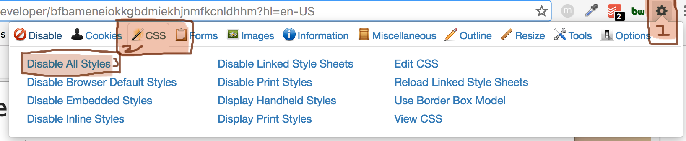

# ❮ Intro to HTML ❯

## Learning Goals
- Understand HTML syntax & vocabulary
- Can identify what tags are most appropriate for specific content
- Can view document in a browser

## HTML Structures Content on Webpages

HTML structures the content of a webpage. Its purpose is to organize content. **In web, the contents of a webpage are all of its text, essays, paragraphs, blogs, headers, images, videos, and other information and media that the website is delivering.**

HTML stands for Hypertext Markup Language. We use HTML to describe and organize the content of a document (website) within the context of the document content itself.

HTML is not concerned about how the content *looks*. That job is left to CSS, which is a totally different language we will be learning later. HTML is concerned with the structure of *content*.

### Websites Still Have Content Structure without CSS

Let's prove to ourselves that developers still organize and structure content, and it is separate from appearance.

**Experiment:** Add the [Web Developer](https://chrome.google.com/webstore/detail/web-developer/bfbameneiokkgbdmiekhjnmfkcnldhhm?hl=en-US) extension to chrome to see how sites look without any CSS!


After you add it, click on the extension's icon (it looks like a gear). A box will popup, click on the CSS tab towards the top left. Then click 'Disable All Styles' to disable CSS on any site your heart desires 💛. Have fun!

Browsers apply default styles even for plain HTML with no definition for appearance. Select 'Disable Browser Default Styles' to disable that as well to get a real view of what HTML by itself looks like.

The best HTML creates a logical and readable document without any styles.

## HTML Syntax

About our files:

- We write HTML in files that have a `.html` extension
- HTML files don't have a required or even standard naming convention, [but they have a few rules](https://www.lifewire.com/naming-html-files-3466503), and we will recommend sticking with kebab-case
- At the moment, we don't have a recommended folder structure (no `lib` folder or anything)

What goes inside the HTML files?

- HTML files will have HTML **elements** that define the structure of the website content
- HTML elements typically (though not always) do one of the following:
    - Contain the details of a single piece of website content
    - Contain other HTML elements to organize and group those elements

### Syntax for Defining an Element

Every HTML Element is opened and closed using tags. For every given HTML Element, the syntax will typically look like this:

```html
<element>Content Details</element>
```

- The text `element` should be the name of the HTML element (details below)
- Every element has an _opening tag_, which is angle brackets surrounding the element name (here: `<element>`)
- Every element has a _closing tag_, which is an opening angle bracket, a `/`, the element name, and then a closing angle bracket
- Every element may have content details between the opening and closing tags. This will typically be text if the HTML element describes text content.

In most cases, HTML doesn't care about whitespace, so sometimes we will see our HTML elements like this:

```html
<element>
  Content Details
</element>
```

Note that we indent inner content in HTML.

Many HTML elements will require that **attributes** are set with the HTML tag. For those cases, the syntax looks like this for every attribute/value pair:

```html
<element attribute-1="string value" attribute-2="a different string value">Content Details</element>
```

## Possible Elements

Unless you have fancy code that will do otherwise, the only valid HTML elements that will show up on a webpage are [defined by W3C](https://www.w3.org/standards/).

[Here is a list of all of the valid HTML Elements.](https://developer.mozilla.org/en-US/docs/Web/HTML/Element)

### Examples of Content Elements

Here are examples of HTML elements that will describe literal website content:

- Paragraphs of text are described with `<p>Content Details</p>` tags
- Headers and headlines:
  - The most important header on the website is `<h1>Content Details</h1>`
  - The second most important header is `<h2>Content Details</h2>`
  - The third most important header is `<h3>Content Details</h3>`
- Making text that is clickable and links to another website: `<a href="http://google.com">This is the text that appears as the link.</a>`

### Examples of Sectioning Elements

Here are examples of HTML elements that will describe sectioning/organizing/grouping website content:

- A standalone section of content is `<section></section>`
- Introductory content, that may contain some heading elements but also a logo, a search form, an author name, and other elements is `<header></header>`
- A section of a page whose purpose is to provide navigation links to other documents is `<nav></nav>`. Common examples of navigation sections are menus, tables of contents, and indexes.
- A footer that typically contains information about the author of the section, copyright data or links to related documents is `<footer></footer>`
- A self-contained composition in a document, page, application, or site, which is intended to be independently distributable or reusable is `<article></article>`

### Exercise

Take time with your neighbor to explore [MDN's HTML elements reference page](https://developer.mozilla.org/en-US/docs/Web/HTML/Element) and answer the following:

- How is this page structured?
- What are two other examples of sectioning elements that this document lists? What do each represent?
- What are five other examples of content elements that this document lists? What do each represent?

## Other Interesting HTML Syntax Details

### Nested Elements

Often times, we will nest elements inside of each other. Usually, we put inside of sectioning elements either content elements or other sectioning elements.

Here is an example of the syntax of nesting an `<h1>` element inside of a `<nav>` element.

```html
<nav>
  <h1>Bookface</h1>
</nav>
```

Start to be mindful of the relationship between nested elements. It will become important as we progress in the week.

Common HTML elements we will nest are lists.

In HTML, unordered lists are grouped by a `<ul>` tag. Items of the list (list-items) are defined inside this tag. Ordered lists are grouped by an `<ol>` tag.

```html
<!-- An Unordered List with List Items -->
<ul>
  <li>Content Details</li>
  <li>Content Details</li>
  <li>Content Details</li>
</ul>

<!-- An Ordered List with List Items -->
<ol>
  <li>Content Details</li>
  <li>Content Details</li>
  <li>Content Details</li>
</ol>
```

Tip: **Valid HTML always closes tags in order.** Your HTML will break if you forget to close your elements properly. For example, this code is **not** valid:

```html
<nav>
  <h1>Bookface
</nav>
</h1>
```

**Utilize indentation to help.**

### Self-Closing Tags

Some tags are self-closing. These elements do not 'wrap' around any content.

The syntax for self-closing tags is the same as normal HTML syntax, but:

1. end the _opening tag_ with a `/>`
2. omit the closing tag

For example, to display an image, use the self-closing `img` tag. It uses the `src` attribute to determine the image's source. It uses the `alt` attribute to determine the image's alternative text to show up in cases when the image is unavailable.

```html

```

### Commenting in an HTML Document

To comment within HTML, use `<!-- -->`.

```html
<!-- Your comment here -->
<h1>Bookface</h1>
```

## Setup an HTML Document

Before we can start to organize our content into HTML elements, we must setup our HTML documents so that our code can be properly interpreted by browsers.

```html
<!-- index.html -->
<!DOCTYPE html>
<html>
  <head>
    <meta charset="UTF-8">
    <title>This site should have a title!</title>
 </head>
  <body>
    <!-- Your code goes here! -->
    Hello, HTML World!
 </body>
</html>
```
What do all these HTML tags mean?

- [DocType](http://stackoverflow.com/questions/414891/what-is-doctype)
- [HTML](http://stackoverflow.com/questions/3270615/why-we-use-html-tag-although-my-website-runs-perfect-without-html-tag)
- [`head`](https://developer.mozilla.org/en-US/docs/Web/HTML/Element/head) is a tag that holds all of the meta data of that page: things that the browser should know
  - [charset](http://stackoverflow.com/questions/2241348/what-is-unicode-utf-8-utf-16)
  - [title](https://www.w3schools.com/html/html_head.asp)
- [`body`](http://htmldog.com/references/html/tags/body/) is a container tag that will hold all of that page's content. If there is content that you expect to be shown on the page, it should be nested within the `body` tag.

### We Organize Content in `<body>`

As a general rule, we will organize website content all nested within the `<body>` element.

### `index.html` is Special

It is convention that every website's main page is named `index.html`

## Exercise

1. Create an empty project folder
1. Inside of that folder, create the file `index.html`
1. Copy/paste the above code into `index.html` and save
1. Open this file in a browser. Do this by either finding this file in Finder and clicking on it, or running in the command line `$ open index.html`

What do you see? Check to see that you see "Hello, HTML World!" on your and your neighbor's screen.

1. Next, modify the text "Hello, HTML World!" to different text. Save the file.
1. Go back to the browser. Nothing changed!
1. Refresh your page (using cmd+r). Every time you save and you want to see updated changes, you will either need to refresh the browser page, or re-open the file.

Challenges:

1. Create 3 imaginary blog snippets on `index.html`. Each blog snippet should have a header and a paragraph below it. Each blog snippet should use Lorem Ipsum for its paragraph text. [(What is lorem ipsum?)](https://www.lipsum.com/)
1. Add 3 images to `index.html`. Use any placeholder image resource, such as:
    - https://placekitten.com
    - https://loremflickr.com
    - https://www.placecage.com
    - https://placebear.com

## Validate your HTML

HTML and browsers that run HTML with broken HTML will not throw exceptions or errors like Ruby will. We can write broken HTML code and nothing will stop us from rendering it-- the browser will do its best to interpret any given HTML.

Validating web documents is an important step which can help improve and ensure their quality. Use this link to see if your HTML is following proper HTML syntax: [Markup Validation Service](https://validator.w3.org/nu/#textarea).

## Best Practices

- Use HTML to accurately describe the structure of content of a page, not presentation
- Use proper indentation
- All content should be wrapped by an element

## Key Takeaway
HTML is concerned about structuring content. HTML does not have the responsibility to determine page style/appearance.

### Additional Resources
- [Learn to Code: HTML & CSS](http://learn.shayhowe.com/html-css/building-your-first-web-page/) ( Will be a good resource to reference throughout week.)
