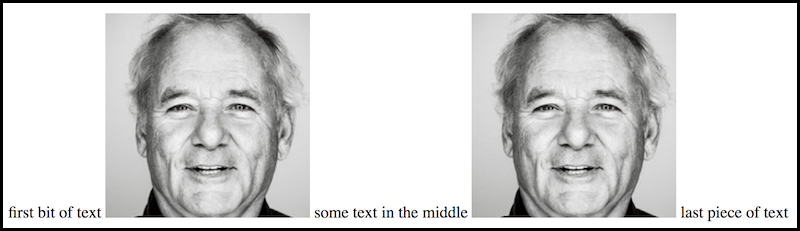
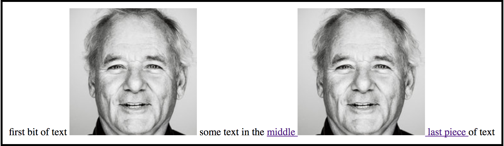
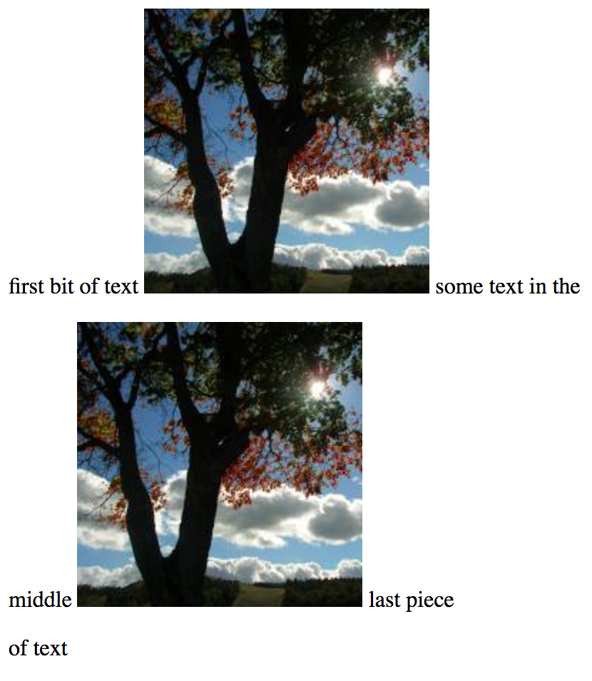

# Layout: Page Flow and the Display Property

## Learning Goals 📚
By the end of this lecture, students should be able to...

- Describe how the browser uses _flow_ to place elements on the page
- Change how elements fit on the page using CSS's `display` property
- Identify the differences between each display type

## Webpage Flow

Displaying a webpage is a complicated task. The browser has to figure out exactly where everything on the page should go, based solely on the HTML we've given it. Understanding the basics of how this works is important if we want to customize how things are laid out.

### Putting Things on the Page
There are lots of different HTML tags, but in a way there are just two types of things in an HTML document:
- Things that render, or appear on the page (`` tag, a single letter, an emoji)
- Things that contain other things (tags like `<p>`, `<ul>`, `<article>` or `<body>`)

Note that a _thing_ here might or might not get its own HTML element.

When rendering, the browser _flows_ from left to right, placing things in a single line. The line is as tall as the tallest element, and all the things are lined up with its bottom. If a thing would go off the edge of the screen, the browser wraps around and starts a new line, completely below the current one.

As an example, consider the following HTML. Note that there is no `<p>` tag around the text.

```html
first bit of text
</img>
some text in the middle
</img>
last piece of text
```



#### Inline Elements
_Inline elements_ like `<a>` and `<span>` do not change this flow - the browser just does whatever it would do to the things contained in that element. For example:

```html
first bit of text

some text in the
<a href="https://adadevelopersacademy.org">
  middle
  
  last piece
</a>
of text
```



#### Block Components
However, the behavior changes when the browser encounters a _block element_, like `<p>` or `<div>`. Block elements always start and end with a line break. Inside the block element, flow continues as normal.

```html
first bit of text

some text in the
<p>
  middle
  
  last piece
</p>
of text
```



### Sizes
When rendering the page, the browser has to figure out how big everything is. This follows a few rules:
1. If the height or width is explicitly set, then that is used
1. A rendering element is exactly as big as it needs to be (the height and width of the image or character)
1. A containing element is exactly tall enough to contain all the things inside it, and it takes up the entire width of its parent element
1. An empty containing element has a height of zero (but still forces a line break)

As we saw in the last lecture, all this can be modified by adding padding, border and margins.

## Display Property
We can modify how an element affects the flow of the webpage using the `display` property. There is a long list of potential values, but there are three values we are going to focus on while we learn about layout: `inline`, `inline-block` and `block`.

- Inline elements:
  - respect left and right margins and padding, but **not** top and bottom
  - **cannot** have a width and height set
  - allow other elements to sit to their left and right

- Block elements:
  - respect all of the margins and padding
  - force a line break before and after the block element

- Inline-block elements:
  - respect all margins and padding
  - respect height and width
  - allow other elements to sit to their left and right

### Modifying an Element's Display

To have elements with default block displays to be inline with each other, it's `display` property and `width` need to be modified.

Use this [Codepen](http://codepen.io/jamazing/pen/rrxLZo) example to experiment with the element's display values.
- Use Chrome's developer tools to inspect the `<div>`s
- What happens when you remove the `display: inline-block;` line?

## Vocab ✅
- flow
- `display` property
- `inline`
- `inline-block`
- `block`

## 🔑 Key Takeaway
Different types of element are rendered by the browser in different ways; use the `display` property to specify what should be done.

## Additional Resources
- [MDN on `display`](https://developer.mozilla.org/en-US/docs/Web/CSS/display)
- [How Browsers Work (long and detailed)](https://www.html5rocks.com/en/tutorials/internals/howbrowserswork/)
