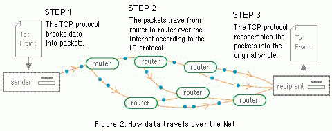

# 🌐 Intro to the web 🌐

## 📚 Learning Goals 📚

- Differentiate between a static and dynamic website
- Define the terms "front-end," "back-end," and "full-stack"
- Understand relationship between clients and servers
- Relate the browser's role to the request/response cycle
- Be aware of web standards & browser compatibility

## Static vs Dynamic websites

A static site presents the same content to every visitor. Everybody that visits the site will be given the same content. The content will rarely change, and if it does, it is typically by only one or few people manually. These sites will only use HTML, CSS and possibly basic JavaScript.

Common examples of static sites include restaurants sites that display contact info and menus, or small business sites that display mission statement and info.

Most modern sites are dynamic. Dynamic sites are sites that have logic involved in serving content. Logic like this requires the use of programming languages like Ruby, Python, or PHP. Every time you sign-in to a site and are given custom content based on your preferences (like who you follow on social media), you are interacting with a dynamic site.

Common Examples: Facebook, Gmail, websites that allow shopping functionality, real-estate websites such as Redfin or Zillow

Are the following sites static or dynamic? Why?

- [Space Jam](http://spacejam.com)
- [Twitter](http://www.twitter.com)

## Front-end vs Back-end

Web applications are dynamic websites that can be broken down into two parts, the front-end and the back-end.

Front-end refers to the code that executes on your browser (and is often called "client-side"). Front-end languages include HTML, CSS and JavaScript.

Back-end refers to code that processes requests. This code remains "server-side" and often interacts with a database. The back-end utilizes programming languages such as Ruby, Python, PHP, Java, or JavaScript.

A full-stack developer whose responsibility is to work on both the front-end and back-end of a web application. At Ada, we teach everyone to be full-stack developers.

### Client-side vs. Server-side

In what context have we defined things as client vs. server?

Discuss with your neighbor your hypothesis, and we'll return to this question later.

### Nota Bene: "Front-end"

There is a recent and current trend of JavaScript development that makes the definition of "front-end development" fuzzier and fuzzier, and the difference between front-end and back-end in JavaScript is blurring. We may revisit this topic later once we get to JavaScript.

## How the Internet Works: A Series of Requests and Responses

In order for us to access a website, its files need to be stored on a computer that is constantly online. Computers and machines always kept online whose responsibility is to serve websites are [web servers](https://en.wikipedia.org/wiki/Server_farm).

 ([Source](https://mdn.mozillademos.org/files/8659/web-server.svg))

We can reframe our understanding of the request-response cycle in this way. When we enter a URL into our browser and then press "enter", we are making a `GET` request, whose path is the URL.

The web server who receives that request processes it, and then sends back a response. We've seen through APIs responses that come back as JSON. These web servers will give back a response that is something the browser can display as a website.

  

    With this in mind, let's return to an earlier question: why would front-end development, or code that executes from the browser, be called "client-side," and why would back-end development, or code that executes from a web server, be called "server-side"?
  

  The request-response cycle defines that the client makes a request, and the server receives the request and gives back a response.

  A website being fetched from the Internet is one instance of the request-response cycle happening. The browser is the client, and makes a request to the web server.

  By default, a browser going to a web site through its URL bar will make a GET request to that URL (path).

  While we have already seen different patterns of clients that aren't browsers, such as CLI programs that send requests to APIs, this is one common pattern.

## How the Internet works: A More Technical look

Should you be excited to look at how the Internet sends and receives data, here are more resources for you.

- [Analogy between postal mail and TCP/IP](http://bpastudio.csudh.edu/fac/lpress/471/hout/netech/postofficelayers.htm)
- [Warriors of the Net Video](https://www.youtube.com/watch?v=PBWhzz_Gn10)

## Browser Compatibility

The internet has changed a lot since Sir Tim Berners Lee made the first [web page](http://info.cern.ch/) in 1991. In turn, HTML and CSS have evolved from when they were first used in the 90's. As these front-end languages evolve, browsers need to evolve with them.

We will be learning HTML5 and CSS3. Be aware that some older browsers do not understand the newest versions of HTML or CSS. One day you many need to develop a site that needs to be accessed by a large demographic, including users with computers from 2001 (or older). Your site may break, or look a lot different on those computer's browsers.

There are also many different browsers (Safari, Internet Explorer, Chrome, Firefox etc). A browser's job is to translate the code that will be displayed. Each browser does this a little bit differently. To ensure a site is widely accessible, developers use browser compatibility tools.

In the Ada curriculum, we will focus our learning goals on developing web sites that are compatible with the latest version of [Google Chrome](https://www.google.com/chrome/). Students don't need to switch to Google Chrome for their every day use, but are asked to use Google Chrome for web development at Ada.

## Each Web Site and Web App is Made of Code

When we use an Internet browser to go to a web address, our browser (as a _client_) makes a _request_ to a _server_, which usually gives us a _response_ that is a set of HTML, CSS, and other code for our browsers to interpret and then display.

Therefore, it's safe to say that all websites and web apps we use and have a visual/interactive element rendered on the browser has some HTML and CSS. Let's prove it!

### Intro to Chrome Dev Tools

Google Chrome provides tools for developers to inspect the rendered code of a website or web app with its Chrome Dev Tools.

Although Chrome Dev Tools have a huge amount of functionality, for this week, we will focus on using them to observe code.

On any page rendered with Google Chrome, you can open the Chrome Dev Tools to inspect its innards. Let's do it on _this literal page_. Right click on this website and find the option "Inspect". Alternatively, you can use the menu path View > Developer > Developer Tools, or the keyboard shortcut `cmd + opt + i`.

A separate pane should show up. You can configure how this pane shows up (on the side, on the top or bottom, or on a separate window). However, the important thing is that you can see that the elements that make up this page is all HTML.

Try inspecting the code on some of these websites!

- Some websites have very "simple"-looking code for a very effective web page... http://nicole.pizza/
- Some websites have a mix of JavaScript... https://www.omayeli.com/
- Some have unrealistically complex CSS... http://diana-adrianne.com/purecss-francine/
- Huge, complex web apps (dynamic sites) are mostly JavaScript, and actually some are even very self-aware about Chrome Dev Tools! https://www.facebook.com/

We will absolutely get deeper into these tools soon enough, but for now, we'll use it to prove to ourselves that we can see _something_.

## 🔑 Key Takeaway

There's a lot to web development and web!

Our start into web development will be to first create many small static websites. This will help us get a beginning foundation on HTML and CSS.

After practicing our HTML and CSS skills making static websites, we will get into dynamic websites later.

Our direction into web development starting with static websites, and eventually dynamic websites, should lead us to be curious about how the Internet works, and rooted in the request/response cycle.

### Additional Resources

- [MDN What is a Web Server](https://developer.mozilla.org/en-US/docs/Learn/Common_questions/What_is_a_web_server) (Highly Recommended)
