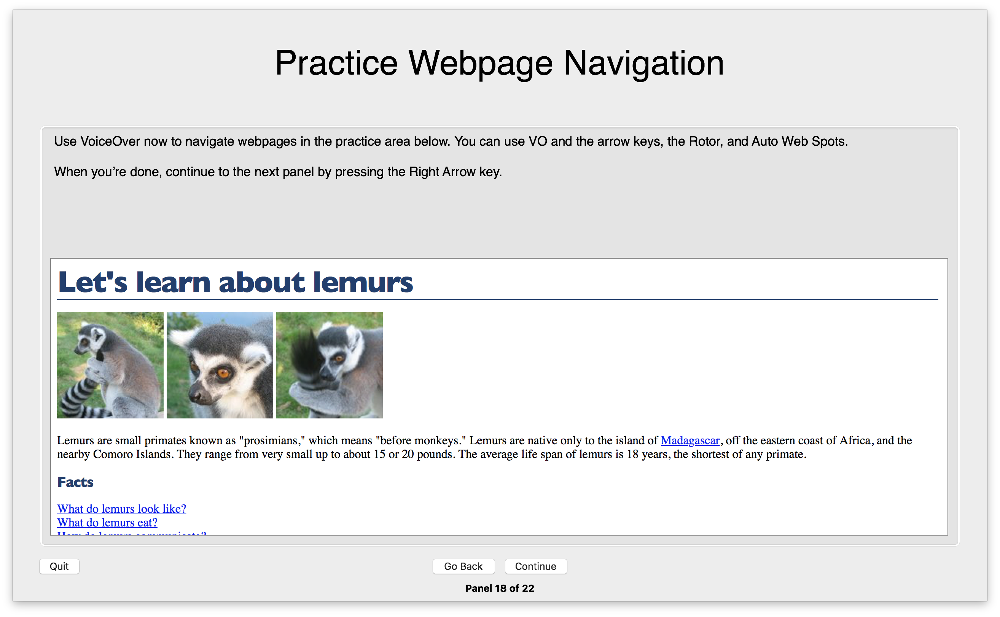
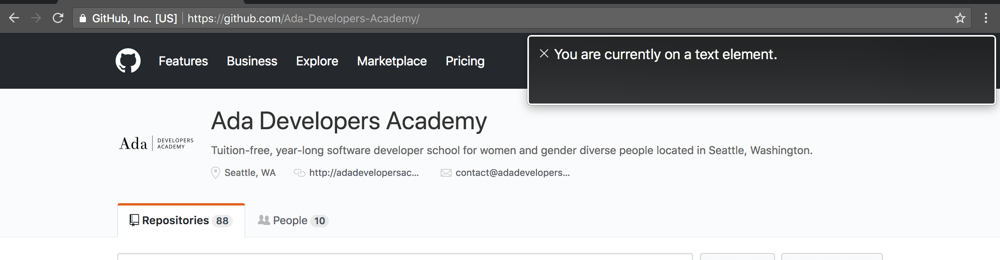

# Vision Accessibility & Using Screen Readers

It's extremely valuable (and imperative) to consider vision accessibility in web design.

## Using a Screen Reader

To use their computer or device, some users do not depend on vision, but depend on accessibility tools like a screen reader. Screen readers are programs that scan through a website's HTML and that interpret the HTML. With the interpreted HTML, screen readers give the user directions and information via audio cues about what is on the page and how to navigate it using devices without a mouse.

Visit [here](https://www.apple.com/accessibility/mac/vision/
) for Apple's parent page on their accessibility tools for vision, or visit [here for a guide to VoiceOver](https://help.apple.com/voiceover/info/guide/
), macOS's built-in screen reader.

### Homework

Spend 30 minutes using [VoiceOver](https://help.apple.com/voiceover/info/guide/
). Run through the tutorial and focus on the web navigation section.

Spend some time on other websites using the screen reader tool.

**Practice:** a screen reader's ability to navigate relies on semantic HTML. Answer the following:
- Find an example of a website you navigated with a screen reader in which there was semantic HTML used to nest two related elements
- Find an example of a website you navigated with a screen reader in which there was semantic HTML used to describe the element. How did the program inform you that it likely used semantic HTML?

## Simulating Color Blindness

The web allows us to use [colors of all kinds](https://en.wikipedia.org/wiki/Web_colors) pretty easily. It's tempting to use a color scheme that fits your needs, but may not take into account color blindness.

Imagine filling out important financial documents on your website, but the user is color blind and cannot see the difference between the "green for valid" and "red for invalid" status indicators on your website's form.

### Homework
Color Oracle is one of many tools that simulates different kinds of color blindness.

Take 15 minutes to download [Color Oracle](http://colororacle.org/) and check some websites with it turned on.

## Checking Color Contrast

Checking the color contrast between text against its background is necessary to check if the usability of your website. Nobody wants to use your website if they can't read it!

[This contrast ratio tool](http://leaverou.github.io/contrast-ratio/) takes a background color and a color for text to go on top of it and gives it a score on the color contrast and tells the user if the color contrast ratio is high enough to meet WCAG standards.

[Web Content Accessibility Guidelines (WCAG)](http://leaverou.github.io/contrast-ratio/) is "developed through the W3C process in cooperation with individuals and organizations around the world, with a goal of providing a single shared standard for web content accessibility that meets the needs of individuals, organizations, and governments internationally. ... The WCAG documents explain how to make web content more accessible to people with disabilities."

## Font Sizes on Mobile

Imagine a person who uses a smart phone daily for their job. They prefer large text on their phone for readability, so they set their phone system settings to the largest font possible by default. Would your website respect the needs of this user?

The web allows us to define sizes of things with a unit of the pixel with `px`. However, pixels are a historical artifact, and hardware and web have evolved to essentially render them as unhelpful:

- pixels as size units on web are not consistent among devices
- pixels as size units are static: they don't change, grow, or shrink

As a general rule, particularly for text, don't use the `px` unit, but instead **use `rem` or `em` units**.

`rem` units are how much bigger this attribute should be compared to what is defined on the document's root element (`<html>`). `font-size: 2rem;` will result in a font size two times bigger than the font-size calculated on `<html>`.

`em` units are how much bigger this element should be compared to its parent element. `font-size: 2em;` will result in a font size two times bigger than the font-size calculated on its parent element.

Play around with this [Codepen](https://codepen.io/adadev/pen/qoEjMK) and comment and uncomment the styles on `html` and `.container` to give it a try!

`rem` and `em` units:
- provide better flexibility between devices
- do listen to font size needs given to the browser

For more information, [this](https://medium.com/@julienetienne/pixels-are-dead-faa87cd8c8b9) is a pretty good and opinionated article on why not to use pixels

# Read More
- [Designing for accessibility is not that hard: Seven easy-to-implement guidelines to design a more accessible web ❤️](https://uxdesign.cc/designing-for-accessibility-is-not-that-hard-c04cc4779d94)
- [Pixels vs. Ems: Users DO Change Font Size](https://medium.com/@vamptvo/pixels-vs-ems-users-do-change-font-size-5cfb20831773)
