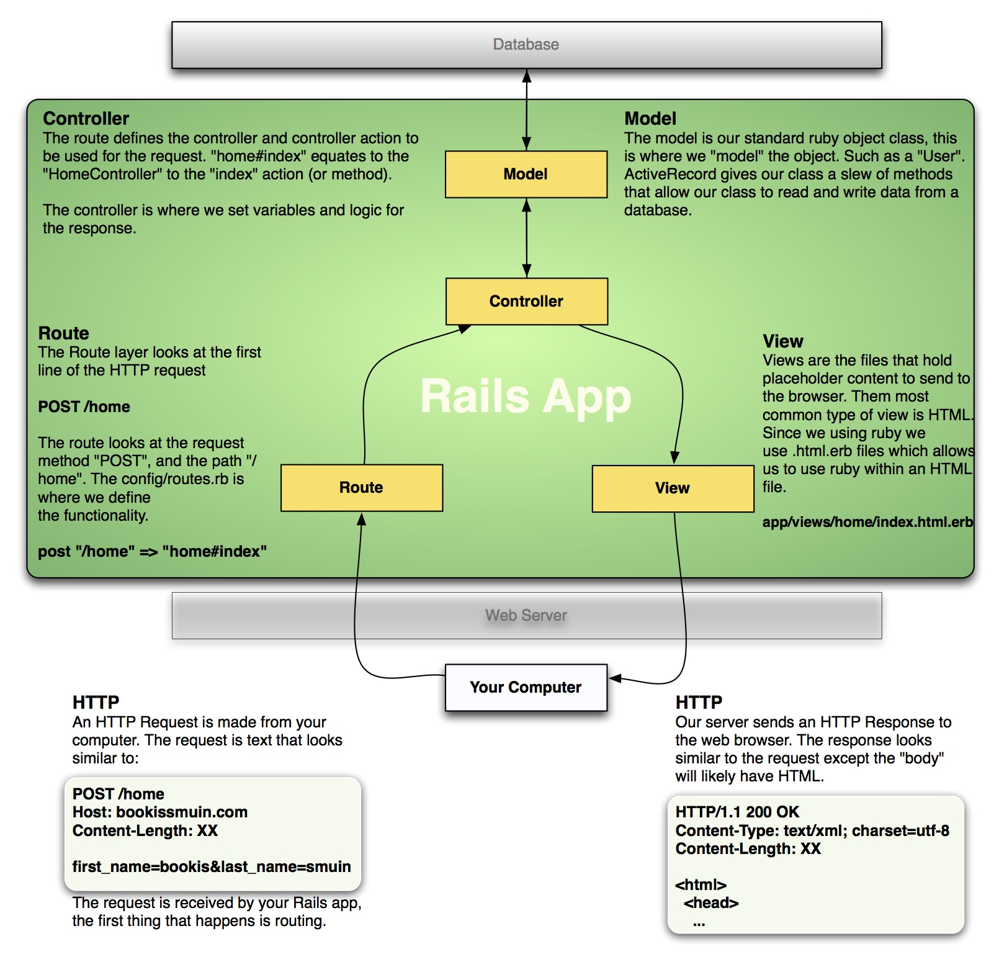

# HTTP And The Internet
## Learning Goals
- Examine the _HTTP_ protocol; what does it do? How does it do it?
- Talk about the most common server architecture on the internet: _Client/Server_
- Define the key pieces in making the internet work:
  + _webserver_
  + _client_
  + _network_
  + _request_
  + _response_

## So what is the Internet?
It's a computer network: a collection of computers and devices connected using communication devices (routers, cables, wifi, fiber, etc).

Computers communicate over a network by sending data over the connection.

There are many types of networks and architectures, but we're going to look primarily at the internet and client/server architecture.

### Client/Server

A **Server** is a computer that provides a service to clients.

A **Client** is a computer that requests services from a _server_ (your web browser, an ATM, your phone, a point-of-sale terminal).

Typically there is a single _server_ and many _clients_.


### How do _clients_ and _servers_ communicate? Protocols.

Hypertext Transfer Protocol (HTTP) functions as a __request-response__ protocol.

A client sends a __request__ and a server sends back an __response__. HTTP describes how that request and response are formatted. There are lots of different protocols that describe lots of different kinds of interactions. Common protocols utilized in networked or internet-based applications include HTTP and HTTPS (hypertext transfer protocol secured), IMAP, FTP, SSH, SMTP, LDAP, DHCP, and more.

All of these are, at the end of the day, text sent over the network. A suite of technologies take this text, carry it to the intended destination, and make sense of it. The _protocol_ is the definition of how the _client_ and _server_ understand the information they've received. Most _protocols_ serve a single purpose--displaying web pages (http), sending an email (smtp), transmitting a file (ftp), etc.

### So what does an _HTTP Request_ look like?
Kinda like this:

```
# this is the request
GET /orders HTTP/1.1
User-Agent: curl/7.30.0
Host: localhost:8080
Content-Length: 6
Accept: */*
```

```
# and the corresponding response
HTTP/1.1 200 OK
Content-Type: text/html
Server: WEBrick/1.3.1 (Ruby/2.1.2/2014-05-08)
Date: Mon, 22 Sep 2014 19:19:57 GMT
Content-Length: 21
Connection: Keep-Alive

# then a bunch of html
```

## Ruby's role in all of this
We will use Ruby--specifically a collection of Gems--to create a _webserver_.

The _webserver_ is a program on the _server_ which monitors incoming _HTTP requests_
and then responds with an _HTTP response_. A _webserver_ interfaces your application with incoming _HTTP requests_ on the server. By using Ruby, we can introduce logic into our server so that it can make decisions, process user input, query data, and more.


