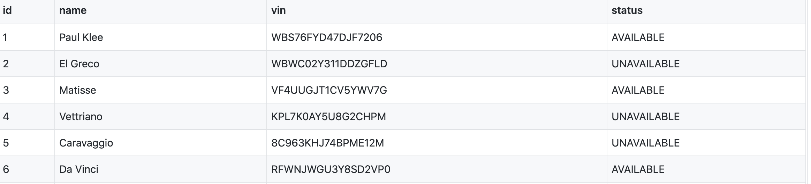

# What is a Database?
## Learning Goals
- Define and discuss the term _database_
- Discuss how a _database_ is different from things like a csv file or spreadsheet
- Discover different _database paradigms_
- Explore key _relation database_ concepts
  - _persistence_
  - _schema_
  - _tables_, _columns_, and _rows_
  - _primary_ and _foreign keys_
- Meet _SQL: the Structured Query Language_

## What is persistence?
As defined by wikipedia:
  >persistence refers to the characteristic of state that outlives the process that created it

## What is a database?
A database is used to *persist* data! It's thing you keep your data in, if you want that data to survive (ie. persist) beyond the execution of our program.

### Several popular paradigms:
There are several different paradigms of databases but the oldest and still the most popular type of database is the Relational Database (RDB, for short). This is the only one we will focus on in our curriculum but it's worth noting that others exists.

Other paradigms/types of databases include:
- Document
- Key-Value
- Object
- Graph

### RDB
A relational database consists of structured data, organized in tables. Data in each table is stored in _rows_ and _columns_. 

In addition, these tables can have relationships with other tables which are _formally described_, meaning the database system will enforce the "rules" defined by the relationships we setup.

### So...what about the CSV files we used?
The CSV files we used in the `Ride Share Rails` project effectively acted as our database. They persisted data about drivers, passengers, and trips. This is why when we run our program and add a trip, the trip will remain in our system, even after restarting the program.

CSV files do act a whole lot like Relational Databases. Each CSV file can act as it's own table. Each file has multiple columns and rows. Just like in a Relational Database, the rows each represent a unique item in the table and the columns represent different attributes each item has.

This is what our Drivers CSV file looked like from our Ride Share Rails project. The `name` column will tell us what each driver's name is and the `row` with `id` of 1 will tell us the information we need for one specific driver. (In this case, Paul Klee.)

#### So why bother working with Relational Databases when CSV files do the job just fine?
Glad you asked! There are actually a number of limitations CSV files have that RDBs do not:
- We can't enforce relationships. 
  - As mentioned above RDBs will actually enforce rules we create about relationships between our tables so we don't end up with mis-matched data. But this is a whole lesson on it's own. We'll get to it soon enough
- We can't scale enough. 
  - CSVs have worked well for us when our system is only tracking 100 trips between a few different drivers and passengers but it is not designed to handle millions or billions of rows in hundreds of different tables. Most enterprise software is operating at that scale or is planning to operate at that scale in the future. RDBs were designed to handle this scale.
- We want to do all kinds of fancy queries on our data
  - RDBs have *a whole programming language* that they use to enable user to do all kinds of crazy queries on the data they hold! That language is called SQL. Which brings us to the final bit of this lesson...

## SQL: Structured Query Language
_SQL_ (often pronounced "sequel") is a complete programming language to define, manipulate, transform, and read data within a relational database. _SQL_ is executed as _statements_. Each _statement_ is an atomic operation that either __defines__ or __manipulates__ the data or structure of the database.

_SQL Statements_ are divided into two categories:

- __DDL__: Data Definition Language
  - Create, Drop, Alter, etc.
- __DML__: Data Manipulation Language
  - Select, Insert, Update, Delete, etc.

We will not learn how to write SQL queries in the Ada curriculum but you will quite likely learn at least basic SQL during your career as a Software Engineer.

## Vocabulary
These are phrases related to RDBs that are all worth knowing. They will be used in future lessons.
- **Schema**: A representation of the structure of a database. It may be graphical or textual. (A table's schema answer's the question "What are the columns of this table?")
- **Table**: A collection of closely related columns. A table consists of rows each of which shares the same columns but vary in the column values. (Much like a single CSV file.)
- **Column**: A single unit of named data that has a particular data type. Columns only exist in tables.
- **Row**: One set of related values for all of the columns declared in a given table. Also known as a record.
- **Primary Key**: A column or group of columns in a given table that uniquely identify each row of the table. (The most frequent Primary Key for a table is `id`.)
- **Foreign Key**: One or more columns in a table intended to contain only values that match the related primary/unique key column(s) in the referenced table. (This is how the aforementioned relationship rules between tables are created.)

