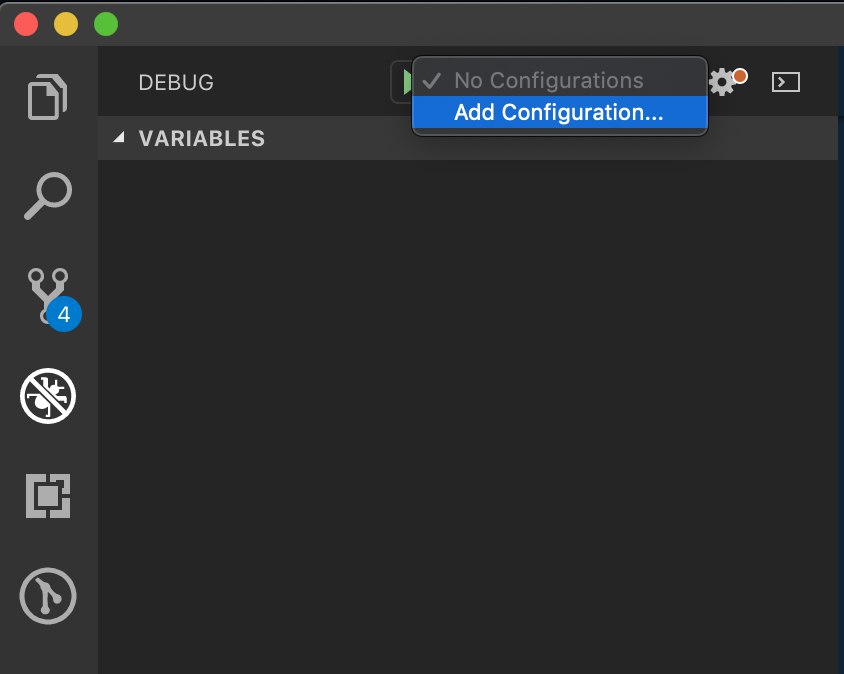

# Debugging Rails with VS Code
## Learning Goals
- Practice setting breakpoints and watch values.
- Additional experience tracking the flow of logic in a Rails application.


## Adding New tools
VS Code and Ruby are still immature in their compatibility, but with a few extensions we can leverage the debugger that comes with VS Code to make our lives a lot easier.

To start off, we should make sure that we have the [ruby](https://marketplace.visualstudio.com/items?itemName=rebornix.Ruby) VS Code extension installed. Use `⇧⌘X` to open the extension window and check to see that it is currently installed.

Additionally, we need to modify the `Gemfile`:

```ruby
#Gemfile
group :development, :test do
  gem 'ruby-debug-ide'
  gem 'debase'
end
```

The [debase](https://rubygems.org/gems/debase) gem is an implementation of the standard Ruby debugger that works with Ruby 2.0, and [ruby-debug-ide](https://rubygems.org/gems/ruby-debug-ide) gem he helps `debase` communicate with VS Code so that we can see and set breakpoints in the IDE itself.

__NOTE: These gems should ALWAYS be part of development and test ONLY.__

Once they are included in your `Gemfile`, run the following commands:

```bash
  $ bundle install 
  #installs the new gems we just added to the Gemfile

  $ which bundle
  # returns /path/to/rubygem/bin/bundle

  $ bundle show ruby-debug-ide
  #returns /path/to/rubygem/gems/ruby-debug-ide-x.x.x

  $ which rspec
  #returns /path/to/rubygem/bin/rspec
```

We will need the output from the commands from above in just a moment in order to tell VS Code how to talk to these gems.

Open the debugging panel using ⇧⌘D, and click on the drop down menu near the play icon. Select `Add New Configuration`.



The next selections you make are somewhat arbitrary, as we will be replacing the code that this action generates with our own custom version.

Once you have the `launch.json` file loaded and open, copy the code below and paste those three paths into the appropriate locations. You should paste each path in two different spots in the file (please remove the asterisks).

```javascript
{
    // Use IntelliSense to learn about possible attributes.
    // Hover to view descriptions of existing attributes.
    // For more information, visit: https://go.microsoft.com/fwlink/?linkid=830387
    "version": "0.2.0",
    "configurations": [
        
        {
            "name": "Start Rails server",
            "type": "Ruby",
            "request": "launch",
            "cwd": "${workspaceRoot}",
            "program": "${workspaceRoot}/bin/rails",
            "args": [
                "server",
                "-p",
                "3000"
            ]
        },
        {
            "name": "Debug Rails server",
            "type": "Ruby",
            "request": "launch",
            "cwd": "${workspaceRoot}",
            "useBundler": true,
            "pathToBundler": "****(which bundle)YOUR/BUNDLE/PATH/HERE****",
            "pathToRDebugIDE": "****(bundle show ruby-debug-ide)YOUR/RUBY/DEBUG/IDE/HERE****",
            "program": "${workspaceRoot}/bin/rails",
            "args": [
                "server",
                "-p",
                "3000"
            ]
        },
        {
            "name": "Run RSpec - all",
            "type": "Ruby",
            "request": "launch",
            "cwd": "${workspaceRoot}",
            "program": "****(which rspec)YOUR/RSPEC/PATH/HERE****",
            "args": [
                "--pattern",
                "${workspaceRoot}/spec/**/*_rspec.rb"
            ]
        },
        {
            "name": "Debug RSpec - open spec file",
            "type": "Ruby",
            "request": "launch",
            "cwd": "${workspaceRoot}",
            "useBundler": true,
            "pathToBundler": "****YOUR/BUNDLE/PATH/HERE****",
            "pathToRDebugIDE": "****YOUR/RUBY/DEBUG/IDE/HERE****",
            "debuggerPort": "1235",
            "program": "****YOUR/RSPEC/PATH/HERE****",
            "args": [
                "${file}"
            ]
        }
    ]
}
```

Double check your work. You should have added, in order from top to bottom:

1. Your Bundle Path
1. Your Debug Path
1. Your RSPEC path
1. Your Bundle Path
1. Your Debug Path
1. Your rSpec path.

This file is pretty handy, so you might want to make a copy that you can use for future projects somewhere convenient! For some people this looks like a new file of notes about debugging in rails saved in their notes folder, and others this looks like a file in a folder of "important dev documents" called `copy-for-rails-debugging-launch.json`.

From this point forward, debugging in rails works much the same way that it did when we were debugging in vanilla ruby. Breakpoints can be set on any instruction, and you can use step and continue to move through your work. 
