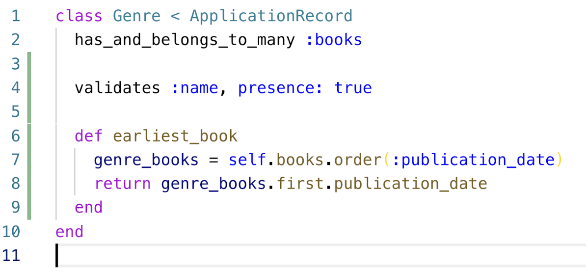

# Rails Review Questions

1. Explain the purpose of each of the following:
   1. Controllers
   1. Models
   1. Views
   - Controllers
   - Models
   - Views
   - Router
1. How do you create a new Rails application?
1. How do you create a controller?
1. What does ERB stand for?
1. Why does the show action require a “route parameter”?
1. What should you test for the controller’s show action?
1. Give 2 examples of a migration
1. Why do you have to create the database and run the migrations when you clone someone’s Rails app from Github?
1. How could you find all the books in Ada-Books by the author “CS Lewis”?
1. List differences between the `.find` and `.find_by`, and the `.where` methods.
1. How could you list all the books in order by author name?
1. Draw an ERD diagram which could represent a Hotel project solution with:  
   - Reservations
   - Rooms
   - Hotels
   - If you had these models, what migrations would you need to make to establish the relationships?
1. Find the last reservation for room with ID number 3
1. Find all the rooms in Hotel 14 with 2 beds (you can assume .beds is a field in the Rooms table).
1. How can you create a new branch called, “driver-controller”?
1. How can you merge commits from the “driver-controller” branch into “master”
1. How can you pull changes from the “master” branch into “driver-controller”?
1. Let’s Assume you have a Post model, with fields:
   - title
   - body
   - author_id (foreign key)
   - How can you ensure that there is a title and the title is unique?
1. In (model file for post.rb)
1. Assume a post fails to save, how can you figure out why?
1. How can you run only the Genre model tests in a Rails application?
Rails test test/models/genre_test.rb
   
1. Given the above model, what tests should you write?
1. How can fixtures help DRY up your tests?
1. Give one example of a test for the above model using fixtures
1. How are flash and flash.now different?  When do you use flash and when do you use flash.now?
1. Update this link_to to use Bootstrap as a button.
   `<%= link_to “login”, login_path %>`
1. Explain the differences between flash and session.  When are each used?
1. Complete this method to log in a user, creating a new User if necessary.
