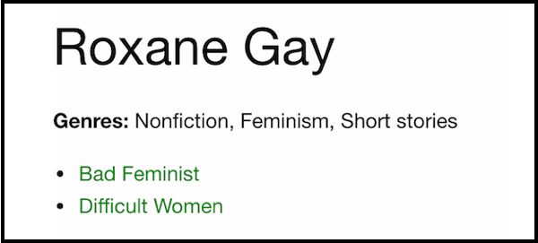

# Indirect Model Relations

## Learning Goals

By the end of this lesson, students should be able to...

- Identify when an indirect model relation would be useful
- Set up an indirect relation using `has_many through:`
- Distinguish between indirect relations and join tables

## Introduction

This lesson builds directly on the lesson on [many to many relationships](many-to-many-relationships.md), so make sure you've got that under your belt before getting started here.

A common scenario when working with databases is to have two models that are related indirectly, through a third model. For example in our library application `Author` and `Genre` are related through the `Book` model.


**Questions:** Imagine that on the details page for an author, we wanted to list all the genres they have written. The list of genres should be de-duplicated (each genre should not appear more than once).
- What would the code look like to build this list of genres?
- Where should this code live?
- What view code would you need to display this list?



There are two pieces of work here. Generating the list of unique genres is business logic, and belongs in the model:

```ruby
# app/models/author.rb
class Author < ApplicationRecord
  # ...
  def genres
    genres = []
    books.each do |book|
      genres += book.genres
    end
    return genres.uniq
  end
end
```

This method gives us an array of `genre`s, as we would expect from a model method. We now need to write some display logic to turn that list into some HTML. Here is one way to approach it:

```html
<!-- app/views/authors/show.html.erb -->
<p>
  <strong>Genres:</strong>
  <%= @author.genres.map { |g| g.name.capitalize }.join(', ') %>
</p>
```

## Indirect Relations in Rails

## Indirect Relations vs Join Tables

## Summary

## Additional Resources
