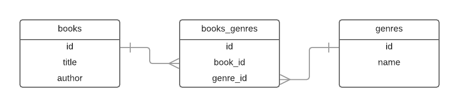
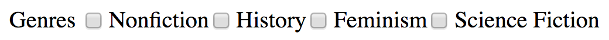

# Many-to-Many Relationships

So far, all the relationships we've see have been _one-to-many_. Books and authors are related in this way: a book has one author, an author has many books.

However, many real-world relationships are _many-to-many_. For example, a genre has many books, and a book may fit into more than one genre. Modeling this sort of relationship will require some new techniques.

## Learning Goals

- Define a _join table_
- Use a join table to set up a _many-to-many_ relation in ActiveRecord
- Explore ActiveRecord's model-level support for many-to-many relations
- Build UI elements that reflect many-to-many relations

## Setting up the Relation

Our running example for this lesson will be the many-to-many relation between books and genres. As an example, let's use two books:

1. **Bad Feminist** by _Roxane Gay_
    - Genres: Nonfiction, Feminism, Writing: Essays, Autobiography: Memoir

1. **Hidden Figures** by _Margot Lee Shetterly_
    - Genres: Nonfiction, History, Science, Biography, Historical

We will have a separate table `genres`, and an ActiveRecord model to match. Let's set that up now:

```
$ rails generate model genre name:string
$ rails db:migrate
```

If we had an instance of `Genre`, we might imagine getting a list of books with `genre.books`; similarly with an instance of `Book` we ought be able to call `book.genres`.

**Question:** How might we keep track of this information?

### Join Tables

Databases do not have an "array" data type, so we can't put a list of genres on each book. Instead we will use an intermediate table, referred to as a _join table_, where each row specifies one book-genre pair.

This means we'll need not two but _three_ tables: `books`, `genres` and `books_genres`. The tables will be related in this way:



And the tables themselves, with data:

**books**

id  | title          | author
--- | ---            | ---
1   | Bad Feminist   | Roxane Gay
2   | Hidden Figures | Margot Lee Shetterly

**genres**

id  | name
--- | ---
1   | Nonfiction
2   | Feminism
3   | History

**books_genres**

id  | book_id | genre_id
--- | ---     | ---
1   | 1       | 1
2   | 2       | 1
3   | 1       | 2
4   | 2       | 3

These tables indicate 4 relations between books and genres:
- Book 1 (Bad Feminist) and genre 1 (Nonfiction)
- Book 2 (Hidden Figures) and genre 1 (Nonfiction)
- Book 1 (Bad Feminist) and genre 2 (Feminism)
- Book 2 (Hidden Figures) and genre 3 (History)

### Building the Join Table

A join table is something that should appear at the database level only - ideally, the rest of our app won't even know it's there. With that in mind we will _not_ build an ActiveRecord model for our new table. Instead of `rails generate model`, we'll say `rails generate migration`:

```
$ rails g migration CreateBooksGenresJoin
```

```ruby
# new migration file
class CreateBooksGenresJoin < ActiveRecord::Migration[5.1]
  def change
    create_table :books_genres do |t|
      t.belongs_to :book, index: true
      t.belongs_to :genre, index: true
    end
  end
end
```

Note the `belongs_to` data type. This tells the database that this column is a foreign key, and which sets up some extra restrictions on what can be in this table. This will help prevent us linking a book to a genre that doesn't exist.

The name of the table (`books_genres`) is important - this is the name ActiveRecord will be looking for later. We could call it something else, but that wouldn't be the Rails Way&trade;.

Remember to `rails db:migrate` again.

### The Relation in the Model Layer

ActiveRecord has built-in support for many-to-many relationships using the join table pattern. Our last step is to set up our models to take advantage of this.

```ruby
# app/models/book.rb
class Book < ApplicationRecord
  has_and_belongs_to_many :genres

  # ... the rest of the class ...
end
```

```ruby
# app/models/genre.rb
class Genre < ApplicationRecord
  has_and_belongs_to_many :books
end
```

Just like the `has_many` and `belongs_to` lines we added when we related books and authors, `has_and_belongs_to_many` will give us a bunch of methods to manipulate our new relation.

## Many-to-Many in the Model

The syntax ActiveRecord provides for manipulating many-to-many relations is similar to that for one-to-many relations. Pull open the rails console, and do the following tasks:

1. Make sure your database contains the two books above: _Bad Feminist_ by Roxane Gay, and _Hidden Figures_ by Margot Lee Shetterly
1. Add three genres to your database: _Nonfiction_, _Feminism_, and _History_
1. Load the record for _Bad Feminist_ into a local variable `bad_feminist`, and the record for _Nonfiction_ into a local variable `nonfiction`
1. Set up a relation between the book and the genre
    - You can approach this from either the book side or the genre side. That is, either of these will work:
        - `bad_feminist.genres << nonfiction`
        - `nonfiction.books << bad_feminist`
    - Read the resulting SQL queries. What happened at the database level?
1. Add the other three relations from the tables above
1. Load the list of the genres for _Hidden Figures_
1. Load the list of _Nonfiction_ books

Challenge problems:
1. Load the list of _Nonfiction_ books, sorted alphabetically by author name
    - For extra extra challenge, do the sorting in the database (i.e. using `.order`, not `.sort` or `.sort_by`)
1. Produce a list of the genres for a given author

Since these last two are complex pieces of business logic, they would make excellent model methods!

## Building UI Elements

Many-to-many relationships take some work at the database level, but they also present an interesting design challenge. How can we build UI elements that present this information in a way that is easy to work with?

**Activity:** Spend some time brainstorming how we might represent the relation between books and genres in our library webapp. Consider the following questions:
- How might a user view the genres for a book, or the books for a genre?
- How would a user specify that a book belongs to a genre?
    - Should it be from the book side, the genre side, or both?
    - What might this look like visually? Draw a picture!

### Viewing Relations

For our application, the details page for each book will contain its list of genres. We'll need to edit the `show` view template for our books:

```html
<!-- app/views/books/show.html.erb -->
<p>Genres:</p>
<ul>
  <% @book.genres.each do |genre| %>
    <li>
      <%= genre.name %>
    </li>
  <% end %>
</ul>
```

### Modifying Relations

A typical library application will have many more books than genres. Since there will be less options to choose from, it probably makes sense to specify book-genre relations through the book rather than through the genre. We will allow a user to pick from a list of genres whenever the create or edit a book.

#### Checkboxes

There are many ways we could enable this feature, but one of the most straightforward ways in Rails is to use checkboxes. We will add a bunch of checkboxes to our book form, one for each genre. Any checked box applies to the book, and any unchecked box does not. The end result will look something like this:



This would be tricky to build by hand, but Rails provides a view helper to do exactly what we want. We can achieve the above result by adding the following code to the `_form` view partial, inside the `form_with` block:

```html
<!-- app/views/books/_form.html.erb -->
<div>
  <%= f.label :genres %>
  <%= collection_check_boxes(:book, :genre_ids, Genre.all, :id, :name) %>
</div>
```

The first line is a label; we have seen these before. The second is a little more complex - this view helper has five arguments! Let's dive into them a little.

- The first two (`:book` and `:genre_ids`) indicate where in the `POST` request the array of selected values should be stored
    - We've indicated it should live in `params[:book][:genre_ids]`
- The third (`Genre.all`) is a collection of models to use for the checkboxes
    - We are using the full list of `Genre`s
- The fourth (`:id`) indicates what value should be sent with the `POST` data
    - We will send the ID of the genre
- The fifth (`:name`) indicates what value should be displayed to the user
    - We will display the genre's name

**Question:** If we click _Nonfiction_ and _Feminism_ and submit the form, what will `params` look like in the controller? How can you check your answer?

With the above addition to our form, `params` might end up looking like the following:

```ruby
{
  "utf8"=>"✓",
  "authenticity_token"=>"u0FW4FA...",
  "book"=>{
    "title"=>"Bad Feminist",
    "author"=>"Roxane Gay",
    "genre_ids"=>["1", "2"],
    # ... other form fields
  },
  "commit"=>"Shelve it!",
  "id"=>"4"
}
```

#### Strong Params

There's one last thing we need to do in the `BooksController`: update the strong params. All the fields we've permitted so far have been individual values, but `genre_ids` is an array, so things will look a little different.

```ruby
# app/controllers/books_controller.rb
class BooksController < ApplicationController
  # ... actions, etc
  private
  def book_params
    # Your list of fields may be slightly longer
    return params.require(:book).permit(:author_id, :title, genre_ids: [])
  end
end
```

**Question:** In an earlier lesson we learned about _nested routes_. Why aren't we using them here?

## Summary

- The relationship between books and genres is an example of a _many-to-many_ relation
    - Books have many genres, genres have many books
- At the database level, a many-to-many relation requires a _join table_
    - Each row in the join table specifies one book-genre relation
- At the model level, use ActiveRecord's `has_and_belongs_to_many` to specify a many-to-many relation
    - This gives us many of our familiar AR methods
- Complex relations require careful UX design
- Remember to update your strong params

## Additional Resources

- [Rails Guides on `has_and_belongs_to_many`](http://guides.rubyonrails.org/association_basics.html#the-has-and-belongs-to-many-association)
- [Documentation for `collection_check_boxes`](http://edgeapi.rubyonrails.org/classes/ActionView/Helpers/FormOptionsHelper.html#method-i-collection_check_boxes)
